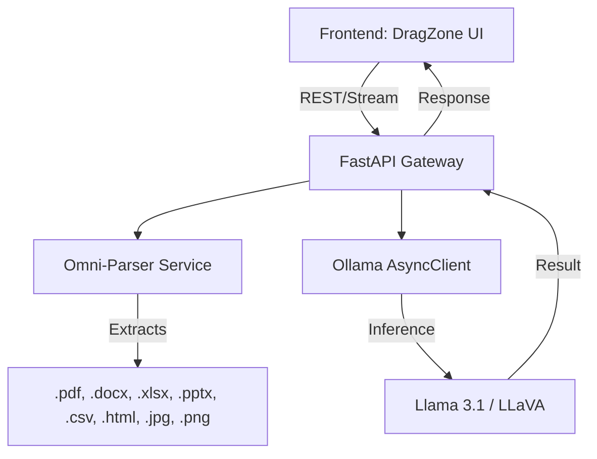

# 🐉 DragEngine: Omni-Parser AI Backend

The high-performance FastAPI heart of the DragZone ecosystem, powered by local LLMs and multi-modal document analysis.

## 🏗️ System Architecture



## 📂 Omni-Parser Capabilities

The Omni-Parser is designed to handle extremely complex payloads:

- **PDF**: Full text extraction using `pypdf`.
- **Excel/CSV**: Tabular data analysis using `pandas`.
- **Word/PowerPoint**: Structural content extraction.
- **Images**: Technical visual reasoning via LLaVA (vision model).
- **HTML**: Cleaned DOM content extraction.

## 🚀 API Endpoints

### 1. File Upload [`POST /api/upload`]
Accepts multiple files as `multipart/form-data`.
**Response:**
```json
{
  "success": true,
  "files": ["report.pdf", "data.xlsx"],
  "context_active": true
}
```

### 2. Chat Stream [`POST /api/chat`]
Streams response chunks from Ollama.
**Payload:**
```json
{
  "messages": [{"role": "user", "content": "Analyze the table in data.xlsx"}],
  "context": "Context from uploaded files..."
}
```

## 🛠️ Setup
```bash
pip install -r requirements.txt
uvicorn main:app --host 0.0.0.0 --port 8000 --reload
```
