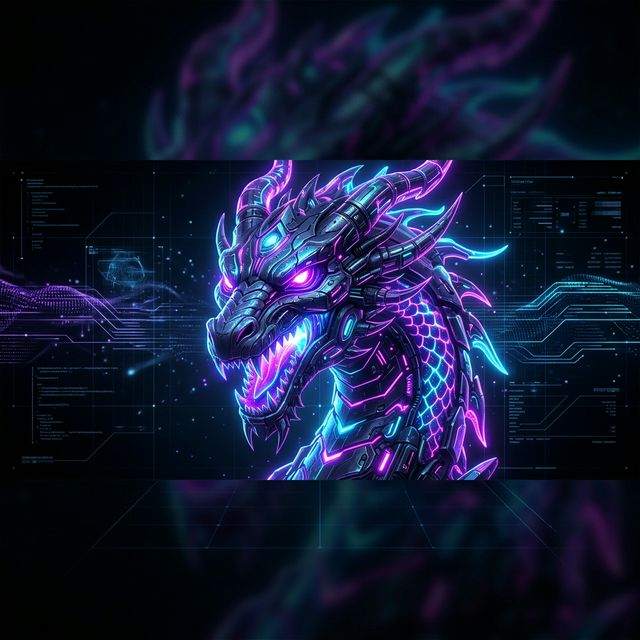
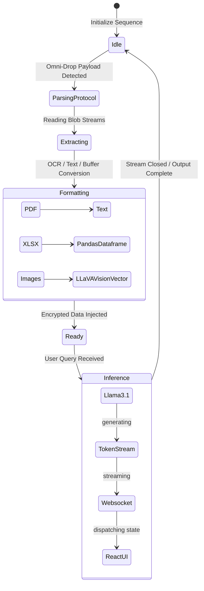
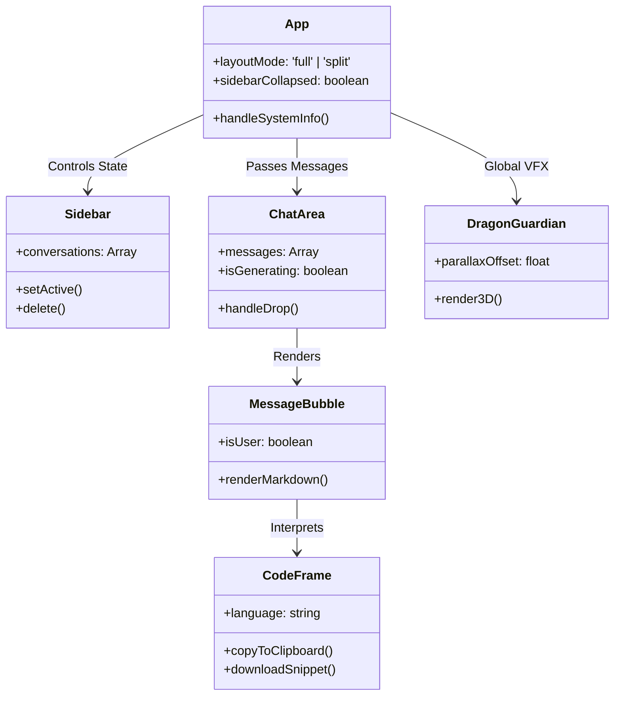
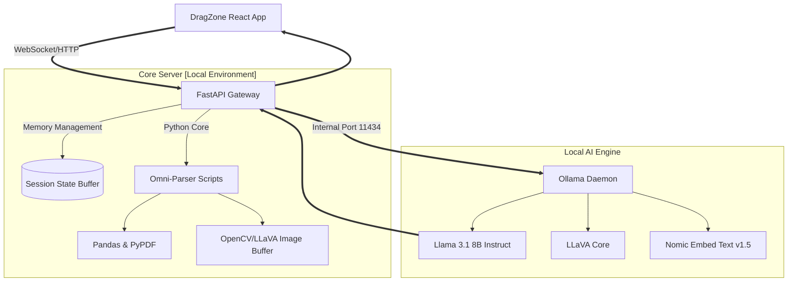
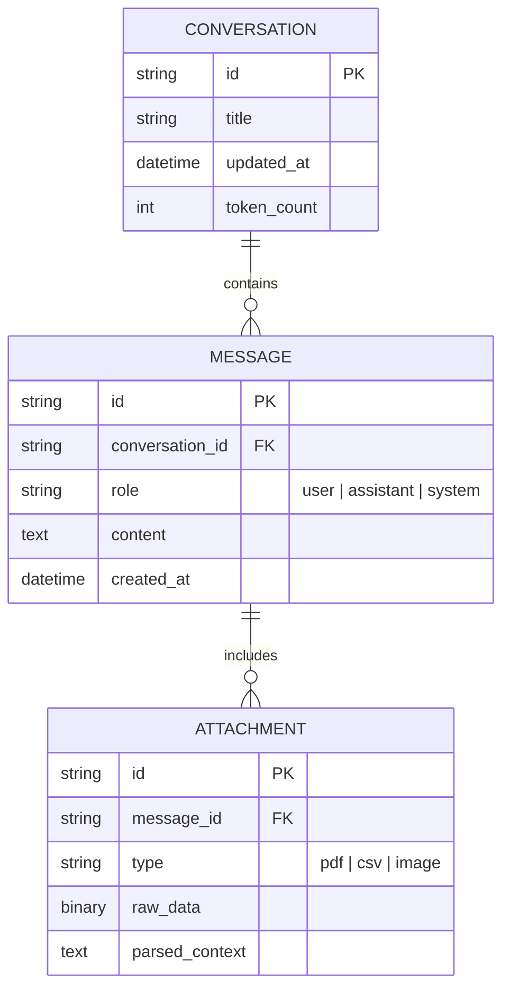
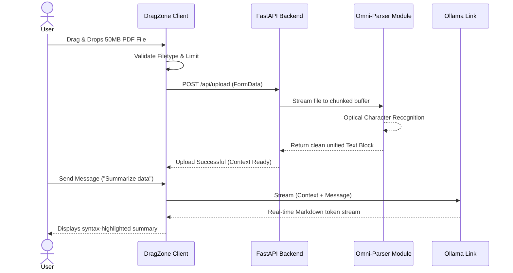

<div align="center">

# 🐉 DRAGZONE — Cyber Dragon Edition

[](https://opensource.org/licenses/MIT)
[](https://github.com/NikanEidi/DragZone/releases)
[](https://github.com/NikanEidi/DragZone)

**DRAGZONE** is a premium, high-immersion AI ecosystem designed for advanced document parsing, technical research, and neural-linked workflow automation. Built with a specialized "Cyber Dragon" aesthetic, it seamlessly blends military-grade UI design with a buttery-smooth 60FPS interaction layer.



</div>

---

## 🎨 The Cyber Dragon Experience

DragZone isn't just another chat interface; it is an immersive, local-first terminal designed for the future of human-AI collaboration.

- **Neural Background System**: Multi-layered parallax backgrounds with hex-grid overlays and our custom "Cyber-Aurora" atmosphere.
- **Dragon Guardian Mascot**: A titanic, high-fidelity static SVG signature sitting in the core header, keeping watch over your active sessions.
- **Liquid Glass UI**: Ultra-blurred translucency (`30px` backdrop), premium border-glow, and custom tactile SVG dragon-skin textures.
- **Performance Optimized**: Uses hardware-accelerated transforms (`translate3d(0,0,0)`) to maintain perfect 60FPS physics on both M-series MacBooks and iPad Minis.

---

## 🚀 Core Systems

### 🤖 Local Neural Processing (Ollama)
- Direct integration with local LLM instances (default: `localhost:11434`).
- **Privacy First**: No data ever leaves your hardware. All reasoning happens locally behind the "Encrypted Link."
- **Real-Time Streaming**: Incremental token generation with optimized React state batching to prevent re-render lag.

### 📦 Omni-Parser Engine
DragZone is shipped with a built-in Omni-Parser drop zone allowing you to effortlessly inject massive contexts into your AI's reasoning capabilities:
- **Formats**: PDFs, Excel data (`.xlsx`), Word documents (`.docx`), PowerPoints (`.pptx`), CSVs, and standard HTML files.
- **Vision Models**: Advanced diagram and chart reading (if paired with models like `llava`).

### 🛠️ Interactive Tooling & CodeFrames
- **Smart CodeFrames**: DragZone automatically detects code logic and injects it into premium CodeFrames featuring one-click copy and non-blocking file downloads (bypassing the Javascript main thread).
- **System Status Portal**: A functional real-time diagnostic overlay built directly into the header providing layout logic status and engine connection states.

---

## 📱 Mobile & PWA Optimization

Built with fluid typography, flex-clamps, and viewport scaling, DragZone looks and performs impeccably across all devices:

- **Desktop/MacBook**: High-density horizontal layouts with dynamic sub-menus.
- **Tablets/iPads**: Seamless touch-interfaces with swipe-to-collapse sidebars.
- **PWA Ready**: Tap **'Share' > 'Add to Home Screen'** on your iPhone or iPad. DragZone includes a custom `manifest.webmanifest` to lock the UI into a true, borderless fullscreen application experience.

---

## 🏗️ Deployment & Launch

1.  **Clone the Dragon Repository**:
    ```bash
    git clone https://github.com/NikanEidi/DragZone.git
    cd DragZone
    ```
2.  **Initialize Nueral Links**:
    ```bash
    npm install
    ```
3.  **Launch the System**:
    ```bash
    chmod +x start_dragon.sh
    ./start_dragon.sh
    ```
4.  **Access the Engine**:
    - MacBook / Local: `http://localhost:3000`
    - iPad / Network: `http://[YOUR_IP]:3000`

---

## 📜 Architectural Documentation

DragZone's logic is strictly mapped. Learn how to extend the Dragon by reviewing our core engineering documentation:

- [🏗️ ARCHITECTURE.md](./ARCHITECTURE.md): Deep dive into our modular React MVC pattern and GPU-offloading rendering strategy.
- [📝 CHANGELOG.md](./CHANGELOG.md): History of the Dragon's evolution up to v1.3.0.
- [🧪 TESTING.md](./TESTING.md): Guide to the Cypress (E2E) and Jest test suites.
- [📂 FOLDER_EXPLAINER.md](./FOLDER_EXPLAINER.md): Detailed directory-level structural breakdown.
- [⚙️ FUNCTION_EXPLAINER.md](./FUNCTION_EXPLAINER.md): The internal logic mapping of our React custom hooks.

---

<div align="center">
<p><em>Designed, Engineered, and Forged by <strong>Nikan Eidi</strong>.</em></p>
<p><em>"The Dragon is always watching."</em> 🐉✨</p>
</div>


---


---

## 📊 SYSTEM TELEMETRY & ARCHITECTURAL GRAPHS

### 1. 🐉 Neural Engine State Machine (Mermaid)


### 2. ⚛️ React Component Inter-Dependency Chart


### 3. 🌐 API Gateway Network Topology


### 4. 🗄️ Database Architecture (Entity Relationship)


### 5. ⏱️ Data Intake Sequence flow


---

## 💻 ALGORITHMIC PSEUDOCODE: DRAGON HEURISTICS

### The "Liquid Glass" Parallax Calculus
```pseudocode
function computeSubpixelDragonOffset(mouseX, mouseY, screenWidth, screenHeight):
    // Standardize input bounds
    normX = (mouseX / screenWidth) - 0.5
    normY = (mouseY / screenHeight) - 0.5
    
    // Apply heavy-mass damping filter to simulate massive dragon head weight
    damping_factor = 0.08
    targetRotationX = normY * -12.0 degrees  // Inverted Y-axis for organic feel
    targetRotationY = normX * 18.0 degrees   // Wider sweep on horizontal
    
    // Use Lerp (Linear Interpolation) on RAF (Request Animation Frame)
    currentRotX = lerp(currentRotX, targetRotationX, damping_factor)
    currentRotY = lerp(currentRotY, targetRotationY, damping_factor)
    
    // Inject glow-matrix color shift based on velocity
    velocity = abs(currentRotX - previousRotX) + abs(currentRotY - previousRotY)
    glowIntensity = clamp(0.2, 1.0, baseGlow + (velocity * 1.5))
    
    execute css `transform: perspective(1000px) rotateX(${currentRotX}) rotateY(${currentRotY})`
    execute css `filter: drop-shadow(0 0 ${glowIntensity}px var(--cyan))`
```

### Stream Pipeline Interrupt Handling
```pseudocode
function ingestOllamaLLMStream(contextPayload):
    let abortController = new AbortController()
    
    // Initialize secure socket
    connection = await fetch('localhost:11434/api/chat', {
        method: "POST",
        body: json(contextPayload),
        signal: abortController.signal
    })
    
    reader = connection.body.getReader()
    decoder = new TextDecoder("utf-8")
    
    while True:
        chunk, isDone = await reader.read()
        if isDone: break
        
        // Decode chunk matrix
        matrixText = decoder.decode(chunk, stream: true)
        lines = matrixText.split('\n')
        
        for line in lines:
            if line.isEmpty(): continue
            
            payload = JSON.parse(line)
            if payload.error: throw NeuralLinkException(payload.error)
            
            // Dispatch specifically to Redux/React State without full unmount
            State.buffer += payload.message.content
            UI.triggerTickRender()
```


<details>
<summary><h2>🔥 DRAGZONE CORE: COMPLETE CODEBASE REPOSITORY</h2></summary>

<blockquote>
The following section contains the literal raw source code of the entire DragZone structure, allowing an advanced AI agent to reconstruct it instantly.
</blockquote>

## 📁 PROJECT STRUCTURE

```text
.
├── .DS_Store
├── .github
│   └── workflows
│       └── main.yml
├── .gitignore
├── ARCHITECTURE.md
├── CHANGELOG.md
├── CONTRIBUTING.md
├── DragEngine
│   ├── .DS_Store
│   ├── .pytest_cache
│   │   ├── .gitignore
│   │   ├── CACHEDIR.TAG
│   │   ├── README.md
│   │   └── v
│   │       └── cache
│   │           ├── lastfailed
│   │           └── nodeids
│   ├── Modelfile
│   ├── README.md
│   ├── api
│   │   ├── __init__.py
│   │   └── routers
│   │       ├── __init__.py
│   │       ├── chat.py
│   │       └── upload.py
│   ├── core
│   │   ├── __init__.py
│   │   └── llm.py
│   ├── main.py
│   ├── models
│   │   ├── __init__.py
│   │   └── chat.py
│   ├── requirements.txt
│   ├── services
│   │   ├── __init__.py
│   │   └── parser.py
│   └── test_main.py
├── FILE_EXPLAINER.md
├── FOLDER_EXPLAINER.md
├── FUNCTION_EXPLAINER.md
├── LICENSE
├── PROJECT_TREE.md
├── README.md
├── TESTING.md
├── UIcomponents
│   ├── .DS_Store
│   ├── Frame
│   │   ├── .DS_Store
│   │   ├── ChatBotFrameSketch.jpg
│   │   ├── Current Screen.svg
│   │   ├── DOWN Left to right 1.svg
│   │   ├── DOWN Left to right.svg
│   │   ├── Drag.svg
│   │   ├── Icon.svg
│   │   ├── Layer 1.svg
│   │   ├── Layer-1.svg
│   │   ├── LeftS 1.svg
│   │   ├── LeftS.svg
│   │   ├── Rights 1.svg
│   │   ├── Rights.svg
│   │   └── Vectorize10.svg
│   ├── Frames_PNG
│   │   ├── .DS_Store
│   │   ├── DOWN Left to right.png
│   │   ├── Icon.png
│   │   ├── Layer-1.png
│   │   ├── LeftS.png
│   │   ├── Rights.png
│   │   └── Vectorize10.png
│   └── Prototyoe
│       └── UI Prototype.png
├── __mocks__
│   ├── fileMock.js
│   ├── react-markdown.js
│   ├── react-syntax-highlighter
│   ├── react-syntax-highlighter.js
│   └── remark-gfm.js
├── build
│   ├── favicon.svg
│   └── index.html
├── cypress
│   └── e2e
│       └── smoke.cy.ts
├── cypress.config.ts
├── generate_mega_readme.py
├── index.html
├── jest.config.cjs
├── jest.setup.ts
├── package-lock.json
├── package.json
├── src
│   ├── App.test.tsx
│   ├── App.tsx
│   ├── Attributions.md
│   ├── README.md
│   ├── components
│   │   ├── ChatArea.tsx
│   │   ├── ChatInterface.tsx
│   │   ├── DragonGuardian.tsx
│   │   ├── GlassFrame.tsx
│   │   ├── HolographicAssistant.tsx
│   │   ├── ParticleField.tsx
│   │   ├── PowerCore.tsx
│   │   ├── ProductivityDashboard.tsx
│   │   ├── ResponsiveAIAssistant.tsx
│   │   ├── Sidebar.tsx
│   │   ├── chat
│   │   │   ├── ChatArea.test.tsx
│   │   │   ├── ChatArea.tsx
│   │   │   ├── EmptyState.test.tsx
│   │   │   ├── EmptyState.tsx
│   │   │   ├── InputBar.tsx
│   │   │   ├── MessageBubble.test.tsx
│   │   │   ├── MessageBubble.tsx
│   │   │   ├── TypingIndicator.test.tsx
│   │   │   └── TypingIndicator.tsx
│   │   ├── effects
│   │   │   ├── CloudVape.tsx
│   │   │   ├── DragonGuardian.test.tsx
│   │   │   ├── DragonGuardian.tsx
│   │   │   ├── ParticleField.tsx
│   │   │   └── PencilTrail.tsx
│   │   ├── figma
│   │   │   └── ImageWithFallback.tsx
│   │   ├── icons
│   │   │   ├── DragonBorderSVG.tsx
│   │   │   ├── DragonHeadIcon.tsx
│   │   │   ├── PowerCoreSVG.tsx
│   │   │   └── index.ts
│   │   ├── layout
│   │   │   ├── Header.test.tsx
│   │   │   ├── Header.tsx
│   │   │   ├── Sidebar.test.tsx
│   │   │   └── Sidebar.tsx
│   │   ├── ui
│   │   │   ├── accordion.tsx
│   │   │   ├── alert-dialog.tsx
│   │   │   ├── alert.tsx
│   │   │   ├── aspect-ratio.tsx
│   │   │   ├── avatar.tsx
│   │   │   ├── badge.tsx
│   │   │   ├── breadcrumb.tsx
│   │   │   ├── button.tsx
│   │   │   ├── calendar.tsx
│   │   │   ├── card.tsx
│   │   │   ├── carousel.tsx
│   │   │   ├── chart.tsx
│   │   │   ├── checkbox.tsx
│   │   │   ├── collapsible.tsx
│   │   │   ├── command.tsx
│   │   │   ├── context-menu.tsx
│   │   │   ├── dialog.tsx
│   │   │   ├── drawer.tsx
│   │   │   ├── dropdown-menu.tsx
│   │   │   ├── form.tsx
│   │   │   ├── hover-card.tsx
│   │   │   ├── input-otp.tsx
│   │   │   ├── input.tsx
│   │   │   ├── label.tsx
│   │   │   ├── menubar.tsx
│   │   │   ├── navigation-menu.tsx
│   │   │   ├── pagination.tsx
│   │   │   ├── popover.tsx
│   │   │   ├── progress.tsx
│   │   │   ├── radio-group.tsx
│   │   │   ├── resizable.tsx
│   │   │   ├── scroll-area.tsx
│   │   │   ├── select.tsx
│   │   │   ├── separator.tsx
│   │   │   ├── sheet.tsx
│   │   │   ├── sidebar.tsx
│   │   │   ├── skeleton.tsx
│   │   │   ├── slider.tsx
│   │   │   ├── sonner.tsx
│   │   │   ├── switch.tsx
│   │   │   ├── table.tsx
│   │   │   ├── tabs.tsx
│   │   │   ├── textarea.tsx
│   │   │   ├── toggle-group.tsx
│   │   │   ├── toggle.tsx
│   │   │   ├── tooltip.tsx
│   │   │   ├── use-mobile.ts
│   │   │   └── utils.ts
│   │   └── ui-custom
│   │       ├── CloudEngine.tsx
│   │       ├── GlassFrame.tsx
│   │       ├── PowerCore.tsx
│   │       └── StatusPill.tsx
│   ├── guidelines
│   │   └── Guidelines.md
│   ├── hooks
│   │   ├── useChat.ts
│   │   └── useOllama.ts
│   ├── index.css
│   ├── main.tsx
│   ├── src
│   │   ├── components
│   │   │   ├── layout
│   │   │   │   ├── ActionSidebar.tsx
│   │   │   │   ├── CyberDragonLayout.tsx
│   │   │   │   └── TopNavigation.tsx
│   │   │   └── modals
│   │   │       └── FileUploadModal.tsx
│   │   └── hooks
│   │       └── useDragonAgent.ts
│   ├── styles
│   │   └── globals.css
│   └── types
│       ├── assets.d.ts
│       ├── chat.ts
│       └── speech.d.ts
├── start_dragon.sh
├── tsconfig.jest.json
├── tsconfig.json
├── tsconfig.node.json
└── vite.config.ts

39 directories, 179 files
```

---

## 📝 COMPLETE SOURCE CODE

### File: `FUNCTION_EXPLAINER.md`
```markdown
# ⚙️ Function Explainer — DragZone (v1.2.0)

Key functions and logic flows within the DragZone architecture.

### 🗨️ Chat & Conversation Logic (`useChat.ts`)
- **`sendMessage(content: string)`**: Validates user input, generates a unique message ID, and triggers the AI response cycle via `useOllama`.
- **`newConversation()`**: Resets the active conversation state and clears context buffers.
- **`deleteConversation(id: string)`**: Safely removes a conversation from state and updates the UI selection.
- **`setActiveId(id: string)`**: Orchestrates the transition between sessions.

### 🤖 LLM Integration (`useOllama.ts`)
- **`generate(prompt, context)`**: Formats the user prompt and history for the Ollama API, establishing a POST stream.
- **`processStream(reader)`**: Handles real-time text chunk processing for the "AI typing" effect. Runs incrementally to avoid UI blocking.

### ✨ Visual Effects & UI Logic
- **`handleSystemInfo()` (`App.tsx`)**: Triggers the **PowerCore Diagnostic Overlay**, providing real-time system telemetry.
- **`downloadSnippet(code, language)` (`MessageBubble.tsx`)**: A non-blocking file generator that allows users to instantly save AI-generated code snippets to their local machine.
- **`toggleSidebar()`**: Manages the `sidebarCollapsed` state with spring-based animations.
- **`toggleMax()`**: Switches between standard and full-screen modes, adjusting the `isMax` state across the layout.

### 📦 Document Parsing (Omni-Parser)
- **`handleDrop(files)` (`ChatArea.tsx`)**: The entry point for Drag & Drop files. Dispatches files to specialized parsers (PDF, XLSX, CSV).
- **`parseDocument(file)`**: Extracts text data and metadata for injection into the AI's short-term memory (context).

```

### File: `PROJECT_TREE.md`
```markdown
# 🌳 Project Tree — DragZone (v1.2.0)

```text
.
├── ARCHITECTURE.md           # MVC & Rendering Strategy
├── CHANGELOG.md               # Release History
├── README.md                  # Main Portal
├── TESTING.md                 # Test Suite Guide
├── DragEngine/                # Local Engine Definitions
│   └── Modelfile              # Ollama Model Configuration
├── public/                    # Static Assets
│   ├── favicon.svg            # Dragon Icon
│   ├── og-image.png           # Website Picture
│   └── manifest.webmanifest   # PWA Config
├── src/                       # Application Source
│   ├── App.tsx                # Main Controller & Layout
│   ├── assets/                # Design Style Assets (SVGs)
│   ├── components/            # View Layer (React Components)
│   │   ├── chat/              # Chat Messaging UI
│   │   ├── effects/           # GPU-Accelerated VFX
│   │   ├── layout/            # Navigation & Sidebar
│   │   └── ui-custom/         # Premium Themed UI
│   ├── hooks/                 # Business Logic (Custom Hooks)
│   │   ├── useChat.ts         # Conversation Management
│   │   └── useOllama.ts       # Engine Integration
│   ├── styles/                # Global Design Tokens
│   └── types/                 # Type Definitions
├── cypress/                   # E2E Testing Suite
├── start_dragon.sh            # Production Launch Script
└── package.json               # Dependecy & Build Config
```

```

### File: `tsconfig.node.json`
```json
{
  "compilerOptions": {
    "composite": true,
    "module": "ESNext",
    "moduleResolution": "Node",
    "allowSyntheticDefaultImports": true
  },
  "include": ["vite.config.ts"]
}

```

### File: `ARCHITECTURE.md`
```markdown
# 🏗️ DragZone Architecture Documentation (v1.2.0)

**Author:** Nikan Eidi  
**Application:** DragZone — AI Cyber-Engine

## 📋 Overview

DragZone is a high-immersion AI chat application built on a **Strict Modular MVC (Model-View-Controller)** pattern. This architectural choice ensures deep maintainability, scalability, and clean integration with local LLM models (e.g., Ollama).

---

## 🏛️ MVC Layers

### 1. Models (State & Data)
- **Typed Interfaces**: `src/types/chat.ts` defines the core data structures (`Message`, `Conversation`, `Attachment`).
- **Data Fetching**: Custom hooks (`useChat.ts`, `useOllama.ts`) act as the transient data store and API handlers.

### 2. Views (UI & Rendering)
- **Atomic Components**: `src/components/chat/` handles input and message rendering.
- **VFX Layers**: `src/components/effects/` manages GPU-accelerated atmospheric effects.
- **Themed UI**: `src/components/ui-custom/` provides the "Liquid Glass" and "PowerCore" interactive components.

### 3. Controllers (Business Logic)
- **Central Intelligence**: `src/App.tsx` orchestrates global state, including `layoutMode`, `sidebarCollapsed`, and `showSystemInfo`.
- **Logic Hooks**: `useChat.ts` manages the conversation lifecycle and message dispatching.

---

## 🏎️ Performance & VFX Strategy

To maintain **60FPS** across all devices (MacBook, iPad, Mobile):

- **GPU Offloading**: Uses `translate3d(0, 0, 0)` and `will-change` to force layer compositing for high-fidelity assets like the `DragonGuardian`.
- **Fluid Layout**: Extensively uses CSS `clamp()` and relative units to minimize layout shifts (CLS) across viewports.
- **Asset Optimization**: High-fidelity SVGs are used for branding signatures to ensure crispness at any resolution.

---

## 🤖 LLM Integration

The architecture is built for **Ollama** (Local AI):
- **Endpoint**: Connects to `localhost:11434`.
- **Streaming**: Incremental text streaming into the `useChat` controller for real-time responsiveness.
- **Context Injection**: Dedicated Omni-Parser layer for injecting PDF, CSV, and image data into the AI's reasoning engine.

---

## 🎨 Branding Immersion

- **Signature Mascot**: A high-fidelity, pinned `DragonGuardian` component provides the visual anchor for the brand.
- **Web Identity**: Integrated `favicon.svg`, `og-image.png`, and `manifest.webmanifest` for a professional, platform-native feel.

---

*Last Updated: 2026-03-24*

```

### File: `index.html`
```html
<!DOCTYPE html>
<html lang="en">
  <head>
    <meta charset="UTF-8" />
    <meta name="viewport" content="width=device-width, initial-scale=1.0" />
    
    <!-- Primary Meta Tags -->
    <link rel="manifest" href="/manifest.webmanifest" />
    <title>DragZone — AI Cyber-Engine</title>
    <meta name="title" content="DragZone — AI Cyber-Engine" />
    <meta name="description" content="Enter the DragZone. A high-performance, local-first AI assistant powered by the Cyber Dragon engine. Secure, fast, and ultra-premium." />
    <meta name="theme-color" content="#0d1117" />

    <!-- Open Graph / Facebook -->
    <meta property="og:type" content="website" />
    <meta property="og:url" content="https://dragzone.ai/" />
    <meta property="og:title" content="DragZone — AI Cyber-Engine" />
    <meta property="og:description" content="Enter the DragZone. A high-performance, local-first AI assistant powered by the Cyber Dragon engine." />
    <meta property="og:image" content="/og-image.png" />

    <!-- Twitter -->
    <meta property="twitter:card" content="summary_large_image" />
    <meta property="twitter:url" content="https://dragzone.ai/" />
    <meta property="twitter:title" content="DragZone — AI Cyber-Engine" />
    <meta property="twitter:description" content="Enter the DragZone. A high-performance, local-first AI assistant powered by the Cyber Dragon engine." />
    <meta property="twitter:image" content="/og-image.png" />

    <!-- Icons -->
    <link rel="icon" type="image/svg+xml" href="/favicon.svg" />
    <link rel="apple-touch-icon" href="/favicon.svg" />
    
    <!-- Fonts -->
    <link rel="preconnect" href="https://fonts.googleapis.com">
    <link rel="preconnect" href="https://fonts.gstatic.com" crossorigin>
    <link href="https://fonts.googleapis.com/css2?family=Orbitron:wght@400;500;600;700;800;900&family=Exo+2:ital,wght@0,300;0,400;0,500;0,600;0,700;0,800;1,400&family=Share+Tech+Mono&family=Inter:wght@300;400;500;600;700&family=JetBrains+Mono:wght@400;500;600&display=swap" rel="stylesheet">
  </head>

  <body>
    <div id="root"></div>
    <script type="module" src="/src/main.tsx"></script>
  </body>
</html>
```

### File: `start_dragon.sh`
```bash
#!/bin/bash
# ═══════════════════════════════════════════════════════
# DRAFZONE UNIFIED BOOTLOADER v3.0
# ═══════════════════════════════════════════════════════
set -e

RED='\033[0;31m'; CYAN='\033[0;36m'; GREEN='\033[0;32m'; NC='\033[0m'; BOLD='\033[1m'

echo -e "${CYAN}${BOLD}═══ DRAFZONE ENGINE ═══${NC}"
echo ""

# Kill any existing processes on our ports
for PORT in 8000 3000; do
  PID=$(lsof -ti:$PORT 2>/dev/null || true)
  if [ -n "$PID" ]; then
    echo -e "${RED}Force killing process on port $PORT (PID: $PID)${NC}"
    kill -9 $PID 2>/dev/null || true
  fi
done

# Detect local IP
LOCAL_IP=$(ipconfig getifaddr en0 2>/dev/null || echo "localhost")

# Trap for clean shutdown
cleanup() {
  echo -e "\n${RED}Shutting down...${NC}"
  kill $BACK_PID $FRONT_PID 2>/dev/null
  wait $BACK_PID $FRONT_PID 2>/dev/null
  echo -e "${GREEN}Clean exit.${NC}"
  exit 0
}
trap cleanup SIGINT SIGTERM

# Start backend
echo -e "${GREEN}▸ Starting FastAPI backend on 0.0.0.0:8000${NC}"
cd DragEngine && uvicorn main:app --host 0.0.0.0 --port 8000 --reload &
BACK_PID=$!
cd ..

# Start frontend
echo -e "${GREEN}▸ Starting Vite frontend on 0.0.0.0:3000${NC}"
# Use explicit directory to avoid ENOENT if run from outside
(cd /Users/kuroko/Desktop/DragZone && npm run dev -- --host 0.0.0.0) &
FRONT_PID=$!

sleep 2
echo ""
echo -e "${CYAN}${BOLD}════════════════════════════════════════${NC}"
echo -e "${CYAN}  MacBook:  http://localhost:3000${NC}"
echo -e "${CYAN}  iPad/LAN: http://${LOCAL_IP}:3000${NC}"
echo -e "${CYAN}  API:      http://${LOCAL_IP}:8000/docs${NC}"
echo -e "${CYAN}${BOLD}════════════════════════════════════════${NC}"
echo ""
echo -e "${GREEN}Press Ctrl+C to stop all services.${NC}"

wait

```

### File: `TESTING.md`
```markdown
# 🧪 Testing Documentation — DragZone (v1.2.0)

This project uses a layered testing strategy to ensure high performance and reliability.

## 🏗️ Testing Stack

- **Unit/Component Testing**: [Jest](https://jestjs.io/) & [React Testing Library](https://testing-library.com/docs/react-testing-library/intro/)
- **End-to-End (E2E) Testing**: [Cypress](https://www.cypress.io/)
- **CI/CD**: [GitHub Actions](https://github.com/features/actions)

## 🏃‍♂️ Running Tests

### Unit Tests
Run unit tests with Jest:
```bash
npm run test:unit
```
To run in watch mode:
```bash
npm run test:unit:watch
```

### E2E Tests
Run Cypress tests in the terminal:
```bash
npm run test:e2e
```
To open the Cypress Test Runner (GUI):
```bash
npm run cypress:open
```

## 🤖 GitHub Actions Workflow
Every push and pull request to the `main` branch triggers the CI pipeline, which:
1. Installs dependencies.
2. Builds the project.
3. Runs all unit tests.
4. Executes E2E tests using `start-server-and-test`.

## 📝 Writing New Tests

### Unit Tests
Place files ending in `.test.tsx` next to the component or hook they test. Mock complex dependencies like Canvas effects or LLM streams to keep tests isolated and fast.

### E2E Tests
Place files in `cypress/e2e/`. Focus on critical user paths:
- Conversation creation.
- Message sending.
- Navigation through the "Liquid Glass" shell.

---
*Maintained by **Nikan Eidi***

```

### File: `FILE_EXPLAINER.md`
```markdown
# 📄 File Explainer — DragZone (v1.2.0)

Key files in the DragZone project and their responsibilities.

### 🏗️ Core Application
- **`src/App.tsx`**: The main orchestrator. It composes the layout, initializes global background effects, and connects the chat controller to the UI.
- **`index.html`**: The single-page application host. Updated with premium branding (favicon, OG image).
- **`start_dragon.sh`**: The official production launch script for the Cyber Dragon engine.

### 🧠 Logic & Controllers
- **`src/hooks/useChat.ts`**: The primary state engine for the chat experience. Manages conversation history, active states, and message dispatching.
- **`src/hooks/useOllama.ts`**: Integration layer for local LLMs via Ollama. Handles generation streams.

### 🎨 Visual & UI
- **`src/components/effects/DragonGuardian.tsx`**: The high-fidelity branding signature component.
- **`src/components/ui/`**: Base UI elements (buttons, inputs) from the shadcn/radix ecosystem.
- **`src/components/ui-custom/`**: Bespoke DragZone components like `PowerCore.tsx` and `StatusPill.tsx`.

### ⚙️ Configuration
- **`public/manifest.webmanifest`**: Enables PWA (Progressive Web App) features and home-screen icons.
- **`public/og-image.png`**: The cinematic "Website Picture" for social sharing.
- **`package.json`**: Project metadata. Current Version: **1.2.0**.

```

### File: `jest.config.cjs`
```javascript
module.exports = {
  preset: 'ts-jest',
  testEnvironment: 'jest-environment-jsdom',
  setupFilesAfterEnv: ['<rootDir>/jest.setup.ts'],
  moduleNameMapper: {
    '\\.(css|less|scss|sass)$': 'identity-obj-proxy',
    '^@/(.*)$': '<rootDir>/src/$1',
    'figma:(.*)$': '<rootDir>/__mocks__/fileMock.js',
    '\\.(jpg|jpeg|png|gif|eot|otf|webp|svg|ttf|woff|woff2|mp4|webm|wav|mp3|m4a|aac|oga)$': '<rootDir>/__mocks__/fileMock.js',
    '^react-markdown$': '<rootDir>/__mocks__/react-markdown.js',
    '^remark-gfm$': '<rootDir>/__mocks__/remark-gfm.js',
    '^react-syntax-highlighter$': '<rootDir>/__mocks__/react-syntax-highlighter.js',
    '^react-syntax-highlighter/dist/esm/styles/prism$': '<rootDir>/__mocks__/react-syntax-highlighter/dist/esm/styles/prism/index.js'
  },
  transform: {
    '^.+\\.(ts|tsx|js|jsx)$': ['ts-jest', {
      tsconfig: 'tsconfig.jest.json',
    }],
  },
};

```

### File: `jest.setup.ts`
```typescript
import '@testing-library/jest-dom';
import React from 'react';
import { TextEncoder, TextDecoder } from 'util';

// JSDOM doesn't implement scrollTo
Element.prototype.scrollTo = jest.fn();

global.TextEncoder = TextEncoder;
global.TextDecoder = TextDecoder as any;

// Mock react-virtuoso with forwardRef to avoid warnings
jest.mock('react-virtuoso', () => ({
  Virtuoso: React.forwardRef(({ data, itemContent, components }: any, ref: any) => {
    return React.createElement('div', { 'data-testid': 'virtuoso', ref },
      components?.Header?.(),
      data.map((item: any, index: number) => React.createElement('div', { key: index }, itemContent(index, item))),
      components?.Footer?.()
    );
  }),
}));

```

### File: `package.json`
```json
{
  "name": "dragzone",
  "version": "1.2.0",
  "description": "Premium Local-First AI Cyber-Engine",
  "private": true,
  "type": "module",
  "dependencies": {
    "@radix-ui/react-accordion": "^1.2.3",
    "@radix-ui/react-alert-dialog": "^1.1.6",
    "@radix-ui/react-aspect-ratio": "^1.1.2",
    "@radix-ui/react-avatar": "^1.1.3",
    "@radix-ui/react-checkbox": "^1.1.4",
    "@radix-ui/react-collapsible": "^1.1.3",
    "@radix-ui/react-context-menu": "^2.2.6",
    "@radix-ui/react-dialog": "^1.1.6",
    "@radix-ui/react-dropdown-menu": "^2.1.6",
    "@radix-ui/react-hover-card": "^1.1.6",
    "@radix-ui/react-label": "^2.1.2",
    "@radix-ui/react-menubar": "^1.1.6",
    "@radix-ui/react-navigation-menu": "^1.2.5",
    "@radix-ui/react-popover": "^1.1.6",
    "@radix-ui/react-progress": "^1.1.2",
    "@radix-ui/react-radio-group": "^1.2.3",
    "@radix-ui/react-scroll-area": "^1.2.3",
    "@radix-ui/react-select": "^2.1.6",
    "@radix-ui/react-separator": "^1.1.2",
    "@radix-ui/react-slider": "^1.2.3",
    "@radix-ui/react-slot": "^1.1.2",
    "@radix-ui/react-switch": "^1.1.3",
    "@radix-ui/react-tabs": "^1.1.3",
    "@radix-ui/react-toggle": "^1.1.2",
    "@radix-ui/react-toggle-group": "^1.1.2",
    "@radix-ui/react-tooltip": "^1.1.8",
    "class-variance-authority": "^0.7.1",
    "clsx": "*",
    "cmdk": "^1.1.1",
    "embla-carousel-react": "^8.6.0",
    "framer-motion": "^12.38.0",
    "input-otp": "^1.4.2",
    "lucide-react": "^0.487.0",
    "next-themes": "^0.4.6",
    "react": "^18.3.1",
    "react-day-picker": "^8.10.1",
    "react-dom": "^18.3.1",
    "react-hook-form": "^7.55.0",
    "react-markdown": "^10.1.0",
    "react-resizable-panels": "^2.1.7",
    "react-swipeable": "^7.0.2",
    "react-syntax-highlighter": "^16.1.1",
    "react-virtuoso": "^4.18.3",
    "recharts": "^2.15.2",
    "remark-gfm": "^4.0.1",
    "sonner": "^2.0.3",
    "tailwind-merge": "*",
    "tw-animate-css": "^1.3.8",
    "vaul": "^1.1.2"
  },
  "devDependencies": {
    "@tailwindcss/vite": "4.1.12",
    "@testing-library/jest-dom": "^6.9.1",
    "@testing-library/react": "^16.3.2",
    "@types/jest": "^30.0.0",
    "@types/node": "^20.10.0",
    "@types/react": "^19.2.14",
    "@types/react-syntax-highlighter": "^15.5.13",
    "@vitejs/plugin-react": "^4.7.0",
    "cypress": "^15.13.0",
    "identity-obj-proxy": "^3.0.0",
    "jest": "^30.3.0",
    "jest-environment-jsdom": "^30.3.0",
    "start-server-and-test": "^2.1.5",
    "tailwindcss": "4.1.12",
    "ts-jest": "^29.4.6",
    "vite": "6.3.5"
  },
  "scripts": {
    "dev": "vite",
    "build": "vite build",
    "test:unit": "jest",
    "test:unit:watch": "jest --watch",
    "test:e2e": "start-test dev 3000 'cypress run'",
    "test:e2e:ci": "start-test dev 3000 'cypress run --browser electron --headless'",
    "cypress:open": "cypress open"
  }
}

```

### File: `CONTRIBUTING.md`
```markdown
# 🤝 Contributing to DragZoneAI

First off, thank you for considering contributing to DragZoneAI! It's people like you that make the open source community such an amazing place to learn, inspire, and create.

## 🚀 How to Contribute

### Reporting Bugs
- Always search for existing issues before creating a new one.
- Use a clear and descriptive title for the issue to identify the problem.
- Describe the exact steps which reproduce the problem in as many details as possible.

### Suggesting Enhancements
- Check if there's already a similar idea in the issues.
- Explain why this enhancement would be useful to most DragZoneAI users.
- Provide a step-by-step description of the suggested enhancement.

### Pull Requests
1. Fork the repo and create your branch from `main`.
2. If you've added code that should be tested, add tests.
3. If you've changed APIs, update the documentation.
4. Ensure the test suite passes.
5. Make sure your code lints.
6. Issue that pull request!

## 📜 Coding Standards

- **TypeScript**: All new code should be written in TypeScript with proper type definitions.
- **Styling**: Use Tailwind CSS for almost all styling needs. Avoid inline styles unless they are dynamic and calculated.
- **Components**: Keep components atomic and reusable. If a component grows too large, split it into smaller sub-components.
- **Hooks**: Business logic should be extracted into custom hooks within the `src/hooks/` directory.

## 🎨 Visual Guidelines

- Maintain the **Cyberpunk/Dragon** aesthetic.
- Use established glassmorphism and translucency patterns (`backdrop-filter: blur(30px)`).
- Ensure all new UI elements are responsive across mobile and desktop.

---

*Project Lead: Nikan Eidi*

```

### File: `FOLDER_EXPLAINER.md`
```markdown
# 📂 Folder Explainer — DragZone (v1.2.0)

Detailed breakdown of the directory structure.

### 📁 `src/`
The core of the application logic and UI.
- **`components/`**: React components organized by responsibility.
  - **`chat/`**: UI elements for the chat interface (bubbles, inputs, scroll areas).
  - **`effects/`**: High-performance visual effects (DragonGuardian, ParticleField).
  - **`layout/`**: Structural components like the Header, Sidebar, and App Shell.
  - **`ui/`**: Generic, low-level UI primitives from the shadcn ecosystem.
  - **`ui-custom/`**: Brand-specific modules like the "PowerCore" diagnostic tool.
- **`hooks/`**: Custom React hooks handling business logic (The "Controllers" in MVC).
- **`types/`**: TypeScript interfaces for unified data modeling (The "Models" in MVC).
- **`styles/`**: Global CSS files and Tailwind transformations.

### 📁 `public/`
Static assets served directly by the web server.
- Contains the officially branded **Favicon** and **OG Image**.
- Hosting the `manifest.webmanifest` for PWA functionality.

### 📁 `DragEngine/`
Configuration folder for the internal Ollama modeling system.
- Includes the `Modelfile` for local engine tuning.

### 📁 `cypress/`
Main end-to-end (E2E) testing suite for platform stability.

```

### File: `tsconfig.json`
```json
{
  "compilerOptions": {
    "target": "ESNext",
    "useDefineForClassFields": true,
    "lib": ["DOM", "DOM.Iterable", "ESNext"],
    "allowJs": false,
    "skipLibCheck": true,
    "esModuleInterop": true,
    "allowSyntheticDefaultImports": true,
    "strict": true,
    "forceConsistentCasingInFileNames": true,
    "module": "ESNext",
    "moduleResolution": "Node",
    "resolveJsonModule": true,
    "isolatedModules": true,
    "noEmit": true,
    "jsx": "react-jsx",
    "baseUrl": ".",
    "paths": {
      "@/*": ["src/*"]
    }
  },
  "include": ["src"],
  "references": [{ "path": "./tsconfig.node.json" }]
}

```

### File: `generate_mega_readme.py`
```python
import os

def append_mega_dump():
    output_file = "README.md"
    try:
        with open(output_file, 'a', encoding='utf-8') as out:
            out.write("\n\n---\n\n")
            out.write("<details>\n<summary><h2>🔥 DRAGZONE CORE: COMPLETE CODEBASE REPOSITORY</h2></summary>\n\n")
            out.write("<blockquote>\n")
            out.write("The following section contains the literal raw source code of the entire DragZone structure, allowing an advanced AI agent to reconstruct it instantly.\n")
            out.write("</blockquote>\n\n")

            out.write("## 📁 PROJECT STRUCTURE\n\n")
            out.write("```text\n")
            out.write(os.popen("tree -I 'node_modules|.git|dist|public|assets|__pycache__' -a").read())
            out.write("```\n\n")

            out.write("---\n\n")
            out.write("## 📝 COMPLETE SOURCE CODE\n\n")

            skipped_files = []

            for root, dirs, files in os.walk("."):
                if any(ignored in root for ignored in ["node_modules", ".git", "dist", "public", ".gemini", "__pycache__"]):
                    continue
                for file in files:
                    if file.endswith((".ts", ".tsx", ".py", ".css", ".json", ".sh", ".html", ".md", ".cjs", ".mjs")) or file == "Modelfile":
                        if file == "package-lock.json" or "log" in file.lower() or file == "generate_prompt.py" or file == "README.md":
                            continue
                        path = os.path.join(root, file)

                        ext = file.split('.')[-1]
                        lang_map = {
                            'py': 'python', 
                            'ts': 'typescript', 
                            'tsx': 'tsx', 
                            'css': 'css', 
                            'json': 'json', 
                            'sh': 'bash', 
                            'html': 'html',
                            'md': 'markdown',
                            'cjs': 'javascript',
                            'mjs': 'javascript'
                        }
                        lang = lang_map.get(ext, 'text')

                        try:
                            with open(path, 'r', encoding='utf-8') as f:
                                content = f.read()

                            if len(content) > 150000:
                                skipped_files.append(path)
                                continue

                            clean_path = path[2:] if path.startswith('./') else path
                            out.write(f"### File: `{clean_path}`\n")
                            out.write(f"```{lang}\n{content}\n```\n\n")
                        except Exception as e:
                            pass

            if skipped_files:
                out.write("### ⚠️ Skipped Massive Files:\n")
                for sf in skipped_files:
                    out.write(f"- `{sf}`\n")

            out.write("\n</details>\n")
            print("Mega dump appended to README.md successfully.")
            
    except Exception as e:
        print(f"Failed to write dump: {e}")

if __name__ == "__main__":
    append_mega_dump()

```

### File: `vite.config.ts`
```typescript

  import { defineConfig } from 'vite';
  import react from '@vitejs/plugin-react';
  import tailwindcss from '@tailwindcss/vite';
  import path from 'path';

  export default defineConfig({
    plugins: [react(), tailwindcss()],
    resolve: {
      extensions: ['.js', '.jsx', '.ts', '.tsx', '.json'],
      alias: {
        'vaul@1.1.2': 'vaul',
        'sonner@2.0.3': 'sonner',
        'recharts@2.15.2': 'recharts',
        'react-resizable-panels@2.1.7': 'react-resizable-panels',
        'react-hook-form@7.55.0': 'react-hook-form',
        'react-day-picker@8.10.1': 'react-day-picker',
        'next-themes@0.4.6': 'next-themes',
        'lucide-react@0.487.0': 'lucide-react',
        'input-otp@1.4.2': 'input-otp',
        'figma:asset/ef6432358e70cd07cef418bda499a8b4438f8bd9.png': path.resolve(__dirname, './src/assets/ef6432358e70cd07cef418bda499a8b4438f8bd9.png'),
        'figma:asset/d4e91d23b9ec3a1c291e712a4ea1d27fc6f6fb52.png': path.resolve(__dirname, './src/assets/d4e91d23b9ec3a1c291e712a4ea1d27fc6f6fb52.png'),
        'figma:asset/b638caa0ba09a47b99268eb04825697fe72fd1c4.png': path.resolve(__dirname, './src/assets/b638caa0ba09a47b99268eb04825697fe72fd1c4.png'),
        'figma:asset/9317dec3d240057a2f1be696f13d7b732ca62087.png': path.resolve(__dirname, './src/assets/9317dec3d240057a2f1be696f13d7b732ca62087.png'),
        'figma:asset/72ef9ba9c3fe7532bcac8261fdd9f80d49e9c5ea.png': path.resolve(__dirname, './src/assets/72ef9ba9c3fe7532bcac8261fdd9f80d49e9c5ea.png'),
        'figma:asset/6ca909935ac1dce0483657090f1a53e2a4196d6c.png': path.resolve(__dirname, './src/assets/6ca909935ac1dce0483657090f1a53e2a4196d6c.png'),
        'figma:asset/57c3753959b3d37b4e1391d15d015be7d1e0db65.png': path.resolve(__dirname, './src/assets/57c3753959b3d37b4e1391d15d015be7d1e0db65.png'),
        'figma:asset/399c1536d7179899acf08cb0ca594c7cf6739472.png': path.resolve(__dirname, './src/assets/399c1536d7179899acf08cb0ca594c7cf6739472.png'),
        'embla-carousel-react@8.6.0': 'embla-carousel-react',
        'cmdk@1.1.1': 'cmdk',
        'class-variance-authority@0.7.1': 'class-variance-authority',
        '@radix-ui/react-tooltip@1.1.8': '@radix-ui/react-tooltip',
        '@radix-ui/react-toggle@1.1.2': '@radix-ui/react-toggle',
        '@radix-ui/react-toggle-group@1.1.2': '@radix-ui/react-toggle-group',
        '@radix-ui/react-tabs@1.1.3': '@radix-ui/react-tabs',
        '@radix-ui/react-switch@1.1.3': '@radix-ui/react-switch',
        '@radix-ui/react-slot@1.1.2': '@radix-ui/react-slot',
        '@radix-ui/react-slider@1.2.3': '@radix-ui/react-slider',
        '@radix-ui/react-separator@1.1.2': '@radix-ui/react-separator',
        '@radix-ui/react-select@2.1.6': '@radix-ui/react-select',
        '@radix-ui/react-scroll-area@1.2.3': '@radix-ui/react-scroll-area',
        '@radix-ui/react-radio-group@1.2.3': '@radix-ui/react-radio-group',
        '@radix-ui/react-progress@1.1.2': '@radix-ui/react-progress',
        '@radix-ui/react-popover@1.1.6': '@radix-ui/react-popover',
        '@radix-ui/react-navigation-menu@1.2.5': '@radix-ui/react-navigation-menu',
        '@radix-ui/react-menubar@1.1.6': '@radix-ui/react-menubar',
        '@radix-ui/react-label@2.1.2': '@radix-ui/react-label',
        '@radix-ui/react-hover-card@1.1.6': '@radix-ui/react-hover-card',
        '@radix-ui/react-dropdown-menu@2.1.6': '@radix-ui/react-dropdown-menu',
        '@radix-ui/react-dialog@1.1.6': '@radix-ui/react-dialog',
        '@radix-ui/react-context-menu@2.2.6': '@radix-ui/react-context-menu',
        '@radix-ui/react-collapsible@1.1.3': '@radix-ui/react-collapsible',
        '@radix-ui/react-checkbox@1.1.4': '@radix-ui/react-checkbox',
        '@radix-ui/react-avatar@1.1.3': '@radix-ui/react-avatar',
        '@radix-ui/react-aspect-ratio@1.1.2': '@radix-ui/react-aspect-ratio',
        '@radix-ui/react-alert-dialog@1.1.6': '@radix-ui/react-alert-dialog',
        '@radix-ui/react-accordion@1.2.3': '@radix-ui/react-accordion',
        '@': path.resolve(__dirname, './src'),
      },
    },
    build: {
      target: 'esnext',
      outDir: 'build',
    },
    server: {
      port: 3000,
      open: true,
    },
  });
```

### File: `tsconfig.jest.json`
```json
{
  "extends": "./tsconfig.json",
  "compilerOptions": {
    "module": "CommonJS",
    "jsx": "react-jsx",
    "esModuleInterop": true
  }
}

```

### File: `cypress.config.ts`
```typescript
import { defineConfig } from "cypress";

export default defineConfig({
  e2e: {
    setupNodeEvents(on, config) {
      // implement node event listeners here
    },
    baseUrl: "http://localhost:3000",
    supportFile: false,
  },
});

```

### File: `cypress/e2e/smoke.cy.ts`
```typescript
describe('Smoke Test', () => {
  it('should load the home page', () => {
    cy.visit('/');
    cy.get('body').should('be.visible');
  });
});

```

### File: `DragEngine/Modelfile`
```text
FROM llama3.1
PARAMETER temperature 0.2
PARAMETER top_p 0.95
SYSTEM """
You are DRAGZONE AI, the premium Cyber Dragon assistant.
Your goal is to provide extremely accurate, technical, and high-quality responses.

DOCUMENTS & CONTEXT HANDLING:
- You will be provided with context from various files (PDF, DOCX, XLSX, images, etc.).
- ALWAYS prioritize the provided context over your general knowledge.
- Be concise but thorough. If a document is large, refer to headings or sections.
- When an image is provided, rely on the technical description generated by the LLaVA model in the context.

QUIZZES & INTERACTIVE NOTES:
- When asked to generate a quiz, format it clearly with "Quiz: [Title]" followed by numbered questions.
- Use Markdown bolding for questions and code blocks with syntax highlighting for code snippets.

STYLE & TONE:
- Professional, efficient, and direct.
- Use technical terminology where appropriate.
- Never use Farsi/Persian in comments or code.
"""

```

### File: `DragEngine/main.py`
```python
from fastapi import FastAPI
from fastapi.middleware.cors import CORSMiddleware
from api.routers import upload, chat

app = FastAPI(title="DragZone Omni-Parser Engine")

app.add_middleware(
    CORSMiddleware,
    allow_origins=["*"],
    allow_credentials=True,
    allow_methods=["*"],
    allow_headers=["*"],
)

app.include_router(upload.router, prefix="/api", tags=["Upload"])
app.include_router(chat.router, prefix="/api", tags=["Chat"])

if __name__ == "__main__":
    import uvicorn
    uvicorn.run("main:app", host="0.0.0.0", port=8000, reload=True)

```

### File: `DragEngine/test_main.py`
```python
import pytest
from fastapi.testclient import TestClient
from main import app
import io
import json

client = TestClient(app)

class MockOllamaClient:
    async def chat(self, model, messages, stream):
        async def mock_generator():
            yield {'message': {'content': 'Mocked response'}}
        return mock_generator()

    async def generate(self, model, prompt, images, stream=False):
        return {'response': 'Mocked image analysis'}

import core.llm
core.llm.client = MockOllamaClient()

# Also inject into the specific modules if they already imported it
import services.parser
import api.routers.chat
services.parser.client = core.llm.client
api.routers.chat.client = core.llm.client

def test_upload_pdf():
    from reportlab.pdfgen import canvas
    pdf_buffer = io.BytesIO()
    c = canvas.Canvas(pdf_buffer)
    c.drawString(100, 100, "Hello World from Test PDF")
    c.save()
    pdf_buffer.seek(0)
    
    response = client.post(
        "/api/upload",
        files={"files": ("test.pdf", pdf_buffer, "application/pdf")}
    )
    assert response.status_code == 200
    data = response.json()
    assert "context" in data
    assert "[--- START FILE: test.pdf ---]" in data["context"]
    assert "Hello World from Test PDF" in data["context"]

def test_upload_text_file():
    text_content = b"This is a test document."
    response = client.post(
        "/api/upload",
        files={"files": ("test.txt", io.BytesIO(text_content), "text/plain")}
    )
    assert response.status_code == 200
    data = response.json()
    assert "[--- START FILE: test.txt ---]" in data["context"]
    assert "This is a test document." in data["context"]

def test_upload_image():
    img_content = b"GIF89a\x01\x00\x01\x00\x80\x00\x00\xff\xff\xff\x00\x00\x00!\xf9\x04\x01\x00\x00\x00\x00,\x00\x00\x00\x00\x01\x00\x01\x00\x00\x02\x02D\x01\x00;"
    response = client.post(
        "/api/upload",
        files={"files": ("test.png", io.BytesIO(img_content), "image/png")}
    )
    assert response.status_code == 200
    data = response.json()
    assert "[--- START FILE: test.png ---]" in data["context"]
    assert "Mocked image analysis" in data["context"]

def test_chat_endpoint_no_context():
    payload = {
        "messages": [{"role": "user", "content": "Hello"}],
        "context": ""
    }
    response = client.post("/api/chat", json=payload)
    assert response.status_code == 200
    assert "text/event-stream" in response.headers["content-type"]
    assert "Mocked response" in response.text

def test_chat_endpoint_with_context():
    payload = {
        "messages": [{"role": "user", "content": "Analyze this."}],
        "context": "[--- START FILE: data.txt ---]\nSome data\n[--- END FILE ---]"
    }
    response = client.post("/api/chat", json=payload)
    assert response.status_code == 200
    assert "Mocked response" in response.text

```

### File: `DragEngine/core/__init__.py`
```python

```

### File: `DragEngine/core/llm.py`
```python
import ollama

client = ollama.AsyncClient()

```

### File: `DragEngine/models/__init__.py`
```python

```

### File: `DragEngine/models/chat.py`
```python
from pydantic import BaseModel
from typing import List, Optional

class ChatMessage(BaseModel):
    role: str
    content: str

class ChatRequest(BaseModel):
    messages: List[ChatMessage]
    context: Optional[str] = ""

```

### File: `DragEngine/api/__init__.py`
```python

```

### File: `DragEngine/api/routers/upload.py`
```python
from typing import List
from fastapi import APIRouter, UploadFile, File
from services.parser import parse_file

router = APIRouter()

@router.post("/upload")
async def upload_files(files: List[UploadFile] = File(...)):
    combined_context = ""
    for file in files:
        combined_context += await parse_file(file)
    return {"context": combined_context}

```

### File: `DragEngine/api/routers/__init__.py`
```python

```

### File: `DragEngine/api/routers/chat.py`
```python
from fastapi import APIRouter
from fastapi.responses import StreamingResponse
from models.chat import ChatRequest
from core.llm import client

router = APIRouter()

@router.post("/chat")
async def chat_endpoint(request: ChatRequest):
    messages = [{"role": m.role, "content": m.content} for m in request.messages]
    
    if request.context and messages and messages[-1]["role"] == "user":
        latest_message = messages[-1]["content"]
        messages[-1]["content"] = f"CONTEXT PROVIDED:\n{request.context}\n\nUSER PROMPT: {latest_message}"

    async def generate_chunks():
        try:
            response = await client.chat(
                model='dragon-agent',
                messages=messages,
                stream=True,
            )
            async for chunk in response:
                content = chunk['message']['content']
                if content:
                    yield content
        except Exception as e:
            yield f"\n\n[DRAGON ENGINE OFFLINE]: {str(e)}\n"

    return StreamingResponse(generate_chunks(), media_type="text/event-stream")

```

### File: `DragEngine/services/__init__.py`
```python

```

### File: `DragEngine/services/parser.py`
```python
import io
from fastapi import UploadFile

# Parsers
from pypdf import PdfReader
from bs4 import BeautifulSoup

try:
    import docx
except ImportError:
    docx = None

try:
    import pandas as pd
except ImportError:
    pd = None

try:
    from pptx import Presentation
except ImportError:
    Presentation = None

from core.llm import client

async def parse_file(file: UploadFile) -> str:
    filename = file.filename.lower()
    content_type = file.content_type
    
    try:
        file_bytes = await file.read()
        extracted_content = ""
        
        # 1. PDF Parsing
        if filename.endswith(".pdf"):
            reader = PdfReader(io.BytesIO(file_bytes))
            for page in reader.pages:
                extracted_content += page.extract_text() + "\n"
                
        # 2. Word Document Parsing (.docx)
        elif filename.endswith(".docx") or filename.endswith(".doc"):
            if docx:
                doc = docx.Document(io.BytesIO(file_bytes))
                extracted_content = "\n".join([para.text for para in doc.paragraphs])
            else:
                extracted_content = "[WARNING: python-docx not installed. Could not parse DOCX.]"

        # 3. Excel / CSV Parsing
        elif filename.endswith((".xlsx", ".xls", ".csv")):
            if pd:
                try:
                    if filename.endswith(".csv"):
                        df = pd.read_csv(io.BytesIO(file_bytes))
                    else:
                        df = pd.read_excel(io.BytesIO(file_bytes))
                    extracted_content = df.to_markdown(index=False)
                except Exception as e:
                    extracted_content = f"[ERROR PARSING EXCEL/CSV: {str(e)}]"
            else:
                extracted_content = "[WARNING: pandas not installed. Could not parse Spreadsheet.]"

        # 4. PowerPoint Parsing (.pptx)
        elif filename.endswith(".pptx"):
            if Presentation:
                try:
                    prs = Presentation(io.BytesIO(file_bytes))
                    for slide_num, slide in enumerate(prs.slides):
                        extracted_content += f"\n--- Slide {slide_num + 1} ---\n"
                        for shape in slide.shapes:
                            if hasattr(shape, "text"):
                                extracted_content += shape.text + "\n"
                except Exception as e:
                    extracted_content = f"[ERROR PARSING PPTX: {str(e)}]"
            else:
                extracted_content = "[WARNING: python-pptx not installed. Could not parse PPTX.]"

        # 5. HTML / XML Parsing
        elif filename.endswith((".html", ".htm", ".xml")):
            soup = BeautifulSoup(file_bytes, "html.parser" if filename.endswith(".html") else "xml")
            extracted_content = soup.get_text(separator="\n", strip=True)

        # 6. Image Analysis via LLaVA
        elif content_type and content_type.startswith("image/"):
            try:
                response = await client.generate(
                    model='llava',
                    prompt="Describe this image technically. Extract any visible text or data. If it is a diagram, explain the flow.",
                    images=[file_bytes],
                    stream=False
                )
                extracted_content = response.get('response', 'No analysis generated.')
            except Exception as e:
                extracted_content = f"[ERROR PARSING IMAGE: {str(e)}]"

        # 7. Fallback to raw text/code decoding
        else:
            try:
                extracted_content = file_bytes.decode("utf-8")
            except UnicodeDecodeError:
                extracted_content = f"[ERROR PARSING {file.filename}]: Could not decode file as UTF-8. Binary format not fully supported without specific extension."

        return f"\n[--- START FILE: {file.filename} ---]\n{extracted_content}\n[--- END FILE ---]\n"

    except Exception as e:
        return f"\n[ERROR PARSING {file.filename}]: {str(e)}\n"

```

### File: `build/index.html`
```html

  <!DOCTYPE html>
  <html lang="en">
    <head>
      <meta charset="UTF-8" />
      <meta name="viewport" content="width=device-width, initial-scale=1.0" />
      <link rel="icon" type="image/svg+xml" href="/favicon.svg" />
      <link rel="preconnect" href="https://fonts.googleapis.com">
      <link rel="preconnect" href="https://fonts.gstatic.com" crossorigin>
      <link href="https://fonts.googleapis.com/css2?family=Orbitron:wght@400;500;600;700;800;900&family=Exo+2:ital,wght@0,300;0,400;0,500;0,600;0,700;0,800;1,400&family=Share+Tech+Mono&family=Inter:wght@300;400;500;600;700&family=JetBrains+Mono:wght@400;500;600&display=swap" rel="stylesheet">
      <title>DragZone</title>
      <script type="module" crossorigin src="/assets/index-CYtjzsWA.js"></script>
      <link rel="stylesheet" crossorigin href="/assets/index-CsbOmRlI.css">
    </head>

    <body>
      <div id="root"></div>
    </body>
  </html>
  
```

### File: `build/assets/index-CsbOmRlI.css`
```css
/*! tailwindcss v4.1.12 | MIT License | https://tailwindcss.com */@layer properties{@supports (((-webkit-hyphens:none)) and (not (margin-trim:inline))) or ((-moz-orient:inline) and (not (color:rgb(from red r g b)))){*,:before,:after,::backdrop{--tw-translate-x:0;--tw-translate-y:0;--tw-translate-z:0;--tw-scale-x:1;--tw-scale-y:1;--tw-scale-z:1;--tw-rotate-x:initial;--tw-rotate-y:initial;--tw-rotate-z:initial;--tw-skew-x:initial;--tw-skew-y:initial;--tw-space-y-reverse:0;--tw-space-x-reverse:0;--tw-border-style:solid;--tw-gradient-position:initial;--tw-gradient-from:#0000;--tw-gradient-via:#0000;--tw-gradient-to:#0000;--tw-gradient-stops:initial;--tw-gradient-via-stops:initial;--tw-gradient-from-position:0%;--tw-gradient-via-position:50%;--tw-gradient-to-position:100%;--tw-leading:initial;--tw-font-weight:initial;--tw-tracking:initial;--tw-ordinal:initial;--tw-slashed-zero:initial;--tw-numeric-figure:initial;--tw-numeric-spacing:initial;--tw-numeric-fraction:initial;--tw-shadow:0 0 #0000;--tw-shadow-color:initial;--tw-shadow-alpha:100%;--tw-inset-shadow:0 0 #0000;--tw-inset-shadow-color:initial;--tw-inset-shadow-alpha:100%;--tw-ring-color:initial;--tw-ring-shadow:0 0 #0000;--tw-inset-ring-color:initial;--tw-inset-ring-shadow:0 0 #0000;--tw-ring-inset:initial;--tw-ring-offset-width:0px;--tw-ring-offset-color:#fff;--tw-ring-offset-shadow:0 0 #0000;--tw-outline-style:solid;--tw-blur:initial;--tw-brightness:initial;--tw-contrast:initial;--tw-grayscale:initial;--tw-hue-rotate:initial;--tw-invert:initial;--tw-opacity:initial;--tw-saturate:initial;--tw-sepia:initial;--tw-drop-shadow:initial;--tw-drop-shadow-color:initial;--tw-drop-shadow-alpha:100%;--tw-drop-shadow-size:initial;--tw-backdrop-blur:initial;--tw-backdrop-brightness:initial;--tw-backdrop-contrast:initial;--tw-backdrop-grayscale:initial;--tw-backdrop-hue-rotate:initial;--tw-backdrop-invert:initial;--tw-backdrop-opacity:initial;--tw-backdrop-saturate:initial;--tw-backdrop-sepia:initial;--tw-duration:initial;--tw-ease:initial;--tw-text-shadow-color:initial;--tw-text-shadow-alpha:100%;--tw-content:"";--tw-animation-delay:0s;--tw-animation-direction:normal;--tw-animation-duration:initial;--tw-animation-fill-mode:none;--tw-animation-iteration-count:1;--tw-enter-blur:0;--tw-enter-opacity:1;--tw-enter-rotate:0;--tw-enter-scale:1;--tw-enter-translate-x:0;--tw-enter-translate-y:0;--tw-exit-blur:0;--tw-exit-opacity:1;--tw-exit-rotate:0;--tw-exit-scale:1;--tw-exit-translate-x:0;--tw-exit-translate-y:0}}}@layer theme{:root,:host{--font-sans:ui-sans-serif,system-ui,sans-serif,"Apple Color Emoji","Segoe UI Emoji","Segoe UI Symbol","Noto Color Emoji";--font-mono:ui-monospace,SFMono-Regular,Menlo,Monaco,Consolas,"Liberation Mono","Courier New",monospace;--color-red-400:oklch(70.4% .191 22.216);--color-red-500:oklch(63.7% .237 25.331);--color-red-600:oklch(57.7% .245 27.325);--color-orange-400:oklch(75% .183 55.934);--color-orange-500:oklch(70.5% .213 47.604);--color-yellow-400:oklch(85.2% .199 91.936);--color-yellow-500:oklch(79.5% .184 86.047);--color-green-400:oklch(79.2% .209 151.711);--color-green-500:oklch(72.3% .219 149.579);--color-cyan-200:oklch(91.7% .08 205.041);--color-cyan-300:oklch(86.5% .127 207.078);--color-cyan-400:oklch(78.9% .154 211.53);--color-cyan-500:oklch(71.5% .143 215.221);--color-cyan-600:oklch(60.9% .126 221.723);--color-cyan-800:oklch(45% .085 224.283);--color-blue-200:oklch(88.2% .059 254.128);--color-blue-300:oklch(80.9% .105 251.813);--color-blue-400:oklch(70.7% .165 254.624);--color-blue-500:oklch(62.3% .214 259.815);--color-blue-600:oklch(54.6% .245 262.881);--color-blue-700:oklch(48.8% .243 264.376);--color-blue-800:oklch(42.4% .199 265.638);--color-blue-900:oklch(37.9% .146 265.522);--color-purple-200:oklch(90.2% .063 306.703);--color-purple-400:oklch(71.4% .203 305.504);--color-purple-500:oklch(62.7% .265 303.9);--color-purple-600:oklch(55.8% .288 302.321);--color-slate-900:oklch(20.8% .042 265.755);--color-gray-100:oklch(96.7% .003 264.542);--color-gray-300:oklch(87.2% .01 258.338);--color-gray-400:oklch(70.7% .022 261.325);--color-gray-500:oklch(55.1% .027 264.364);--color-gray-600:oklch(44.6% .03 256.802);--color-gray-700:oklch(37.3% .034 259.733);--color-gray-800:oklch(27.8% .033 256.848);--color-gray-900:oklch(21% .034 264.665);--color-zinc-400:oklch(70.5% .015 286.067);--color-zinc-500:oklch(55.2% .016 285.938);--color-black:#000;--color-white:#fff;--spacing:.25rem;--container-sm:24rem;--container-md:28rem;--container-lg:32rem;--container-4xl:56rem;--container-7xl:80rem;--text-xs:.75rem;--text-xs--line-height:calc(1/.75);--text-sm:.875rem;--text-sm--line-height:calc(1.25/.875);--text-base:1rem;--text-base--line-height: 1.5 ;--text-lg:1.125rem;--text-lg--line-height:calc(1.75/1.125);--text-xl:1.25rem;--text-xl--line-height:calc(1.75/1.25);--text-2xl:1.5rem;--text-2xl--line-height:calc(2/1.5);--text-3xl:1.875rem;--text-3xl--line-height: 1.2 ;--text-4xl:2.25rem;--text-4xl--line-height:calc(2.5/2.25);--font-weight-normal:400;--font-weight-medium:500;--font-weight-semibold:600;--font-weight-bold:700;--font-weight-black:900;--tracking-tighter:-.05em;--tracking-tight:-.025em;--tracking-wide:.025em;--tracking-wider:.05em;--tracking-widest:.1em;--leading-relaxed:1.625;--leading-loose:2;--radius-xs:.125rem;--radius-sm:.25rem;--radius-md:.375rem;--radius-lg:.5rem;--radius-xl:.75rem;--radius-2xl:1rem;--drop-shadow-2xl:0 25px 25px #00000026;--ease-out:cubic-bezier(0,0,.2,1);--ease-in-out:cubic-bezier(.4,0,.2,1);--animate-spin:spin 1s linear infinite;--animate-ping:ping 1s cubic-bezier(0,0,.2,1)infinite;--animate-pulse:pulse 2s cubic-bezier(.4,0,.6,1)infinite;--animate-bounce:bounce 1s infinite;--blur-sm:8px;--blur-md:12px;--blur-lg:16px;--blur-xl:24px;--blur-3xl:64px;--aspect-video:16/9;--default-transition-duration:.15s;--default-transition-timing-function:cubic-bezier(.4,0,.2,1);--default-font-family:var(--font-sans);--default-mono-font-family:var(--font-mono)}}@layer base{*,:after,:before,::backdrop{box-sizing:border-box;border:0 solid;margin:0;padding:0}::file-selector-button{box-sizing:border-box;border:0 solid;margin:0;padding:0}html,:host{-webkit-text-size-adjust:100%;tab-size:4;line-height:1.5;font-family:var(--default-font-family,ui-sans-serif,system-ui,sans-serif,"Apple Color Emoji","Segoe UI Emoji","Segoe UI Symbol","Noto Color Emoji");font-feature-settings:var(--default-font-feature-settings,normal);font-variation-settings:var(--default-font-variation-settings,normal);-webkit-tap-highlight-color:transparent}hr{height:0;color:inherit;border-top-width:1px}abbr:where([title]){-webkit-text-decoration:underline dotted;text-decoration:underline dotted}h1,h2,h3,h4,h5,h6{font-size:inherit;font-weight:inherit}a{color:inherit;-webkit-text-decoration:inherit;text-decoration:inherit}b,strong{font-weight:bolder}code,kbd,samp,pre{font-family:var(--default-mono-font-family,ui-monospace,SFMono-Regular,Menlo,Monaco,Consolas,"Liberation Mono","Courier New",monospace);font-feature-settings:var(--default-mono-font-feature-settings,normal);font-variation-settings:var(--default-mono-font-variation-settings,normal);font-size:1em}small{font-size:80%}sub,sup{vertical-align:baseline;font-size:75%;line-height:0;position:relative}sub{bottom:-.25em}sup{top:-.5em}table{text-indent:0;border-color:inherit;border-collapse:collapse}:-moz-focusring{outline:auto}progress{vertical-align:baseline}summary{display:list-item}ol,ul,menu{list-style:none}img,svg,video,canvas,audio,iframe,embed,object{vertical-align:middle;display:block}img,video{max-width:100%;height:auto}button,input,select,optgroup,textarea{font:inherit;font-feature-settings:inherit;font-variation-settings:inherit;letter-spacing:inherit;color:inherit;opacity:1;background-color:#0000;border-radius:0}::file-selector-button{font:inherit;font-feature-settings:inherit;font-variation-settings:inherit;letter-spacing:inherit;color:inherit;opacity:1;background-color:#0000;border-radius:0}:where(select:is([multiple],[size])) optgroup{font-weight:bolder}:where(select:is([multiple],[size])) optgroup option{padding-inline-start:20px}::file-selector-button{margin-inline-end:4px}::placeholder{opacity:1}@supports (not ((-webkit-appearance:-apple-pay-button))) or (contain-intrinsic-size:1px){::placeholder{color:currentColor}@supports (color:color-mix(in lab,red,red)){::placeholder{color:color-mix(in oklab,currentcolor 50%,transparent)}}}textarea{resize:vertical}::-webkit-search-decoration{-webkit-appearance:none}::-webkit-date-and-time-value{min-height:1lh;text-align:inherit}::-webkit-datetime-edit{display:inline-flex}::-webkit-datetime-edit-fields-wrapper{padding:0}::-webkit-datetime-edit{padding-block:0}::-webkit-datetime-edit-year-field{padding-block:0}::-webkit-datetime-edit-month-field{padding-block:0}::-webkit-datetime-edit-day-field{padding-block:0}::-webkit-datetime-edit-hour-field{padding-block:0}::-webkit-datetime-edit-minute-field{padding-block:0}::-webkit-datetime-edit-second-field{padding-block:0}::-webkit-datetime-edit-millisecond-field{padding-block:0}::-webkit-datetime-edit-meridiem-field{padding-block:0}::-webkit-calendar-picker-indicator{line-height:1}:-moz-ui-invalid{box-shadow:none}button,input:where([type=button],[type=reset],[type=submit]){appearance:button}::file-selector-button{appearance:button}::-webkit-inner-spin-button{height:auto}::-webkit-outer-spin-button{height:auto}[hidden]:where(:not([hidden=until-found])){display:none!important}html,body,#root{height:100%;min-height:100vh;margin:0}}@layer components;@layer utilities{.\@container\/card-header{container:card-header/inline-size}.pointer-events-none{pointer-events:none}.collapse{visibility:collapse}.invisible{visibility:hidden}.visible{visibility:visible}.sr-only{clip:rect(0,0,0,0);white-space:nowrap;border-width:0;width:1px;height:1px;margin:-1px;padding:0;position:absolute;overflow:hidden}.absolute{position:absolute}.fixed{position:fixed}.relative{position:relative}.-inset-3{inset:calc(var(--spacing)*-3)}.-inset-4{inset:calc(var(--spacing)*-4)}.-inset-\[1px\]{inset:-1px}.inset-0{inset:calc(var(--spacing)*0)}.inset-\[-2px\]{inset:-2px}.inset-\[-3px\]{inset:-3px}.inset-\[2px\]{inset:2px}.inset-\[3px\]{inset:3px}.inset-\[10\%\]{inset:10%}.inset-x-0{inset-inline:calc(var(--spacing)*0)}.inset-y-0{inset-block:calc(var(--spacing)*0)}.-top-3{top:calc(var(--spacing)*-3)}.-top-4{top:calc(var(--spacing)*-4)}.-top-12{top:calc(var(--spacing)*-12)}.top-0{top:calc(var(--spacing)*0)}.top-1\.5{top:calc(var(--spacing)*1.5)}.top-1\/2{top:50%}.top-2{top:calc(var(--spacing)*2)}.top-3\.5{top:calc(var(--spacing)*3.5)}.top-4{top:calc(var(--spacing)*4)}.top-20{top:calc(var(--spacing)*20)}.top-\[-20px\]{top:-20px}.top-\[1px\]{top:1px}.top-\[2px\]{top:2px}.top-\[3px\]{top:3px}.top-\[14px\]{top:14px}.top-\[16px\]{top:16px}.top-\[50\%\]{top:50%}.top-\[60\%\]{top:60%}.top-full{top:100%}.-right-0\.5{right:calc(var(--spacing)*-.5)}.-right-1{right:calc(var(--spacing)*-1)}.-right-4{right:calc(var(--spacing)*-4)}.-right-12{right:calc(var(--spacing)*-12)}.right-0{right:calc(var(--spacing)*0)}.right-1{right:calc(var(--spacing)*1)}.right-2{right:calc(var(--spacing)*2)}.right-3{right:calc(var(--spacing)*3)}.right-4{right:calc(var(--spacing)*4)}.right-6{right:calc(var(--spacing)*6)}.right-10{right:calc(var(--spacing)*10)}.right-\[-20px\]{right:-20px}.right-\[3\%\]{right:3%}.right-\[10\%\]{right:10%}.right-\[12\%\]{right:12%}.right-\[14px\]{right:14px}.right-\[15\%\]{right:15%}.right-\[16px\]{right:16px}.right-\[20\%\]{right:20%}.right-\[clamp\(20px\,3vw\,36px\)\]{right:clamp(20px,3vw,36px)}.right-\[clamp\(24px\,3vw\,40px\)\]{right:clamp(24px,3vw,40px)}.-bottom-0\.5{bottom:calc(var(--spacing)*-.5)}.-bottom-12{bottom:calc(var(--spacing)*-12)}.bottom-0{bottom:calc(var(--spacing)*0)}.bottom-3{bottom:calc(var(--spacing)*3)}.bottom-12{bottom:calc(var(--spacing)*12)}.bottom-20{bottom:calc(var(--spacing)*20)}.bottom-\[3px\]{bottom:3px}.bottom-\[14px\]{bottom:14px}.bottom-\[16px\]{bottom:16px}.bottom-\[clamp\(80px\,10vw\,110px\)\]{bottom:clamp(80px,10vw,110px)}.bottom-\[clamp\(140px\,16vw\,160px\)\]{bottom:clamp(140px,16vw,160px)}.-left-12{left:calc(var(--spacing)*-12)}.left-0{left:calc(var(--spacing)*0)}.left-1{left:calc(var(--spacing)*1)}.left-1\/2{left:50%}.left-1\/4{left:25%}.left-2{left:calc(var(--spacing)*2)}.left-10{left:calc(var(--spacing)*10)}.left-\[3\%\]{left:3%}.left-\[10\%\]{left:10%}.left-\[12\%\]{left:12%}.left-\[14px\]{left:14px}.left-\[15\%\]{left:15%}.left-\[16px\]{left:16px}.left-\[20\%\]{left:20%}.left-\[50\%\]{left:50%}.isolate{isolation:isolate}.z-0{z-index:0}.z-10{z-index:10}.z-20{z-index:20}.z-30{z-index:30}.z-40{z-index:40}.z-50{z-index:50}.z-\[1\]{z-index:1}.z-\[2\]{z-index:2}.z-\[5\]{z-index:5}.z-\[59\]{z-index:59}.z-\[60\]{z-index:60}.z-\[62\]{z-index:62}.z-\[200\]{z-index:200}.z-\[210\]{z-index:210}.z-\[9999\]{z-index:9999}.z-\[99999\]{z-index:99999}.col-span-3{grid-column:span 3/span 3}.col-start-2{grid-column-start:2}.row-span-2{grid-row:span 2/span 2}.row-start-1{grid-row-start:1}.container{width:100%}@media(min-width:40rem){.container{max-width:40rem}}@media(min-width:48rem){.container{max-width:48rem}}@media(min-width:64rem){.container{max-width:64rem}}@media(min-width:80rem){.container{max-width:80rem}}@media(min-width:96rem){.container{max-width:96rem}}.m-4{margin:calc(var(--spacing)*4)}.m-\[clamp\(8px\,2vw\,24px\)\]{margin:clamp(8px,2vw,24px)}.-mx-1{margin-inline:calc(var(--spacing)*-1)}.mx-2{margin-inline:calc(var(--spacing)*2)}.mx-3\.5{margin-inline:calc(var(--spacing)*3.5)}.mx-auto{margin-inline:auto}.my-0\.5{margin-block:calc(var(--spacing)*.5)}.my-1{margin-block:calc(var(--spacing)*1)}.my-2{margin-block:calc(var(--spacing)*2)}.my-4{margin-block:calc(var(--spacing)*4)}.my-8{margin-block:calc(var(--spacing)*8)}.-mt-4{margin-top:calc(var(--spacing)*-4)}.mt-0\.5{margin-top:calc(var(--spacing)*.5)}.mt-1{margin-top:calc(var(--spacing)*1)}.mt-1\.5{margin-top:calc(var(--spacing)*1.5)}.mt-2{margin-top:calc(var(--spacing)*2)}.mt-3{margin-top:calc(var(--spacing)*3)}.mt-4{margin-top:calc(var(--spacing)*4)}.mt-5{margin-top:calc(var(--spacing)*5)}.mt-6{margin-top:calc(var(--spacing)*6)}.mt-8{margin-top:calc(var(--spacing)*8)}.mt-12{margin-top:calc(var(--spacing)*12)}.mt-\[clamp\(8px\,1vw\,12px\)\]{margin-top:clamp(8px,1vw,12px)}.mt-\[clamp\(12px\,1\.5vw\,20px\)\]{margin-top:clamp(12px,1.5vw,20px)}.mt-auto{margin-top:auto}.mr-1{margin-right:calc(var(--spacing)*1)}.mr-2{margin-right:calc(var(--spacing)*2)}.mr-3{margin-right:calc(var(--spacing)*3)}.mr-\[clamp\(80px\,12vw\,140px\)\]{margin-right:clamp(80px,12vw,140px)}.mr-\[clamp\(80px\,12vw\,160px\)\]{margin-right:clamp(80px,12vw,160px)}.mb-0{margin-bottom:calc(var(--spacing)*0)}.mb-2{margin-bottom:calc(var(--spacing)*2)}.mb-3{margin-bottom:calc(var(--spacing)*3)}.mb-4{margin-bottom:calc(var(--spacing)*4)}.mb-6{margin-bottom:calc(var(--spacing)*6)}.mb-8{margin-bottom:calc(var(--spacing)*8)}.mb-\[clamp\(8px\,1vw\,12px\)\]{margin-bottom:clamp(8px,1vw,12px)}.mb-\[clamp\(12px\,1\.5vw\,18px\)\]{margin-bottom:clamp(12px,1.5vw,18px)}.mb-\[clamp\(14px\,1\.8vw\,20px\)\]{margin-bottom:clamp(14px,1.8vw,20px)}.mb-\[clamp\(14px\,2vw\,22px\)\]{margin-bottom:clamp(14px,2vw,22px)}.mb-\[clamp\(24px\,3vw\,36px\)\]{margin-bottom:clamp(24px,3vw,36px)}.-ml-4{margin-left:calc(var(--spacing)*-4)}.ml-1{margin-left:calc(var(--spacing)*1)}.ml-2{margin-left:calc(var(--spacing)*2)}.ml-6{margin-left:calc(var(--spacing)*6)}.ml-auto{margin-left:auto}.line-clamp-1{-webkit-line-clamp:1;-webkit-box-orient:vertical;display:-webkit-box;overflow:hidden}.block{display:block}.flex{display:flex}.grid{display:grid}.hidden{display:none}.inline{display:inline}.inline-block{display:inline-block}.inline-flex{display:inline-flex}.table{display:table}.table-caption{display:table-caption}.table-cell{display:table-cell}.table-row{display:table-row}.field-sizing-content{field-sizing:content}.aspect-square{aspect-ratio:1}.aspect-video{aspect-ratio:var(--aspect-video)}.size-2{width:calc(var(--spacing)*2);height:calc(var(--spacing)*2)}.size-2\.5{width:calc(var(--spacing)*2.5);height:calc(var(--spacing)*2.5)}.size-3{width:calc(var(--spacing)*3);height:calc(var(--spacing)*3)}.size-3\.5{width:calc(var(--spacing)*3.5);height:calc(var(--spacing)*3.5)}.size-4{width:calc(var(--spacing)*4);height:calc(var(--spacing)*4)}.size-7{width:calc(var(--spacing)*7);height:calc(var(--spacing)*7)}.size-8{width:calc(var(--spacing)*8);height:calc(var(--spacing)*8)}.size-9{width:calc(var(--spacing)*9);height:calc(var(--spacing)*9)}.size-10{width:calc(var(--spacing)*10);height:calc(var(--spacing)*10)}.size-full{width:100%;height:100%}.h-1{height:calc(var(--spacing)*1)}.h-1\.5{height:calc(var(--spacing)*1.5)}.h-2{height:calc(var(--spacing)*2)}.h-2\.5{height:calc(var(--spacing)*2.5)}.h-3{height:calc(var(--spacing)*3)}.h-4{height:calc(var(--spacing)*4)}.h-5{height:calc(var(--spacing)*5)}.h-6{height:calc(var(--spacing)*6)}.h-7{height:calc(var(--spacing)*7)}.h-8{height:calc(var(--spacing)*8)}.h-9{height:calc(var(--spacing)*9)}.h-10{height:calc(var(--spacing)*10)}.h-12{height:calc(var(--spacing)*12)}.h-16{height:calc(var(--spacing)*16)}.h-24{height:calc(var(--spacing)*24)}.h-32{height:calc(var(--spacing)*32)}.h-40{height:calc(var(--spacing)*40)}.h-48{height:calc(var(--spacing)*48)}.h-64{height:calc(var(--spacing)*64)}.h-\[1\.15rem\]{height:1.15rem}.h-\[1px\]{height:1px}.h-\[2px\]{height:2px}.h-\[3px\]{height:3px}.h-\[4px\]{height:4px}.h-\[5px\]{height:5px}.h-\[6px\]{height:6px}.h-\[7px\]{height:7px}.h-\[8px\]{height:8px}.h-\[10px\]{height:10px}.h-\[12px\]{height:12px}.h-\[14px\]{height:14px}.h-\[40px\]{height:40px}.h-\[80px\]{height:80px}.h-\[100dvh\]{height:100dvh}.h-\[calc\(100\%-1px\)\]{height:calc(100% - 1px)}.h-\[clamp\(20px\,2\.5vw\,32px\)\]{height:clamp(20px,2.5vw,32px)}.h-\[clamp\(28px\,3\.2vw\,34px\)\]{height:clamp(28px,3.2vw,34px)}.h-\[clamp\(100px\,15vw\,180px\)\]{height:clamp(100px,15vw,180px)}.h-\[var\(--radix-navigation-menu-viewport-height\)\]{height:var(--radix-navigation-menu-viewport-height)}.h-\[var\(--radix-select-trigger-height\)\]{height:var(--radix-select-trigger-height)}.h-auto{height:auto}.h-dvh{height:100dvh}.h-full{height:100%}.h-px{height:1px}.h-screen{height:100vh}.h-svh{height:100svh}.max-h-\(--radix-context-menu-content-available-height\){max-height:var(--radix-context-menu-content-available-height)}.max-h-\(--radix-dropdown-menu-content-available-height\){max-height:var(--radix-dropdown-menu-content-available-height)}.max-h-\(--radix-select-content-available-height\){max-height:var(--radix-select-content-available-height)}.max-h-\[300px\]{max-height:300px}.max-h-\[500px\]{max-height:500px}.min-h-0{min-height:calc(var(--spacing)*0)}.min-h-4{min-height:calc(var(--spacing)*4)}.min-h-16{min-height:calc(var(--spacing)*16)}.min-h-\[40px\]{min-height:40px}.min-h-\[44px\]{min-height:44px}.min-h-screen{min-height:100vh}.min-h-svh{min-height:100svh}.w-\(--sidebar-width\){width:var(--sidebar-width)}.w-0{width:calc(var(--spacing)*0)}.w-1{width:calc(var(--spacing)*1)}.w-1\.5{width:calc(var(--spacing)*1.5)}.w-2{width:calc(var(--spacing)*2)}.w-2\.5{width:calc(var(--spacing)*2.5)}.w-3{width:calc(var(--spacing)*3)}.w-3\/4{width:75%}.w-4{width:calc(var(--spacing)*4)}.w-5{width:calc(var(--spacing)*5)}.w-6{width:calc(var(--spacing)*6)}.w-8{width:calc(var(--spacing)*8)}.w-9{width:calc(var(--spacing)*9)}.w-12{width:calc(var(--spacing)*12)}.w-16{width:calc(var(--spacing)*16)}.w-24{width:calc(var(--spacing)*24)}.w-32{width:calc(var(--spacing)*32)}.w-40{width:calc(var(--spacing)*40)}.w-48{width:calc(var(--spacing)*48)}.w-64{width:calc(var(--spacing)*64)}.w-72{width:calc(var(--spacing)*72)}.w-80{width:calc(var(--spacing)*80)}.w-\[1\.5px\]{width:1.5px}.w-\[1px\]{width:1px}.w-\[2px\]{width:2px}.w-\[3px\]{width:3px}.w-\[4px\]{width:4px}.w-\[5px\]{width:5px}.w-\[6px\]{width:6px}.w-\[7px\]{width:7px}.w-\[8px\]{width:8px}.w-\[10px\]{width:10px}.w-\[80px\]{width:80px}.w-\[100px\]{width:100px}.w-\[280px\]{width:280px}.w-\[clamp\(20px\,3vw\,40px\)\]{width:clamp(20px,3vw,40px)}.w-\[clamp\(28px\,3\.2vw\,34px\)\]{width:clamp(28px,3.2vw,34px)}.w-\[clamp\(100px\,15vw\,180px\)\]{width:clamp(100px,15vw,180px)}.w-\[clamp\(140px\,30vw\,300px\)\]{width:clamp(140px,30vw,300px)}.w-\[clamp\(260px\,28vw\,300px\)\]{width:clamp(260px,28vw,300px)}.w-\[clamp\(280px\,28vw\,350px\)\]{width:clamp(280px,28vw,350px)}.w-auto{width:auto}.w-fit{width:fit-content}.w-full{width:100%}.w-max{width:max-content}.w-px{width:1px}.w-screen{width:100vw}.max-w-\(--skeleton-width\){max-width:var(--skeleton-width)}.max-w-4xl{max-width:var(--container-4xl)}.max-w-7xl{max-width:var(--container-7xl)}.max-w-\[70\%\]{max-width:70%}.max-w-\[85\%\]{max-width:85%}.max-w-\[calc\(100\%-2rem\)\]{max-width:calc(100% - 2rem)}.max-w-lg{max-width:var(--container-lg)}.max-w-max{max-width:max-content}.max-w-md{max-width:var(--container-md)}.min-w-0{min-width:calc(var(--spacing)*0)}.min-w-5{min-width:calc(var(--spacing)*5)}.min-w-8{min-width:calc(var(--spacing)*8)}.min-w-9{min-width:calc(var(--spacing)*9)}.min-w-10{min-width:calc(var(--spacing)*10)}.min-w-\[8rem\]{min-width:8rem}.min-w-\[12rem\]{min-width:12rem}.min-w-\[40px\]{min-width:40px}.min-w-\[44px\]{min-width:44px}.min-w-\[var\(--radix-select-trigger-width\)\]{min-width:var(--radix-select-trigger-width)}.flex-1{flex:1}.shrink-0{flex-shrink:0}.grow{flex-grow:1}.grow-0{flex-grow:0}.basis-full{flex-basis:100%}.caption-bottom{caption-side:bottom}.border-collapse{border-collapse:collapse}.origin-\(--radix-context-menu-content-transform-origin\){transform-origin:var(--radix-context-menu-content-transform-origin)}.origin-\(--radix-dropdown-menu-content-transform-origin\){transform-origin:var(--radix-dropdown-menu-content-transform-origin)}.origin-\(--radix-hover-card-content-transform-origin\){transform-origin:var(--radix-hover-card-content-transform-origin)}.origin-\(--radix-menubar-content-transform-origin\){transform-origin:var(--radix-menubar-content-transform-origin)}.origin-\(--radix-popover-content-transform-origin\){transform-origin:var(--radix-popover-content-transform-origin)}.origin-\(--radix-select-content-transform-origin\){transform-origin:var(--radix-select-content-transform-origin)}.origin-\(--radix-tooltip-content-transform-origin\){transform-origin:var(--radix-tooltip-content-transform-origin)}.-translate-x-1\/2{--tw-translate-x: -50% ;translate:var(--tw-translate-x)var(--tw-translate-y)}.-translate-x-full{--tw-translate-x:-100%;translate:var(--tw-translate-x)var(--tw-translate-y)}.-translate-x-px{--tw-translate-x:-1px;translate:var(--tw-translate-x)var(--tw-translate-y)}.translate-x-0{--tw-translate-x:calc(var(--spacing)*0);translate:var(--tw-translate-x)var(--tw-translate-y)}.translate-x-\[-50\%\]{--tw-translate-x:-50%;translate:var(--tw-translate-x)var(--tw-translate-y)}.translate-x-px{--tw-translate-x:1px;translate:var(--tw-translate-x)var(--tw-translate-y)}.-translate-y-1\/2{--tw-translate-y: -50% ;translate:var(--tw-translate-x)var(--tw-translate-y)}.translate-y-0\.5{--tw-translate-y:calc(var(--spacing)*.5);translate:var(--tw-translate-x)var(--tw-translate-y)}.translate-y-\[-50\%\]{--tw-translate-y:-50%;translate:var(--tw-translate-x)var(--tw-translate-y)}.translate-y-\[10\%\]{--tw-translate-y:10%;translate:var(--tw-translate-x)var(--tw-translate-y)}.translate-y-\[calc\(-50\%_-_2px\)\]{--tw-translate-y: calc(-50% - 2px) ;translate:var(--tw-translate-x)var(--tw-translate-y)}.scale-100{--tw-scale-x:100%;--tw-scale-y:100%;--tw-scale-z:100%;scale:var(--tw-scale-x)var(--tw-scale-y)}.scale-\[1\.2\]{scale:1.2}.scale-\[1\.55\]{scale:1.55}.rotate-45{rotate:45deg}.rotate-90{rotate:90deg}.skew-x-\[-10deg\]{--tw-skew-x:skewX(-10deg);transform:var(--tw-rotate-x,)var(--tw-rotate-y,)var(--tw-rotate-z,)var(--tw-skew-x,)var(--tw-skew-y,)}.transform{transform:var(--tw-rotate-x,)var(--tw-rotate-y,)var(--tw-rotate-z,)var(--tw-skew-x,)var(--tw-skew-y,)}.animate-\[barPulse_2\.5s_ease-in-out_infinite\]{animation:2.5s ease-in-out infinite barPulse}.animate-\[coreZoom_10s_ease-in-out_infinite\]{animation:10s ease-in-out infinite coreZoom}.animate-\[coreZoom_12s_ease-in-out_infinite\]{animation:12s ease-in-out infinite coreZoom}.animate-\[dragonFloat_6s_ease-in-out_infinite\]{animation:6s ease-in-out infinite dragonFloat}.animate-\[dragonFloat_7s_ease-in-out_infinite\]{animation:7s ease-in-out infinite dragonFloat}.animate-\[dragonPulse_3\.5s_ease-in-out_infinite\]{animation:3.5s ease-in-out infinite dragonPulse}.animate-\[fadeIn_0\.3s_ease-out\]{animation:.3s ease-out fadeIn}.animate-\[fadeSlideIn_0\.3s_ease-out\]{animation:.3s ease-out fadeSlideIn}.animate-\[hexSpin_8s_linear_infinite\]{animation:8s linear infinite hexSpin}.animate-\[messageIn_0\.4s_cubic-bezier\(0\.22\,1\,0\.36\,1\)_both\]{animation:.4s cubic-bezier(.22,1,.36,1) both messageIn}.animate-\[orbitSpin_12s_linear_infinite\]{animation:12s linear infinite orbitSpin}.animate-\[orbitSpin_14s_linear_infinite\]{animation:14s linear infinite orbitSpin}.animate-\[orbitSpin_18s_linear_infinite_reverse\]{animation:18s linear infinite reverse orbitSpin}.animate-\[orbitSpin_20s_linear_infinite_reverse\]{animation:20s linear infinite reverse orbitSpin}.animate-\[orbitSpin_26s_linear_infinite\]{animation:26s linear infinite orbitSpin}.animate-\[pingOut_2\.5s_ease-out_infinite\]{animation:2.5s ease-out infinite pingOut}.animate-\[pingOut_2s_ease-out_infinite\]{animation:2s ease-out infinite pingOut}.animate-\[pulseGlow_2\.5s_ease-in-out_infinite\]{animation:2.5s ease-in-out infinite pulseGlow}.animate-\[pulseGlow_3s_ease-in-out_infinite\]{animation:3s ease-in-out infinite pulseGlow}.animate-\[pulseGlow_4s_ease-in-out_infinite\]{animation:4s ease-in-out infinite pulseGlow}.animate-\[textFlicker_2\.5s_ease-in-out_infinite\]{animation:2.5s ease-in-out infinite textFlicker}.animate-\[typingBounce_1\.4s_ease-in-out_infinite\]{animation:1.4s ease-in-out infinite typingBounce}.animate-\[waveform_0\.8s_ease-in-out_infinite_alternate\]{animation:.8s ease-in-out infinite alternate waveform}.animate-bounce{animation:var(--animate-bounce)}.animate-caret-blink{animation:1.25s ease-out infinite caret-blink}.animate-in{animation:enter var(--tw-animation-duration,var(--tw-duration,.15s))var(--tw-ease,ease)var(--tw-animation-delay,0s)var(--tw-animation-iteration-count,1)var(--tw-animation-direction,normal)var(--tw-animation-fill-mode,none)}.animate-ping{animation:var(--animate-ping)}.animate-pulse{animation:var(--animate-pulse)}.animate-spin{animation:var(--animate-spin)}.cursor-default{cursor:default}.cursor-pointer{cursor:pointer}.touch-none{touch-action:none}.resize{resize:both}.resize-none{resize:none}.scroll-my-1{scroll-margin-block:calc(var(--spacing)*1)}.scroll-py-1{scroll-padding-block:calc(var(--spacing)*1)}.list-decimal{list-style-type:decimal}.list-disc{list-style-type:disc}.list-none{list-style-type:none}.auto-rows-min{grid-auto-rows:min-content}.grid-cols-1{grid-template-columns:repeat(1,minmax(0,1fr))}.grid-cols-3{grid-template-columns:repeat(3,minmax(0,1fr))}.grid-cols-\[0_1fr\]{grid-template-columns:0 1fr}.grid-rows-\[auto_auto\]{grid-template-rows:auto auto}.flex-col{flex-direction:column}.flex-col-reverse{flex-direction:column-reverse}.flex-row{flex-direction:row}.flex-wrap{flex-wrap:wrap}.items-center{align-items:center}.items-end{align-items:flex-end}.items-start{align-items:flex-start}.items-stretch{align-items:stretch}.justify-between{justify-content:space-between}.justify-center{justify-content:center}.justify-end{justify-content:flex-end}.justify-start{justify-content:flex-start}.justify-items-start{justify-items:start}.gap-0{gap:calc(var(--spacing)*0)}.gap-1{gap:calc(var(--spacing)*1)}.gap-1\.5{gap:calc(var(--spacing)*1.5)}.gap-2{gap:calc(var(--spacing)*2)}.gap-2\.5{gap:calc(var(--spacing)*2.5)}.gap-3{gap:calc(var(--spacing)*3)}.gap-4{gap:calc(var(--spacing)*4)}.gap-6{gap:calc(var(--spacing)*6)}.gap-\[1px\]{gap:1px}.gap-\[2px\]{gap:2px}.gap-\[3px\]{gap:3px}.gap-\[5px\]{gap:5px}.gap-\[6px\]{gap:6px}.gap-\[clamp\(4px\,0\.5vw\,6px\)\]{gap:clamp(4px,.5vw,6px)}.gap-\[clamp\(4px\,1vw\,16px\)\]{gap:clamp(4px,1vw,16px)}.gap-\[clamp\(5px\,0\.6vw\,8px\)\]{gap:clamp(5px,.6vw,8px)}.gap-\[clamp\(6px\,0\.7vw\,10px\)\]{gap:clamp(6px,.7vw,10px)}.gap-\[clamp\(6px\,0\.8vw\,10px\)\]{gap:clamp(6px,.8vw,10px)}.gap-\[clamp\(6px\,0\.8vw\,12px\)\]{gap:clamp(6px,.8vw,12px)}.gap-\[clamp\(8px\,1\.2vw\,16px\)\]{gap:clamp(8px,1.2vw,16px)}.gap-\[clamp\(8px\,1\.5vw\,16px\)\]{gap:clamp(8px,1.5vw,16px)}.gap-\[clamp\(8px\,1vw\,12px\)\]{gap:clamp(8px,1vw,12px)}.gap-\[clamp\(8px\,1vw\,14px\)\]{gap:clamp(8px,1vw,14px)}.gap-\[clamp\(10px\,1\.2vw\,14px\)\]{gap:clamp(10px,1.2vw,14px)}.gap-\[clamp\(10px\,1\.2vw\,16px\)\]{gap:clamp(10px,1.2vw,16px)}.gap-\[clamp\(12px\,1\.5vw\,16px\)\]{gap:clamp(12px,1.5vw,16px)}.gap-\[clamp\(12px\,1\.5vw\,20px\)\]{gap:clamp(12px,1.5vw,20px)}.gap-\[clamp\(16px\,2\.5vw\,32px\)\]{gap:clamp(16px,2.5vw,32px)}.gap-\[clamp\(20px\,3vw\,36px\)\]{gap:clamp(20px,3vw,36px)}:where(.space-y-1>:not(:last-child)){--tw-space-y-reverse:0;margin-block-start:calc(calc(var(--spacing)*1)*var(--tw-space-y-reverse));margin-block-end:calc(calc(var(--spacing)*1)*calc(1 - var(--tw-space-y-reverse)))}:where(.space-y-1\.5>:not(:last-child)){--tw-space-y-reverse:0;margin-block-start:calc(calc(var(--spacing)*1.5)*var(--tw-space-y-reverse));margin-block-end:calc(calc(var(--spacing)*1.5)*calc(1 - var(--tw-space-y-reverse)))}:where(.space-y-2>:not(:last-child)){--tw-space-y-reverse:0;margin-block-start:calc(calc(var(--spacing)*2)*var(--tw-space-y-reverse));margin-block-end:calc(calc(var(--spacing)*2)*calc(1 - var(--tw-space-y-reverse)))}:where(.space-y-3>:not(:last-child)){--tw-space-y-reverse:0;margin-block-start:calc(calc(var(--spacing)*3)*var(--tw-space-y-reverse));margin-block-end:calc(calc(var(--spacing)*3)*calc(1 - var(--tw-space-y-reverse)))}:where(.space-y-4>:not(:last-child)){--tw-space-y-reverse:0;margin-block-start:calc(calc(var(--spacing)*4)*var(--tw-space-y-reverse));margin-block-end:calc(calc(var(--spacing)*4)*calc(1 - var(--tw-space-y-reverse)))}:where(.space-y-6>:not(:last-child)){--tw-space-y-reverse:0;margin-block-start:calc(calc(var(--spacing)*6)*var(--tw-space-y-reverse));margin-block-end:calc(calc(var(--spacing)*6)*calc(1 - var(--tw-space-y-reverse)))}:where(.space-y-8>:not(:last-child)){--tw-space-y-reverse:0;margin-block-start:calc(calc(var(--spacing)*8)*var(--tw-space-y-reverse));margin-block-end:calc(calc(var(--spacing)*8)*calc(1 - var(--tw-space-y-reverse)))}:where(.space-y-\[clamp\(3px\,0\.4vw\,5px\)\]>:not(:last-child)){--tw-space-y-reverse:0;margin-block-start:calc(clamp(3px,.4vw,5px)*var(--tw-space-y-reverse));margin-block-end:calc(clamp(3px,.4vw,5px)*calc(1 - var(--tw-space-y-reverse)))}:where(.space-y-\[clamp\(4px\,0\.8vw\,10px\)\]>:not(:last-child)){--tw-space-y-reverse:0;margin-block-start:calc(clamp(4px,.8vw,10px)*var(--tw-space-y-reverse));margin-block-end:calc(clamp(4px,.8vw,10px)*calc(1 - var(--tw-space-y-reverse)))}:where(.space-y-\[clamp\(6px\,1vw\,12px\)\]>:not(:last-child)){--tw-space-y-reverse:0;margin-block-start:calc(clamp(6px,1vw,12px)*var(--tw-space-y-reverse));margin-block-end:calc(clamp(6px,1vw,12px)*calc(1 - var(--tw-space-y-reverse)))}:where(.space-y-\[clamp\(14px\,2vw\,22px\)\]>:not(:last-child)){--tw-space-y-reverse:0;margin-block-start:calc(clamp(14px,2vw,22px)*var(--tw-space-y-reverse));margin-block-end:calc(clamp(14px,2vw,22px)*calc(1 - var(--tw-space-y-reverse)))}:where(.space-x-1>:not(:last-child)){--tw-space-x-reverse:0;margin-inline-start:calc(calc(var(--spacing)*1)*var(--tw-space-x-reverse));margin-inline-end:calc(calc(var(--spacing)*1)*calc(1 - var(--tw-space-x-reverse)))}:where(.space-x-2>:not(:last-child)){--tw-space-x-reverse:0;margin-inline-start:calc(calc(var(--spacing)*2)*var(--tw-space-x-reverse));margin-inline-end:calc(calc(var(--spacing)*2)*calc(1 - var(--tw-space-x-reverse)))}:where(.space-x-3>:not(:last-child)){--tw-space-x-reverse:0;margin-inline-start:calc(calc(var(--spacing)*3)*var(--tw-space-x-reverse));margin-inline-end:calc(calc(var(--spacing)*3)*calc(1 - var(--tw-space-x-reverse)))}:where(.space-x-6>:not(:last-child)){--tw-space-x-reverse:0;margin-inline-start:calc(calc(var(--spacing)*6)*var(--tw-space-x-reverse));margin-inline-end:calc(calc(var(--spacing)*6)*calc(1 - var(--tw-space-x-reverse)))}.gap-y-0\.5{row-gap:calc(var(--spacing)*.5)}.self-start{align-self:flex-start}.justify-self-end{justify-self:flex-end}.truncate{text-overflow:ellipsis;white-space:nowrap;overflow:hidden}.overflow-auto{overflow:auto}.overflow-hidden{overflow:hidden}.overflow-x-auto{overflow-x:auto}.overflow-x-hidden{overflow-x:hidden}.overflow-y-auto{overflow-y:auto}.overscroll-contain{overscroll-behavior:contain}.rounded{border-radius:.25rem}.rounded-2xl{border-radius:var(--radius-2xl)}.rounded-\[2px\]{border-radius:2px}.rounded-\[4px\]{border-radius:4px}.rounded-\[6px\]{border-radius:6px}.rounded-\[8px\]{border-radius:8px}.rounded-\[10px\]{border-radius:10px}.rounded-\[12px\]{border-radius:12px}.rounded-\[14px\]{border-radius:14px}.rounded-\[16px\]{border-radius:16px}.rounded-\[17px\]{border-radius:17px}.rounded-\[18px\]{border-radius:18px}.rounded-\[20px\]{border-radius:20px}.rounded-\[21px\]{border-radius:21px}.rounded-\[24px\]{border-radius:24px}.rounded-\[inherit\]{border-radius:inherit}.rounded-full{border-radius:3.40282e38px}.rounded-lg{border-radius:var(--radius-lg)}.rounded-md{border-radius:var(--radius-md)}.rounded-none{border-radius:0}.rounded-sm{border-radius:var(--radius-sm)}.rounded-xl{border-radius:var(--radius-xl)}.rounded-xs{border-radius:var(--radius-xs)}.rounded-t-2xl{border-top-left-radius:var(--radius-2xl);border-top-right-radius:var(--radius-2xl)}.rounded-l-\[20px\]{border-top-left-radius:20px;border-bottom-left-radius:20px}.rounded-tl-sm{border-top-left-radius:var(--radius-sm)}.rounded-r-\[20px\]{border-top-right-radius:20px;border-bottom-right-radius:20px}.rounded-b-\[8px\]{border-bottom-right-radius:8px;border-bottom-left-radius:8px}.rounded-b-lg{border-bottom-right-radius:var(--radius-lg);border-bottom-left-radius:var(--radius-lg)}.border{border-style:var(--tw-border-style);border-width:1px}.border-0{border-style:var(--tw-border-style);border-width:0}.border-2{border-style:var(--tw-border-style);border-width:2px}.border-4{border-style:var(--tw-border-style);border-width:4px}.border-\[1\.5px\]{border-style:var(--tw-border-style);border-width:1.5px}.border-y{border-block-style:var(--tw-border-style);border-block-width:1px}.border-t{border-top-style:var(--tw-border-style);border-top-width:1px}.border-t-\[3px\]{border-top-style:var(--tw-border-style);border-top-width:3px}.border-r{border-right-style:var(--tw-border-style);border-right-width:1px}.border-r-\[3px\]{border-right-style:var(--tw-border-style);border-right-width:3px}.border-b{border-bottom-style:var(--tw-border-style);border-bottom-width:1px}.border-b-\[3px\]{border-bottom-style:var(--tw-border-style);border-bottom-width:3px}.border-l{border-left-style:var(--tw-border-style);border-left-width:1px}.border-l-\[3px\]{border-left-style:var(--tw-border-style);border-left-width:3px}.border-dashed{--tw-border-style:dashed;border-style:dashed}.border-\(--color-border\){border-color:var(--color-border)}.border-\[\#00F0FF\]\/20{border-color:#00f0ff33}.border-\[\#00F0FF\]\/50{border-color:#00f0ff80}.border-\[\#00F3FF\]{border-color:#00f3ff}.border-\[\#00F3FF\]\/50{border-color:#00f3ff80}.border-\[\#A020F0\]{border-color:#a020f0}.border-\[\#A020F0\]\/20{border-color:#a020f033}.border-\[\#A020F0\]\/30{border-color:#a020f04d}.border-\[\#A020F0\]\/50{border-color:#a020f080}.border-\[rgba\(0\,240\,255\,0\.2\)\]{border-color:#00f0ff33}.border-\[rgba\(0\,240\,255\,0\.3\)\]{border-color:#00f0ff4d}.border-\[rgba\(255\,10\,10\,0\.15\)\]{border-color:#ff0a0a26}.border-\[rgba\(255\,255\,255\,0\.05\)\]{border-color:#ffffff0d}.border-\[var\(--cyan\)\]\/20{border-color:var(--cyan)}@supports (color:color-mix(in lab,red,red)){.border-\[var\(--cyan\)\]\/20{border-color:color-mix(in oklab,var(--cyan)20%,transparent)}}.border-\[var\(--cyan\)\]\/30{border-color:var(--cyan)}@supports (color:color-mix(in lab,red,red)){.border-\[var\(--cyan\)\]\/30{border-color:color-mix(in oklab,var(--cyan)30%,transparent)}}.border-\[var\(--cyan\)\]\/40{border-color:var(--cyan)}@supports (color:color-mix(in lab,red,red)){.border-\[var\(--cyan\)\]\/40{border-color:color-mix(in oklab,var(--cyan)40%,transparent)}}.border-\[var\(--neon-purple\)\]\/30{border-color:var(--neon-purple)}@supports (color:color-mix(in lab,red,red)){.border-\[var\(--neon-purple\)\]\/30{border-color:color-mix(in oklab,var(--neon-purple)30%,transparent)}}.border-blue-400{border-color:var(--color-blue-400)}.border-blue-500\/30{border-color:#3080ff4d}@supports (color:color-mix(in lab,red,red)){.border-blue-500\/30{border-color:color-mix(in oklab,var(--color-blue-500)30%,transparent)}}.border-cyan-400{border-color:var(--color-cyan-400)}.border-gray-600{border-color:var(--color-gray-600)}.border-gray-700{border-color:var(--color-gray-700)}.border-gray-700\/50{border-color:#36415380}@supports (color:color-mix(in lab,red,red)){.border-gray-700\/50{border-color:color-mix(in oklab,var(--color-gray-700)50%,transparent)}}.border-green-500\/30{border-color:#00c7584d}@supports (color:color-mix(in lab,red,red)){.border-green-500\/30{border-color:color-mix(in oklab,var(--color-green-500)30%,transparent)}}.border-orange-500\/30{border-color:#fe6e004d}@supports (color:color-mix(in lab,red,red)){.border-orange-500\/30{border-color:color-mix(in oklab,var(--color-orange-500)30%,transparent)}}.border-purple-500\/30{border-color:#ac4bff4d}@supports (color:color-mix(in lab,red,red)){.border-purple-500\/30{border-color:color-mix(in oklab,var(--color-purple-500)30%,transparent)}}.border-red-500\/20{border-color:#fb2c3633}@supports (color:color-mix(in lab,red,red)){.border-red-500\/20{border-color:color-mix(in oklab,var(--color-red-500)20%,transparent)}}.border-red-500\/30{border-color:#fb2c364d}@supports (color:color-mix(in lab,red,red)){.border-red-500\/30{border-color:color-mix(in oklab,var(--color-red-500)30%,transparent)}}.border-transparent{border-color:#0000}.border-white\/5{border-color:#ffffff0d}@supports (color:color-mix(in lab,red,red)){.border-white\/5{border-color:color-mix(in oklab,var(--color-white)5%,transparent)}}.border-white\/10{border-color:#ffffff1a}@supports (color:color-mix(in lab,red,red)){.border-white\/10{border-color:color-mix(in oklab,var(--color-white)10%,transparent)}}.border-white\/20{border-color:#fff3}@supports (color:color-mix(in lab,red,red)){.border-white\/20{border-color:color-mix(in oklab,var(--color-white)20%,transparent)}}.border-y-\[\#A020F0\]\/30{border-block-color:oklab(56.5501% .162623 -.220633/.3)}.border-t-\[\#00F3FF\]{border-top-color:#00f3ff}.border-t-transparent{border-top-color:#0000}.border-l-transparent{border-left-color:#0000}.bg-\(--color-bg\){background-color:var(--color-bg)}.bg-\[\#0a0a0a\]{background-color:#0a0a0a}.bg-\[\#0a0a0a\]\/80{background-color:#0a0a0acc}.bg-\[\#0a0e16\]\/80{background-color:#0a0e16cc}.bg-\[\#00F0FF\]{background-color:#00f0ff}.bg-\[\#00F0FF\]\/10{background-color:#00f0ff1a}.bg-\[\#00F0FF\]\/20{background-color:#00f0ff33}.bg-\[\#00F3FF\]{background-color:#00f3ff}.bg-\[\#00F3FF\]\/10{background-color:#00f3ff1a}.bg-\[\#050505\]{background-color:#050505}.bg-\[\#A020F0\]{background-color:#a020f0}.bg-\[\#A020F0\]\/5{background-color:#a020f00d}.bg-\[\#A020F0\]\/10{background-color:#a020f01a}.bg-\[\#A020F0\]\/20{background-color:#a020f033}.bg-\[\#FF1010\]{background-color:#ff1010}.bg-\[rgba\(0\,240\,255\,0\.1\)\]{background-color:#00f0ff1a}.bg-\[rgba\(255\,255\,255\,0\.03\)\]{background-color:#ffffff08}.bg-\[var\(--cyan\)\],.bg-\[var\(--cyan\)\]\/5{background-color:var(--cyan)}@supports (color:color-mix(in lab,red,red)){.bg-\[var\(--cyan\)\]\/5{background-color:color-mix(in oklab,var(--cyan)5%,transparent)}}.bg-\[var\(--cyan\)\]\/10{background-color:var(--cyan)}@supports (color:color-mix(in lab,red,red)){.bg-\[var\(--cyan\)\]\/10{background-color:color-mix(in oklab,var(--cyan)10%,transparent)}}.bg-\[var\(--cyan\)\]\/20{background-color:var(--cyan)}@supports (color:color-mix(in lab,red,red)){.bg-\[var\(--cyan\)\]\/20{background-color:color-mix(in oklab,var(--cyan)20%,transparent)}}.bg-\[var\(--neon-purple\)\],.bg-\[var\(--neon-purple\)\]\/5{background-color:var(--neon-purple)}@supports (color:color-mix(in lab,red,red)){.bg-\[var\(--neon-purple\)\]\/5{background-color:color-mix(in oklab,var(--neon-purple)5%,transparent)}}.bg-\[var\(--red\)\]{background-color:var(--red)}.bg-black{background-color:var(--color-black)}.bg-black\/40{background-color:#0006}@supports (color:color-mix(in lab,red,red)){.bg-black\/40{background-color:color-mix(in oklab,var(--color-black)40%,transparent)}}.bg-black\/50{background-color:#00000080}@supports (color:color-mix(in lab,red,red)){.bg-black\/50{background-color:color-mix(in oklab,var(--color-black)50%,transparent)}}.bg-black\/60{background-color:#0009}@supports (color:color-mix(in lab,red,red)){.bg-black\/60{background-color:color-mix(in oklab,var(--color-black)60%,transparent)}}.bg-black\/80{background-color:#000c}@supports (color:color-mix(in lab,red,red)){.bg-black\/80{background-color:color-mix(in oklab,var(--color-black)80%,transparent)}}.bg-blue-400{background-color:var(--color-blue-400)}.bg-blue-400\/10{background-color:#54a2ff1a}@supports (color:color-mix(in lab,red,red)){.bg-blue-400\/10{background-color:color-mix(in oklab,var(--color-blue-400)10%,transparent)}}.bg-blue-500\/20{background-color:#3080ff33}@supports (color:color-mix(in lab,red,red)){.bg-blue-500\/20{background-color:color-mix(in oklab,var(--color-blue-500)20%,transparent)}}.bg-blue-600{background-color:var(--color-blue-600)}.bg-cyan-300\/10{background-color:#53eafd1a}@supports (color:color-mix(in lab,red,red)){.bg-cyan-300\/10{background-color:color-mix(in oklab,var(--color-cyan-300)10%,transparent)}}.bg-cyan-400{background-color:var(--color-cyan-400)}.bg-cyan-400\/10{background-color:#00d2ef1a}@supports (color:color-mix(in lab,red,red)){.bg-cyan-400\/10{background-color:color-mix(in oklab,var(--color-cyan-400)10%,transparent)}}.bg-cyan-600{background-color:var(--color-cyan-600)}.bg-cyan-600\/80{background-color:#0092b5cc}@supports (color:color-mix(in lab,red,red)){.bg-cyan-600\/80{background-color:color-mix(in oklab,var(--color-cyan-600)80%,transparent)}}.bg-gray-100{background-color:var(--color-gray-100)}.bg-gray-700{background-color:var(--color-gray-700)}.bg-gray-800{background-color:var(--color-gray-800)}.bg-gray-800\/50{background-color:#1e293980}@supports (color:color-mix(in lab,red,red)){.bg-gray-800\/50{background-color:color-mix(in oklab,var(--color-gray-800)50%,transparent)}}.bg-gray-900{background-color:var(--color-gray-900)}.bg-gray-900\/30{background-color:#1018284d}@supports (color:color-mix(in lab,red,red)){.bg-gray-900\/30{background-color:color-mix(in oklab,var(--color-gray-900)30%,transparent)}}.bg-gray-900\/95{background-color:#101828f2}@supports (color:color-mix(in lab,red,red)){.bg-gray-900\/95{background-color:color-mix(in oklab,var(--color-gray-900)95%,transparent)}}.bg-green-400{background-color:var(--color-green-400)}.bg-green-500{background-color:var(--color-green-500)}.bg-green-500\/20{background-color:#00c75833}@supports (color:color-mix(in lab,red,red)){.bg-green-500\/20{background-color:color-mix(in oklab,var(--color-green-500)20%,transparent)}}.bg-orange-400{background-color:var(--color-orange-400)}.bg-orange-500\/20{background-color:#fe6e0033}@supports (color:color-mix(in lab,red,red)){.bg-orange-500\/20{background-color:color-mix(in oklab,var(--color-orange-500)20%,transparent)}}.bg-purple-400{background-color:var(--color-purple-400)}.bg-purple-500\/20{background-color:#ac4bff33}@supports (color:color-mix(in lab,red,red)){.bg-purple-500\/20{background-color:color-mix(in oklab,var(--color-purple-500)20%,transparent)}}.bg-red-500{background-color:var(--color-red-500)}.bg-red-500\/10{background-color:#fb2c361a}@supports (color:color-mix(in lab,red,red)){.bg-red-500\/10{background-color:color-mix(in oklab,var(--color-red-500)10%,transparent)}}.bg-red-600{background-color:var(--color-red-600)}.bg-slate-900{background-color:var(--color-slate-900)}.bg-transparent{background-color:#0000}.bg-white\/5{background-color:#ffffff0d}@supports (color:color-mix(in lab,red,red)){.bg-white\/5{background-color:color-mix(in oklab,var(--color-white)5%,transparent)}}.bg-white\/10{background-color:#ffffff1a}@supports (color:color-mix(in lab,red,red)){.bg-white\/10{background-color:color-mix(in oklab,var(--color-white)10%,transparent)}}.bg-yellow-500{background-color:var(--color-yellow-500)}.bg-gradient-to-b{--tw-gradient-position:to bottom in oklab;background-image:linear-gradient(var(--tw-gradient-stops))}.bg-gradient-to-br{--tw-gradient-position:to bottom right in oklab;background-image:linear-gradient(var(--tw-gradient-stops))}.bg-gradient-to-r{--tw-gradient-position:to right in oklab;background-image:linear-gradient(var(--tw-gradient-stops))}.from-\[\#111\]{--tw-gradient-from:#111;--tw-gradient-stops:var(--tw-gradient-via-stops,var(--tw-gradient-position),var(--tw-gradient-from)var(--tw-gradient-from-position),var(--tw-gradient-to)var(--tw-gradient-to-position))}.from-\[\#A020F0\]{--tw-gradient-from:#a020f0;--tw-gradient-stops:var(--tw-gradient-via-stops,var(--tw-gradient-position),var(--tw-gradient-from)var(--tw-gradient-from-position),var(--tw-gradient-to)var(--tw-gradient-to-position))}.from-\[\#A020F0\]\/10{--tw-gradient-from:oklab(56.5501% .162623 -.220633/.1);--tw-gradient-stops:var(--tw-gradient-via-stops,var(--tw-gradient-position),var(--tw-gradient-from)var(--tw-gradient-from-position),var(--tw-gradient-to)var(--tw-gradient-to-position))}.from-\[rgba\(0\,240\,255\,0\.05\)\]{--tw-gradient-from:#00f0ff0d;--tw-gradient-stops:var(--tw-gradient-via-stops,var(--tw-gradient-position),var(--tw-gradient-from)var(--tw-gradient-from-position),var(--tw-gradient-to)var(--tw-gradient-to-position))}.from-\[rgba\(0\,240\,255\,0\.015\)\]{--tw-gradient-from:#00f0ff04;--tw-gradient-stops:var(--tw-gradient-via-stops,var(--tw-gradient-position),var(--tw-gradient-from)var(--tw-gradient-from-position),var(--tw-gradient-to)var(--tw-gradient-to-position))}.from-blue-600\/20{--tw-gradient-from:#155dfc33}@supports (color:color-mix(in lab,red,red)){.from-blue-600\/20{--tw-gradient-from:color-mix(in oklab,var(--color-blue-600)20%,transparent)}}.from-blue-600\/20{--tw-gradient-stops:var(--tw-gradient-via-stops,var(--tw-gradient-position),var(--tw-gradient-from)var(--tw-gradient-from-position),var(--tw-gradient-to)var(--tw-gradient-to-position))}.from-blue-900{--tw-gradient-from:var(--color-blue-900);--tw-gradient-stops:var(--tw-gradient-via-stops,var(--tw-gradient-position),var(--tw-gradient-from)var(--tw-gradient-from-position),var(--tw-gradient-to)var(--tw-gradient-to-position))}.from-cyan-400\/20{--tw-gradient-from:#00d2ef33}@supports (color:color-mix(in lab,red,red)){.from-cyan-400\/20{--tw-gradient-from:color-mix(in oklab,var(--color-cyan-400)20%,transparent)}}.from-cyan-400\/20{--tw-gradient-stops:var(--tw-gradient-via-stops,var(--tw-gradient-position),var(--tw-gradient-from)var(--tw-gradient-from-position),var(--tw-gradient-to)var(--tw-gradient-to-position))}.from-purple-400{--tw-gradient-from:var(--color-purple-400);--tw-gradient-stops:var(--tw-gradient-via-stops,var(--tw-gradient-position),var(--tw-gradient-from)var(--tw-gradient-from-position),var(--tw-gradient-to)var(--tw-gradient-to-position))}.from-transparent{--tw-gradient-from:transparent;--tw-gradient-stops:var(--tw-gradient-via-stops,var(--tw-gradient-position),var(--tw-gradient-from)var(--tw-gradient-from-position),var(--tw-gradient-to)var(--tw-gradient-to-position))}.via-\[\#00F3FF\]\/10{--tw-gradient-via:oklab(87.7113% -.139079 -.0539091/.1);--tw-gradient-via-stops:var(--tw-gradient-position),var(--tw-gradient-from)var(--tw-gradient-from-position),var(--tw-gradient-via)var(--tw-gradient-via-position),var(--tw-gradient-to)var(--tw-gradient-to-position);--tw-gradient-stops:var(--tw-gradient-via-stops)}.via-\[var\(--cyan\)\]{--tw-gradient-via:var(--cyan);--tw-gradient-via-stops:var(--tw-gradient-position),var(--tw-gradient-from)var(--tw-gradient-from-position),var(--tw-gradient-via)var(--tw-gradient-via-position),var(--tw-gradient-to)var(--tw-gradient-to-position);--tw-gradient-stops:var(--tw-gradient-via-stops)}.via-\[var\(--neon-purple\)\]{--tw-gradient-via:var(--neon-purple);--tw-gradient-via-stops:var(--tw-gradient-position),var(--tw-gradient-from)var(--tw-gradient-from-position),var(--tw-gradient-via)var(--tw-gradient-via-position),var(--tw-gradient-to)var(--tw-gradient-to-position);--tw-gradient-stops:var(--tw-gradient-via-stops)}.via-cyan-500\/20{--tw-gradient-via:#00b7d733}@supports (color:color-mix(in lab,red,red)){.via-cyan-500\/20{--tw-gradient-via:color-mix(in oklab,var(--color-cyan-500)20%,transparent)}}.via-cyan-500\/20{--tw-gradient-via-stops:var(--tw-gradient-position),var(--tw-gradient-from)var(--tw-gradient-from-position),var(--tw-gradient-via)var(--tw-gradient-via-position),var(--tw-gradient-to)var(--tw-gradient-to-position);--tw-gradient-stops:var(--tw-gradient-via-stops)}.via-cyan-800{--tw-gradient-via:var(--color-cyan-800);--tw-gradient-via-stops:var(--tw-gradient-position),var(--tw-gradient-from)var(--tw-gradient-from-position),var(--tw-gradient-via)var(--tw-gradient-via-position),var(--tw-gradient-to)var(--tw-gradient-to-position);--tw-gradient-stops:var(--tw-gradient-via-stops)}.via-purple-500{--tw-gradient-via:var(--color-purple-500);--tw-gradient-via-stops:var(--tw-gradient-position),var(--tw-gradient-from)var(--tw-gradient-from-position),var(--tw-gradient-via)var(--tw-gradient-via-position),var(--tw-gradient-to)var(--tw-gradient-to-position);--tw-gradient-stops:var(--tw-gradient-via-stops)}.via-white\/10{--tw-gradient-via:#ffffff1a}@supports (color:color-mix(in lab,red,red)){.via-white\/10{--tw-gradient-via:color-mix(in oklab,var(--color-white)10%,transparent)}}.via-white\/10{--tw-gradient-via-stops:var(--tw-gradient-position),var(--tw-gradient-from)var(--tw-gradient-from-position),var(--tw-gradient-via)var(--tw-gradient-via-position),var(--tw-gradient-to)var(--tw-gradient-to-position);--tw-gradient-stops:var(--tw-gradient-via-stops)}.to-\[\#00F3FF\]{--tw-gradient-to:#00f3ff;--tw-gradient-stops:var(--tw-gradient-via-stops,var(--tw-gradient-position),var(--tw-gradient-from)var(--tw-gradient-from-position),var(--tw-gradient-to)var(--tw-gradient-to-position))}.to-\[\#A020F0\]\/10{--tw-gradient-to:oklab(56.5501% .162623 -.220633/.1);--tw-gradient-stops:var(--tw-gradient-via-stops,var(--tw-gradient-position),var(--tw-gradient-from)var(--tw-gradient-from-position),var(--tw-gradient-to)var(--tw-gradient-to-position))}.to-\[rgba\(176\,38\,255\,0\.05\)\]{--tw-gradient-to:#b026ff0d;--tw-gradient-stops:var(--tw-gradient-via-stops,var(--tw-gradient-position),var(--tw-gradient-from)var(--tw-gradient-from-position),var(--tw-gradient-to)var(--tw-gradient-to-position))}.to-\[rgba\(176\,38\,255\,0\.015\)\]{--tw-gradient-to:#b026ff04;--tw-gradient-stops:var(--tw-gradient-via-stops,var(--tw-gradient-position),var(--tw-gradient-from)var(--tw-gradient-from-position),var(--tw-gradient-to)var(--tw-gradient-to-position))}.to-blue-400\/20{--tw-gradient-to:#54a2ff33}@supports (color:color-mix(in lab,red,red)){.to-blue-400\/20{--tw-gradient-to:color-mix(in oklab,var(--color-blue-400)20%,transparent)}}.to-blue-400\/20{--tw-gradient-stops:var(--tw-gradient-via-stops,var(--tw-gradient-position),var(--tw-gradient-from)var(--tw-gradient-from-position),var(--tw-gradient-to)var(--tw-gradient-to-position))}.to-blue-700\/20{--tw-gradient-to:#1447e633}@supports (color:color-mix(in lab,red,red)){.to-blue-700\/20{--tw-gradient-to:color-mix(in oklab,var(--color-blue-700)20%,transparent)}}.to-blue-700\/20{--tw-gradient-stops:var(--tw-gradient-via-stops,var(--tw-gradient-position),var(--tw-gradient-from)var(--tw-gradient-from-position),var(--tw-gradient-to)var(--tw-gradient-to-position))}.to-blue-800{--tw-gradient-to:var(--color-blue-800);--tw-gradient-stops:var(--tw-gradient-via-stops,var(--tw-gradient-position),var(--tw-gradient-from)var(--tw-gradient-from-position),var(--tw-gradient-to)var(--tw-gradient-to-position))}.to-purple-600{--tw-gradient-to:var(--color-purple-600);--tw-gradient-stops:var(--tw-gradient-via-stops,var(--tw-gradient-position),var(--tw-gradient-from)var(--tw-gradient-from-position),var(--tw-gradient-to)var(--tw-gradient-to-position))}.to-transparent{--tw-gradient-to:transparent;--tw-gradient-stops:var(--tw-gradient-via-stops,var(--tw-gradient-position),var(--tw-gradient-from)var(--tw-gradient-from-position),var(--tw-gradient-to)var(--tw-gradient-to-position))}.bg-cover{background-size:cover}.bg-center{background-position:50%}.fill-current{fill:currentColor}.object-contain{object-fit:contain}.object-cover{object-fit:cover}.object-fill{object-fit:fill}.p-0{padding:calc(var(--spacing)*0)}.p-1{padding:calc(var(--spacing)*1)}.p-1\.5{padding:calc(var(--spacing)*1.5)}.p-2{padding:calc(var(--spacing)*2)}.p-2\.5{padding:calc(var(--spacing)*2.5)}.p-3{padding:calc(var(--spacing)*3)}.p-4{padding:calc(var(--spacing)*4)}.p-6{padding:calc(var(--spacing)*6)}.p-8{padding:calc(var(--spacing)*8)}.p-12{padding:calc(var(--spacing)*12)}.p-\[3px\]{padding:3px}.p-\[6px\]{padding:6px}.p-\[clamp\(4px\,0\.5vw\,6px\)\]{padding:clamp(4px,.5vw,6px)}.p-\[clamp\(4px\,0\.5vw\,7px\)\]{padding:clamp(4px,.5vw,7px)}.p-\[clamp\(6px\,0\.8vw\,10px\)\]{padding:clamp(6px,.8vw,10px)}.p-\[clamp\(6px\,0\.8vw\,12px\)\]{padding:clamp(6px,.8vw,12px)}.p-\[clamp\(8px\,1vw\,12px\)\]{padding:clamp(8px,1vw,12px)}.p-px{padding:1px}.px-1{padding-inline:calc(var(--spacing)*1)}.px-1\.5{padding-inline:calc(var(--spacing)*1.5)}.px-2{padding-inline:calc(var(--spacing)*2)}.px-2\.5{padding-inline:calc(var(--spacing)*2.5)}.px-3{padding-inline:calc(var(--spacing)*3)}.px-4{padding-inline:calc(var(--spacing)*4)}.px-6{padding-inline:calc(var(--spacing)*6)}.px-\[2px\]{padding-inline:2px}.px-\[7px\]{padding-inline:7px}.px-\[clamp\(8px\,0\.9vw\,12px\)\]{padding-inline:clamp(8px,.9vw,12px)}.px-\[clamp\(8px\,1vw\,12px\)\]{padding-inline:clamp(8px,1vw,12px)}.px-\[clamp\(8px\,1vw\,14px\)\]{padding-inline:clamp(8px,1vw,14px)}.px-\[clamp\(10px\,1\.2vw\,14px\)\]{padding-inline:clamp(10px,1.2vw,14px)}.px-\[clamp\(12px\,1\.5vw\,16px\)\]{padding-inline:clamp(12px,1.5vw,16px)}.px-\[clamp\(12px\,1\.5vw\,20px\)\]{padding-inline:clamp(12px,1.5vw,20px)}.px-\[clamp\(12px\,1\.6vw\,18px\)\]{padding-inline:clamp(12px,1.6vw,18px)}.px-\[clamp\(12px\,2vw\,24px\)\]{padding-inline:clamp(12px,2vw,24px)}.px-\[clamp\(12px\,2vw\,28px\)\]{padding-inline:clamp(12px,2vw,28px)}.px-\[clamp\(12px\,2vw\,32px\)\]{padding-inline:clamp(12px,2vw,32px)}.px-\[clamp\(14px\,1\.6vw\,18px\)\]{padding-inline:clamp(14px,1.6vw,18px)}.px-\[clamp\(14px\,1\.8vw\,20px\)\]{padding-inline:clamp(14px,1.8vw,20px)}.px-\[clamp\(14px\,1\.8vw\,22px\)\]{padding-inline:clamp(14px,1.8vw,22px)}.px-\[clamp\(14px\,2vw\,24px\)\]{padding-inline:clamp(14px,2vw,24px)}.px-\[clamp\(16px\,2\.5vw\,32px\)\]{padding-inline:clamp(16px,2.5vw,32px)}.px-\[clamp\(20px\,2\.5vw\,28px\)\]{padding-inline:clamp(20px,2.5vw,28px)}.px-\[clamp\(20px\,2\.5vw\,32px\)\]{padding-inline:clamp(20px,2.5vw,32px)}.py-0\.5{padding-block:calc(var(--spacing)*.5)}.py-1{padding-block:calc(var(--spacing)*1)}.py-1\.5{padding-block:calc(var(--spacing)*1.5)}.py-2{padding-block:calc(var(--spacing)*2)}.py-3{padding-block:calc(var(--spacing)*3)}.py-4{padding-block:calc(var(--spacing)*4)}.py-6{padding-block:calc(var(--spacing)*6)}.py-8{padding-block:calc(var(--spacing)*8)}.py-\[3px\]{padding-block:3px}.py-\[4px\]{padding-block:4px}.py-\[clamp\(4px\,0\.5vw\,6px\)\]{padding-block:clamp(4px,.5vw,6px)}.py-\[clamp\(6px\,1vw\,12px\)\]{padding-block:clamp(6px,1vw,12px)}.py-\[clamp\(10px\,1\.2vw\,14px\)\]{padding-block:clamp(10px,1.2vw,14px)}.py-\[clamp\(10px\,1\.2vw\,16px\)\]{padding-block:clamp(10px,1.2vw,16px)}.py-\[clamp\(10px\,1\.3vw\,14px\)\]{padding-block:clamp(10px,1.3vw,14px)}.py-\[clamp\(10px\,1\.3vw\,16px\)\]{padding-block:clamp(10px,1.3vw,16px)}.py-\[clamp\(12px\,1\.4vw\,16px\)\]{padding-block:clamp(12px,1.4vw,16px)}.py-\[clamp\(12px\,1\.5vw\,16px\)\]{padding-block:clamp(12px,1.5vw,16px)}.py-\[clamp\(12px\,1\.5vw\,18px\)\]{padding-block:clamp(12px,1.5vw,18px)}.py-\[clamp\(14px\,1\.8vw\,18px\)\]{padding-block:clamp(14px,1.8vw,18px)}.py-\[clamp\(14px\,1\.8vw\,20px\)\]{padding-block:clamp(14px,1.8vw,20px)}.py-\[clamp\(16px\,2\.5vw\,28px\)\]{padding-block:clamp(16px,2.5vw,28px)}.py-\[clamp\(16px\,2vw\,24px\)\]{padding-block:clamp(16px,2vw,24px)}.py-\[clamp\(20px\,2\.5vw\,28px\)\]{padding-block:clamp(20px,2.5vw,28px)}.py-\[clamp\(20px\,2\.5vw\,32px\)\]{padding-block:clamp(20px,2.5vw,32px)}.pt-0{padding-top:calc(var(--spacing)*0)}.pt-1{padding-top:calc(var(--spacing)*1)}.pt-3{padding-top:calc(var(--spacing)*3)}.pt-4{padding-top:calc(var(--spacing)*4)}.pt-6{padding-top:calc(var(--spacing)*6)}.pt-8{padding-top:calc(var(--spacing)*8)}.pt-\[2px\]{padding-top:2px}.pt-\[16px\]{padding-top:16px}.pt-\[clamp\(8px\,1vw\,12px\)\]{padding-top:clamp(8px,1vw,12px)}.pt-\[clamp\(10px\,1\.2vw\,14px\)\]{padding-top:clamp(10px,1.2vw,14px)}.pt-\[clamp\(10px\,1\.2vw\,16px\)\]{padding-top:clamp(10px,1.2vw,16px)}.pt-\[clamp\(16px\,2vw\,24px\)\]{padding-top:clamp(16px,2vw,24px)}.pt-\[clamp\(20px\,2\.5vw\,32px\)\]{padding-top:clamp(20px,2.5vw,32px)}.pr-1{padding-right:calc(var(--spacing)*1)}.pr-2{padding-right:calc(var(--spacing)*2)}.pr-2\.5{padding-right:calc(var(--spacing)*2.5)}.pr-8{padding-right:calc(var(--spacing)*8)}.pr-12{padding-right:calc(var(--spacing)*12)}.pr-\[2px\]{padding-right:2px}.pr-\[clamp\(16px\,3vw\,44px\)\]{padding-right:clamp(16px,3vw,44px)}.pb-1{padding-bottom:calc(var(--spacing)*1)}.pb-3{padding-bottom:calc(var(--spacing)*3)}.pb-4{padding-bottom:calc(var(--spacing)*4)}.pb-6{padding-bottom:calc(var(--spacing)*6)}.pb-\[4px\]{padding-bottom:4px}.pb-\[180px\]{padding-bottom:180px}.pb-\[clamp\(2px\,1vw\,16px\)\]{padding-bottom:clamp(2px,1vw,16px)}.pb-\[clamp\(8px\,0\.9vw\,10px\)\]{padding-bottom:clamp(8px,.9vw,10px)}.pb-\[clamp\(8px\,1vw\,12px\)\]{padding-bottom:clamp(8px,1vw,12px)}.pb-\[clamp\(12px\,2vw\,24px\)\]{padding-bottom:clamp(12px,2vw,24px)}.pb-\[clamp\(14px\,2vw\,22px\)\]{padding-bottom:clamp(14px,2vw,22px)}.pl-1{padding-left:calc(var(--spacing)*1)}.pl-2{padding-left:calc(var(--spacing)*2)}.pl-4{padding-left:calc(var(--spacing)*4)}.pl-8{padding-left:calc(var(--spacing)*8)}.pl-\[2px\]{padding-left:2px}.text-center{text-align:center}.text-left{text-align:left}.align-middle{vertical-align:middle}.font-\[\'system-ui\'\]{font-family:"system-ui"}.font-mono{font-family:var(--font-mono)}.text-2xl{font-size:var(--text-2xl);line-height:var(--tw-leading,var(--text-2xl--line-height))}.text-3xl{font-size:var(--text-3xl);line-height:var(--tw-leading,var(--text-3xl--line-height))}.text-4xl{font-size:var(--text-4xl);line-height:var(--tw-leading,var(--text-4xl--line-height))}.text-base{font-size:var(--text-base);line-height:var(--tw-leading,var(--text-base--line-height))}.text-lg{font-size:var(--text-lg);line-height:var(--tw-leading,var(--text-lg--line-height))}.text-sm{font-size:var(--text-sm);line-height:var(--tw-leading,var(--text-sm--line-height))}.text-xl{font-size:var(--text-xl);line-height:var(--tw-leading,var(--text-xl--line-height))}.text-xs{font-size:var(--text-xs);line-height:var(--tw-leading,var(--text-xs--line-height))}.text-\[0\.8rem\]{font-size:.8rem}.text-\[0\.9em\]{font-size:.9em}.text-\[10px\]{font-size:10px}.text-\[13px\]{font-size:13px}.leading-loose{--tw-leading:var(--leading-loose);line-height:var(--leading-loose)}.leading-none{--tw-leading:1;line-height:1}.font-black{--tw-font-weight:var(--font-weight-black);font-weight:var(--font-weight-black)}.font-bold{--tw-font-weight:var(--font-weight-bold);font-weight:var(--font-weight-bold)}.font-medium{--tw-font-weight:var(--font-weight-medium);font-weight:var(--font-weight-medium)}.font-normal{--tw-font-weight:var(--font-weight-normal);font-weight:var(--font-weight-normal)}.font-semibold{--tw-font-weight:var(--font-weight-semibold);font-weight:var(--font-weight-semibold)}.tracking-\[2px\]{--tw-tracking:2px;letter-spacing:2px}.tracking-tight{--tw-tracking:var(--tracking-tight);letter-spacing:var(--tracking-tight)}.tracking-tighter{--tw-tracking:var(--tracking-tighter);letter-spacing:var(--tracking-tighter)}.tracking-wide{--tw-tracking:var(--tracking-wide);letter-spacing:var(--tracking-wide)}.tracking-wider{--tw-tracking:var(--tracking-wider);letter-spacing:var(--tracking-wider)}.tracking-widest{--tw-tracking:var(--tracking-widest);letter-spacing:var(--tracking-widest)}.text-balance{text-wrap:balance}.break-words{overflow-wrap:break-word}.whitespace-nowrap{white-space:nowrap}.text-\[\#0a0a0a\]{color:#0a0a0a}.text-\[\#00F0FF\]{color:#00f0ff}.text-\[\#00F3FF\]{color:#00f3ff}.text-\[\#888\]{color:#888}.text-\[\#A020F0\]{color:#a020f0}.text-\[\#A020F0\]\/60{color:#a020f099}.text-\[\#A020F0\]\/80{color:#a020f0cc}.text-\[\#E0E0E0\]{color:#e0e0e0}.text-\[var\(--cyan\)\]{color:var(--cyan)}.text-black{color:var(--color-black)}.text-blue-200{color:var(--color-blue-200)}.text-blue-300{color:var(--color-blue-300)}.text-blue-400{color:var(--color-blue-400)}.text-current{color:currentColor}.text-cyan-200{color:var(--color-cyan-200)}.text-cyan-300{color:var(--color-cyan-300)}.text-gray-300{color:var(--color-gray-300)}.text-gray-400{color:var(--color-gray-400)}.text-gray-500{color:var(--color-gray-500)}.text-green-400{color:var(--color-green-400)}.text-orange-400{color:var(--color-orange-400)}.text-purple-200{color:var(--color-purple-200)}.text-purple-400{color:var(--color-purple-400)}.text-red-400{color:var(--color-red-400)}.text-red-500{color:var(--color-red-500)}.text-white{color:var(--color-white)}.text-yellow-400{color:var(--color-yellow-400)}.text-zinc-400{color:var(--color-zinc-400)}.text-zinc-500{color:var(--color-zinc-500)}.uppercase{text-transform:uppercase}.italic{font-style:italic}.tabular-nums{--tw-numeric-spacing:tabular-nums;font-variant-numeric:var(--tw-ordinal,)var(--tw-slashed-zero,)var(--tw-numeric-figure,)var(--tw-numeric-spacing,)var(--tw-numeric-fraction,)}.underline{text-decoration-line:underline}.decoration-\[var\(--cyan\)\]\/30{-webkit-text-decoration-color:var(--cyan);text-decoration-color:var(--cyan)}@supports (color:color-mix(in lab,red,red)){.decoration-\[var\(--cyan\)\]\/30{-webkit-text-decoration-color:color-mix(in oklab,var(--cyan)30%,transparent);text-decoration-color:color-mix(in oklab,var(--cyan)30%,transparent)}}.underline-offset-4{text-underline-offset:4px}.opacity-0{opacity:0}.opacity-10{opacity:.1}.opacity-20{opacity:.2}.opacity-30{opacity:.3}.opacity-50{opacity:.5}.opacity-60{opacity:.6}.opacity-70{opacity:.7}.opacity-80{opacity:.8}.opacity-100{opacity:1}.opacity-\[0\.2\]{opacity:.2}.opacity-\[0\.06\]{opacity:.06}.opacity-\[0\.08\]{opacity:.08}.opacity-\[0\.15\]{opacity:.15}.opacity-\[0\.18\]{opacity:.18}.opacity-\[0\.35\]{opacity:.35}.opacity-\[0\.65\]{opacity:.65}.mix-blend-overlay{mix-blend-mode:overlay}.mix-blend-screen{mix-blend-mode:screen}.shadow{--tw-shadow:0 1px 3px 0 var(--tw-shadow-color,#0000001a),0 1px 2px -1px var(--tw-shadow-color,#0000001a);box-shadow:var(--tw-inset-shadow),var(--tw-inset-ring-shadow),var(--tw-ring-offset-shadow),var(--tw-ring-shadow),var(--tw-shadow)}.shadow-2xl{--tw-shadow:0 25px 50px -12px var(--tw-shadow-color,#00000040);box-shadow:var(--tw-inset-shadow),var(--tw-inset-ring-shadow),var(--tw-ring-offset-shadow),var(--tw-ring-shadow),var(--tw-shadow)}.shadow-\[-5px_0_15px_rgba\(0\,243\,255\,0\.2\)\]{--tw-shadow:-5px 0 15px var(--tw-shadow-color,#00f3ff33);box-shadow:var(--tw-inset-shadow),var(--tw-inset-ring-shadow),var(--tw-ring-offset-shadow),var(--tw-ring-shadow),var(--tw-shadow)}.shadow-\[0_0_0_1px_hsl\(var\(--sidebar-border\)\)\]{--tw-shadow:0 0 0 1px var(--tw-shadow-color,hsl(var(--sidebar-border)));box-shadow:var(--tw-inset-shadow),var(--tw-inset-ring-shadow),var(--tw-ring-offset-shadow),var(--tw-ring-shadow),var(--tw-shadow)}.shadow-\[0_0_5px_\#FF1010\]{--tw-shadow:0 0 5px var(--tw-shadow-color,#ff1010);box-shadow:var(--tw-inset-shadow),var(--tw-inset-ring-shadow),var(--tw-ring-offset-shadow),var(--tw-ring-shadow),var(--tw-shadow)}.shadow-\[0_0_6px_var\(--red\)\]{--tw-shadow:0 0 6px var(--tw-shadow-color,var(--red));box-shadow:var(--tw-inset-shadow),var(--tw-inset-ring-shadow),var(--tw-ring-offset-shadow),var(--tw-ring-shadow),var(--tw-shadow)}.shadow-\[0_0_8px_\#00F0FF\]{--tw-shadow:0 0 8px var(--tw-shadow-color,#00f0ff);box-shadow:var(--tw-inset-shadow),var(--tw-inset-ring-shadow),var(--tw-ring-offset-shadow),var(--tw-ring-shadow),var(--tw-shadow)}.shadow-\[0_0_10px_\#00F3FF\]{--tw-shadow:0 0 10px var(--tw-shadow-color,#00f3ff);box-shadow:var(--tw-inset-shadow),var(--tw-inset-ring-shadow),var(--tw-ring-offset-shadow),var(--tw-ring-shadow),var(--tw-shadow)}.shadow-\[0_0_10px_\#A020F0\]{--tw-shadow:0 0 10px var(--tw-shadow-color,#a020f0);box-shadow:var(--tw-inset-shadow),var(--tw-inset-ring-shadow),var(--tw-ring-offset-shadow),var(--tw-ring-shadow),var(--tw-shadow)}.shadow-\[0_0_10px_rgba\(255\,10\,10\,0\.2\)\]{--tw-shadow:0 0 10px var(--tw-shadow-color,#ff0a0a33);box-shadow:var(--tw-inset-shadow),var(--tw-inset-ring-shadow),var(--tw-ring-offset-shadow),var(--tw-ring-shadow),var(--tw-shadow)}.shadow-\[0_0_15px_\#00F3FF\]{--tw-shadow:0 0 15px var(--tw-shadow-color,#00f3ff);box-shadow:var(--tw-inset-shadow),var(--tw-inset-ring-shadow),var(--tw-ring-offset-shadow),var(--tw-ring-shadow),var(--tw-shadow)}.shadow-\[0_0_15px_rgba\(0\,243\,255\,0\.6\)\]{--tw-shadow:0 0 15px var(--tw-shadow-color,#00f3ff99);box-shadow:var(--tw-inset-shadow),var(--tw-inset-ring-shadow),var(--tw-ring-offset-shadow),var(--tw-ring-shadow),var(--tw-shadow)}.shadow-\[0_0_20px_rgba\(176\,38\,255\,0\.1\)\]{--tw-shadow:0 0 20px var(--tw-shadow-color,#b026ff1a);box-shadow:var(--tw-inset-shadow),var(--tw-inset-ring-shadow),var(--tw-ring-offset-shadow),var(--tw-ring-shadow),var(--tw-shadow)}.shadow-\[0_0_30px_rgba\(0\,240\,255\,0\.1\)\]{--tw-shadow:0 0 30px var(--tw-shadow-color,#00f0ff1a);box-shadow:var(--tw-inset-shadow),var(--tw-inset-ring-shadow),var(--tw-ring-offset-shadow),var(--tw-ring-shadow),var(--tw-shadow)}.shadow-\[0_0_40px_rgba\(0\,240\,255\,0\.2\)\]{--tw-shadow:0 0 40px var(--tw-shadow-color,#00f0ff33);box-shadow:var(--tw-inset-shadow),var(--tw-inset-ring-shadow),var(--tw-ring-offset-shadow),var(--tw-ring-shadow),var(--tw-shadow)}.shadow-\[0_0_40px_rgba\(160\,32\,240\,0\.4\)\]{--tw-shadow:0 0 40px var(--tw-shadow-color,#a020f066);box-shadow:var(--tw-inset-shadow),var(--tw-inset-ring-shadow),var(--tw-ring-offset-shadow),var(--tw-ring-shadow),var(--tw-shadow)}.shadow-\[0_15px_40px_rgba\(0\,0\,0\,0\.8\)\]{--tw-shadow:0 15px 40px var(--tw-shadow-color,#000c);box-shadow:var(--tw-inset-shadow),var(--tw-inset-ring-shadow),var(--tw-ring-offset-shadow),var(--tw-ring-shadow),var(--tw-shadow)}.shadow-\[5px_0_15px_rgba\(160\,32\,240\,0\.2\)\]{--tw-shadow:5px 0 15px var(--tw-shadow-color,#a020f033);box-shadow:var(--tw-inset-shadow),var(--tw-inset-ring-shadow),var(--tw-ring-offset-shadow),var(--tw-ring-shadow),var(--tw-shadow)}.shadow-\[inset_0_0_20px_rgba\(0\,243\,255\,0\.2\)\]{--tw-shadow:inset 0 0 20px var(--tw-shadow-color,#00f3ff33);box-shadow:var(--tw-inset-shadow),var(--tw-inset-ring-shadow),var(--tw-ring-offset-shadow),var(--tw-ring-shadow),var(--tw-shadow)}.shadow-\[inset_0_0_30px_rgba\(0\,0\,0\,0\.8\)\]{--tw-shadow:inset 0 0 30px var(--tw-shadow-color,#000c);box-shadow:var(--tw-inset-shadow),var(--tw-inset-ring-shadow),var(--tw-ring-offset-shadow),var(--tw-ring-shadow),var(--tw-shadow)}.shadow-\[inset_0_0_50px_rgba\(0\,0\,0\,0\.9\)\]{--tw-shadow:inset 0 0 50px var(--tw-shadow-color,#000000e6);box-shadow:var(--tw-inset-shadow),var(--tw-inset-ring-shadow),var(--tw-ring-offset-shadow),var(--tw-ring-shadow),var(--tw-shadow)}.shadow-\[inset_0_1px_1px_rgba\(255\,255\,255\,0\.1\)\]{--tw-shadow:inset 0 1px 1px var(--tw-shadow-color,#ffffff1a);box-shadow:var(--tw-inset-shadow),var(--tw-inset-ring-shadow),var(--tw-ring-offset-shadow),var(--tw-ring-shadow),var(--tw-shadow)}.shadow-lg{--tw-shadow:0 10px 15px -3px var(--tw-shadow-color,#0000001a),0 4px 6px -4px var(--tw-shadow-color,#0000001a);box-shadow:var(--tw-inset-shadow),var(--tw-inset-ring-shadow),var(--tw-ring-offset-shadow),var(--tw-ring-shadow),var(--tw-shadow)}.shadow-md{--tw-shadow:0 4px 6px -1px var(--tw-shadow-color,#0000001a),0 2px 4px -2px var(--tw-shadow-color,#0000001a);box-shadow:var(--tw-inset-shadow),var(--tw-inset-ring-shadow),var(--tw-ring-offset-shadow),var(--tw-ring-shadow),var(--tw-shadow)}.shadow-none{--tw-shadow:0 0 #0000;box-shadow:var(--tw-inset-shadow),var(--tw-inset-ring-shadow),var(--tw-ring-offset-shadow),var(--tw-ring-shadow),var(--tw-shadow)}.shadow-sm{--tw-shadow:0 1px 3px 0 var(--tw-shadow-color,#0000001a),0 1px 2px -1px var(--tw-shadow-color,#0000001a);box-shadow:var(--tw-inset-shadow),var(--tw-inset-ring-shadow),var(--tw-ring-offset-shadow),var(--tw-ring-shadow),var(--tw-shadow)}.shadow-xl{--tw-shadow:0 20px 25px -5px var(--tw-shadow-color,#0000001a),0 8px 10px -6px var(--tw-shadow-color,#0000001a);box-shadow:var(--tw-inset-shadow),var(--tw-inset-ring-shadow),var(--tw-ring-offset-shadow),var(--tw-ring-shadow),var(--tw-shadow)}.shadow-xs{--tw-shadow:0 1px 2px 0 var(--tw-shadow-color,#0000000d);box-shadow:var(--tw-inset-shadow),var(--tw-inset-ring-shadow),var(--tw-ring-offset-shadow),var(--tw-ring-shadow),var(--tw-shadow)}.ring{--tw-ring-shadow:var(--tw-ring-inset,)0 0 0 calc(1px + var(--tw-ring-offset-width))var(--tw-ring-color,currentcolor);box-shadow:var(--tw-inset-shadow),var(--tw-inset-ring-shadow),var(--tw-ring-offset-shadow),var(--tw-ring-shadow),var(--tw-shadow)}.ring-0{--tw-ring-shadow:var(--tw-ring-inset,)0 0 0 calc(0px + var(--tw-ring-offset-width))var(--tw-ring-color,currentcolor);box-shadow:var(--tw-inset-shadow),var(--tw-inset-ring-shadow),var(--tw-ring-offset-shadow),var(--tw-ring-shadow),var(--tw-shadow)}.outline-hidden{--tw-outline-style:none;outline-style:none}@media(forced-colors:active){.outline-hidden{outline-offset:2px;outline:2px solid #0000}}.outline{outline-style:var(--tw-outline-style);outline-width:1px}.blur{--tw-blur:blur(8px);filter:var(--tw-blur,)var(--tw-brightness,)var(--tw-contrast,)var(--tw-grayscale,)var(--tw-hue-rotate,)var(--tw-invert,)var(--tw-saturate,)var(--tw-sepia,)var(--tw-drop-shadow,)}.blur-3xl{--tw-blur:blur(var(--blur-3xl));filter:var(--tw-blur,)var(--tw-brightness,)var(--tw-contrast,)var(--tw-grayscale,)var(--tw-hue-rotate,)var(--tw-invert,)var(--tw-saturate,)var(--tw-sepia,)var(--tw-drop-shadow,)}.blur-\[40px\]{--tw-blur:blur(40px);filter:var(--tw-blur,)var(--tw-brightness,)var(--tw-contrast,)var(--tw-grayscale,)var(--tw-hue-rotate,)var(--tw-invert,)var(--tw-saturate,)var(--tw-sepia,)var(--tw-drop-shadow,)}.blur-lg{--tw-blur:blur(var(--blur-lg));filter:var(--tw-blur,)var(--tw-brightness,)var(--tw-contrast,)var(--tw-grayscale,)var(--tw-hue-rotate,)var(--tw-invert,)var(--tw-saturate,)var(--tw-sepia,)var(--tw-drop-shadow,)}.blur-xl{--tw-blur:blur(var(--blur-xl));filter:var(--tw-blur,)var(--tw-brightness,)var(--tw-contrast,)var(--tw-grayscale,)var(--tw-hue-rotate,)var(--tw-invert,)var(--tw-saturate,)var(--tw-sepia,)var(--tw-drop-shadow,)}.drop-shadow-2xl{--tw-drop-shadow-size:drop-shadow(0 25px 25px var(--tw-drop-shadow-color,#00000026));--tw-drop-shadow:drop-shadow(var(--drop-shadow-2xl));filter:var(--tw-blur,)var(--tw-brightness,)var(--tw-contrast,)var(--tw-grayscale,)var(--tw-hue-rotate,)var(--tw-invert,)var(--tw-saturate,)var(--tw-sepia,)var(--tw-drop-shadow,)}.drop-shadow-\[0_0_10px_\#00F3FF\]{--tw-drop-shadow-size:drop-shadow(0 0 10px var(--tw-drop-shadow-color,#00f3ff));--tw-drop-shadow:var(--tw-drop-shadow-size);filter:var(--tw-blur,)var(--tw-brightness,)var(--tw-contrast,)var(--tw-grayscale,)var(--tw-hue-rotate,)var(--tw-invert,)var(--tw-saturate,)var(--tw-sepia,)var(--tw-drop-shadow,)}.drop-shadow-\[0_0_20px_rgba\(160\,32\,240\,0\.9\)\]{--tw-drop-shadow-size:drop-shadow(0 0 20px var(--tw-drop-shadow-color,#a020f0e6));--tw-drop-shadow:var(--tw-drop-shadow-size);filter:var(--tw-blur,)var(--tw-brightness,)var(--tw-contrast,)var(--tw-grayscale,)var(--tw-hue-rotate,)var(--tw-invert,)var(--tw-saturate,)var(--tw-sepia,)var(--tw-drop-shadow,)}.filter{filter:var(--tw-blur,)var(--tw-brightness,)var(--tw-contrast,)var(--tw-grayscale,)var(--tw-hue-rotate,)var(--tw-invert,)var(--tw-saturate,)var(--tw-sepia,)var(--tw-drop-shadow,)}.backdrop-blur-lg{--tw-backdrop-blur:blur(var(--blur-lg));-webkit-backdrop-filter:var(--tw-backdrop-blur,)var(--tw-backdrop-brightness,)var(--tw-backdrop-contrast,)var(--tw-backdrop-grayscale,)var(--tw-backdrop-hue-rotate,)var(--tw-backdrop-invert,)var(--tw-backdrop-opacity,)var(--tw-backdrop-saturate,)var(--tw-backdrop-sepia,);backdrop-filter:var(--tw-backdrop-blur,)var(--tw-backdrop-brightness,)var(--tw-backdrop-contrast,)var(--tw-backdrop-grayscale,)var(--tw-backdrop-hue-rotate,)var(--tw-backdrop-invert,)var(--tw-backdrop-opacity,)var(--tw-backdrop-saturate,)var(--tw-backdrop-sepia,)}.backdrop-blur-md{--tw-backdrop-blur:blur(var(--blur-md));-webkit-backdrop-filter:var(--tw-backdrop-blur,)var(--tw-backdrop-brightness,)var(--tw-backdrop-contrast,)var(--tw-backdrop-grayscale,)var(--tw-backdrop-hue-rotate,)var(--tw-backdrop-invert,)var(--tw-backdrop-opacity,)var(--tw-backdrop-saturate,)var(--tw-backdrop-sepia,);backdrop-filter:var(--tw-backdrop-blur,)var(--tw-backdrop-brightness,)var(--tw-backdrop-contrast,)var(--tw-backdrop-grayscale,)var(--tw-backdrop-hue-rotate,)var(--tw-backdrop-invert,)var(--tw-backdrop-opacity,)var(--tw-backdrop-saturate,)var(--tw-backdrop-sepia,)}.backdrop-blur-sm{--tw-backdrop-blur:blur(var(--blur-sm));-webkit-backdrop-filter:var(--tw-backdrop-blur,)var(--tw-backdrop-brightness,)var(--tw-backdrop-contrast,)var(--tw-backdrop-grayscale,)var(--tw-backdrop-hue-rotate,)var(--tw-backdrop-invert,)var(--tw-backdrop-opacity,)var(--tw-backdrop-saturate,)var(--tw-backdrop-sepia,);backdrop-filter:var(--tw-backdrop-blur,)var(--tw-backdrop-brightness,)var(--tw-backdrop-contrast,)var(--tw-backdrop-grayscale,)var(--tw-backdrop-hue-rotate,)var(--tw-backdrop-invert,)var(--tw-backdrop-opacity,)var(--tw-backdrop-saturate,)var(--tw-backdrop-sepia,)}.backdrop-blur-xl{--tw-backdrop-blur:blur(var(--blur-xl));-webkit-backdrop-filter:var(--tw-backdrop-blur,)var(--tw-backdrop-brightness,)var(--tw-backdrop-contrast,)var(--tw-backdrop-grayscale,)var(--tw-backdrop-hue-rotate,)var(--tw-backdrop-invert,)var(--tw-backdrop-opacity,)var(--tw-backdrop-saturate,)var(--tw-backdrop-sepia,);backdrop-filter:var(--tw-backdrop-blur,)var(--tw-backdrop-brightness,)var(--tw-backdrop-contrast,)var(--tw-backdrop-grayscale,)var(--tw-backdrop-hue-rotate,)var(--tw-backdrop-invert,)var(--tw-backdrop-opacity,)var(--tw-backdrop-saturate,)var(--tw-backdrop-sepia,)}.transition{transition-property:color,background-color,border-color,outline-color,text-decoration-color,fill,stroke,--tw-gradient-from,--tw-gradient-via,--tw-gradient-to,opacity,box-shadow,transform,translate,scale,rotate,filter,-webkit-backdrop-filter,backdrop-filter,display,visibility,content-visibility,overlay,pointer-events;transition-timing-function:var(--tw-ease,var(--default-transition-timing-function));transition-duration:var(--tw-duration,var(--default-transition-duration))}.transition-\[color\,box-shadow\]{transition-property:color,box-shadow;transition-timing-function:var(--tw-ease,var(--default-transition-timing-function));transition-duration:var(--tw-duration,var(--default-transition-duration))}.transition-\[left\,right\,width\]{transition-property:left,right,width;transition-timing-function:var(--tw-ease,var(--default-transition-timing-function));transition-duration:var(--tw-duration,var(--default-transition-duration))}.transition-\[margin\,opacity\]{transition-property:margin,opacity;transition-timing-function:var(--tw-ease,var(--default-transition-timing-function));transition-duration:var(--tw-duration,var(--default-transition-duration))}.transition-\[width\,height\,padding\]{transition-property:width,height,padding;transition-timing-function:var(--tw-ease,var(--default-transition-timing-function));transition-duration:var(--tw-duration,var(--default-transition-duration))}.transition-\[width\]{transition-property:width;transition-timing-function:var(--tw-ease,var(--default-transition-timing-function));transition-duration:var(--tw-duration,var(--default-transition-duration))}.transition-all{transition-property:all;transition-timing-function:var(--tw-ease,var(--default-transition-timing-function));transition-duration:var(--tw-duration,var(--default-transition-duration))}.transition-colors{transition-property:color,background-color,border-color,outline-color,text-decoration-color,fill,stroke,--tw-gradient-from,--tw-gradient-via,--tw-gradient-to;transition-timing-function:var(--tw-ease,var(--default-transition-timing-function));transition-duration:var(--tw-duration,var(--default-transition-duration))}.transition-opacity{transition-property:opacity;transition-timing-function:var(--tw-ease,var(--default-transition-timing-function));transition-duration:var(--tw-duration,var(--default-transition-duration))}.transition-shadow{transition-property:box-shadow;transition-timing-function:var(--tw-ease,var(--default-transition-timing-function));transition-duration:var(--tw-duration,var(--default-transition-duration))}.transition-transform{transition-property:transform,translate,scale,rotate;transition-timing-function:var(--tw-ease,var(--default-transition-timing-function));transition-duration:var(--tw-duration,var(--default-transition-duration))}.transition-none{transition-property:none}.duration-200{--tw-duration:.2s;transition-duration:.2s}.duration-300{--tw-duration:.3s;transition-duration:.3s}.duration-400{--tw-duration:.4s;transition-duration:.4s}.duration-500{--tw-duration:.5s;transition-duration:.5s}.duration-1000{--tw-duration:1s;transition-duration:1s}.ease-\[cubic-bezier\(0\.22\,1\,0\.36\,1\)\]{--tw-ease:cubic-bezier(.22,1,.36,1);transition-timing-function:cubic-bezier(.22,1,.36,1)}.ease-in-out{--tw-ease:var(--ease-in-out);transition-timing-function:var(--ease-in-out)}.ease-linear{--tw-ease:linear;transition-timing-function:linear}.ease-out{--tw-ease:var(--ease-out);transition-timing-function:var(--ease-out)}.will-change-\[transform\,opacity\]{will-change:transform,opacity}.fade-in-0{--tw-enter-opacity:0}.outline-none{--tw-outline-style:none;outline-style:none}.select-none{-webkit-user-select:none;user-select:none}.zoom-in-95{--tw-enter-scale:.95}.running{animation-play-state:running}.text-shadow-\[0_0_8px_\#00F3FF\]{text-shadow:0 0 8px var(--tw-text-shadow-color,#00f3ff)}.text-shadow-\[0_0_8px_\#A020F0\]{text-shadow:0 0 8px var(--tw-text-shadow-color,#a020f0)}.text-shadow-\[0_0_8px_red\]{text-shadow:0 0 8px var(--tw-text-shadow-color,red)}.text-shadow-\[0_0_10px_\#00F3FF\]{text-shadow:0 0 10px var(--tw-text-shadow-color,#00f3ff)}.group-focus-within\/menu-item\:opacity-100:is(:where(.group\/menu-item):focus-within *){opacity:1}@media(hover:hover){.group-hover\:border-\[\#00F3FF\]:is(:where(.group):hover *){border-color:#00f3ff}.group-hover\:bg-\[\#00F3FF\]\/20:is(:where(.group):hover *){background-color:#00f3ff33}.group-hover\:text-\[\#00F3FF\]:is(:where(.group):hover *){color:#00f3ff}.group-hover\:text-\[var\(--cyan\)\]:is(:where(.group):hover *){color:var(--cyan)}.group-hover\:opacity-100:is(:where(.group):hover *){opacity:1}.group-hover\:shadow-\[0_0_15px_rgba\(0\,243\,255\,0\.6\)\]:is(:where(.group):hover *){--tw-shadow:0 0 15px var(--tw-shadow-color,#00f3ff99);box-shadow:var(--tw-inset-shadow),var(--tw-inset-ring-shadow),var(--tw-ring-offset-shadow),var(--tw-ring-shadow),var(--tw-shadow)}.group-hover\/menu-item\:opacity-100:is(:where(.group\/menu-item):hover *){opacity:1}}.group-has-data-\[sidebar\=menu-action\]\/menu-item\:pr-8:is(:where(.group\/menu-item):has([data-sidebar=menu-action]) *){padding-right:calc(var(--spacing)*8)}.group-data-\[collapsible\=icon\]\:-mt-8:is(:where(.group)[data-collapsible=icon] *){margin-top:calc(var(--spacing)*-8)}.group-data-\[collapsible\=icon\]\:hidden:is(:where(.group)[data-collapsible=icon] *){display:none}.group-data-\[collapsible\=icon\]\:size-8\!:is(:where(.group)[data-collapsible=icon] *){width:calc(var(--spacing)*8)!important;height:calc(var(--spacing)*8)!important}.group-data-\[collapsible\=icon\]\:w-\(--sidebar-width-icon\):is(:where(.group)[data-collapsible=icon] *){width:var(--sidebar-width-icon)}.group-data-\[collapsible\=icon\]\:w-\[calc\(var\(--sidebar-width-icon\)\+\(--spacing\(4\)\)\)\]:is(:where(.group)[data-collapsible=icon] *){width:calc(var(--sidebar-width-icon) + (calc(var(--spacing)*4)))}.group-data-\[collapsible\=icon\]\:w-\[calc\(var\(--sidebar-width-icon\)\+\(--spacing\(4\)\)\+2px\)\]:is(:where(.group)[data-collapsible=icon] *){width:calc(var(--sidebar-width-icon) + (calc(var(--spacing)*4)) + 2px)}.group-data-\[collapsible\=icon\]\:overflow-hidden:is(:where(.group)[data-collapsible=icon] *){overflow:hidden}.group-data-\[collapsible\=icon\]\:p-0\!:is(:where(.group)[data-collapsible=icon] *){padding:calc(var(--spacing)*0)!important}.group-data-\[collapsible\=icon\]\:p-2\!:is(:where(.group)[data-collapsible=icon] *){padding:calc(var(--spacing)*2)!important}.group-data-\[collapsible\=icon\]\:opacity-0:is(:where(.group)[data-collapsible=icon] *){opacity:0}.group-data-\[collapsible\=offcanvas\]\:right-\[calc\(var\(--sidebar-width\)\*-1\)\]:is(:where(.group)[data-collapsible=offcanvas] *){right:calc(var(--sidebar-width)*-1)}.group-data-\[collapsible\=offcanvas\]\:left-\[calc\(var\(--sidebar-width\)\*-1\)\]:is(:where(.group)[data-collapsible=offcanvas] *){left:calc(var(--sidebar-width)*-1)}.group-data-\[collapsible\=offcanvas\]\:w-0:is(:where(.group)[data-collapsible=offcanvas] *){width:calc(var(--spacing)*0)}.group-data-\[collapsible\=offcanvas\]\:translate-x-0:is(:where(.group)[data-collapsible=offcanvas] *){--tw-translate-x:calc(var(--spacing)*0);translate:var(--tw-translate-x)var(--tw-translate-y)}.group-data-\[disabled\=true\]\:pointer-events-none:is(:where(.group)[data-disabled=true] *){pointer-events:none}.group-data-\[disabled\=true\]\:opacity-50:is(:where(.group)[data-disabled=true] *){opacity:.5}.group-data-\[side\=left\]\:-right-4:is(:where(.group)[data-side=left] *){right:calc(var(--spacing)*-4)}.group-data-\[side\=left\]\:border-r:is(:where(.group)[data-side=left] *){border-right-style:var(--tw-border-style);border-right-width:1px}.group-data-\[side\=right\]\:left-0:is(:where(.group)[data-side=right] *){left:calc(var(--spacing)*0)}.group-data-\[side\=right\]\:rotate-180:is(:where(.group)[data-side=right] *){rotate:180deg}.group-data-\[side\=right\]\:border-l:is(:where(.group)[data-side=right] *){border-left-style:var(--tw-border-style);border-left-width:1px}.group-data-\[state\=open\]\:rotate-180:is(:where(.group)[data-state=open] *){rotate:180deg}.group-data-\[variant\=floating\]\:rounded-lg:is(:where(.group)[data-variant=floating] *){border-radius:var(--radius-lg)}.group-data-\[variant\=floating\]\:border:is(:where(.group)[data-variant=floating] *){border-style:var(--tw-border-style);border-width:1px}.group-data-\[variant\=floating\]\:shadow-sm:is(:where(.group)[data-variant=floating] *){--tw-shadow:0 1px 3px 0 var(--tw-shadow-color,#0000001a),0 1px 2px -1px var(--tw-shadow-color,#0000001a);box-shadow:var(--tw-inset-shadow),var(--tw-inset-ring-shadow),var(--tw-ring-offset-shadow),var(--tw-ring-shadow),var(--tw-shadow)}.group-data-\[vaul-drawer-direction\=bottom\]\/drawer-content\:block:is(:where(.group\/drawer-content)[data-vaul-drawer-direction=bottom] *){display:block}.group-data-\[viewport\=false\]\/navigation-menu\:top-full:is(:where(.group\/navigation-menu)[data-viewport=false] *){top:100%}.group-data-\[viewport\=false\]\/navigation-menu\:mt-1\.5:is(:where(.group\/navigation-menu)[data-viewport=false] *){margin-top:calc(var(--spacing)*1.5)}.group-data-\[viewport\=false\]\/navigation-menu\:overflow-hidden:is(:where(.group\/navigation-menu)[data-viewport=false] *){overflow:hidden}.group-data-\[viewport\=false\]\/navigation-menu\:rounded-md:is(:where(.group\/navigation-menu)[data-viewport=false] *){border-radius:var(--radius-md)}.group-data-\[viewport\=false\]\/navigation-menu\:border:is(:where(.group\/navigation-menu)[data-viewport=false] *){border-style:var(--tw-border-style);border-width:1px}.group-data-\[viewport\=false\]\/navigation-menu\:shadow:is(:where(.group\/navigation-menu)[data-viewport=false] *){--tw-shadow:0 1px 3px 0 var(--tw-shadow-color,#0000001a),0 1px 2px -1px var(--tw-shadow-color,#0000001a);box-shadow:var(--tw-inset-shadow),var(--tw-inset-ring-shadow),var(--tw-ring-offset-shadow),var(--tw-ring-shadow),var(--tw-shadow)}.group-data-\[viewport\=false\]\/navigation-menu\:duration-200:is(:where(.group\/navigation-menu)[data-viewport=false] *){--tw-duration:.2s;transition-duration:.2s}.peer-disabled\:cursor-not-allowed:is(:where(.peer):disabled~*){cursor:not-allowed}.peer-disabled\:opacity-50:is(:where(.peer):disabled~*){opacity:.5}.peer-data-\[size\=default\]\/menu-button\:top-1\.5:is(:where(.peer\/menu-button)[data-size=default]~*){top:calc(var(--spacing)*1.5)}.peer-data-\[size\=lg\]\/menu-button\:top-2\.5:is(:where(.peer\/menu-button)[data-size=lg]~*){top:calc(var(--spacing)*2.5)}.peer-data-\[size\=sm\]\/menu-button\:top-1:is(:where(.peer\/menu-button)[data-size=sm]~*){top:calc(var(--spacing)*1)}.selection\:bg-\[\#A020F0\]\/40 ::selection{background-color:#a020f066}.selection\:bg-\[\#A020F0\]\/40::selection{background-color:#a020f066}.selection\:bg-\[var\(--neon-purple\)\]\/40 ::selection{background-color:var(--neon-purple)}@supports (color:color-mix(in lab,red,red)){.selection\:bg-\[var\(--neon-purple\)\]\/40 ::selection{background-color:color-mix(in oklab,var(--neon-purple)40%,transparent)}}.selection\:bg-\[var\(--neon-purple\)\]\/40::selection{background-color:var(--neon-purple)}@supports (color:color-mix(in lab,red,red)){.selection\:bg-\[var\(--neon-purple\)\]\/40::selection{background-color:color-mix(in oklab,var(--neon-purple)40%,transparent)}}.selection\:text-\[\#00F3FF\] ::selection{color:#00f3ff}.selection\:text-\[\#00F3FF\]::selection{color:#00f3ff}.selection\:text-\[\#FFFFFF\] ::selection{color:#fff}.selection\:text-\[\#FFFFFF\]::selection{color:#fff}.file\:inline-flex::file-selector-button{display:inline-flex}.file\:h-7::file-selector-button{height:calc(var(--spacing)*7)}.file\:border-0::file-selector-button{border-style:var(--tw-border-style);border-width:0}.file\:bg-transparent::file-selector-button{background-color:#0000}.file\:text-sm::file-selector-button{font-size:var(--text-sm);line-height:var(--tw-leading,var(--text-sm--line-height))}.file\:font-medium::file-selector-button{--tw-font-weight:var(--font-weight-medium);font-weight:var(--font-weight-medium)}.placeholder\:text-gray-400::placeholder{color:var(--color-gray-400)}.placeholder\:text-white\/60::placeholder{color:#fff9}@supports (color:color-mix(in lab,red,red)){.placeholder\:text-white\/60::placeholder{color:color-mix(in oklab,var(--color-white)60%,transparent)}}.after\:absolute:after{content:var(--tw-content);position:absolute}.after\:-inset-2:after{content:var(--tw-content);inset:calc(var(--spacing)*-2)}.after\:inset-y-0:after{content:var(--tw-content);inset-block:calc(var(--spacing)*0)}.after\:left-1\/2:after{content:var(--tw-content);left:50%}.after\:w-1:after{content:var(--tw-content);width:calc(var(--spacing)*1)}.after\:w-\[2px\]:after{content:var(--tw-content);width:2px}.after\:-translate-x-1\/2:after{content:var(--tw-content);--tw-translate-x: -50% ;translate:var(--tw-translate-x)var(--tw-translate-y)}.group-data-\[collapsible\=offcanvas\]\:after\:left-full:is(:where(.group)[data-collapsible=offcanvas] *):after{content:var(--tw-content);left:100%}.first\:rounded-l-md:first-child{border-top-left-radius:var(--radius-md);border-bottom-left-radius:var(--radius-md)}.first\:border-l:first-child{border-left-style:var(--tw-border-style);border-left-width:1px}.last\:mb-0:last-child{margin-bottom:calc(var(--spacing)*0)}.last\:rounded-r-md:last-child{border-top-right-radius:var(--radius-md);border-bottom-right-radius:var(--radius-md)}.last\:border-b-0:last-child{border-bottom-style:var(--tw-border-style);border-bottom-width:0}.focus-within\:relative:focus-within{position:relative}.focus-within\:z-20:focus-within{z-index:20}@media(hover:hover){.hover\:scale-105:hover{--tw-scale-x:105%;--tw-scale-y:105%;--tw-scale-z:105%;scale:var(--tw-scale-x)var(--tw-scale-y)}.hover\:scale-110:hover{--tw-scale-x:110%;--tw-scale-y:110%;--tw-scale-z:110%;scale:var(--tw-scale-x)var(--tw-scale-y)}.hover\:scale-\[1\.05\]:hover{scale:1.05}.hover\:border-\[var\(--cyan\)\]\/30:hover{border-color:var(--cyan)}@supports (color:color-mix(in lab,red,red)){.hover\:border-\[var\(--cyan\)\]\/30:hover{border-color:color-mix(in oklab,var(--cyan)30%,transparent)}}.hover\:bg-\[\#A020F0\]:hover{background-color:#a020f0}.hover\:bg-\[\#A020F0\]\/10:hover{background-color:#a020f01a}.hover\:bg-\[rgba\(255\,255\,255\,0\.05\)\]:hover{background-color:#ffffff0d}.hover\:bg-blue-500:hover{background-color:var(--color-blue-500)}.hover\:bg-cyan-500:hover{background-color:var(--color-cyan-500)}.hover\:bg-gray-600:hover{background-color:var(--color-gray-600)}.hover\:bg-gray-700:hover{background-color:var(--color-gray-700)}.hover\:bg-gray-800:hover{background-color:var(--color-gray-800)}.hover\:bg-gray-800\/50:hover{background-color:#1e293980}@supports (color:color-mix(in lab,red,red)){.hover\:bg-gray-800\/50:hover{background-color:color-mix(in oklab,var(--color-gray-800)50%,transparent)}}.hover\:bg-red-500:hover{background-color:var(--color-red-500)}.hover\:bg-red-500\/10:hover{background-color:#fb2c361a}@supports (color:color-mix(in lab,red,red)){.hover\:bg-red-500\/10:hover{background-color:color-mix(in oklab,var(--color-red-500)10%,transparent)}}.hover\:bg-red-500\/20:hover{background-color:#fb2c3633}@supports (color:color-mix(in lab,red,red)){.hover\:bg-red-500\/20:hover{background-color:color-mix(in oklab,var(--color-red-500)20%,transparent)}}.hover\:bg-white\/5:hover{background-color:#ffffff0d}@supports (color:color-mix(in lab,red,red)){.hover\:bg-white\/5:hover{background-color:color-mix(in oklab,var(--color-white)5%,transparent)}}.hover\:bg-white\/10:hover{background-color:#ffffff1a}@supports (color:color-mix(in lab,red,red)){.hover\:bg-white\/10:hover{background-color:color-mix(in oklab,var(--color-white)10%,transparent)}}.hover\:text-\[\#00F0FF\]:hover{color:#00f0ff}.hover\:text-\[\#00F3FF\]:hover{color:#00f3ff}.hover\:text-\[var\(--cyan\)\]:hover{color:var(--cyan)}.hover\:text-\[var\(--neon-purple\)\]:hover{color:var(--neon-purple)}.hover\:text-red-400:hover{color:var(--color-red-400)}.hover\:text-white:hover{color:var(--color-white)}.hover\:underline:hover{text-decoration-line:underline}.hover\:opacity-100:hover{opacity:1}.hover\:shadow-\[0_0_0_1px_hsl\(var\(--sidebar-accent\)\)\]:hover{--tw-shadow:0 0 0 1px var(--tw-shadow-color,hsl(var(--sidebar-accent)));box-shadow:var(--tw-inset-shadow),var(--tw-inset-ring-shadow),var(--tw-ring-offset-shadow),var(--tw-ring-shadow),var(--tw-shadow)}.hover\:ring-4:hover{--tw-ring-shadow:var(--tw-ring-inset,)0 0 0 calc(4px + var(--tw-ring-offset-width))var(--tw-ring-color,currentcolor);box-shadow:var(--tw-inset-shadow),var(--tw-inset-ring-shadow),var(--tw-ring-offset-shadow),var(--tw-ring-shadow),var(--tw-shadow)}.hover\:brightness-110:hover{--tw-brightness:brightness(110%);filter:var(--tw-blur,)var(--tw-brightness,)var(--tw-contrast,)var(--tw-grayscale,)var(--tw-hue-rotate,)var(--tw-invert,)var(--tw-saturate,)var(--tw-sepia,)var(--tw-drop-shadow,)}}.focus\:z-10:focus{z-index:10}.focus\:border-transparent:focus{border-color:#0000}.focus\:ring-2:focus{--tw-ring-shadow:var(--tw-ring-inset,)0 0 0 calc(2px + var(--tw-ring-offset-width))var(--tw-ring-color,currentcolor);box-shadow:var(--tw-inset-shadow),var(--tw-inset-ring-shadow),var(--tw-ring-offset-shadow),var(--tw-ring-shadow),var(--tw-shadow)}.focus\:ring-cyan-400:focus{--tw-ring-color:var(--color-cyan-400)}.focus\:ring-offset-2:focus{--tw-ring-offset-width:2px;--tw-ring-offset-shadow:var(--tw-ring-inset,)0 0 0 var(--tw-ring-offset-width)var(--tw-ring-offset-color)}.focus\:outline-hidden:focus{--tw-outline-style:none;outline-style:none}@media(forced-colors:active){.focus\:outline-hidden:focus{outline-offset:2px;outline:2px solid #0000}}.focus-visible\:z-10:focus-visible{z-index:10}.focus-visible\:ring-1:focus-visible{--tw-ring-shadow:var(--tw-ring-inset,)0 0 0 calc(1px + var(--tw-ring-offset-width))var(--tw-ring-color,currentcolor);box-shadow:var(--tw-inset-shadow),var(--tw-inset-ring-shadow),var(--tw-ring-offset-shadow),var(--tw-ring-shadow),var(--tw-shadow)}.focus-visible\:ring-2:focus-visible{--tw-ring-shadow:var(--tw-ring-inset,)0 0 0 calc(2px + var(--tw-ring-offset-width))var(--tw-ring-color,currentcolor);box-shadow:var(--tw-inset-shadow),var(--tw-inset-ring-shadow),var(--tw-ring-offset-shadow),var(--tw-ring-shadow),var(--tw-shadow)}.focus-visible\:ring-4:focus-visible{--tw-ring-shadow:var(--tw-ring-inset,)0 0 0 calc(4px + var(--tw-ring-offset-width))var(--tw-ring-color,currentcolor);box-shadow:var(--tw-inset-shadow),var(--tw-inset-ring-shadow),var(--tw-ring-offset-shadow),var(--tw-ring-shadow),var(--tw-shadow)}.focus-visible\:ring-\[3px\]:focus-visible{--tw-ring-shadow:var(--tw-ring-inset,)0 0 0 calc(3px + var(--tw-ring-offset-width))var(--tw-ring-color,currentcolor);box-shadow:var(--tw-inset-shadow),var(--tw-inset-ring-shadow),var(--tw-ring-offset-shadow),var(--tw-ring-shadow),var(--tw-shadow)}.focus-visible\:ring-offset-1:focus-visible{--tw-ring-offset-width:1px;--tw-ring-offset-shadow:var(--tw-ring-inset,)0 0 0 var(--tw-ring-offset-width)var(--tw-ring-offset-color)}.focus-visible\:outline-hidden:focus-visible{--tw-outline-style:none;outline-style:none}@media(forced-colors:active){.focus-visible\:outline-hidden:focus-visible{outline-offset:2px;outline:2px solid #0000}}.focus-visible\:outline-1:focus-visible{outline-style:var(--tw-outline-style);outline-width:1px}.active\:scale-90:active{--tw-scale-x:90%;--tw-scale-y:90%;--tw-scale-z:90%;scale:var(--tw-scale-x)var(--tw-scale-y)}.active\:scale-95:active{--tw-scale-x:95%;--tw-scale-y:95%;--tw-scale-z:95%;scale:var(--tw-scale-x)var(--tw-scale-y)}.active\:scale-\[0\.8\]:active{scale:.8}.active\:scale-\[0\.9\]:active{scale:.9}.active\:scale-\[0\.85\]:active{scale:.85}.active\:scale-\[0\.95\]:active{scale:.95}.active\:scale-\[0\.96\]:active{scale:.96}.active\:scale-\[0\.97\]:active{scale:.97}.active\:scale-\[0\.98\]:active{scale:.98}.disabled\:pointer-events-none:disabled{pointer-events:none}.disabled\:cursor-not-allowed:disabled{cursor:not-allowed}.disabled\:opacity-50:disabled{opacity:.5}:where([data-side=left]) .in-data-\[side\=left\]\:cursor-w-resize{cursor:w-resize}:where([data-side=right]) .in-data-\[side\=right\]\:cursor-e-resize{cursor:e-resize}.has-disabled\:opacity-50:has(:disabled){opacity:.5}.has-data-\[slot\=card-action\]\:grid-cols-\[1fr_auto\]:has([data-slot=card-action]){grid-template-columns:1fr auto}.has-\[\>svg\]\:grid-cols-\[calc\(var\(--spacing\)\*4\)_1fr\]:has(>svg){grid-template-columns:calc(var(--spacing)*4)1fr}.has-\[\>svg\]\:gap-x-3:has(>svg){column-gap:calc(var(--spacing)*3)}.has-\[\>svg\]\:px-2\.5:has(>svg){padding-inline:calc(var(--spacing)*2.5)}.has-\[\>svg\]\:px-3:has(>svg){padding-inline:calc(var(--spacing)*3)}.has-\[\>svg\]\:px-4:has(>svg){padding-inline:calc(var(--spacing)*4)}.aria-disabled\:pointer-events-none[aria-disabled=true]{pointer-events:none}.aria-disabled\:opacity-50[aria-disabled=true]{opacity:.5}.aria-selected\:opacity-100[aria-selected=true]{opacity:1}.data-\[active\=true\]\:z-10[data-active=true]{z-index:10}.data-\[active\=true\]\:font-medium[data-active=true]{--tw-font-weight:var(--font-weight-medium);font-weight:var(--font-weight-medium)}.data-\[active\=true\]\:ring-\[3px\][data-active=true]{--tw-ring-shadow:var(--tw-ring-inset,)0 0 0 calc(3px + var(--tw-ring-offset-width))var(--tw-ring-color,currentcolor);box-shadow:var(--tw-inset-shadow),var(--tw-inset-ring-shadow),var(--tw-ring-offset-shadow),var(--tw-ring-shadow),var(--tw-shadow)}.data-\[disabled\]\:pointer-events-none[data-disabled]{pointer-events:none}.data-\[disabled\]\:opacity-50[data-disabled]{opacity:.5}.data-\[disabled\=true\]\:pointer-events-none[data-disabled=true]{pointer-events:none}.data-\[disabled\=true\]\:opacity-50[data-disabled=true]{opacity:.5}.data-\[inset\]\:pl-8[data-inset]{padding-left:calc(var(--spacing)*8)}.data-\[motion\=from-end\]\:slide-in-from-right-52[data-motion=from-end]{--tw-enter-translate-x:calc(52*var(--spacing))}.data-\[motion\=from-start\]\:slide-in-from-left-52[data-motion=from-start]{--tw-enter-translate-x:calc(52*var(--spacing)*-1)}.data-\[motion\=to-end\]\:slide-out-to-right-52[data-motion=to-end]{--tw-exit-translate-x:calc(52*var(--spacing))}.data-\[motion\=to-start\]\:slide-out-to-left-52[data-motion=to-start]{--tw-exit-translate-x:calc(52*var(--spacing)*-1)}.data-\[motion\^\=from-\]\:animate-in[data-motion^=from-]{animation:enter var(--tw-animation-duration,var(--tw-duration,.15s))var(--tw-ease,ease)var(--tw-animation-delay,0s)var(--tw-animation-iteration-count,1)var(--tw-animation-direction,normal)var(--tw-animation-fill-mode,none)}.data-\[motion\^\=from-\]\:fade-in[data-motion^=from-]{--tw-enter-opacity:0}.data-\[motion\^\=to-\]\:animate-out[data-motion^=to-]{animation:exit var(--tw-animation-duration,var(--tw-duration,.15s))var(--tw-ease,ease)var(--tw-animation-delay,0s)var(--tw-animation-iteration-count,1)var(--tw-animation-direction,normal)var(--tw-animation-fill-mode,none)}.data-\[motion\^\=to-\]\:fade-out[data-motion^=to-]{--tw-exit-opacity:0}.data-\[orientation\=horizontal\]\:h-4[data-orientation=horizontal]{height:calc(var(--spacing)*4)}.data-\[orientation\=horizontal\]\:h-full[data-orientation=horizontal]{height:100%}.data-\[orientation\=horizontal\]\:h-px[data-orientation=horizontal]{height:1px}.data-\[orientation\=horizontal\]\:w-full[data-orientation=horizontal]{width:100%}.data-\[orientation\=vertical\]\:h-full[data-orientation=vertical]{height:100%}.data-\[orientation\=vertical\]\:min-h-44[data-orientation=vertical]{min-height:calc(var(--spacing)*44)}.data-\[orientation\=vertical\]\:w-1\.5[data-orientation=vertical]{width:calc(var(--spacing)*1.5)}.data-\[orientation\=vertical\]\:w-auto[data-orientation=vertical]{width:auto}.data-\[orientation\=vertical\]\:w-full[data-orientation=vertical]{width:100%}.data-\[orientation\=vertical\]\:w-px[data-orientation=vertical]{width:1px}.data-\[orientation\=vertical\]\:flex-col[data-orientation=vertical]{flex-direction:column}.data-\[panel-group-direction\=vertical\]\:h-px[data-panel-group-direction=vertical]{height:1px}.data-\[panel-group-direction\=vertical\]\:w-full[data-panel-group-direction=vertical]{width:100%}.data-\[panel-group-direction\=vertical\]\:flex-col[data-panel-group-direction=vertical]{flex-direction:column}.data-\[panel-group-direction\=vertical\]\:after\:left-0[data-panel-group-direction=vertical]:after{content:var(--tw-content);left:calc(var(--spacing)*0)}.data-\[panel-group-direction\=vertical\]\:after\:h-1[data-panel-group-direction=vertical]:after{content:var(--tw-content);height:calc(var(--spacing)*1)}.data-\[panel-group-direction\=vertical\]\:after\:w-full[data-panel-group-direction=vertical]:after{content:var(--tw-content);width:100%}.data-\[panel-group-direction\=vertical\]\:after\:translate-x-0[data-panel-group-direction=vertical]:after{content:var(--tw-content);--tw-translate-x:calc(var(--spacing)*0);translate:var(--tw-translate-x)var(--tw-translate-y)}.data-\[panel-group-direction\=vertical\]\:after\:-translate-y-1\/2[data-panel-group-direction=vertical]:after{content:var(--tw-content);--tw-translate-y: -50% ;translate:var(--tw-translate-x)var(--tw-translate-y)}.data-\[side\=bottom\]\:translate-y-1[data-side=bottom]{--tw-translate-y:calc(var(--spacing)*1);translate:var(--tw-translate-x)var(--tw-translate-y)}.data-\[side\=bottom\]\:slide-in-from-top-2[data-side=bottom]{--tw-enter-translate-y:calc(2*var(--spacing)*-1)}.data-\[side\=left\]\:-translate-x-1[data-side=left]{--tw-translate-x:calc(var(--spacing)*-1);translate:var(--tw-translate-x)var(--tw-translate-y)}.data-\[side\=left\]\:slide-in-from-right-2[data-side=left]{--tw-enter-translate-x:calc(2*var(--spacing))}.data-\[side\=right\]\:translate-x-1[data-side=right]{--tw-translate-x:calc(var(--spacing)*1);translate:var(--tw-translate-x)var(--tw-translate-y)}.data-\[side\=right\]\:slide-in-from-left-2[data-side=right]{--tw-enter-translate-x:calc(2*var(--spacing)*-1)}.data-\[side\=top\]\:-translate-y-1[data-side=top]{--tw-translate-y:calc(var(--spacing)*-1);translate:var(--tw-translate-x)var(--tw-translate-y)}.data-\[side\=top\]\:slide-in-from-bottom-2[data-side=top]{--tw-enter-translate-y:calc(2*var(--spacing))}.data-\[size\=default\]\:h-9[data-size=default]{height:calc(var(--spacing)*9)}.data-\[size\=sm\]\:h-8[data-size=sm]{height:calc(var(--spacing)*8)}:is(.\*\*\:data-\[slot\=command-input-wrapper\]\:h-12 *)[data-slot=command-input-wrapper]{height:calc(var(--spacing)*12)}:is(.\*\*\:data-\[slot\=navigation-menu-link\]\:focus\:ring-0 *)[data-slot=navigation-menu-link]:focus{--tw-ring-shadow:var(--tw-ring-inset,)0 0 0 calc(0px + var(--tw-ring-offset-width))var(--tw-ring-color,currentcolor);box-shadow:var(--tw-inset-shadow),var(--tw-inset-ring-shadow),var(--tw-ring-offset-shadow),var(--tw-ring-shadow),var(--tw-shadow)}:is(.\*\*\:data-\[slot\=navigation-menu-link\]\:focus\:outline-none *)[data-slot=navigation-menu-link]:focus{--tw-outline-style:none;outline-style:none}:is(.\*\:data-\[slot\=select-value\]\:line-clamp-1>*)[data-slot=select-value]{-webkit-line-clamp:1;-webkit-box-orient:vertical;display:-webkit-box;overflow:hidden}:is(.\*\:data-\[slot\=select-value\]\:flex>*)[data-slot=select-value]{display:flex}:is(.\*\:data-\[slot\=select-value\]\:items-center>*)[data-slot=select-value]{align-items:center}:is(.\*\:data-\[slot\=select-value\]\:gap-2>*)[data-slot=select-value]{gap:calc(var(--spacing)*2)}.data-\[state\=checked\]\:translate-x-\[calc\(100\%-2px\)\][data-state=checked]{--tw-translate-x: calc(100% - 2px) ;translate:var(--tw-translate-x)var(--tw-translate-y)}.data-\[state\=closed\]\:animate-accordion-up[data-state=closed]{animation:accordion-up var(--tw-animation-duration,var(--tw-duration,.2s))var(--tw-ease,ease-out)var(--tw-animation-delay,0s)var(--tw-animation-iteration-count,1)var(--tw-animation-direction,normal)var(--tw-animation-fill-mode,none)}.data-\[state\=closed\]\:animate-out[data-state=closed]{animation:exit var(--tw-animation-duration,var(--tw-duration,.15s))var(--tw-ease,ease)var(--tw-animation-delay,0s)var(--tw-animation-iteration-count,1)var(--tw-animation-direction,normal)var(--tw-animation-fill-mode,none)}.data-\[state\=closed\]\:duration-300[data-state=closed]{--tw-duration:.3s;transition-duration:.3s}.data-\[state\=closed\]\:fade-out-0[data-state=closed]{--tw-exit-opacity:0}.data-\[state\=closed\]\:zoom-out-95[data-state=closed]{--tw-exit-scale:.95}.data-\[state\=closed\]\:slide-out-to-bottom[data-state=closed]{--tw-exit-translate-y:100%}.data-\[state\=closed\]\:slide-out-to-left[data-state=closed]{--tw-exit-translate-x:-100%}.data-\[state\=closed\]\:slide-out-to-right[data-state=closed]{--tw-exit-translate-x:100%}.data-\[state\=closed\]\:slide-out-to-top[data-state=closed]{--tw-exit-translate-y:-100%}.group-data-\[viewport\=false\]\/navigation-menu\:data-\[state\=closed\]\:animate-out:is(:where(.group\/navigation-menu)[data-viewport=false] *)[data-state=closed]{animation:exit var(--tw-animation-duration,var(--tw-duration,.15s))var(--tw-ease,ease)var(--tw-animation-delay,0s)var(--tw-animation-iteration-count,1)var(--tw-animation-direction,normal)var(--tw-animation-fill-mode,none)}.group-data-\[viewport\=false\]\/navigation-menu\:data-\[state\=closed\]\:fade-out-0:is(:where(.group\/navigation-menu)[data-viewport=false] *)[data-state=closed]{--tw-exit-opacity:0}.group-data-\[viewport\=false\]\/navigation-menu\:data-\[state\=closed\]\:zoom-out-95:is(:where(.group\/navigation-menu)[data-viewport=false] *)[data-state=closed]{--tw-exit-scale:.95}.data-\[state\=hidden\]\:animate-out[data-state=hidden]{animation:exit var(--tw-animation-duration,var(--tw-duration,.15s))var(--tw-ease,ease)var(--tw-animation-delay,0s)var(--tw-animation-iteration-count,1)var(--tw-animation-direction,normal)var(--tw-animation-fill-mode,none)}.data-\[state\=hidden\]\:fade-out[data-state=hidden]{--tw-exit-opacity:0}.data-\[state\=open\]\:animate-accordion-down[data-state=open]{animation:accordion-down var(--tw-animation-duration,var(--tw-duration,.2s))var(--tw-ease,ease-out)var(--tw-animation-delay,0s)var(--tw-animation-iteration-count,1)var(--tw-animation-direction,normal)var(--tw-animation-fill-mode,none)}.data-\[state\=open\]\:animate-in[data-state=open]{animation:enter var(--tw-animation-duration,var(--tw-duration,.15s))var(--tw-ease,ease)var(--tw-animation-delay,0s)var(--tw-animation-iteration-count,1)var(--tw-animation-direction,normal)var(--tw-animation-fill-mode,none)}.data-\[state\=open\]\:opacity-100[data-state=open]{opacity:1}.data-\[state\=open\]\:duration-500[data-state=open]{--tw-duration:.5s;transition-duration:.5s}.data-\[state\=open\]\:fade-in-0[data-state=open]{--tw-enter-opacity:0}.data-\[state\=open\]\:zoom-in-90[data-state=open]{--tw-enter-scale:.9}.data-\[state\=open\]\:zoom-in-95[data-state=open]{--tw-enter-scale:.95}.data-\[state\=open\]\:slide-in-from-bottom[data-state=open]{--tw-enter-translate-y:100%}.data-\[state\=open\]\:slide-in-from-left[data-state=open]{--tw-enter-translate-x:-100%}.data-\[state\=open\]\:slide-in-from-right[data-state=open]{--tw-enter-translate-x:100%}.data-\[state\=open\]\:slide-in-from-top[data-state=open]{--tw-enter-translate-y:-100%}.group-data-\[viewport\=false\]\/navigation-menu\:data-\[state\=open\]\:animate-in:is(:where(.group\/navigation-menu)[data-viewport=false] *)[data-state=open]{animation:enter var(--tw-animation-duration,var(--tw-duration,.15s))var(--tw-ease,ease)var(--tw-animation-delay,0s)var(--tw-animation-iteration-count,1)var(--tw-animation-direction,normal)var(--tw-animation-fill-mode,none)}.group-data-\[viewport\=false\]\/navigation-menu\:data-\[state\=open\]\:fade-in-0:is(:where(.group\/navigation-menu)[data-viewport=false] *)[data-state=open]{--tw-enter-opacity:0}.group-data-\[viewport\=false\]\/navigation-menu\:data-\[state\=open\]\:zoom-in-95:is(:where(.group\/navigation-menu)[data-viewport=false] *)[data-state=open]{--tw-enter-scale:.95}.data-\[state\=unchecked\]\:translate-x-0[data-state=unchecked]{--tw-translate-x:calc(var(--spacing)*0);translate:var(--tw-translate-x)var(--tw-translate-y)}.data-\[state\=visible\]\:animate-in[data-state=visible]{animation:enter var(--tw-animation-duration,var(--tw-duration,.15s))var(--tw-ease,ease)var(--tw-animation-delay,0s)var(--tw-animation-iteration-count,1)var(--tw-animation-direction,normal)var(--tw-animation-fill-mode,none)}.data-\[state\=visible\]\:fade-in[data-state=visible]{--tw-enter-opacity:0}.data-\[variant\=outline\]\:border-l-0[data-variant=outline]{border-left-style:var(--tw-border-style);border-left-width:0}.data-\[variant\=outline\]\:shadow-xs[data-variant=outline]{--tw-shadow:0 1px 2px 0 var(--tw-shadow-color,#0000000d);box-shadow:var(--tw-inset-shadow),var(--tw-inset-ring-shadow),var(--tw-ring-offset-shadow),var(--tw-ring-shadow),var(--tw-shadow)}.data-\[variant\=outline\]\:first\:border-l[data-variant=outline]:first-child{border-left-style:var(--tw-border-style);border-left-width:1px}.data-\[vaul-drawer-direction\=bottom\]\:inset-x-0[data-vaul-drawer-direction=bottom]{inset-inline:calc(var(--spacing)*0)}.data-\[vaul-drawer-direction\=bottom\]\:bottom-0[data-vaul-drawer-direction=bottom]{bottom:calc(var(--spacing)*0)}.data-\[vaul-drawer-direction\=bottom\]\:mt-24[data-vaul-drawer-direction=bottom]{margin-top:calc(var(--spacing)*24)}.data-\[vaul-drawer-direction\=bottom\]\:max-h-\[80vh\][data-vaul-drawer-direction=bottom]{max-height:80vh}.data-\[vaul-drawer-direction\=bottom\]\:rounded-t-lg[data-vaul-drawer-direction=bottom]{border-top-left-radius:var(--radius-lg);border-top-right-radius:var(--radius-lg)}.data-\[vaul-drawer-direction\=bottom\]\:border-t[data-vaul-drawer-direction=bottom]{border-top-style:var(--tw-border-style);border-top-width:1px}.data-\[vaul-drawer-direction\=left\]\:inset-y-0[data-vaul-drawer-direction=left]{inset-block:calc(var(--spacing)*0)}.data-\[vaul-drawer-direction\=left\]\:left-0[data-vaul-drawer-direction=left]{left:calc(var(--spacing)*0)}.data-\[vaul-drawer-direction\=left\]\:w-3\/4[data-vaul-drawer-direction=left]{width:75%}.data-\[vaul-drawer-direction\=left\]\:border-r[data-vaul-drawer-direction=left]{border-right-style:var(--tw-border-style);border-right-width:1px}.data-\[vaul-drawer-direction\=right\]\:inset-y-0[data-vaul-drawer-direction=right]{inset-block:calc(var(--spacing)*0)}.data-\[vaul-drawer-direction\=right\]\:right-0[data-vaul-drawer-direction=right]{right:calc(var(--spacing)*0)}.data-\[vaul-drawer-direction\=right\]\:w-3\/4[data-vaul-drawer-direction=right]{width:75%}.data-\[vaul-drawer-direction\=right\]\:border-l[data-vaul-drawer-direction=right]{border-left-style:var(--tw-border-style);border-left-width:1px}.data-\[vaul-drawer-direction\=top\]\:inset-x-0[data-vaul-drawer-direction=top]{inset-inline:calc(var(--spacing)*0)}.data-\[vaul-drawer-direction\=top\]\:top-0[data-vaul-drawer-direction=top]{top:calc(var(--spacing)*0)}.data-\[vaul-drawer-direction\=top\]\:mb-24[data-vaul-drawer-direction=top]{margin-bottom:calc(var(--spacing)*24)}.data-\[vaul-drawer-direction\=top\]\:max-h-\[80vh\][data-vaul-drawer-direction=top]{max-height:80vh}.data-\[vaul-drawer-direction\=top\]\:rounded-b-lg[data-vaul-drawer-direction=top]{border-bottom-right-radius:var(--radius-lg);border-bottom-left-radius:var(--radius-lg)}.data-\[vaul-drawer-direction\=top\]\:border-b[data-vaul-drawer-direction=top]{border-bottom-style:var(--tw-border-style);border-bottom-width:1px}@media(min-width:40rem){.sm\:inset-\[20\%\]{inset:20%}.sm\:block{display:block}.sm\:flex{display:flex}.sm\:inline{display:inline}.sm\:max-w-lg{max-width:var(--container-lg)}.sm\:max-w-sm{max-width:var(--container-sm)}.sm\:flex-row{flex-direction:row}.sm\:justify-end{justify-content:flex-end}.sm\:gap-2\.5{gap:calc(var(--spacing)*2.5)}.sm\:px-\[clamp\(8px\,1vw\,16px\)\]{padding-inline:clamp(8px,1vw,16px)}.sm\:pt-\[44px\]{padding-top:44px}.sm\:pr-2\.5{padding-right:calc(var(--spacing)*2.5)}.sm\:pr-\[44px\]{padding-right:44px}.sm\:pb-\[44px\]{padding-bottom:44px}.sm\:pl-2\.5{padding-left:calc(var(--spacing)*2.5)}.sm\:pl-\[44px\]{padding-left:44px}.sm\:text-left{text-align:left}.sm\:text-\[14px\]{font-size:14px}.data-\[vaul-drawer-direction\=left\]\:sm\:max-w-sm[data-vaul-drawer-direction=left],.data-\[vaul-drawer-direction\=right\]\:sm\:max-w-sm[data-vaul-drawer-direction=right]{max-width:var(--container-sm)}}@media(min-width:48rem){.md\:absolute{position:absolute}.md\:relative{position:relative}.md\:inset-x-\[clamp\(20px\,3vw\,40px\)\]{inset-inline:clamp(20px,3vw,40px)}.md\:-top-5{top:calc(var(--spacing)*-5)}.md\:-right-3{right:calc(var(--spacing)*-3)}.md\:z-auto{z-index:auto}.md\:ml-0{margin-left:calc(var(--spacing)*0)}.md\:block{display:block}.md\:flex{display:flex}.md\:hidden{display:none}.md\:w-\[var\(--radix-navigation-menu-viewport-width\)\]{width:var(--radix-navigation-menu-viewport-width)}.md\:w-auto{width:auto}.md\:translate-x-0{--tw-translate-x:calc(var(--spacing)*0);translate:var(--tw-translate-x)var(--tw-translate-y)}.md\:grid-cols-2{grid-template-columns:repeat(2,minmax(0,1fr))}.md\:flex-row{flex-direction:row}.md\:pt-\[52px\]{padding-top:52px}.md\:pr-\[52px\]{padding-right:52px}.md\:pb-\[52px\]{padding-bottom:52px}.md\:pl-\[52px\]{padding-left:52px}.md\:text-sm{font-size:var(--text-sm);line-height:var(--tw-leading,var(--text-sm--line-height))}.md\:text-xs{font-size:var(--text-xs);line-height:var(--tw-leading,var(--text-xs--line-height))}.md\:opacity-0{opacity:0}.md\:opacity-100{opacity:1}.md\:peer-data-\[variant\=inset\]\:m-2:is(:where(.peer)[data-variant=inset]~*){margin:calc(var(--spacing)*2)}.md\:peer-data-\[variant\=inset\]\:ml-0:is(:where(.peer)[data-variant=inset]~*){margin-left:calc(var(--spacing)*0)}.md\:peer-data-\[variant\=inset\]\:rounded-xl:is(:where(.peer)[data-variant=inset]~*){border-radius:var(--radius-xl)}.md\:peer-data-\[variant\=inset\]\:shadow-sm:is(:where(.peer)[data-variant=inset]~*){--tw-shadow:0 1px 3px 0 var(--tw-shadow-color,#0000001a),0 1px 2px -1px var(--tw-shadow-color,#0000001a);box-shadow:var(--tw-inset-shadow),var(--tw-inset-ring-shadow),var(--tw-ring-offset-shadow),var(--tw-ring-shadow),var(--tw-shadow)}.md\:peer-data-\[variant\=inset\]\:peer-data-\[state\=collapsed\]\:ml-2:is(:where(.peer)[data-variant=inset]~*):is(:where(.peer)[data-state=collapsed]~*){margin-left:calc(var(--spacing)*2)}.md\:after\:hidden:after{content:var(--tw-content);display:none}}@media(min-width:64rem){.lg\:-top-6{top:calc(var(--spacing)*-6)}.lg\:-right-4{right:calc(var(--spacing)*-4)}.lg\:col-span-2{grid-column:span 2/span 2}.lg\:ml-64{margin-left:calc(var(--spacing)*64)}.lg\:block{display:block}.lg\:flex{display:flex}.lg\:hidden{display:none}.lg\:h-48{height:calc(var(--spacing)*48)}.lg\:w-48{width:calc(var(--spacing)*48)}.lg\:max-w-\[70\%\]{max-width:70%}.lg\:grid-cols-3{grid-template-columns:repeat(3,minmax(0,1fr))}.lg\:grid-cols-4{grid-template-columns:repeat(4,minmax(0,1fr))}.lg\:gap-4{gap:calc(var(--spacing)*4)}:where(.lg\:space-y-4>:not(:last-child)){--tw-space-y-reverse:0;margin-block-start:calc(calc(var(--spacing)*4)*var(--tw-space-y-reverse));margin-block-end:calc(calc(var(--spacing)*4)*calc(1 - var(--tw-space-y-reverse)))}:where(.lg\:space-y-8>:not(:last-child)){--tw-space-y-reverse:0;margin-block-start:calc(calc(var(--spacing)*8)*var(--tw-space-y-reverse));margin-block-end:calc(calc(var(--spacing)*8)*calc(1 - var(--tw-space-y-reverse)))}.lg\:p-6{padding:calc(var(--spacing)*6)}.lg\:px-6{padding-inline:calc(var(--spacing)*6)}.lg\:text-4xl{font-size:var(--text-4xl);line-height:var(--tw-leading,var(--text-4xl--line-height))}.lg\:text-base{font-size:var(--text-base);line-height:var(--tw-leading,var(--text-base--line-height))}.lg\:text-lg{font-size:var(--text-lg);line-height:var(--tw-leading,var(--text-lg--line-height))}.lg\:text-xl{font-size:var(--text-xl);line-height:var(--tw-leading,var(--text-xl--line-height))}}@media(min-width:80rem){.xl\:hidden{display:none}}.\[\&_\.recharts-dot\[stroke\=\'\#fff\'\]\]\:stroke-transparent .recharts-dot[stroke="#fff"]{stroke:#0000}.\[\&_\.recharts-layer\]\:outline-hidden .recharts-layer{--tw-outline-style:none;outline-style:none}@media(forced-colors:active){.\[\&_\.recharts-layer\]\:outline-hidden .recharts-layer{outline-offset:2px;outline:2px solid #0000}}.\[\&_\.recharts-sector\]\:outline-hidden .recharts-sector{--tw-outline-style:none;outline-style:none}@media(forced-colors:active){.\[\&_\.recharts-sector\]\:outline-hidden .recharts-sector{outline-offset:2px;outline:2px solid #0000}}.\[\&_\.recharts-sector\[stroke\=\'\#fff\'\]\]\:stroke-transparent .recharts-sector[stroke="#fff"]{stroke:#0000}.\[\&_\.recharts-surface\]\:outline-hidden .recharts-surface{--tw-outline-style:none;outline-style:none}@media(forced-colors:active){.\[\&_\.recharts-surface\]\:outline-hidden .recharts-surface{outline-offset:2px;outline:2px solid #0000}}.\[\&_\[cmdk-group-heading\]\]\:px-2 [cmdk-group-heading]{padding-inline:calc(var(--spacing)*2)}.\[\&_\[cmdk-group-heading\]\]\:py-1\.5 [cmdk-group-heading]{padding-block:calc(var(--spacing)*1.5)}.\[\&_\[cmdk-group-heading\]\]\:text-xs [cmdk-group-heading]{font-size:var(--text-xs);line-height:var(--tw-leading,var(--text-xs--line-height))}.\[\&_\[cmdk-group-heading\]\]\:font-medium [cmdk-group-heading]{--tw-font-weight:var(--font-weight-medium);font-weight:var(--font-weight-medium)}.\[\&_\[cmdk-group\]\]\:px-2 [cmdk-group]{padding-inline:calc(var(--spacing)*2)}.\[\&_\[cmdk-group\]\:not\(\[hidden\]\)_\~\[cmdk-group\]\]\:pt-0 [cmdk-group]:not([hidden])~[cmdk-group]{padding-top:calc(var(--spacing)*0)}.\[\&_\[cmdk-input-wrapper\]_svg\]\:h-5 [cmdk-input-wrapper] svg{height:calc(var(--spacing)*5)}.\[\&_\[cmdk-input-wrapper\]_svg\]\:w-5 [cmdk-input-wrapper] svg{width:calc(var(--spacing)*5)}.\[\&_\[cmdk-input\]\]\:h-12 [cmdk-input]{height:calc(var(--spacing)*12)}.\[\&_\[cmdk-item\]\]\:px-2 [cmdk-item]{padding-inline:calc(var(--spacing)*2)}.\[\&_\[cmdk-item\]\]\:py-3 [cmdk-item]{padding-block:calc(var(--spacing)*3)}.\[\&_\[cmdk-item\]_svg\]\:h-5 [cmdk-item] svg{height:calc(var(--spacing)*5)}.\[\&_\[cmdk-item\]_svg\]\:w-5 [cmdk-item] svg{width:calc(var(--spacing)*5)}.\[\&_p\]\:leading-relaxed p{--tw-leading:var(--leading-relaxed);line-height:var(--leading-relaxed)}.\[\&_svg\]\:pointer-events-none svg{pointer-events:none}.\[\&_svg\]\:shrink-0 svg{flex-shrink:0}.\[\&_svg\:not\(\[class\*\=\'size-\'\]\)\]\:size-4 svg:not([class*=size-]){width:calc(var(--spacing)*4);height:calc(var(--spacing)*4)}.\[\&_tr\]\:border-b tr{border-bottom-style:var(--tw-border-style);border-bottom-width:1px}.\[\&_tr\:last-child\]\:border-0 tr:last-child{border-style:var(--tw-border-style);border-width:0}.\[\&\:has\(\>\.day-range-end\)\]\:rounded-r-md:has(>.day-range-end){border-top-right-radius:var(--radius-md);border-bottom-right-radius:var(--radius-md)}.\[\&\:has\(\>\.day-range-start\)\]\:rounded-l-md:has(>.day-range-start){border-top-left-radius:var(--radius-md);border-bottom-left-radius:var(--radius-md)}.\[\&\:has\(\[aria-selected\]\)\]\:rounded-md:has([aria-selected]){border-radius:var(--radius-md)}.first\:\[\&\:has\(\[aria-selected\]\)\]\:rounded-l-md:first-child:has([aria-selected]){border-top-left-radius:var(--radius-md);border-bottom-left-radius:var(--radius-md)}.last\:\[\&\:has\(\[aria-selected\]\)\]\:rounded-r-md:last-child:has([aria-selected]),.\[\&\:has\(\[aria-selected\]\.day-range-end\)\]\:rounded-r-md:has([aria-selected].day-range-end){border-top-right-radius:var(--radius-md);border-bottom-right-radius:var(--radius-md)}.\[\&\:has\(\[role\=checkbox\]\)\]\:pr-0:has([role=checkbox]){padding-right:calc(var(--spacing)*0)}.\[\.border-b\]\:pb-6.border-b{padding-bottom:calc(var(--spacing)*6)}.\[\.border-t\]\:pt-6.border-t{padding-top:calc(var(--spacing)*6)}:is(.\*\:\[span\]\:last\:flex>*):is(span):last-child{display:flex}:is(.\*\:\[span\]\:last\:items-center>*):is(span):last-child{align-items:center}:is(.\*\:\[span\]\:last\:gap-2>*):is(span):last-child{gap:calc(var(--spacing)*2)}.\[\&\:last-child\]\:pb-6:last-child{padding-bottom:calc(var(--spacing)*6)}.\[\&\>\[role\=checkbox\]\]\:translate-y-\[2px\]>[role=checkbox]{--tw-translate-y:2px;translate:var(--tw-translate-x)var(--tw-translate-y)}.\[\&\>button\]\:hidden>button{display:none}.\[\&\>span\:last-child\]\:truncate>span:last-child{text-overflow:ellipsis;white-space:nowrap;overflow:hidden}.\[\&\>svg\]\:pointer-events-none>svg{pointer-events:none}.\[\&\>svg\]\:size-3>svg{width:calc(var(--spacing)*3);height:calc(var(--spacing)*3)}.\[\&\>svg\]\:size-3\.5>svg{width:calc(var(--spacing)*3.5);height:calc(var(--spacing)*3.5)}.\[\&\>svg\]\:size-4>svg{width:calc(var(--spacing)*4);height:calc(var(--spacing)*4)}.\[\&\>svg\]\:h-2\.5>svg{height:calc(var(--spacing)*2.5)}.\[\&\>svg\]\:h-3>svg{height:calc(var(--spacing)*3)}.\[\&\>svg\]\:w-2\.5>svg{width:calc(var(--spacing)*2.5)}.\[\&\>svg\]\:w-3>svg{width:calc(var(--spacing)*3)}.\[\&\>svg\]\:shrink-0>svg{flex-shrink:0}.\[\&\>svg\]\:translate-y-0\.5>svg{--tw-translate-y:calc(var(--spacing)*.5);translate:var(--tw-translate-x)var(--tw-translate-y)}.\[\&\>svg\]\:text-current>svg{color:currentColor}.\[\&\>tr\]\:last\:border-b-0>tr:last-child{border-bottom-style:var(--tw-border-style);border-bottom-width:0}.\[\&\[data-panel-group-direction\=vertical\]\>div\]\:rotate-90[data-panel-group-direction=vertical]>div{rotate:90deg}.\[\&\[data-state\=open\]\>svg\]\:rotate-180[data-state=open]>svg{rotate:180deg}[data-side=left][data-collapsible=offcanvas] .\[\[data-side\=left\]\[data-collapsible\=offcanvas\]_\&\]\:-right-2{right:calc(var(--spacing)*-2)}[data-side=left][data-state=collapsed] .\[\[data-side\=left\]\[data-state\=collapsed\]_\&\]\:cursor-e-resize{cursor:e-resize}[data-side=right][data-collapsible=offcanvas] .\[\[data-side\=right\]\[data-collapsible\=offcanvas\]_\&\]\:-left-2{left:calc(var(--spacing)*-2)}[data-side=right][data-state=collapsed] .\[\[data-side\=right\]\[data-state\=collapsed\]_\&\]\:cursor-w-resize{cursor:w-resize}}@property --tw-animation-delay{syntax:"*";inherits:false;initial-value:0s}@property --tw-animation-direction{syntax:"*";inherits:false;initial-value:normal}@property --tw-animation-duration{syntax:"*";inherits:false}@property --tw-animation-fill-mode{syntax:"*";inherits:false;initial-value:none}@property --tw-animation-iteration-count{syntax:"*";inherits:false;initial-value:1}@property --tw-enter-blur{syntax:"*";inherits:false;initial-value:0}@property --tw-enter-opacity{syntax:"*";inherits:false;initial-value:1}@property --tw-enter-rotate{syntax:"*";inherits:false;initial-value:0}@property --tw-enter-scale{syntax:"*";inherits:false;initial-value:1}@property --tw-enter-translate-x{syntax:"*";inherits:false;initial-value:0}@property --tw-enter-translate-y{syntax:"*";inherits:false;initial-value:0}@property --tw-exit-blur{syntax:"*";inherits:false;initial-value:0}@property --tw-exit-opacity{syntax:"*";inherits:false;initial-value:1}@property --tw-exit-rotate{syntax:"*";inherits:false;initial-value:0}@property --tw-exit-scale{syntax:"*";inherits:false;initial-value:1}@property --tw-exit-translate-x{syntax:"*";inherits:false;initial-value:0}@property --tw-exit-translate-y{syntax:"*";inherits:false;initial-value:0}:root{--font-ui:"Inter",-apple-system,system-ui,sans-serif;--font-mono:"JetBrains Mono","SF Mono","Fira Code",monospace;--cyan:#00f0ff;--cyan-rgb:0,240,255;--neon-purple:#b026ff;--neon-purple-rgb:176,38,255;--red:#ff1010;--red-rgb:255,16,16;--bg-black:#000;--bg-dark:#050505;--border:#00f0ff1a;--text-primary:#fff;--text-secondary:#00f0ff;--text-muted:#8b949e}*{-webkit-tap-highlight-color:transparent;box-sizing:border-box}html,body{-webkit-text-size-adjust:100%;overscroll-behavior-y:none;font-family:var(--font-ui);background:#030306}input,button,textarea{touch-action:manipulation;font-family:var(--font-ui)}textarea{-webkit-user-select:text;user-select:text}textarea:focus{outline:none}*{scrollbar-width:none}::-webkit-scrollbar{width:0;display:none}input::placeholder,textarea::placeholder{color:#555!important}.liquid-glass{-webkit-backdrop-filter:blur(40px)saturate(130%);background:#0a0a0eb8;border:1px solid #00f0ff14;border-radius:20px;box-shadow:inset 0 1px 1px #ffffff0f,inset 0 -1px 1px #b026ff0a,0 25px 50px #000c,0 0 40px #00f0ff08}.dragon-skin-realistic{background-image:url("data:image/svg+xml,%3Csvg xmlns='http://www.w3.org/2000/svg' width='300' height='300'%3E%3Cfilter id='s'%3E%3CfeTurbulence type='fractalNoise' baseFrequency='0.015' numOctaves='4' seed='7'/%3E%3CfeSpecularLighting surfaceScale='6' specularConstant='0.9' specularExponent='15' lighting-color='%2300F0FF'%3E%3CfeDistantLight azimuth='45' elevation='45'/%3E%3C/feSpecularLighting%3E%3C/filter%3E%3Crect width='100%25' height='100%25' filter='url(%23s)' opacity='0.25'/%3E%3C/svg%3E");background-size:300px 300px}.dragon-skin-base{background-image:url("data:image/svg+xml,%3Csvg xmlns='http://www.w3.org/2000/svg' width='400' height='400'%3E%3Cfilter id='s'%3E%3CfeTurbulence type='fractalNoise' baseFrequency='0.01' numOctaves='4' seed='13'/%3E%3CfeSpecularLighting surfaceScale='5' specularConstant='1' specularExponent='12' lighting-color='%23B026FF'%3E%3CfeDistantLight azimuth='90' elevation='40'/%3E%3C/feSpecularLighting%3E%3C/filter%3E%3Crect width='100%25' height='100%25' filter='url(%23s)' opacity='0.4'/%3E%3C/svg%3E");background-size:400px 400px}@keyframes fadeIn{0%{opacity:0}to{opacity:1}}@keyframes messageIn{0%{opacity:0;transform:translateY(8px)}to{opacity:1;transform:translate(0)}}@keyframes subtlePulse{0%,to{opacity:.8}50%{opacity:1}}@keyframes typingBounce{0%,to{opacity:.3;transform:translateY(0)scale(.7)}50%{opacity:1;transform:translateY(-4px)scale(1)}}@keyframes auroraBreathe{0%{opacity:.7;transform:translate(0)}to{opacity:1;transform:translate(2%,-1%)}}.animate-in{animation-duration:.2s;animation-fill-mode:both}.fade-in{animation-name:fadeIn}.h-dvh{height:100vh}@supports (height:100dvh){.h-dvh{height:100dvh}}@property --tw-translate-x{syntax:"*";inherits:false;initial-value:0}@property --tw-translate-y{syntax:"*";inherits:false;initial-value:0}@property --tw-translate-z{syntax:"*";inherits:false;initial-value:0}@property --tw-scale-x{syntax:"*";inherits:false;initial-value:1}@property --tw-scale-y{syntax:"*";inherits:false;initial-value:1}@property --tw-scale-z{syntax:"*";inherits:false;initial-value:1}@property --tw-rotate-x{syntax:"*";inherits:false}@property --tw-rotate-y{syntax:"*";inherits:false}@property --tw-rotate-z{syntax:"*";inherits:false}@property --tw-skew-x{syntax:"*";inherits:false}@property --tw-skew-y{syntax:"*";inherits:false}@property --tw-space-y-reverse{syntax:"*";inherits:false;initial-value:0}@property --tw-space-x-reverse{syntax:"*";inherits:false;initial-value:0}@property --tw-border-style{syntax:"*";inherits:false;initial-value:solid}@property --tw-gradient-position{syntax:"*";inherits:false}@property --tw-gradient-from{syntax:"<color>";inherits:false;initial-value:#0000}@property --tw-gradient-via{syntax:"<color>";inherits:false;initial-value:#0000}@property --tw-gradient-to{syntax:"<color>";inherits:false;initial-value:#0000}@property --tw-gradient-stops{syntax:"*";inherits:false}@property --tw-gradient-via-stops{syntax:"*";inherits:false}@property --tw-gradient-from-position{syntax:"<length-percentage>";inherits:false;initial-value:0%}@property --tw-gradient-via-position{syntax:"<length-percentage>";inherits:false;initial-value:50%}@property --tw-gradient-to-position{syntax:"<length-percentage>";inherits:false;initial-value:100%}@property --tw-leading{syntax:"*";inherits:false}@property --tw-font-weight{syntax:"*";inherits:false}@property --tw-tracking{syntax:"*";inherits:false}@property --tw-ordinal{syntax:"*";inherits:false}@property --tw-slashed-zero{syntax:"*";inherits:false}@property --tw-numeric-figure{syntax:"*";inherits:false}@property --tw-numeric-spacing{syntax:"*";inherits:false}@property --tw-numeric-fraction{syntax:"*";inherits:false}@property --tw-shadow{syntax:"*";inherits:false;initial-value:0 0 #0000}@property --tw-shadow-color{syntax:"*";inherits:false}@property --tw-shadow-alpha{syntax:"<percentage>";inherits:false;initial-value:100%}@property --tw-inset-shadow{syntax:"*";inherits:false;initial-value:0 0 #0000}@property --tw-inset-shadow-color{syntax:"*";inherits:false}@property --tw-inset-shadow-alpha{syntax:"<percentage>";inherits:false;initial-value:100%}@property --tw-ring-color{syntax:"*";inherits:false}@property --tw-ring-shadow{syntax:"*";inherits:false;initial-value:0 0 #0000}@property --tw-inset-ring-color{syntax:"*";inherits:false}@property --tw-inset-ring-shadow{syntax:"*";inherits:false;initial-value:0 0 #0000}@property --tw-ring-inset{syntax:"*";inherits:false}@property --tw-ring-offset-width{syntax:"<length>";inherits:false;initial-value:0}@property --tw-ring-offset-color{syntax:"*";inherits:false;initial-value:#fff}@property --tw-ring-offset-shadow{syntax:"*";inherits:false;initial-value:0 0 #0000}@property --tw-outline-style{syntax:"*";inherits:false;initial-value:solid}@property --tw-blur{syntax:"*";inherits:false}@property --tw-brightness{syntax:"*";inherits:false}@property --tw-contrast{syntax:"*";inherits:false}@property --tw-grayscale{syntax:"*";inherits:false}@property --tw-hue-rotate{syntax:"*";inherits:false}@property --tw-invert{syntax:"*";inherits:false}@property --tw-opacity{syntax:"*";inherits:false}@property --tw-saturate{syntax:"*";inherits:false}@property --tw-sepia{syntax:"*";inherits:false}@property --tw-drop-shadow{syntax:"*";inherits:false}@property --tw-drop-shadow-color{syntax:"*";inherits:false}@property --tw-drop-shadow-alpha{syntax:"<percentage>";inherits:false;initial-value:100%}@property --tw-drop-shadow-size{syntax:"*";inherits:false}@property --tw-backdrop-blur{syntax:"*";inherits:false}@property --tw-backdrop-brightness{syntax:"*";inherits:false}@property --tw-backdrop-contrast{syntax:"*";inherits:false}@property --tw-backdrop-grayscale{syntax:"*";inherits:false}@property --tw-backdrop-hue-rotate{syntax:"*";inherits:false}@property --tw-backdrop-invert{syntax:"*";inherits:false}@property --tw-backdrop-opacity{syntax:"*";inherits:false}@property --tw-backdrop-saturate{syntax:"*";inherits:false}@property --tw-backdrop-sepia{syntax:"*";inherits:false}@property --tw-duration{syntax:"*";inherits:false}@property --tw-ease{syntax:"*";inherits:false}@property --tw-text-shadow-color{syntax:"*";inherits:false}@property --tw-text-shadow-alpha{syntax:"<percentage>";inherits:false;initial-value:100%}@property --tw-content{syntax:"*";inherits:false;initial-value:""}@keyframes spin{to{transform:rotate(360deg)}}@keyframes ping{75%,to{opacity:0;transform:scale(2)}}@keyframes pulse{50%{opacity:.5}}@keyframes bounce{0%,to{animation-timing-function:cubic-bezier(.8,0,1,1);transform:translateY(-25%)}50%{animation-timing-function:cubic-bezier(0,0,.2,1);transform:none}}@keyframes enter{0%{opacity:var(--tw-enter-opacity,1);transform:translate3d(var(--tw-enter-translate-x,0),var(--tw-enter-translate-y,0),0)scale3d(var(--tw-enter-scale,1),var(--tw-enter-scale,1),var(--tw-enter-scale,1))rotate(var(--tw-enter-rotate,0));filter:blur(var(--tw-enter-blur,0))}}@keyframes exit{to{opacity:var(--tw-exit-opacity,1);transform:translate3d(var(--tw-exit-translate-x,0),var(--tw-exit-translate-y,0),0)scale3d(var(--tw-exit-scale,1),var(--tw-exit-scale,1),var(--tw-exit-scale,1))rotate(var(--tw-exit-rotate,0));filter:blur(var(--tw-exit-blur,0))}}@keyframes accordion-down{0%{height:0}to{height:var(--radix-accordion-content-height,var(--bits-accordion-content-height,var(--reka-accordion-content-height,var(--kb-accordion-content-height,var(--ngp-accordion-content-height,auto)))))}}@keyframes accordion-up{0%{height:var(--radix-accordion-content-height,var(--bits-accordion-content-height,var(--reka-accordion-content-height,var(--kb-accordion-content-height,var(--ngp-accordion-content-height,auto)))))}to{height:0}}@keyframes caret-blink{0%,70%,to{opacity:1}20%,50%{opacity:0}}

```

### File: `src/App.tsx`
```tsx
import React from "react";
import { Header } from "./components/layout/Header";
import { Sidebar } from "./components/layout/Sidebar";
import { ChatArea } from "./components/chat/ChatArea";
import { ParticleField } from "./components/effects/ParticleField";
import { CloudVape } from "./components/effects/CloudVape";
import { useSwipeable } from 'react-swipeable';
import { useChat } from "./hooks/useChat";
import { HorizontalBorder, VerticalBorder, CornerOrnament } from "./components/icons/DragonBorderSVG";
import { motion, AnimatePresence } from "framer-motion";
import { ShieldCheck, Plus } from "lucide-react";
import dragonDrag from "./assets/dragon-drag.svg";

export default function App() {
  const {
    conversations, active, activeId, status,
    sidebarOpen, sidebarCollapsed, activeContext,
    setActiveId, setSidebarOpen, setSidebarCollapsed,
    sendMessage, newConversation, deleteConversation, shareConversation, uploadFiles,
  } = useChat();

  const [layoutMode, setLayoutMode] = React.useState<'normal' | 'chat-full' | 'sidebar-full'>('normal');
  const [showSystemInfo, setShowSystemInfo] = React.useState(false);

  // Memoize handlers to improve INP
  const swipeHandlers = React.useMemo(() => ({
    onSwipedLeft: () => setSidebarOpen(false),
    onSwipedRight: () => setSidebarOpen(true),
    trackMouse: false,
    preventScrollOnSwipe: true,
  }), [setSidebarOpen]);

  const swipeProps = useSwipeable(swipeHandlers);

  const isChatMax = layoutMode === 'chat-full';
  const isSidebarMax = layoutMode === 'sidebar-full';
  const isAnyMax = isChatMax || isSidebarMax;

  return (
    <div {...swipeProps} className="h-dvh w-screen overflow-hidden relative selection:bg-[var(--neon-purple)]/40 selection:text-[#FFFFFF]" style={{ background: "var(--bg-black)" }}>

      {/* ═══ MULTI-LAYER BACKGROUND SYSTEM ═══ */}
      
      {/* Deep space base */}
      <div className="absolute inset-0" style={{
        background: "var(--bg-black)"
      }} />

      {/* Animated Cyber-Aurora — large slow-moving color blobs */}
      <div className="absolute inset-0 pointer-events-none" style={{
        background: `
          radial-gradient(circle at 20% 25%, rgba(0,240,255,0.15) 0%, transparent 50%),
          radial-gradient(circle at 80% 65%, rgba(176,38,255,0.15) 0%, transparent 50%),
          radial-gradient(circle at 50% 90%, rgba(0,240,255,0.08) 0%, transparent 40%),
          radial-gradient(circle at 10% 80%, rgba(176,38,255,0.08) 0%, transparent 35%)
        `,
        animation: 'auroraBreathe 12s ease-in-out infinite alternate'
      }} />

      {/* Subtle dragon-skin background texture over everything */}
      <div className="absolute inset-0 pointer-events-none opacity-[0.2] mix-blend-overlay" style={{
        backgroundImage: `url(${dragonDrag})`,
        backgroundSize: "350px auto",
        backgroundPosition: "center",
        backgroundRepeat: "repeat",
        filter: "invert(0.5) sepia(1) saturate(5) hue-rotate(180deg)"
      }} />

      {/* Blueprint grid — clean cyberpunk feel */}
      <div className="absolute inset-0 pointer-events-none mix-blend-screen opacity-[0.06]" style={{
        backgroundImage: `
          linear-gradient(rgba(0,240,255,0.5) 1px, transparent 1px),
          linear-gradient(90deg, rgba(0,240,255,0.5) 1px, transparent 1px)
        `,
        backgroundSize: '60px 60px',
        maskImage: 'radial-gradient(ellipse at center, black 30%, transparent 75%)',
        WebkitMaskImage: 'radial-gradient(ellipse at center, black 30%, transparent 75%)'
      }} />

      {/* Dragon leather texture with specular lighting (Hidden on mobile to save GPU) */}
      <div className="absolute inset-0 pointer-events-none opacity-[0.35] mix-blend-overlay dragon-skin-base hidden sm:block" />

      {/* Deep cinematic vignette */}
      <div className="absolute inset-0 pointer-events-none" style={{
        backgroundImage: `radial-gradient(ellipse 130% 130% at 50% 50%, transparent 25%, rgba(0,0,0,0.7) 60%, rgba(0,0,0,1) 100%)`,
      }} />

      {/* Canvas effects */}
      <div className="opacity-60 mix-blend-screen"><ParticleField /></div>
      <div className="opacity-50 mix-blend-screen"><CloudVape /></div>

      {/* ═══ DRAGON SKIN FRAME BORDERS (Hidden when maximized or on mobile) ═══ */}
      {!isAnyMax && (
        <>
          <div className="absolute top-0 left-0 right-0 z-[60] pointer-events-none hidden sm:block">
            <HorizontalBorder height={44} />
          </div>
          <div className="absolute bottom-0 left-0 right-0 z-[60] pointer-events-none hidden sm:block" style={{ transform: 'scaleY(-1)' }}>
            <HorizontalBorder height={44} />
          </div>
          <div className="absolute top-0 bottom-0 left-0 z-[60] pointer-events-none hidden sm:block">
            <VerticalBorder width={44} />
          </div>
          <div className="absolute top-0 bottom-0 right-0 z-[60] pointer-events-none hidden sm:block" style={{ transform: 'scaleX(-1)' }}>
            <VerticalBorder width={44} />
          </div>

          {/* Dragon Eye Corner Ornaments */}
          <div className="absolute top-0 left-0 z-[62] pointer-events-none hidden sm:block">
            <CornerOrnament size={64} rotation={0} />
          </div>
          <div className="absolute top-0 right-0 z-[62] pointer-events-none hidden sm:block">
            <CornerOrnament size={64} rotation={90} />
          </div>
          <div className="absolute bottom-0 right-0 z-[62] pointer-events-none hidden sm:block">
            <CornerOrnament size={64} rotation={180} />
          </div>
          <div className="absolute bottom-0 left-0 z-[62] pointer-events-none hidden sm:block">
            <CornerOrnament size={64} rotation={270} />
          </div>

          {/* AMBIENT GLOW behind borders */}
          <div className="absolute top-0 left-0 right-0 h-[80px] z-[59] pointer-events-none hidden sm:block" style={{
            background: "linear-gradient(to bottom, rgba(0,240,255,0.06), transparent)",
          }} />
          <div className="absolute bottom-0 left-0 right-0 h-[80px] z-[59] pointer-events-none hidden sm:block" style={{
            background: "linear-gradient(to top, rgba(176,38,255,0.06), transparent)",
          }} />
        </>
      )}

      {/* ═══ APP LAYOUT ═══ */}
      <div className={`relative z-10 flex flex-col h-full transition-all duration-500 ease-in-out ${isAnyMax ? 'p-0' : 'pl-[2px] pr-[2px] sm:pl-[44px] sm:pr-[44px] md:pl-[52px] md:pr-[52px] pt-[2px] sm:pt-[44px] md:pt-[52px] pb-[4px] sm:pb-[44px] md:pb-[52px]'}`}>
        <Header 
          status={status} 
          isMax={isChatMax}
          onToggleMax={() => setLayoutMode(prev => prev === 'chat-full' ? 'normal' : 'chat-full')}
          onToggleSidebar={() => setSidebarCollapsed(!sidebarCollapsed)}
          onSystemInfo={() => setShowSystemInfo(true)}
        />
        <div className="flex flex-1 min-h-0 relative px-[2px] sm:px-[clamp(8px,1vw,16px)] pb-[clamp(2px,1vw,16px)] gap-[clamp(4px,1vw,16px)]">
          <Sidebar
            conversations={conversations.map(c => ({ id: c.id, title: c.title, count: c.messages.length }))}
            activeId={activeId}
            onSelect={(id) => { setActiveId(id); if(isSidebarMax) setLayoutMode('normal'); }}
            onNew={newConversation}
            onDelete={deleteConversation}
            open={sidebarOpen}
            onClose={() => setSidebarOpen(false)}
            collapsed={sidebarCollapsed}
            onToggleCollapse={() => setSidebarCollapsed(p => !p)}
            hidden={isChatMax}
            isMax={isSidebarMax}
            onToggleMax={() => setLayoutMode(prev => prev === 'sidebar-full' ? 'normal' : 'sidebar-full')}
          />
          <ChatArea
            messages={active.messages}
            status={status}
            contextActive={!!activeContext}
            onSend={sendMessage}
            onUpload={uploadFiles}
            onShare={shareConversation}
            onToggleSidebar={() => setSidebarOpen(true)}
            onSystemInfo={() => setShowSystemInfo(true)}
            isMax={isChatMax}
            hidden={isSidebarMax}
          />
        </div>
      </div>

      {/* ═══ PREMIUM SYSTEM STATUS OVERLAY ═══ */}
      <AnimatePresence>
        {showSystemInfo && (
          <>
            <motion.div 
              initial={{ opacity: 0 }} animate={{ opacity: 1 }} exit={{ opacity: 0 }}
              className="fixed inset-0 z-[200] bg-black/80 backdrop-blur-xl"
              onClick={() => setShowSystemInfo(false)}
            />
            <motion.div 
              initial={{ opacity: 0, scale: 0.95, y: 20 }} 
              animate={{ opacity: 1, scale: 1, y: 0 }} 
              exit={{ opacity: 0, scale: 0.95, y: 20 }}
              className="fixed inset-[10%] sm:inset-[20%] z-[210] liquid-glass border border-[var(--cyan)]/30 rounded-[24px] flex flex-col p-8 overflow-hidden"
            >
               {/* Hex grid bg */}
               <div className="absolute inset-0 opacity-10 pointer-events-none" style={{
                 backgroundImage: `url("data:image/svg+xml,%3Csvg xmlns='http://www.w3.org/2000/svg' width='40' height='40'%3E%3Cpath d='M20 0L40 10V30L20 40L0 30V10L20 0Z' fill='none' stroke='%2300F0FF' stroke-width='0.5'/%3E%3C/svg%3E")`,
                 backgroundSize: '40px 40px'
               }} />

               <div className="flex items-center justify-between mb-8 relative z-10">
                 <div className="flex items-center gap-4">
                   <div className="w-12 h-12 rounded-[14px] bg-[var(--cyan)]/10 border border-[var(--cyan)]/30 flex items-center justify-center">
                     <ShieldCheck className="text-[var(--cyan)]" />
                   </div>
                   <div>
                     <h2 className="text-2xl font-black tracking-tight text-white uppercase italic">System: DragZone_Core</h2>
                     <p className="text-[var(--cyan)] text-xs font-mono uppercase tracking-widest">v1.1.0-STABLE | ENCRYPTED LINK</p>
                   </div>
                 </div>
                 <button onClick={() => setShowSystemInfo(false)} className="p-2 rounded-full hover:bg-white/10 text-zinc-500 transition-colors">
                   <Plus style={{ transform: 'rotate(45deg)' }} />
                 </button>
               </div>

               <div className="grid grid-cols-1 md:grid-cols-2 gap-6 relative z-10">
                 {[
                   { label: 'Ollama Engine', status: status === 'typing' ? 'BUSY' : 'READY', color: 'var(--cyan)' },
                   { label: 'Security Layer', status: 'ACTIVE', color: 'var(--red)' },
                   { label: 'Neural Buffer', status: '98% SYNC', color: 'var(--neon-purple)' },
                   { label: 'Memory Leak', status: '0.00%', color: 'var(--red)' }
                 ].map((mod, i) => (
                   <div key={i} className="p-4 rounded-[16px] bg-white/5 border border-white/5 flex items-center justify-between group hover:border-[var(--cyan)]/30 transition-all">
                     <span className="text-zinc-400 font-medium">{mod.label}</span>
                     <span className="font-mono text-[10px] px-2 py-1 rounded-[4px]" style={{ background: `${mod.color}20`, color: mod.color, border: `1px solid ${mod.color}40` }}>
                       {mod.status}
                     </span>
                   </div>
                 ))}
               </div>

               <div className="mt-auto pt-8 border-t border-white/5 relative z-10">
                 <div className="flex justify-between items-end">
                    <div className="space-y-2">
                       <p className="text-[10px] text-zinc-500 font-mono tracking-tighter">LATENCY: 24ms | UPTIME: 142:12:08</p>
                       <div className="h-1 w-48 bg-white/5 rounded-full overflow-hidden">
                          <motion.div 
                            initial={{ x: '-100%' }} animate={{ x: '0%' }} transition={{ duration: 2, repeat: Infinity }}
                            className="h-full w-full bg-gradient-to-r from-transparent via-[var(--cyan)] to-transparent" 
                          />
                       </div>
                    </div>
                    <button onClick={() => setShowSystemInfo(false)} className="px-6 py-2 rounded-[10px] bg-[var(--cyan)] text-black font-bold uppercase tracking-widest text-xs hover:brightness-110 active:scale-95 transition-all">
                       Acknowledge
                    </button>
                 </div>
               </div>
            </motion.div>
          </>
        )}
      </AnimatePresence>
    </div>
  );
}
```

### File: `src/main.tsx`
```tsx

  import { createRoot } from "react-dom/client";
  import App from "./App.tsx";
  import "./index.css";

  createRoot(document.getElementById("root")!).render(<App />);
  
```

### File: `src/App.test.tsx`
```tsx
import React from 'react';
import { render, screen } from '@testing-library/react';
import App from './App';
import { useChat } from './hooks/useChat';

// Mock the useChat hook
jest.mock('./hooks/useChat', () => ({
  useChat: jest.fn(),
}));

describe('App Component', () => {
  beforeAll(() => {
    // Mock Canvas
    HTMLCanvasElement.prototype.getContext = jest.fn(() => ({
      fillRect: jest.fn(),
      clearRect: jest.fn(),
      getImageData: jest.fn(),
      putImageData: jest.fn(),
      createImageData: jest.fn(),
      setTransform: jest.fn(),
      drawImage: jest.fn(),
      save: jest.fn(),
      fillText: jest.fn(),
      restore: jest.fn(),
      beginPath: jest.fn(),
      moveTo: jest.fn(),
      lineTo: jest.fn(),
      closePath: jest.fn(),
      stroke: jest.fn(),
      translate: jest.fn(),
      scale: jest.fn(),
      rotate: jest.fn(),
      arc: jest.fn(),
      fill: jest.fn(),
      measureText: jest.fn(() => ({ width: 0 })),
      transform: jest.fn(),
      rect: jest.fn(),
      clip: jest.fn(),
      createRadialGradient: jest.fn(() => ({
        addColorStop: jest.fn()
      })),
      createLinearGradient: jest.fn(() => ({
        addColorStop: jest.fn()
      })),
    })) as any;

    // Mock ResizeObserver
    global.ResizeObserver = class {
      observe() {}
      unobserve() {}
      disconnect() {}
    };
  });
  beforeEach(() => {
    (useChat as jest.Mock).mockReturnValue({
      conversations: [],
      active: { id: '1', title: 'Test', messages: [] },
      activeId: '1',
      status: 'idle',
      sidebarOpen: true,
      sidebarCollapsed: false,
      setActiveId: jest.fn(),
      setSidebarOpen: jest.fn(),
      setSidebarCollapsed: jest.fn(),
      sendMessage: jest.fn(),
      newConversation: jest.fn(),
      deleteConversation: jest.fn(),
      shareConversation: jest.fn(),
      uploadFiles: jest.fn(),
      activeContext: ""
    });
  });

  it('renders without crashing', () => {
    render(<App />);
    // Since App has high-performance effects, we check if it mounts
    expect(document.body).toBeDefined();
  });
});

```

### File: `src/index.css`
```css
@import 'tailwindcss' source(none);
@source './**/*.{js,ts,jsx,tsx}';
@import 'tw-animate-css';
@import './styles/globals.css';

@layer base {
  html, body, #root { min-height: 100vh; height: 100%; margin: 0; }
}
```

### File: `src/Attributions.md`
```markdown
This Figma Make file includes components from [shadcn/ui](https://ui.shadcn.com/) used under [MIT license](https://github.com/shadcn-ui/ui/blob/main/LICENSE.md).

This Figma Make file includes photos from [Unsplash](https://unsplash.com) used under [license](https://unsplash.com/license).
```

### File: `src/types/chat.ts`
```typescript
// ═══ DRAGZONE — MVC Model Layer ═══

export interface Message {
  id: string;
  role: "user" | "assistant";
  content: string;
  timestamp: Date;
  attachments?: Attachment[];
}

export interface Attachment {
  id: string;
  name: string;
  size: number;
  type: string;
}

export interface Conversation {
  id: string;
  title: string;
  messages: Message[];
  pinned?: boolean;
  createdAt: Date;
}

export interface OllamaConfig {
  baseUrl: string;
  model: string;
  temperature: number;
  maxTokens: number;
}

export type ChatStatus = "idle" | "typing" | "error" | "connecting";

// Color theme tokens
export const THEME = {
  // Primary — Emerald Cloud Engine
  primary: "#0FE5A0",
  primaryDim: "#0BB87F",
  primaryGlow: "rgba(15,229,160,",
  // Secondary — Electric Amber
  amber: "#F0A030",
  amberGlow: "rgba(240,160,48,",
  // Tertiary — Steel Blue
  steel: "#4A9BD9",
  steelGlow: "rgba(74,155,217,",
  // Accent — Plasma Violet (used sparingly)
  violet: "#9055E0",
  violetGlow: "rgba(144,85,224,",
  // Accent 2 — Coral Red (errors, delete)
  coral: "#E05555",
  // Neutrals
  textBright: "#E8ECF0",
  textMid: "#9CA3AB",
  textDim: "#505860",
  textMuted: "#2A3038",
  // Surfaces
  bgDeep: "#060810",
  bgPanel: "rgba(10,14,22,",
  bgSurface: "rgba(16,22,32,",
  border: "rgba(15,229,160,",
} as const;

```

### File: `src/types/speech.d.ts`
```typescript
interface SpeechRecognition extends EventTarget {
  continuous: boolean;
  interimResults: boolean;
  lang: string;
  start(): void;
  stop(): void;
  onresult: ((this: SpeechRecognition, ev: SpeechRecognitionEvent) => any) | null;
  onerror: ((this: SpeechRecognition, ev: SpeechRecognitionErrorEvent) => any) | null;
  onend: ((this: SpeechRecognition, ev: Event) => any) | null;
}

interface SpeechRecognitionEvent extends Event {
  results: SpeechRecognitionResultList;
}

interface SpeechRecognitionResultList {
  readonly length: number;
  item(index: number): SpeechRecognitionResult;
  [index: number]: SpeechRecognitionResult;
}

interface SpeechRecognitionResult {
  readonly length: number;
  item(index: number): SpeechRecognitionAlternative;
  [index: number]: SpeechRecognitionAlternative;
}

interface SpeechRecognitionAlternative {
  readonly transcript: string;
  readonly confidence: number;
}

interface SpeechRecognitionErrorEvent extends Event {
  readonly error: string;
  readonly message: string;
}

declare global {
  interface Window {
    SpeechRecognition: typeof SpeechRecognition;
    webkitSpeechRecognition: typeof SpeechRecognition;
  }
  
  var SpeechRecognition: {
    prototype: SpeechRecognition;
    new(): SpeechRecognition;
  };
  
  var webkitSpeechRecognition: {
    prototype: SpeechRecognition;
    new(): SpeechRecognition;
  };
}
```

### File: `src/types/assets.d.ts`
```typescript
declare module "*.svg" {
  const content: string;
  export default content;
}

declare module "*.png" {
  const content: string;
  export default content;
}

declare module "*.jpg" {
  const content: string;
  export default content;
}

```

### File: `src/styles/globals.css`
```css
/* DRAGZONE IDENTITY SYSTEM */
:root {
  --font-ui: 'Inter', -apple-system, system-ui, sans-serif;
  --font-mono: 'JetBrains Mono', 'SF Mono', 'Fira Code', monospace;
  --cyan: #00F0FF;
  --cyan-rgb: 0, 240, 255;
  --neon-purple: #B026FF;
  --neon-purple-rgb: 176, 38, 255;
  --red: #FF1010;
  --red-rgb: 255, 16, 16;
  --bg-black: #000000;
  --bg-dark: #050505;
  --border: rgba(0, 240, 255, 0.1);
  --text-primary: #FFFFFF;
  --text-secondary: #00F0FF;
  --text-muted: #8B949E;
}

* { -webkit-tap-highlight-color: transparent; box-sizing: border-box; }
html, body {
  -webkit-text-size-adjust: 100%;
  overscroll-behavior-y: none;
  font-family: var(--font-ui);
  background: #030306;
}

input, button, textarea { touch-action: manipulation; font-family: var(--font-ui); }
textarea { -webkit-user-select: text; user-select: text; }
textarea:focus { outline: none; }
* { scrollbar-width: none; }
::-webkit-scrollbar { width: 0; display: none; }
input::placeholder, textarea::placeholder { color: #555 !important; }

/* ═══ PREMIUM STYLES ═══ */

.liquid-glass {
  background: rgba(10, 10, 14, 0.72);
  backdrop-filter: blur(40px) saturate(130%);
  -webkit-backdrop-filter: blur(40px) saturate(130%);
  border-radius: 20px;
  border: 1px solid rgba(0,240,255,0.08);
  box-shadow: 
    inset 0 1px 1px rgba(255,255,255,0.06),
    inset 0 -1px 1px rgba(176,38,255,0.04),
    0 25px 50px rgba(0,0,0,0.8),
    0 0 40px rgba(0,240,255,0.03);
}

.dragon-skin-realistic {
  background-image: url("data:image/svg+xml,%3Csvg xmlns='http://www.w3.org/2000/svg' width='300' height='300'%3E%3Cfilter id='s'%3E%3CfeTurbulence type='fractalNoise' baseFrequency='0.015' numOctaves='4' seed='7'/%3E%3CfeSpecularLighting surfaceScale='6' specularConstant='0.9' specularExponent='15' lighting-color='%2300F0FF'%3E%3CfeDistantLight azimuth='45' elevation='45'/%3E%3C/feSpecularLighting%3E%3C/filter%3E%3Crect width='100%25' height='100%25' filter='url(%23s)' opacity='0.25'/%3E%3C/svg%3E");
  background-size: 300px 300px;
}

.dragon-skin-base {
  background-image: url("data:image/svg+xml,%3Csvg xmlns='http://www.w3.org/2000/svg' width='400' height='400'%3E%3Cfilter id='s'%3E%3CfeTurbulence type='fractalNoise' baseFrequency='0.01' numOctaves='4' seed='13'/%3E%3CfeSpecularLighting surfaceScale='5' specularConstant='1' specularExponent='12' lighting-color='%23B026FF'%3E%3CfeDistantLight azimuth='90' elevation='40'/%3E%3C/feSpecularLighting%3E%3C/filter%3E%3Crect width='100%25' height='100%25' filter='url(%23s)' opacity='0.4'/%3E%3C/svg%3E");
  background-size: 400px 400px;
}

/* ═══ ANIMATIONS ═══ */

@keyframes fadeIn { from { opacity: 0; } to { opacity: 1; } }
@keyframes messageIn { from { opacity: 0; transform: translate3d(0,8px,0); } to { opacity: 1; transform: translate3d(0,0,0); } }
@keyframes subtlePulse { 0%, 100% { opacity: 0.8; } 50% { opacity: 1; } }
@keyframes typingBounce { 0%,100% { transform: translateY(0) scale(0.7); opacity: 0.3; } 50% { transform: translateY(-4px) scale(1); opacity: 1; } }
@keyframes auroraBreathe { 
  0% { transform: translate(0, 0); opacity: 0.7; }
  100% { transform: translate(2%, -1%); opacity: 1; }
}

.animate-in { animation-duration: 200ms; animation-fill-mode: both; }
.fade-in { animation-name: fadeIn; }

.h-dvh { height: 100vh; }
@supports (height: 100dvh) { .h-dvh { height: 100dvh; } }

```

### File: `src/components/ChatInterface.tsx`
```tsx
import React, { useState, useRef, useEffect } from 'react';
import { Button } from './ui/button';
import { Card } from './ui/card';
import { Input } from './ui/input';
import { Mic, MicOff, Send, Volume2 } from 'lucide-react';

interface Message {
  id: string;
  text: string;
  sender: 'user' | 'ai';
  timestamp: Date;
}

export function ChatInterface() {
  const [messages, setMessages] = useState<Message[]>([
    {
      id: '1',
      text: "Hello! I'm your AI assistant. You can type or use voice to talk with me. How can I help you today?",
      sender: 'ai',
      timestamp: new Date()
    }
  ]);
  const [inputText, setInputText] = useState('');
  const [isListening, setIsListening] = useState(false);
  const [isSpeaking, setIsSpeaking] = useState(false);
  const [recognition, setRecognition] = useState<SpeechRecognition | null>(null);
  const [speechSynthesis, setSpeechSynthesis] = useState<SpeechSynthesis | null>(null);
  const messagesEndRef = useRef<HTMLDivElement>(null);

  useEffect(() => {
    // Initialize speech recognition
    if ('webkitSpeechRecognition' in window || 'SpeechRecognition' in window) {
      const SpeechRecognition = window.SpeechRecognition || window.webkitSpeechRecognition;
      const recognitionInstance = new SpeechRecognition();
      recognitionInstance.continuous = false;
      recognitionInstance.interimResults = false;
      recognitionInstance.lang = 'en-US';

      recognitionInstance.onresult = (event) => {
        const transcript = event.results[0][0].transcript;
        setInputText(transcript);
        setIsListening(false);
      };

      recognitionInstance.onerror = () => {
        setIsListening(false);
      };

      recognitionInstance.onend = () => {
        setIsListening(false);
      };

      setRecognition(recognitionInstance);
    }

    // Initialize speech synthesis
    if ('speechSynthesis' in window) {
      setSpeechSynthesis(window.speechSynthesis);
    }
  }, []);

  useEffect(() => {
    messagesEndRef.current?.scrollIntoView({ behavior: 'smooth' });
  }, [messages]);

  const generateAIResponse = (userMessage: string): string => {
    // Mock AI responses based on keywords
    const lowerMessage = userMessage.toLowerCase();
    
    if (lowerMessage.includes('hello') || lowerMessage.includes('hi')) {
      return "Hello! It's great to chat with you. What would you like to talk about?";
    } else if (lowerMessage.includes('weather')) {
      return "I'd love to help with weather information! In a full implementation, I'd connect to a weather API to give you current conditions.";
    } else if (lowerMessage.includes('time')) {
      return `The current time is ${new Date().toLocaleTimeString()}.`;
    } else if (lowerMessage.includes('help')) {
      return "I'm here to help! You can ask me questions, have a conversation, or try using the voice feature by clicking the microphone button.";
    } else if (lowerMessage.includes('voice') || lowerMessage.includes('speak')) {
      return "Yes, I can speak! Click the speaker button next to my messages to hear them read aloud.";
    } else {
      return "That's interesting! I'm a mock AI assistant, so my responses are limited, but I'm here to demonstrate the chat and voice features.";
    }
  };

  const handleSendMessage = () => {
    if (!inputText.trim()) return;

    const userMessage: Message = {
      id: Date.now().toString(),
      text: inputText,
      sender: 'user',
      timestamp: new Date()
    };

    setMessages(prev => [...prev, userMessage]);

    // Generate AI response
    setTimeout(() => {
      const aiResponse: Message = {
        id: (Date.now() + 1).toString(),
        text: generateAIResponse(inputText),
        sender: 'ai',
        timestamp: new Date()
      };
      setMessages(prev => [...prev, aiResponse]);
    }, 1000);

    setInputText('');
  };

  const handleVoiceInput = () => {
    if (!recognition) {
      alert('Speech recognition is not supported in your browser.');
      return;
    }

    if (isListening) {
      recognition.stop();
      setIsListening(false);
    } else {
      recognition.start();
      setIsListening(true);
    }
  };

  const handleSpeak = (text: string) => {
    if (!speechSynthesis) {
      alert('Speech synthesis is not supported in your browser.');
      return;
    }

    if (isSpeaking) {
      speechSynthesis.cancel();
      setIsSpeaking(false);
      return;
    }

    const utterance = new SpeechSynthesisUtterance(text);
    utterance.rate = 0.8;
    utterance.pitch = 1;
    
    utterance.onstart = () => setIsSpeaking(true);
    utterance.onend = () => setIsSpeaking(false);
    utterance.onerror = () => setIsSpeaking(false);

    speechSynthesis.speak(utterance);
  };

  const handleKeyPress = (e: React.KeyboardEvent) => {
    if (e.key === 'Enter' && !e.shiftKey) {
      e.preventDefault();
      handleSendMessage();
    }
  };

  return (
    <div className="flex flex-col h-full max-w-4xl mx-auto">
      <div className="flex-1 overflow-y-auto p-4 space-y-4">
        {messages.map((message) => (
          <div
            key={message.id}
            className={`flex ${message.sender === 'user' ? 'justify-end' : 'justify-start'}`}
          >
            <Card className={`max-w-[70%] p-3 ${
              message.sender === 'user' 
                ? 'bg-primary text-primary-foreground' 
                : 'bg-muted'
            }`}>
              <div className="flex items-start justify-between gap-2">
                <p className="text-sm">{message.text}</p>
                {message.sender === 'ai' && (
                  <Button
                    variant="ghost"
                    size="sm"
                    className="shrink-0 h-6 w-6 p-0"
                    onClick={() => handleSpeak(message.text)}
                  >
                    <Volume2 className="h-3 w-3" />
                  </Button>
                )}
              </div>
              <p className="text-xs opacity-70 mt-1">
                {message.timestamp.toLocaleTimeString()}
              </p>
            </Card>
          </div>
        ))}
        <div ref={messagesEndRef} />
      </div>

      <div className="p-4 border-t bg-background">
        <div className="flex gap-2">
          <div className="flex-1 relative">
            <Input
              value={inputText}
              onChange={(e) => setInputText(e.target.value)}
              onKeyPress={handleKeyPress}
              placeholder="Type your message or use voice input..."
              className="pr-12"
            />
            <Button
              variant="ghost"
              size="sm"
              className={`absolute right-1 top-1/2 -translate-y-1/2 h-8 w-8 p-0 ${
                isListening ? 'text-destructive' : ''
              }`}
              onClick={handleVoiceInput}
            >
              {isListening ? <MicOff className="h-4 w-4" /> : <Mic className="h-4 w-4" />}
            </Button>
          </div>
          <Button onClick={handleSendMessage} disabled={!inputText.trim()}>
            <Send className="h-4 w-4" />
          </Button>
        </div>
        
        {isListening && (
          <div className="mt-2 text-center">
            <p className="text-sm text-muted-foreground animate-pulse">
              Listening... Speak now
            </p>
          </div>
        )}
        
        {isSpeaking && (
          <div className="mt-2 text-center">
            <p className="text-sm text-muted-foreground animate-pulse">
              Speaking...
            </p>
          </div>
        )}
      </div>
    </div>
  );
}
```

### File: `src/components/ChatArea.tsx`
```tsx
import React, { useState, useRef, useEffect, useCallback } from "react";
import { Send, Menu, User, Sparkles, Terminal, ArrowDown, Copy, Check, Activity, Cpu } from "lucide-react";
import { GlassFrame } from "./GlassFrame";
import dragonIcon from "figma:asset/d4e91d23b9ec3a1c291e712a4ea1d27fc6f6fb52.png";

interface Message { id: string; role: "user" | "assistant"; content: string; timestamp: Date; }
interface ChatAreaProps { messages: Message[]; onSend: (t: string) => void; onToggleSidebar: () => void; isTyping: boolean; }

/* ─── Typing dots ─── */
function TypingDots() {
  return (
    <div className="flex items-center gap-[clamp(6px,0.8vw,10px)]">
      <div className="flex items-center gap-[3px]">
        {[0, 1, 2].map(i => (
          <div key={i} className="rounded-full animate-[typingBounce_1.4s_ease-in-out_infinite]"
            style={{ width: "clamp(4px,0.5vw,6px)", height: "clamp(4px,0.5vw,6px)", background: "#A020F0",
              boxShadow: "0 0 6px #A020F0, 0 0 14px rgba(160,32,240,0.25)", animationDelay: `${i * 0.15}s` }} />
        ))}
      </div>
      <span className="animate-[textFlicker_2.5s_ease-in-out_infinite]" style={{
        fontFamily: "'Rajdhani',sans-serif", fontSize: "clamp(10px,1.1vw,12px)", color: "#5a4a6a", letterSpacing: "1px"
      }}>Processing...</span>
    </div>
  );
}

/* ─── Waveform ─── */
function Waveform() {
  return (
    <div className="flex items-center gap-[1px] h-[12px]">
      {Array.from({ length: 16 }).map((_, i) => (
        <div key={i} className="w-[1.5px] rounded-full animate-[waveform_0.8s_ease-in-out_infinite_alternate]"
          style={{ background: "rgba(160,32,240,0.3)", height: `${25 + Math.random() * 75}%`, animationDelay: `${i * 0.04}s` }} />
      ))}
    </div>
  );
}

/* ─── Message Bubble ─── */
function Bubble({ m, idx }: { m: Message; idx: number }) {
  const [copied, setCopied] = useState(false);
  const [hov, setHov] = useState(false);
  const isU = m.role === "user";

  const copy = () => { 
    try {
      if (navigator.clipboard) {
        navigator.clipboard.writeText(m.content).catch(() => {}); 
      }
    } catch (e) {}
    setCopied(true); 
    setTimeout(() => setCopied(false), 2000); 
  };

  const accent = isU ? "#00F3FF" : "#A020F0";
  const accentSoft = isU ? "rgba(0,243,255," : "rgba(160,32,240,";

  return (
    <div
      className={`flex gap-[clamp(8px,1vw,14px)] ${isU ? "justify-end" : "justify-start"}`}
      onMouseEnter={() => setHov(true)} onMouseLeave={() => setHov(false)}
      style={{ animation: `messageIn 0.5s cubic-bezier(0.22,1,0.36,1) ${idx * 0.05}s both` }}
    >
      {/* Avatar (assistant) */}
      {!isU && (
        <div className="relative shrink-0 mt-1">
          <div className="rounded-[12px] flex items-center justify-center overflow-hidden"
            style={{
              width: "clamp(32px,3.6vw,40px)", height: "clamp(32px,3.6vw,40px)",
              background: `${accentSoft}0.06)`,
              border: `1.5px solid ${accentSoft}0.15)`,
              boxShadow: `0 0 14px ${accentSoft}0.06), inset 0 1px 0 rgba(255,255,255,0.03)`,
            }}>
            
          </div>
          <div className="absolute -bottom-0.5 -right-0.5 w-[8px] h-[8px] rounded-full"
            style={{ background: "#00F3FF", boxShadow: "0 0 5px #00F3FF", border: "1.5px solid #0a0618" }} />
        </div>
      )}

      {/* Bubble */}
      <div className="group" style={{ maxWidth: "clamp(240px, 72%, 600px)" }}>
        <div className="relative rounded-[18px] overflow-hidden transition-all duration-400"
          style={{
            background: hov ? `${accentSoft}0.06)` : `${accentSoft}0.03)`,
            border: `1.5px solid ${accentSoft}${hov ? "0.15)" : "0.08)"}`,
            borderRadius: isU ? "20px 20px 6px 20px" : "20px 20px 20px 6px",
            boxShadow: hov ? `0 8px 30px ${accentSoft}0.06), inset 0 1px 0 rgba(255,255,255,0.02)` : "inset 0 1px 0 rgba(255,255,255,0.01)",
            transform: hov ? "translateY(-1px)" : "none",
            transition: "all 0.35s ease",
          }}>
          {/* Top edge shine */}
          <div className="absolute top-0 left-[12%] right-[12%] h-[1px]" style={{ background: `linear-gradient(90deg, transparent, ${accentSoft}0.15), transparent)` }} />

          <div className="px-[clamp(14px,1.8vw,20px)] py-[clamp(12px,1.4vw,16px)]">
            <p style={{
              fontFamily: "'Rajdhani',sans-serif",
              fontSize: "clamp(13px,1.4vw,16px)",
              lineHeight: "1.8",
              color: isU ? "#c8e8ee" : "#c0b8d0",
              letterSpacing: "0.3px",
            }}>
              {m.content}
            </p>
          </div>

          {/* Footer */}
          <div className="flex items-center justify-between px-[clamp(14px,1.8vw,20px)] pb-[clamp(8px,1vw,12px)]">
            <div className="flex items-center gap-2">
              <div className="w-[4px] h-[4px] rounded-full" style={{ background: accent, opacity: 0.35 }} />
              <span style={{ fontFamily: "monospace", fontSize: "clamp(8px,0.9vw,10px)", color: "#2a2a3a" }}>
                {m.timestamp.toLocaleTimeString([], { hour: "2-digit", minute: "2-digit" })}
              </span>
            </div>
            <button onClick={copy}
              className="opacity-0 group-hover:opacity-100 p-1.5 rounded-[8px] transition-all duration-300 hover:bg-white/5 active:scale-90"
              style={{ color: "#3a3a4a", touchAction: "manipulation" }}>
              {copied ? <Check size={10} style={{ color: "#00F3FF" }} /> : <Copy size={10} />}
            </button>
          </div>
        </div>
      </div>

      {/* Avatar (user) */}
      {isU && (
        <div className="shrink-0 mt-1">
          <div className="rounded-[12px] flex items-center justify-center"
            style={{
              width: "clamp(32px,3.6vw,40px)", height: "clamp(32px,3.6vw,40px)",
              background: "rgba(0,243,255,0.04)",
              border: "1.5px solid rgba(0,243,255,0.1)",
              boxShadow: "0 0 10px rgba(0,243,255,0.04), inset 0 1px 0 rgba(255,255,255,0.02)",
            }}>
            <User size={14} style={{ color: "#00F3FF", filter: "drop-shadow(0 0 3px rgba(0,243,255,0.3))" }} />
          </div>
        </div>
      )}
    </div>
  );
}

/* ─── Main Chat Area ─── */
export function ChatArea({ messages, onSend, onToggleSidebar, isTyping }: ChatAreaProps) {
  const [input, setInput] = useState("");
  const [sendHov, setSendHov] = useState(false);
  const [showScroll, setShowScroll] = useState(false);
  const scrollRef = useRef<HTMLDivElement>(null);
  const inputRef = useRef<HTMLInputElement>(null);

  useEffect(() => {
    scrollRef.current?.scrollTo({ top: scrollRef.current.scrollHeight, behavior: "smooth" });
  }, [messages, isTyping]);

  const onScroll = useCallback(() => {
    if (!scrollRef.current) return;
    const { scrollTop, scrollHeight, clientHeight } = scrollRef.current;
    setShowScroll(scrollHeight - scrollTop - clientHeight > 80);
  }, []);

  const send = () => { if (!input.trim()) return; onSend(input.trim()); setInput(""); inputRef.current?.focus(); };
  const has = input.trim().length > 0;

  return (
    <div className="flex-1 flex flex-col min-w-0 p-[clamp(6px,0.8vw,12px)]">
      <GlassFrame className="flex-1 flex flex-col min-h-0">
        {/* Header */}
        <div className="flex items-center gap-[clamp(8px,1vw,14px)] px-[clamp(14px,2vw,24px)] py-[clamp(10px,1.3vw,16px)] shrink-0"
          style={{ borderBottom: "1px solid rgba(160,32,240,0.05)" }}>
          <button onClick={onToggleSidebar} className="md:hidden p-[clamp(6px,0.8vw,10px)] rounded-[12px] hover:bg-white/5 active:scale-90 transition-all"
            style={{ color: "#A020F0", touchAction: "manipulation" }}>
            <Menu size={18} />
          </button>
          <div className="p-[6px] rounded-[10px]" style={{ background: "rgba(0,243,255,0.04)", border: "1px solid rgba(0,243,255,0.08)" }}>
            <Terminal size={13} style={{ color: "#00F3FF", filter: "drop-shadow(0 0 5px #00F3FF)" }} />
          </div>
          <div className="flex-1 min-w-0">
            <span style={{ fontFamily: "'Orbitron',sans-serif", fontSize: "clamp(9px,1.1vw,11px)", letterSpacing: "3px", color: "#7a6a8a" }}>
              NEURAL INTERFACE
            </span>
          </div>
          <Waveform />
          <div className="flex items-center gap-[6px] px-[clamp(8px,1vw,12px)] py-[4px] rounded-full"
            style={{ background: "rgba(0,243,255,0.03)", border: "1px solid rgba(0,243,255,0.06)" }}>
            <div className="relative">
              <div className="w-[6px] h-[6px] rounded-full" style={{ background: "#00F3FF", boxShadow: "0 0 6px #00F3FF" }} />
              <div className="absolute inset-0 rounded-full animate-[pingOut_2s_ease-out_infinite]" style={{ background: "#00F3FF" }} />
            </div>
            <span className="hidden sm:inline" style={{ fontFamily: "'Rajdhani',sans-serif", fontSize: "10px", color: "#3a4a4a", letterSpacing: "1px" }}>LIVE</span>
          </div>
        </div>

        {/* Messages area */}
        <div ref={scrollRef} onScroll={onScroll}
          className="flex-1 overflow-y-auto px-[clamp(12px,2vw,28px)] py-[clamp(16px,2.5vw,28px)] space-y-[clamp(14px,2vw,22px)] overscroll-contain"
          style={{ WebkitOverflowScrolling: "touch" }}>
          {/* Empty state */}
          {messages.length === 0 && (
            <div className="flex flex-col items-center justify-center h-full gap-[clamp(20px,3vw,36px)]">
              <div className="relative" style={{ perspective: "600px" }}>
                <div className="animate-[dragonFloat_6s_ease-in-out_infinite]" style={{ transformStyle: "preserve-3d" }}>
                  
                </div>
                {/* Orbit ring */}
                <div className="absolute top-1/2 left-1/2 rounded-full animate-[orbitSpin_12s_linear_infinite]"
                  style={{ width: "180%", height: "180%", border: "1px solid rgba(160,32,240,0.06)", transform: "translate(-50%,-50%) rotateX(70deg)" }}>
                  <div className="absolute top-0 left-1/2 w-[6px] h-[6px] rounded-full -translate-x-1/2 -translate-y-1/2"
                    style={{ background: "#A020F0", boxShadow: "0 0 8px #A020F0, 0 0 18px rgba(160,32,240,0.3)" }} />
                </div>
                <div className="absolute top-1/2 left-1/2 rounded-full animate-[orbitSpin_18s_linear_infinite_reverse]"
                  style={{ width: "240%", height: "240%", border: "1px solid rgba(0,243,255,0.04)", transform: "translate(-50%,-50%) rotateX(70deg) rotateZ(50deg)" }}>
                  <div className="absolute top-0 left-1/2 w-[4px] h-[4px] rounded-full -translate-x-1/2 -translate-y-1/2"
                    style={{ background: "#00F3FF", boxShadow: "0 0 6px #00F3FF" }} />
                </div>
              </div>
              <div className="text-center space-y-[clamp(6px,1vw,12px)]">
                <p style={{ fontFamily: "'Orbitron',sans-serif", fontSize: "clamp(10px,1.4vw,14px)", color: "#A020F0", letterSpacing: "5px", textShadow: "0 0 18px rgba(160,32,240,0.25)" }}>
                  DRAGON CORE ACTIVE
                </p>
                <p style={{ fontFamily: "'Rajdhani',sans-serif", fontSize: "clamp(12px,1.3vw,14px)", color: "#2a2a3a", letterSpacing: "2px" }}>
                  Initialize neural link to begin transmission
                </p>
                <div className="flex items-center justify-center gap-2 mt-1">
                  <Activity size={9} style={{ color: "#5a4a6a" }} />
                  <span style={{ fontFamily: "monospace", fontSize: "clamp(8px,0.9vw,10px)", color: "#1e1e2e", letterSpacing: "1px" }}>
                    LATENCY: 0.003ms &bull; THREADS: 47 &bull; UPTIME: 99.97%
                  </span>
                </div>
              </div>
            </div>
          )}

          {messages.map((m, i) => <Bubble key={m.id} m={m} idx={i} />)}

          {isTyping && (
            <div className="flex gap-[clamp(8px,1vw,14px)] items-start animate-[messageIn_0.4s_cubic-bezier(0.22,1,0.36,1)_both]">
              <div className="rounded-[12px] flex items-center justify-center shrink-0 overflow-hidden"
                style={{ width: "clamp(32px,3.6vw,40px)", height: "clamp(32px,3.6vw,40px)", background: "rgba(160,32,240,0.06)", border: "1.5px solid rgba(160,32,240,0.12)" }}>
                
              </div>
              <div className="rounded-[16px] px-[clamp(14px,1.8vw,20px)] py-[clamp(10px,1.3vw,14px)]"
                style={{ background: "rgba(160,32,240,0.03)", border: "1.5px solid rgba(160,32,240,0.08)" }}>
                <TypingDots />
              </div>
            </div>
          )}
        </div>

        {/* Scroll to bottom */}
        {showScroll && (
          <button onClick={() => scrollRef.current?.scrollTo({ top: scrollRef.current.scrollHeight, behavior: "smooth" })}
            className="absolute bottom-[clamp(80px,10vw,110px)] right-[clamp(20px,3vw,36px)] z-30 p-[clamp(8px,1vw,12px)] rounded-full transition-all hover:scale-110 active:scale-90 animate-[fadeIn_0.3s_ease-out]"
            style={{ background: "rgba(160,32,240,0.12)", border: "1.5px solid rgba(160,32,240,0.2)", boxShadow: "0 4px 20px rgba(160,32,240,0.1)", color: "#A020F0", touchAction: "manipulation" }}>
            <ArrowDown size={14} />
          </button>
        )}

        {/* ─── INPUT BAR ─── */}
        <div className="relative shrink-0 px-[clamp(12px,2vw,24px)] pb-[clamp(14px,2vw,22px)] pt-[clamp(8px,1vw,12px)]">
          {/* Ambient glow under input */}
          {has && <div className="absolute bottom-3 left-[10%] right-[10%] h-[40px] pointer-events-none" style={{ background: "radial-gradient(ellipse at center bottom, rgba(160,32,240,0.06) 0%, transparent 75%)", filter: "blur(12px)" }} />}

          <div className="relative flex items-center gap-[clamp(8px,1vw,14px)] px-[clamp(14px,1.8vw,22px)] py-[clamp(12px,1.5vw,18px)] rounded-[18px] transition-all duration-500"
            style={{
              background: has ? "rgba(12, 6, 28, 0.65)" : "rgba(10, 5, 22, 0.45)",
              border: `1.5px solid ${has ? "rgba(160,32,240,0.2)" : "rgba(160,32,240,0.05)"}`,
              boxShadow: has
                ? "0 0 35px rgba(160,32,240,0.06), inset 0 0 25px rgba(160,32,240,0.02), inset 0 1px 0 rgba(255,255,255,0.02), 0 8px 30px rgba(0,0,0,0.2)"
                : "inset 0 1px 0 rgba(255,255,255,0.01), 0 4px 16px rgba(0,0,0,0.1)",
            }}>
            {/* Top edge line */}
            <div className="absolute top-0 left-[12%] right-[12%] h-[1px]"
              style={{ background: `linear-gradient(90deg, transparent, rgba(160,32,240,${has ? 0.2 : 0.05}), transparent)`, transition: "all 0.5s" }} />

            <div className="p-[clamp(4px,0.5vw,6px)] rounded-[10px] transition-all duration-500" style={{
              background: has ? "rgba(160,32,240,0.08)" : "transparent",
              border: `1px solid ${has ? "rgba(160,32,240,0.12)" : "transparent"}`,
            }}>
              <Sparkles size={14} style={{
                color: has ? "#A020F0" : "#1a1a2a",
                filter: has ? "drop-shadow(0 0 4px #A020F0)" : "none",
                transition: "all 0.5s",
                animation: has ? "sparkleRotate 4s linear infinite" : "none",
              }} />
            </div>

            <input
              ref={inputRef}
              value={input}
              onChange={e => setInput(e.target.value)}
              onKeyDown={e => e.key === "Enter" && !e.shiftKey && send()}
              placeholder="Transmit to Dragon Core..."
              className="flex-1 bg-transparent outline-none min-w-0"
              style={{
                fontFamily: "'Rajdhani',sans-serif",
                fontSize: "clamp(13px,1.5vw,16px)",
                color: "#c0b8cc",
                letterSpacing: "0.5px",
                caretColor: "#A020F0",
                touchAction: "manipulation",
              }}
            />

            <div className="flex items-center gap-[clamp(6px,0.8vw,10px)]">
              {has && (
                <span className="animate-[fadeIn_0.3s_ease-out]" style={{ fontFamily: "monospace", fontSize: "9px", color: "#2a2a3a" }}>
                  {input.length}
                </span>
              )}
              <button
                onClick={send}
                onMouseEnter={() => setSendHov(true)}
                onMouseLeave={() => setSendHov(false)}
                disabled={!has}
                className="relative rounded-[14px] transition-all duration-500 active:scale-90"
                style={{
                  padding: "clamp(10px,1.2vw,14px)",
                  background: has
                    ? sendHov
                      ? "linear-gradient(135deg, rgba(160,32,240,0.3), rgba(0,243,255,0.12))"
                      : "rgba(160,32,240,0.12)"
                    : "rgba(255,255,255,0.015)",
                  border: `1.5px solid ${has ? (sendHov ? "rgba(160,32,240,0.4)" : "rgba(160,32,240,0.18)") : "rgba(255,255,255,0.02)"}`,
                  boxShadow: has && sendHov
                    ? "0 0 30px rgba(160,32,240,0.15), inset 0 0 15px rgba(160,32,240,0.04), 0 4px 16px rgba(0,0,0,0.2)"
                    : "none",
                  transform: sendHov && has ? "translateY(-2px) scale(1.05)" : "none",
                  cursor: has ? "pointer" : "default",
                  touchAction: "manipulation",
                }}>
                {/* Inner shine */}
                {has && <div className="absolute top-[2px] left-[15%] right-[15%] h-[1px]" style={{ background: "linear-gradient(90deg, transparent, rgba(255,255,255,0.08), transparent)" }} />}
                <Send size={15} style={{
                  color: has ? "#B050FF" : "#1a1a2a",
                  filter: has ? "drop-shadow(0 0 6px #A020F0)" : "none",
                  transition: "all 0.5s",
                  transform: sendHov && has ? "rotate(-12deg) translateX(1px)" : "rotate(0)",
                }} />
              </button>
            </div>
          </div>
        </div>
      </GlassFrame>
    </div>
  );
}

```

### File: `src/components/DragonGuardian.tsx`
```tsx
import React, { useEffect, useRef, useState } from "react";
import dragonHead from "figma:asset/399c1536d7179899acf08cb0ca594c7cf6739472.png";

export function DragonGuardian() {
  const [m, setM] = useState({ x: 0, y: 0 });
  const ref = useRef<HTMLDivElement>(null);

  useEffect(() => {
    const h = (e: MouseEvent) => {
      if (!ref.current) return;
      const r = ref.current.getBoundingClientRect();
      const cx = r.left + r.width / 2, cy = r.top + r.height / 2;
      setM({ x: ((e.clientX - cx) / window.innerWidth) * 10, y: ((e.clientY - cy) / window.innerHeight) * 6 });
    };
    window.addEventListener("mousemove", h);
    return () => window.removeEventListener("mousemove", h);
  }, []);

  return (
    <div ref={ref} className="absolute -top-3 -right-1 md:-top-5 md:-right-3 lg:-top-6 lg:-right-4 z-50 pointer-events-none"
      style={{ width: "clamp(100px, 16vw, 200px)", height: "clamp(100px, 16vw, 200px)", perspective: "800px" }}>
      {/* Aura rings */}
      {[0, 1, 2].map(i => (
        <div key={i} className="absolute rounded-full" style={{
          width: `${140 + i * 30}%`, height: `${140 + i * 30}%`,
          top: `${-20 - i * 15}%`, left: `${-20 - i * 15}%`,
          border: `1px solid rgba(160,32,240,${0.1 - i * 0.025})`,
          animation: `ringPulse ${3 + i}s ease-in-out ${i * 0.4}s infinite`,
        }} />
      ))}
      {/* 3D dragon */}
      <div className="relative w-full h-full" style={{
        transform: `rotateY(${m.x}deg) rotateX(${-m.y}deg)`,
        transformStyle: "preserve-3d", transition: "transform 0.25s ease-out",
        animation: "dragonFloat 6s ease-in-out infinite",
      }}>
        
        
      </div>
    </div>
  );
}

```

### File: `src/components/Sidebar.tsx`
```tsx
import React, { useState } from "react";
import { Plus, MessageSquare, Trash2, ChevronLeft, Database, Clock, Zap } from "lucide-react";
import { GlassFrame } from "./GlassFrame";

interface SidebarProps {
  conversations: { id: string; title: string; count: number }[];
  activeId: string;
  onSelect: (id: string) => void;
  onNew: () => void;
  onDelete: (id: string) => void;
  open: boolean;
  onClose: () => void;
}

export function Sidebar({ conversations, activeId, onSelect, onNew, onDelete, open, onClose }: SidebarProps) {
  const [hovId, setHovId] = useState<string | null>(null);
  const [newHov, setNewHov] = useState(false);

  return (
    <>
      {open && <div className="fixed inset-0 z-40 md:hidden" style={{ background: "rgba(3,2,8,0.88)", backdropFilter: "blur(6px)" }} onClick={onClose} />}
      <aside className={`
        fixed md:relative z-50 md:z-auto top-0 left-0 h-full
        w-[clamp(260px,28vw,300px)] flex flex-col shrink-0
        transition-all duration-500 ease-[cubic-bezier(0.22,1,0.36,1)]
        ${open ? "translate-x-0 opacity-100" : "-translate-x-full md:translate-x-0 md:opacity-100 opacity-0"}
      `}>
        <div className="h-full p-[clamp(6px,0.8vw,12px)]">
          <GlassFrame className="h-full flex flex-col">
            <div className="flex flex-col h-full px-[clamp(14px,1.8vw,22px)] py-[clamp(14px,1.8vw,20px)]">
              {/* Header */}
              <div className="flex items-center justify-between mb-[clamp(14px,2vw,22px)]">
                <div className="flex items-center gap-[clamp(6px,0.8vw,10px)]">
                  <div className="p-[6px] rounded-[10px]" style={{ background: "rgba(160,32,240,0.08)", border: "1px solid rgba(160,32,240,0.12)" }}>
                    <Database size={13} style={{ color: "#A020F0", filter: "drop-shadow(0 0 4px #A020F0)" }} />
                  </div>
                  <span style={{ fontFamily: "'Orbitron',sans-serif", fontSize: "clamp(9px,1.1vw,11px)", letterSpacing: "3px", color: "#B050FF", textShadow: "0 0 12px rgba(160,32,240,0.35)" }}>
                    ARCHIVES
                  </span>
                </div>
                <button onClick={onClose} className="md:hidden p-2 rounded-xl active:scale-90 transition-all" style={{ color: "#555", touchAction: "manipulation" }}>
                  <ChevronLeft size={16} />
                </button>
              </div>

              {/* New Chat Button */}
              <button
                onClick={onNew}
                onMouseEnter={() => setNewHov(true)}
                onMouseLeave={() => setNewHov(false)}
                className="group flex items-center justify-center gap-[clamp(8px,1vw,12px)] w-full py-[clamp(12px,1.5vw,16px)] rounded-[14px] mb-[clamp(14px,1.8vw,20px)] transition-all duration-500 active:scale-[0.96]"
                style={{
                  background: newHov ? "linear-gradient(135deg, rgba(160,32,240,0.14), rgba(0,243,255,0.06))" : "rgba(160,32,240,0.04)",
                  border: `1.5px solid ${newHov ? "rgba(160,32,240,0.35)" : "rgba(160,32,240,0.08)"}`,
                  boxShadow: newHov ? "0 0 25px rgba(160,32,240,0.1), inset 0 1px 0 rgba(255,255,255,0.03)" : "inset 0 1px 0 rgba(255,255,255,0.02)",
                  touchAction: "manipulation",
                }}
              >
                <div className="p-1.5 rounded-[8px] transition-all duration-300" style={{
                  background: newHov ? "rgba(0,243,255,0.12)" : "rgba(0,243,255,0.04)",
                  border: `1px solid ${newHov ? "rgba(0,243,255,0.2)" : "rgba(0,243,255,0.06)"}`,
                }}>
                  <Plus size={13} style={{ color: newHov ? "#00F3FF" : "#335", filter: newHov ? "drop-shadow(0 0 4px #00F3FF)" : "none", transition: "all 0.3s" }} />
                </div>
                <span style={{ fontFamily: "'Rajdhani',sans-serif", fontSize: "clamp(12px,1.3vw,14px)", color: newHov ? "#ddd" : "#555", letterSpacing: "2.5px", transition: "color 0.3s" }}>
                  NEW SESSION
                </span>
              </button>

              {/* Section label */}
              <div className="flex items-center gap-2 mb-[clamp(8px,1vw,12px)] px-1">
                <Clock size={9} style={{ color: "#2a2a3a" }} />
                <span style={{ fontFamily: "'Rajdhani',sans-serif", fontSize: "9px", color: "#2a2a3a", letterSpacing: "2px" }}>RECENT</span>
                <div className="flex-1 h-[1px]" style={{ background: "linear-gradient(90deg, rgba(160,32,240,0.08), transparent)" }} />
              </div>

              {/* Conversations */}
              <div className="flex-1 overflow-y-auto space-y-[clamp(3px,0.4vw,5px)] pr-1 overscroll-contain" style={{ WebkitOverflowScrolling: "touch" }}>
                {conversations.map((c, idx) => {
                  const isA = c.id === activeId;
                  const isH = hovId === c.id;
                  return (
                    <div
                      key={c.id}
                      onClick={() => { onSelect(c.id); onClose(); }}
                      onMouseEnter={() => setHovId(c.id)}
                      onMouseLeave={() => setHovId(null)}
                      className="group flex items-center gap-[clamp(8px,1vw,12px)] px-[clamp(10px,1.2vw,14px)] py-[clamp(10px,1.2vw,14px)] rounded-[12px] cursor-pointer transition-all duration-300 active:scale-[0.97]"
                      style={{
                        background: isA ? "linear-gradient(135deg, rgba(160,32,240,0.1), rgba(160,32,240,0.04))" : isH ? "rgba(255,255,255,0.015)" : "transparent",
                        border: isA ? "1px solid rgba(160,32,240,0.18)" : "1px solid transparent",
                        boxShadow: isA ? "0 0 20px rgba(160,32,240,0.05), inset 0 0 15px rgba(160,32,240,0.03)" : "none",
                        touchAction: "manipulation",
                        animation: `fadeSlideIn 0.35s ease-out ${idx * 0.04}s both`,
                      }}
                    >
                      {/* Icon */}
                      <div className="w-[clamp(28px,3.2vw,34px)] h-[clamp(28px,3.2vw,34px)] rounded-[10px] flex items-center justify-center shrink-0 transition-all duration-300" style={{
                        background: isA ? "rgba(160,32,240,0.12)" : "rgba(255,255,255,0.015)",
                        border: `1px solid ${isA ? "rgba(160,32,240,0.2)" : "rgba(255,255,255,0.02)"}`,
                        boxShadow: isA ? "0 0 10px rgba(160,32,240,0.08)" : "none",
                      }}>
                        <MessageSquare size={12} style={{ color: isA ? "#B050FF" : "#2a2a3a", filter: isA ? "drop-shadow(0 0 3px #A020F0)" : "none", transition: "all 0.3s" }} />
                      </div>
                      {/* Text */}
                      <div className="flex-1 min-w-0">
                        <div className="truncate" style={{ fontFamily: "'Rajdhani',sans-serif", fontSize: "clamp(12px,1.3vw,14px)", color: isA ? "#d8d0e8" : isH ? "#888" : "#555", transition: "color 0.3s" }}>
                          {c.title}
                        </div>
                        <div className="flex items-center gap-1.5 mt-0.5">
                          <Zap size={7} style={{ color: isA ? "#A020F0" : "#1a1a2a" }} />
                          <span style={{ fontFamily: "monospace", fontSize: "9px", color: isA ? "#5a4a6a" : "#1a1a2a" }}>{c.count} messages</span>
                        </div>
                      </div>
                      {/* Delete */}
                      <button
                        onClick={(e) => { e.stopPropagation(); onDelete(c.id); }}
                        className="opacity-0 group-hover:opacity-100 p-[clamp(4px,0.5vw,7px)] rounded-[8px] transition-all duration-300 hover:bg-red-500/10 active:scale-90"
                        style={{ color: "#3a3a4a", touchAction: "manipulation" }}
                      >
                        <Trash2 size={11} />
                      </button>
                    </div>
                  );
                })}
              </div>

              {/* Footer */}
              <div className="pt-[clamp(10px,1.2vw,16px)] mt-[clamp(8px,1vw,12px)]" style={{ borderTop: "1px solid rgba(160,32,240,0.05)" }}>
                <div className="flex items-center justify-between">
                  <div className="flex items-center gap-2">
                    <div className="relative">
                      <div className="w-[7px] h-[7px] rounded-full" style={{ background: "#00F3FF", boxShadow: "0 0 6px #00F3FF, 0 0 12px rgba(0,243,255,0.3)" }} />
                      <div className="absolute inset-0 rounded-full animate-[pingOut_2s_ease-out_infinite]" style={{ background: "#00F3FF" }} />
                    </div>
                    <span style={{ fontFamily: "'Rajdhani',sans-serif", fontSize: "10px", color: "#2a2a3a", letterSpacing: "2px" }}>SYSTEM ACTIVE</span>
                  </div>
                  <span style={{ fontFamily: "monospace", fontSize: "8px", color: "#1a1a2a" }}>v3.2.1</span>
                </div>
                {/* Activity bars */}
                <div className="flex items-end gap-[2px] h-[14px] mt-2">
                  {[0.3, 0.6, 0.9, 0.4, 0.8, 0.5, 0.7, 0.3, 0.9, 0.6, 0.4, 0.8].map((v, i) => (
                    <div key={i} className="flex-1 rounded-sm animate-[barPulse_2.5s_ease-in-out_infinite]" style={{
                      height: `${v * 100}%`,
                      background: `linear-gradient(to top, rgba(160,32,240,${0.08 + v * 0.12}), rgba(0,243,255,${0.04 + v * 0.06}))`,
                      animationDelay: `${i * 0.12}s`,
                    }} />
                  ))}
                </div>
              </div>
            </div>
          </GlassFrame>
        </div>
      </aside>
    </>
  );
}

```

### File: `src/components/GlassFrame.tsx`
```tsx
import React from "react";
import leftScales from "figma:asset/72ef9ba9c3fe7532bcac8261fdd9f80d49e9c5ea.png";
import rightScales from "figma:asset/57c3753959b3d37b4e1391d15d015be7d1e0db65.png";
import bottomScales from "figma:asset/6ca909935ac1dce0483657090f1a53e2a4196d6c.png";

interface Props {
  children: React.ReactNode;
  className?: string;
  glowColor?: string;
  style?: React.CSSProperties;
}

/**
 * Reusable 3D-layered glass frame with dragon-scale borders.
 * Multi-stroke effect: outer glow → scale texture → inner stroke → glass.
 */
export function GlassFrame({ children, className = "", glowColor = "#A020F0", style }: Props) {
  return (
    <div className={`relative rounded-[20px] ${className}`} style={style}>
      {/* === LAYER 1: Outer glow border === */}
      <div className="absolute -inset-[1px] rounded-[21px] pointer-events-none" style={{
        background: `linear-gradient(135deg, ${glowColor}18, transparent 40%, ${glowColor}0a 60%, transparent 80%, ${glowColor}15)`,
        boxShadow: `0 0 25px ${glowColor}10, 0 0 60px ${glowColor}05`,
      }} />

      {/* === LAYER 2: Scale texture borders with neon leakage === */}
      <div className="absolute left-0 top-[16px] bottom-[16px] w-[10px] z-20 pointer-events-none rounded-l-[20px] overflow-hidden" style={{
        backgroundImage: `url(${leftScales})`, backgroundRepeat: "repeat-y", backgroundSize: "10px auto",
        filter: `drop-shadow(0 0 6px ${glowColor}) drop-shadow(0 0 12px ${glowColor}80)`,
      }} />
      <div className="absolute right-0 top-[16px] bottom-[16px] w-[10px] z-20 pointer-events-none rounded-r-[20px] overflow-hidden" style={{
        backgroundImage: `url(${rightScales})`, backgroundRepeat: "repeat-y", backgroundSize: "10px auto",
        filter: `drop-shadow(0 0 6px ${glowColor}) drop-shadow(0 0 12px ${glowColor}80)`,
      }} />
      <div className="absolute bottom-0 left-[16px] right-[16px] h-[10px] z-20 pointer-events-none" style={{
        backgroundImage: `url(${bottomScales})`, backgroundRepeat: "repeat-x", backgroundSize: "auto 10px",
        filter: `drop-shadow(0 0 6px ${glowColor}) drop-shadow(0 0 12px ${glowColor}80)`,
      }} />
      <div className="absolute top-0 left-[16px] right-[16px] h-[10px] z-20 pointer-events-none" style={{
        backgroundImage: `url(${bottomScales})`, backgroundRepeat: "repeat-x", backgroundSize: "auto 10px",
        transform: "scaleY(-1)",
        filter: `drop-shadow(0 0 6px ${glowColor}) drop-shadow(0 0 12px ${glowColor}80)`,
      }} />

      {/* === LAYER 3: Inner stroke (1px crisp line) === */}
      <div className="absolute inset-[3px] rounded-[17px] pointer-events-none z-10" style={{
        border: `1px solid ${glowColor}15`,
        boxShadow: `inset 0 0 20px ${glowColor}06`,
      }} />

      {/* === LAYER 4: Glass surface === */}
      <div className="absolute inset-0 rounded-[20px]" style={{
        background: "rgba(10, 6, 22, 0.55)",
        backdropFilter: "blur(28px) saturate(1.2)",
        WebkitBackdropFilter: "blur(28px) saturate(1.2)",
        border: `1px solid ${glowColor}0a`,
      }} />

      {/* === LAYER 5: Top edge highlight === */}
      <div className="absolute top-[3px] left-[15%] right-[15%] h-[1px] z-10 pointer-events-none" style={{
        background: `linear-gradient(90deg, transparent, ${glowColor}30, transparent)`,
      }} />
      {/* Bottom inner light */}
      <div className="absolute bottom-[3px] left-[20%] right-[20%] h-[1px] z-10 pointer-events-none" style={{
        background: `linear-gradient(90deg, transparent, ${glowColor}10, transparent)`,
      }} />

      {/* Content */}
      <div className="relative z-10 h-full">{children}</div>
    </div>
  );
}

```

### File: `src/components/PowerCore.tsx`
```tsx
import React from "react";
import coreImg from "figma:asset/9317dec3d240057a2f1be696f13d7b732ca62087.png";

export function PowerCore() {
  const size = "clamp(40px, 5vw, 56px)";
  return (
    <div className="relative shrink-0" style={{ width: size, height: size, perspective: "500px" }}>
      {/* Outer spinning hex */}
      <div className="absolute inset-[-3px] animate-[hexSpin_8s_linear_infinite]"
        style={{ clipPath: "polygon(50% 0%,93% 25%,93% 75%,50% 100%,7% 75%,7% 25%)", background: "conic-gradient(from 0deg,#A020F0,#00F3FF,#A020F0,#7B2FBE,#00F3FF,#A020F0)" }} />
      {/* Inner hex image */}
      <div className="absolute inset-0 overflow-hidden" style={{ clipPath: "polygon(50% 0%,93% 25%,93% 75%,50% 100%,7% 75%,7% 25%)", background: "#08041a" }}>
        
        <div className="absolute inset-0 animate-[pulseGlow_2.5s_ease-in-out_infinite]" style={{ background: "radial-gradient(circle,transparent 20%,rgba(5,0,15,0.4) 100%)" }} />
      </div>
      {/* Glow aura */}
      <div className="absolute -inset-4 pointer-events-none animate-[pulseGlow_3s_ease-in-out_infinite]" style={{ background: "radial-gradient(circle,rgba(160,32,240,0.15) 0%,transparent 70%)" }} />
    </div>
  );
}

```

### File: `src/components/ResponsiveAIAssistant.tsx`
```tsx
import React, { useState, useRef, useEffect } from 'react';
import { Button } from './ui/button';
import { Input } from './ui/input';
import { Card } from './ui/card';
import { Mic, MicOff, Send, Settings, Menu, X, MessageSquare, Zap, Volume2, User } from 'lucide-react';
import globeImage from 'figma:asset/ef6432358e70cd07cef418bda499a8b4438f8bd9.png';

interface Message {
  id: string;
  text: string;
  sender: 'user' | 'ai';
  timestamp: Date;
}

export function ResponsiveAIAssistant() {
  const [messages, setMessages] = useState<Message[]>([]);
  const [inputText, setInputText] = useState('');
  const [isListening, setIsListening] = useState(false);
  const [isSpeaking, setIsSpeaking] = useState(false);
  const [showChat, setShowChat] = useState(false);
  const [showSidebar, setShowSidebar] = useState(false);
  const [recognition, setRecognition] = useState<SpeechRecognition | null>(null);
  const [speechSynthesis, setSpeechSynthesis] = useState<SpeechSynthesis | null>(null);
  const messagesEndRef = useRef<HTMLDivElement>(null);

  useEffect(() => {
    // Initialize speech recognition
    if ('webkitSpeechRecognition' in window || 'SpeechRecognition' in window) {
      const SpeechRecognition = window.SpeechRecognition || window.webkitSpeechRecognition;
      const recognitionInstance = new SpeechRecognition();
      recognitionInstance.continuous = false;
      recognitionInstance.interimResults = false;
      recognitionInstance.lang = 'en-US';

      recognitionInstance.onresult = (event) => {
        const transcript = event.results[0][0].transcript;
        setInputText(transcript);
        setIsListening(false);
      };

      recognitionInstance.onerror = () => {
        setIsListening(false);
      };

      recognitionInstance.onend = () => {
        setIsListening(false);
      };

      setRecognition(recognitionInstance);
    }

    // Initialize speech synthesis
    if ('speechSynthesis' in window) {
      setSpeechSynthesis(window.speechSynthesis);
    }
  }, []);

  useEffect(() => {
    messagesEndRef.current?.scrollIntoView({ behavior: 'smooth' });
  }, [messages]);

  const generateAIResponse = (userMessage: string): string => {
    const lowerMessage = userMessage.toLowerCase();
    
    if (lowerMessage.includes('hello') || lowerMessage.includes('hi')) {
      return "Hello! I'm your AI assistant. I'm here to help you with anything you need. How can I assist you today?";
    } else if (lowerMessage.includes('weather')) {
      return "I'd love to help with weather information! In a full implementation, I'd connect to a weather API to give you current conditions for your location.";
    } else if (lowerMessage.includes('time')) {
      return `The current time is ${new Date().toLocaleTimeString()}.`;
    } else if (lowerMessage.includes('help')) {
      return "I'm here to help! You can ask me questions, have a conversation, or use voice input by tapping the microphone button.";
    } else {
      return "That's an interesting question! I'm a demo AI assistant with simulated responses, but I'm designed to show how voice and chat interactions work together.";
    }
  };

  const handleSendMessage = () => {
    if (!inputText.trim()) return;

    const userMessage: Message = {
      id: Date.now().toString(),
      text: inputText,
      sender: 'user',
      timestamp: new Date()
    };

    setMessages(prev => [...prev, userMessage]);
    setShowChat(true);

    // Generate AI response
    setTimeout(() => {
      const aiResponse: Message = {
        id: (Date.now() + 1).toString(),
        text: generateAIResponse(inputText),
        sender: 'ai',
        timestamp: new Date()
      };
      setMessages(prev => [...prev, aiResponse]);
    }, 1000);

    setInputText('');
  };

  const handleVoiceInput = () => {
    if (!recognition) {
      alert('Speech recognition is not supported in your browser.');
      return;
    }

    if (isListening) {
      recognition.stop();
      setIsListening(false);
    } else {
      recognition.start();
      setIsListening(true);
    }
  };

  const handleSpeak = (text: string) => {
    if (!speechSynthesis) {
      alert('Speech synthesis is not supported in your browser.');
      return;
    }

    if (isSpeaking) {
      speechSynthesis.cancel();
      setIsSpeaking(false);
      return;
    }

    const utterance = new SpeechSynthesisUtterance(text);
    utterance.rate = 0.8;
    utterance.pitch = 1;
    
    utterance.onstart = () => setIsSpeaking(true);
    utterance.onend = () => setIsSpeaking(false);
    utterance.onerror = () => setIsSpeaking(false);

    speechSynthesis.speak(utterance);
  };

  const handleKeyPress = (e: React.KeyboardEvent) => {
    if (e.key === 'Enter' && !e.shiftKey) {
      e.preventDefault();
      handleSendMessage();
    }
  };

  return (
    <div className="h-screen bg-gradient-to-br from-blue-900 via-cyan-800 to-blue-800 relative overflow-hidden">
      {/* Background Effects */}
      <div className="absolute inset-0 bg-gradient-to-br from-blue-600/20 via-cyan-500/20 to-blue-700/20"></div>
      <div className="absolute top-20 left-10 w-32 h-32 bg-cyan-400/10 rounded-full blur-xl"></div>
      <div className="absolute bottom-20 right-10 w-40 h-40 bg-blue-400/10 rounded-full blur-xl"></div>
      <div className="absolute top-1/2 left-1/4 w-24 h-24 bg-cyan-300/10 rounded-full blur-lg"></div>

      {/* Mobile Sidebar Overlay */}
      {showSidebar && (
        <div className="fixed inset-0 bg-black/50 z-40 lg:hidden" onClick={() => setShowSidebar(false)}>
          <div className="absolute right-0 top-0 h-full w-80 bg-gray-900/95 backdrop-blur-lg border-l border-gray-700" onClick={(e) => e.stopPropagation()}>
            <div className="p-6">
              <div className="flex items-center justify-between mb-8">
                <h3 className="text-white text-lg">Menu</h3>
                <Button 
                  variant="ghost" 
                  size="sm" 
                  onClick={() => setShowSidebar(false)}
                  className="text-white hover:bg-gray-800"
                >
                  <X className="w-5 h-5" />
                </Button>
              </div>
              
              <div className="space-y-4">
                <Button variant="ghost" className="w-full justify-start text-white hover:bg-gray-800">
                  <MessageSquare className="w-4 h-4 mr-3" />
                  Chat History
                </Button>
                <Button variant="ghost" className="w-full justify-start text-white hover:bg-gray-800">
                  <Zap className="w-4 h-4 mr-3" />
                  Quick Actions
                </Button>
                <Button variant="ghost" className="w-full justify-start text-white hover:bg-gray-800">
                  <Settings className="w-4 h-4 mr-3" />
                  Settings
                </Button>
                <Button variant="ghost" className="w-full justify-start text-white hover:bg-gray-800">
                  <User className="w-4 h-4 mr-3" />
                  Profile
                </Button>
              </div>
            </div>
          </div>
        </div>
      )}

      {/* Desktop Sidebar */}
      <div className="hidden lg:block fixed left-0 top-0 h-full w-64 bg-gray-900/30 backdrop-blur-lg border-r border-gray-700/50 z-30">
        <div className="p-6">
          <div className="mb-8">
            <h2 className="text-white text-xl mb-2">AI Assistant</h2>
            <p className="text-cyan-300 text-sm">Your intelligent companion</p>
          </div>
          
          <div className="space-y-3">
            <Button variant="ghost" className="w-full justify-start text-white hover:bg-gray-800/50">
              <MessageSquare className="w-4 h-4 mr-3" />
              Chat History
            </Button>
            <Button variant="ghost" className="w-full justify-start text-white hover:bg-gray-800/50">
              <Zap className="w-4 h-4 mr-3" />
              Quick Actions
            </Button>
            <Button variant="ghost" className="w-full justify-start text-white hover:bg-gray-800/50">
              <Settings className="w-4 h-4 mr-3" />
              Settings
            </Button>
            <Button variant="ghost" className="w-full justify-start text-white hover:bg-gray-800/50">
              <User className="w-4 h-4 mr-3" />
              Profile
            </Button>
          </div>
        </div>
      </div>

      {/* Main Content */}
      <div className="flex flex-col h-full lg:ml-64">
        {/* Header */}
        <div className="flex items-center justify-between p-4 lg:p-6 relative z-20">
          <div className="flex items-center gap-3">
            <Button 
              variant="ghost" 
              size="sm" 
              className="lg:hidden text-white hover:bg-white/10"
              onClick={() => setShowSidebar(true)}
            >
              <Menu className="w-5 h-5" />
            </Button>
            <h1 className="text-white text-lg lg:text-xl">AI Assistant</h1>
          </div>
          
          {showChat && (
            <Button 
              variant="ghost" 
              size="sm" 
              className="text-white hover:bg-white/10"
              onClick={() => setShowChat(false)}
            >
              <X className="w-5 h-5" />
            </Button>
          )}
        </div>

        {/* Content Area */}
        <div className="flex-1 relative z-10 px-4 lg:px-6">
          {!showChat ? (
            /* Welcome Screen */
            <div className="flex flex-col items-center justify-center h-full text-center space-y-6 lg:space-y-8">
              {/* Globe */}
              <div className="relative">
                <div className="w-32 h-32 lg:w-48 lg:h-48 relative">
                  
                  {(isListening || isSpeaking) && (
                    <div className="absolute inset-0 rounded-full border-4 border-cyan-400 animate-ping"></div>
                  )}
                  <div className="absolute inset-0 bg-gradient-to-r from-cyan-400/20 to-blue-400/20 rounded-full blur-xl"></div>
                </div>
              </div>

              {/* Welcome Text */}
              <div className="space-y-2 lg:space-y-4">
                <h2 className="text-2xl lg:text-4xl text-white">Hello there!</h2>
                <p className="text-lg lg:text-xl text-cyan-200">I'm your AI assistant</p>
                <p className="text-base lg:text-lg text-blue-200 max-w-md">
                  Ready to help you with questions, tasks, and conversations
                </p>
              </div>

              {/* Quick Action Buttons */}
              <div className="flex flex-wrap gap-3 lg:gap-4 justify-center max-w-lg">
                <Button
                  onClick={() => setShowChat(true)}
                  className="bg-cyan-600 hover:bg-cyan-500 text-white border-0 px-6 py-3 rounded-full shadow-lg"
                >
                  <MessageSquare className="w-4 h-4 mr-2" />
                  Start Chat
                </Button>
                <Button
                  onClick={handleVoiceInput}
                  className={`${isListening ? 'bg-red-600 hover:bg-red-500' : 'bg-blue-600 hover:bg-blue-500'} text-white border-0 px-6 py-3 rounded-full shadow-lg`}
                >
                  {isListening ? <MicOff className="w-4 h-4 mr-2" /> : <Mic className="w-4 h-4 mr-2" />}
                  {isListening ? 'Stop' : 'Voice'}
                </Button>
              </div>
            </div>
          ) : (
            /* Chat Interface */
            <div className="h-full flex flex-col">
              {/* Chat Messages */}
              <div className="flex-1 overflow-y-auto mb-4 space-y-4 pb-4">
                {messages.length === 0 && (
                  <div className="text-center py-8">
                    <p className="text-cyan-200">Start a conversation...</p>
                  </div>
                )}
                
                {messages.map((message) => (
                  <div
                    key={message.id}
                    className={`flex ${message.sender === 'user' ? 'justify-end' : 'justify-start'}`}
                  >
                    <Card className={`max-w-[85%] lg:max-w-[70%] p-4 backdrop-blur-lg border-0 shadow-xl ${
                      message.sender === 'user' 
                        ? 'bg-cyan-600/80 text-white' 
                        : 'bg-white/10 text-white border border-white/20'
                    }`}>
                      <div className="flex items-start justify-between gap-2">
                        <p className="text-sm lg:text-base">{message.text}</p>
                        {message.sender === 'ai' && (
                          <Button
                            variant="ghost"
                            size="sm"
                            className="shrink-0 h-8 w-8 p-0 text-cyan-300 hover:bg-white/10"
                            onClick={() => handleSpeak(message.text)}
                          >
                            <Volume2 className="h-4 w-4" />
                          </Button>
                        )}
                      </div>
                      <p className="text-xs opacity-70 mt-2">
                        {message.timestamp.toLocaleTimeString()}
                      </p>
                    </Card>
                  </div>
                ))}
                <div ref={messagesEndRef} />
              </div>
            </div>
          )}
        </div>

        {/* Chat Input - Always at bottom */}
        <div className="p-4 lg:p-6 relative z-20">
          <Card className="backdrop-blur-lg bg-white/10 border border-white/20 p-4 shadow-xl">
            <div className="flex gap-3">
              <div className="flex-1 relative">
                <Input
                  value={inputText}
                  onChange={(e) => setInputText(e.target.value)}
                  onKeyPress={handleKeyPress}
                  placeholder="Type your message..."
                  className="bg-white/10 border-white/20 text-white placeholder:text-white/60 pr-12 rounded-full focus:ring-2 focus:ring-cyan-400 focus:border-transparent"
                />
                <Button
                  variant="ghost"
                  size="sm"
                  className={`absolute right-2 top-1/2 -translate-y-1/2 h-8 w-8 p-0 ${
                    isListening ? 'text-red-400' : 'text-cyan-300'
                  } hover:bg-white/10`}
                  onClick={handleVoiceInput}
                >
                  {isListening ? <MicOff className="h-4 w-4" /> : <Mic className="h-4 w-4" />}
                </Button>
              </div>
              <Button 
                onClick={handleSendMessage} 
                disabled={!inputText.trim()}
                className="bg-cyan-600 hover:bg-cyan-500 text-white border-0 rounded-full px-6 shadow-lg disabled:opacity-50"
              >
                <Send className="h-4 w-4" />
              </Button>
            </div>
            
            {isListening && (
              <div className="mt-3 text-center">
                <p className="text-sm text-cyan-300 animate-pulse flex items-center justify-center gap-2">
                  <div className="w-2 h-2 bg-cyan-400 rounded-full animate-bounce"></div>
                  Listening... Speak now
                  <div className="w-2 h-2 bg-cyan-400 rounded-full animate-bounce" style={{ animationDelay: '0.1s' }}></div>
                </p>
              </div>
            )}
            
            {isSpeaking && (
              <div className="mt-3 text-center">
                <p className="text-sm text-blue-300 animate-pulse flex items-center justify-center gap-2">
                  <Volume2 className="w-4 h-4" />
                  Speaking...
                </p>
              </div>
            )}
          </Card>
        </div>
      </div>
    </div>
  );
}
```

### File: `src/components/ProductivityDashboard.tsx`
```tsx
import React from 'react';
import { Card } from './ui/card';
import { Button } from './ui/button';
import { Progress } from './ui/progress';
import { Badge } from './ui/badge';
import { TrendingUp, Calendar, Clock, Target, BarChart3, Activity, Users, Zap } from 'lucide-react';
import exampleImage from 'figma:asset/b638caa0ba09a47b99268eb04825697fe72fd1c4.png';

export function ProductivityDashboard() {
  return (
    <div className="min-h-screen bg-gradient-to-br from-purple-400 via-purple-500 to-purple-600 p-8">
      <div className="max-w-7xl mx-auto">
        {/* Main Content Area - Computer Monitor Effect */}
        <div className="relative">
          {/* Monitor Frame */}
          <div className="bg-gray-900 rounded-t-2xl p-6 shadow-2xl transform perspective-1000 rotateX-5">
            {/* Monitor Header */}
            <div className="flex items-center justify-between mb-8">
              <div className="flex items-center space-x-3">
                <div className="w-3 h-3 bg-red-500 rounded-full"></div>
                <div className="w-3 h-3 bg-yellow-500 rounded-full"></div>
                <div className="w-3 h-3 bg-green-500 rounded-full"></div>
              </div>
              <div className="text-gray-400 text-sm">Dashboard</div>
            </div>

            {/* Dashboard Content */}
            <div className="space-y-8">
              {/* Hero Section */}
              <div className="text-center space-y-4">
                <h1 className="text-4xl text-white mb-2">
                  You're on a wave of
                </h1>
                <h1 className="text-4xl text-white mb-6">
                  productivity!
                </h1>
                <p className="text-gray-300 text-lg">
                  Keep up the momentum with your daily tasks and goals
                </p>
              </div>

              {/* Main Dashboard Grid */}
              <div className="grid grid-cols-1 md:grid-cols-2 lg:grid-cols-4 gap-6">
                {/* Today's Focus Card */}
                <Card className="bg-gray-800/50 border-gray-700 backdrop-blur-sm p-6">
                  <div className="flex items-center justify-between mb-4">
                    <Target className="w-5 h-5 text-blue-400" />
                    <Badge className="bg-blue-500/20 text-blue-400 border-blue-500/30">
                      Active
                    </Badge>
                  </div>
                  <h3 className="text-white text-lg mb-2">Today's Focus</h3>
                  <p className="text-2xl text-white mb-2">4</p>
                  <p className="text-gray-400 text-sm">Tasks completed</p>
                  <Progress value={75} className="mt-3" />
                </Card>

                {/* Time Tracking Card */}
                <Card className="bg-gray-800/50 border-gray-700 backdrop-blur-sm p-6">
                  <div className="flex items-center justify-between mb-4">
                    <Clock className="w-5 h-5 text-green-400" />
                    <Badge className="bg-green-500/20 text-green-400 border-green-500/30">
                      Running
                    </Badge>
                  </div>
                  <h3 className="text-white text-lg mb-2">Time Tracked</h3>
                  <p className="text-2xl text-white mb-2">6h 24m</p>
                  <p className="text-gray-400 text-sm">Today's total</p>
                  <div className="mt-3 flex items-center text-green-400 text-sm">
                    <TrendingUp className="w-4 h-4 mr-1" />
                    +12% vs yesterday
                  </div>
                </Card>

                {/* Weekly Goals Card */}
                <Card className="bg-gray-800/50 border-gray-700 backdrop-blur-sm p-6">
                  <div className="flex items-center justify-between mb-4">
                    <Calendar className="w-5 h-5 text-purple-400" />
                    <Badge className="bg-purple-500/20 text-purple-400 border-purple-500/30">
                      Week 32
                    </Badge>
                  </div>
                  <h3 className="text-white text-lg mb-2">Weekly Goal</h3>
                  <p className="text-2xl text-white mb-2">67</p>
                  <p className="text-gray-400 text-sm">% Complete</p>
                  <Progress value={67} className="mt-3" />
                </Card>

                {/* Productivity Score Card */}
                <Card className="bg-gray-800/50 border-gray-700 backdrop-blur-sm p-6">
                  <div className="flex items-center justify-between mb-4">
                    <Activity className="w-5 h-5 text-orange-400" />
                    <Badge className="bg-orange-500/20 text-orange-400 border-orange-500/30">
                      High
                    </Badge>
                  </div>
                  <h3 className="text-white text-lg mb-2">Productivity</h3>
                  <p className="text-2xl text-white mb-2">74</p>
                  <p className="text-gray-400 text-sm">Score today</p>
                  <div className="mt-3 flex items-center text-orange-400 text-sm">
                    <TrendingUp className="w-4 h-4 mr-1" />
                    Peak performance
                  </div>
                </Card>
              </div>

              {/* Secondary Grid */}
              <div className="grid grid-cols-1 lg:grid-cols-3 gap-6">
                {/* Recent Activity */}
                <Card className="bg-gray-800/50 border-gray-700 backdrop-blur-sm p-6 lg:col-span-2">
                  <div className="flex items-center justify-between mb-6">
                    <h3 className="text-white text-lg">Recent Activity</h3>
                    <BarChart3 className="w-5 h-5 text-gray-400" />
                  </div>
                  <div className="space-y-4">
                    <div className="flex items-center justify-between">
                      <div className="flex items-center space-x-3">
                        <div className="w-2 h-2 bg-blue-400 rounded-full"></div>
                        <span className="text-gray-300">Completed design review</span>
                      </div>
                      <span className="text-gray-500 text-sm">2 min ago</span>
                    </div>
                    <div className="flex items-center justify-between">
                      <div className="flex items-center space-x-3">
                        <div className="w-2 h-2 bg-green-400 rounded-full"></div>
                        <span className="text-gray-300">Updated project documentation</span>
                      </div>
                      <span className="text-gray-500 text-sm">15 min ago</span>
                    </div>
                    <div className="flex items-center justify-between">
                      <div className="flex items-center space-x-3">
                        <div className="w-2 h-2 bg-purple-400 rounded-full"></div>
                        <span className="text-gray-300">Team meeting completed</span>
                      </div>
                      <span className="text-gray-500 text-sm">1 hour ago</span>
                    </div>
                    <div className="flex items-center justify-between">
                      <div className="flex items-center space-x-3">
                        <div className="w-2 h-2 bg-orange-400 rounded-full"></div>
                        <span className="text-gray-300">Code review feedback</span>
                      </div>
                      <span className="text-gray-500 text-sm">2 hours ago</span>
                    </div>
                  </div>
                </Card>

                {/* Quick Actions */}
                <Card className="bg-gray-800/50 border-gray-700 backdrop-blur-sm p-6">
                  <div className="flex items-center justify-between mb-6">
                    <h3 className="text-white text-lg">Quick Actions</h3>
                    <Zap className="w-5 h-5 text-yellow-400" />
                  </div>
                  <div className="space-y-3">
                    <Button className="w-full bg-blue-600 hover:bg-blue-500 text-white">
                      Start Timer
                    </Button>
                    <Button className="w-full bg-gray-700 hover:bg-gray-600 text-white">
                      Add Task
                    </Button>
                    <Button className="w-full bg-gray-700 hover:bg-gray-600 text-white">
                      View Calendar
                    </Button>
                    <Button className="w-full bg-gray-700 hover:bg-gray-600 text-white">
                      Team Chat
                    </Button>
                  </div>
                </Card>
              </div>

              {/* Bottom Status Bar */}
              <div className="flex items-center justify-between pt-6 border-t border-gray-700">
                <div className="flex items-center space-x-6">
                  <div className="flex items-center space-x-2 text-gray-400">
                    <Users className="w-4 h-4" />
                    <span className="text-sm">3 team members online</span>
                  </div>
                  <div className="flex items-center space-x-2 text-gray-400">
                    <Activity className="w-4 h-4" />
                    <span className="text-sm">All systems operational</span>
                  </div>
                </div>
                <div className="text-gray-500 text-sm">
                  Last updated: just now
                </div>
              </div>
            </div>
          </div>

          {/* Monitor Stand */}
          <div className="bg-gray-700 h-8 w-32 mx-auto rounded-b-lg shadow-lg"></div>
          <div className="bg-gray-800 h-4 w-48 mx-auto rounded-lg shadow-lg"></div>
        </div>

        {/* Bottom Text */}
        <div className="text-center mt-12">
          <h2 className="text-white text-3xl mb-4">Aarav</h2>
          <p className="text-purple-200 text-lg">
            Your AI-powered productivity companion
          </p>
        </div>
      </div>
    </div>
  );
}
```

### File: `src/components/ParticleField.tsx`
```tsx
import React, { useEffect, useRef } from "react";

export function ParticleField() {
  const canvasRef = useRef<HTMLCanvasElement>(null);

  useEffect(() => {
    const canvas = canvasRef.current;
    if (!canvas) return;
    const ctx = canvas.getContext("2d");
    if (!ctx) return;

    let animId: number;
    let w = 0, h = 0;

    interface P {
      x: number; y: number; vx: number; vy: number;
      s: number; life: number; max: number;
      hue: number; pulse: number; ps: number;
    }

    const ps: P[] = [];

    function resize() {
      const dpr = Math.min(window.devicePixelRatio || 1, 2);
      w = canvas!.offsetWidth;
      h = canvas!.offsetHeight;
      canvas!.width = w * dpr;
      canvas!.height = h * dpr;
      ctx!.setTransform(dpr, 0, 0, dpr, 0, 0);
    }

    function spawn() {
      if (ps.length > 60) return;
      ps.push({
        x: Math.random() * w, y: Math.random() * h,
        vx: (Math.random() - 0.5) * 0.25, vy: -0.1 - Math.random() * 0.2,
        s: 0.5 + Math.random() * 1.5,
        life: 0, max: 400 + Math.random() * 500,
        hue: Math.random() > 0.5 ? 275 : 185,
        pulse: 0, ps: 0.015 + Math.random() * 0.02,
      });
    }

    function draw() {
      ctx!.clearRect(0, 0, w, h);

      for (let i = 0; i < ps.length; i++) {
        for (let j = i + 1; j < ps.length; j++) {
          const dx = ps[i].x - ps[j].x; const dy = ps[i].y - ps[j].y;
          const d = Math.sqrt(dx * dx + dy * dy);
          if (d < 100) {
            const a = (1 - d / 100) * 0.04;
            ctx!.beginPath();
            ctx!.strokeStyle = `hsla(275,80%,55%,${a})`;
            ctx!.lineWidth = 0.3;
            ctx!.moveTo(ps[i].x, ps[i].y);
            ctx!.lineTo(ps[j].x, ps[j].y);
            ctx!.stroke();
          }
        }
      }

      for (let i = ps.length - 1; i >= 0; i--) {
        const p = ps[i];
        p.x += p.vx; p.y += p.vy; p.life++; p.pulse += p.ps;
        const r = p.life / p.max;
        const alpha = Math.min(r * 6, 1) * (r > 0.8 ? 1 - (r - 0.8) / 0.2 : 1);
        const sz = p.s * (1 + Math.sin(p.pulse) * 0.25);
        const g = ctx!.createRadialGradient(p.x, p.y, 0, p.x, p.y, sz * 5);
        g.addColorStop(0, `hsla(${p.hue},80%,60%,${alpha * 0.12})`);
        g.addColorStop(1, "transparent");
        ctx!.fillStyle = g;
        ctx!.fillRect(p.x - sz * 5, p.y - sz * 5, sz * 10, sz * 10);
        ctx!.beginPath();
        ctx!.arc(p.x, p.y, sz, 0, Math.PI * 2);
        ctx!.fillStyle = `hsla(${p.hue},80%,65%,${alpha * 0.7})`;
        ctx!.fill();
        if (p.life >= p.max || p.x < -20 || p.x > w + 20 || p.y < -20 || p.y > h + 20) ps.splice(i, 1);
      }
      if (Math.random() < 0.06) spawn();
      animId = requestAnimationFrame(draw);
    }

    resize();
    for (let i = 0; i < 30; i++) spawn();
    draw();
    const ro = new ResizeObserver(resize);
    ro.observe(canvas);
    return () => { cancelAnimationFrame(animId); ro.disconnect(); };
  }, []);

  return <canvas ref={canvasRef} className="absolute inset-0 w-full h-full pointer-events-none z-0" style={{ opacity: 0.5 }} />;
}

```

### File: `src/components/ui/aspect-ratio.tsx`
```tsx
"use client";

import * as AspectRatioPrimitive from "@radix-ui/react-aspect-ratio@1.1.2";

function AspectRatio({
  ...props
}: React.ComponentProps<typeof AspectRatioPrimitive.Root>) {
  return <AspectRatioPrimitive.Root data-slot="aspect-ratio" {...props} />;
}

export { AspectRatio };

```

### File: `src/components/ui/pagination.tsx`
```tsx
import * as React from "react";
import {
  ChevronLeftIcon,
  ChevronRightIcon,
  MoreHorizontalIcon,
} from "lucide-react@0.487.0";

import { cn } from "./utils";
import { Button, buttonVariants } from "./button";

function Pagination({ className, ...props }: React.ComponentProps<"nav">) {
  return (
    <nav
      role="navigation"
      aria-label="pagination"
      data-slot="pagination"
      className={cn("mx-auto flex w-full justify-center", className)}
      {...props}
    />
  );
}

function PaginationContent({
  className,
  ...props
}: React.ComponentProps<"ul">) {
  return (
    <ul
      data-slot="pagination-content"
      className={cn("flex flex-row items-center gap-1", className)}
      {...props}
    />
  );
}

function PaginationItem({ ...props }: React.ComponentProps<"li">) {
  return <li data-slot="pagination-item" {...props} />;
}

type PaginationLinkProps = {
  isActive?: boolean;
} & Pick<React.ComponentProps<typeof Button>, "size"> &
  React.ComponentProps<"a">;

function PaginationLink({
  className,
  isActive,
  size = "icon",
  ...props
}: PaginationLinkProps) {
  return (
    <a
      aria-current={isActive ? "page" : undefined}
      data-slot="pagination-link"
      data-active={isActive}
      className={cn(
        buttonVariants({
          variant: isActive ? "outline" : "ghost",
          size,
        }),
        className,
      )}
      {...props}
    />
  );
}

function PaginationPrevious({
  className,
  ...props
}: React.ComponentProps<typeof PaginationLink>) {
  return (
    <PaginationLink
      aria-label="Go to previous page"
      size="default"
      className={cn("gap-1 px-2.5 sm:pl-2.5", className)}
      {...props}
    >
      <ChevronLeftIcon />
      <span className="hidden sm:block">Previous</span>
    </PaginationLink>
  );
}

function PaginationNext({
  className,
  ...props
}: React.ComponentProps<typeof PaginationLink>) {
  return (
    <PaginationLink
      aria-label="Go to next page"
      size="default"
      className={cn("gap-1 px-2.5 sm:pr-2.5", className)}
      {...props}
    >
      <span className="hidden sm:block">Next</span>
      <ChevronRightIcon />
    </PaginationLink>
  );
}

function PaginationEllipsis({
  className,
  ...props
}: React.ComponentProps<"span">) {
  return (
    <span
      aria-hidden
      data-slot="pagination-ellipsis"
      className={cn("flex size-9 items-center justify-center", className)}
      {...props}
    >
      <MoreHorizontalIcon className="size-4" />
      <span className="sr-only">More pages</span>
    </span>
  );
}

export {
  Pagination,
  PaginationContent,
  PaginationLink,
  PaginationItem,
  PaginationPrevious,
  PaginationNext,
  PaginationEllipsis,
};

```

### File: `src/components/ui/tabs.tsx`
```tsx
"use client";

import * as React from "react";
import * as TabsPrimitive from "@radix-ui/react-tabs@1.1.3";

import { cn } from "./utils";

function Tabs({
  className,
  ...props
}: React.ComponentProps<typeof TabsPrimitive.Root>) {
  return (
    <TabsPrimitive.Root
      data-slot="tabs"
      className={cn("flex flex-col gap-2", className)}
      {...props}
    />
  );
}

function TabsList({
  className,
  ...props
}: React.ComponentProps<typeof TabsPrimitive.List>) {
  return (
    <TabsPrimitive.List
      data-slot="tabs-list"
      className={cn(
        "bg-muted text-muted-foreground inline-flex h-9 w-fit items-center justify-center rounded-xl p-[3px] flex",
        className,
      )}
      {...props}
    />
  );
}

function TabsTrigger({
  className,
  ...props
}: React.ComponentProps<typeof TabsPrimitive.Trigger>) {
  return (
    <TabsPrimitive.Trigger
      data-slot="tabs-trigger"
      className={cn(
        "data-[state=active]:bg-card dark:data-[state=active]:text-foreground focus-visible:border-ring focus-visible:ring-ring/50 focus-visible:outline-ring dark:data-[state=active]:border-input dark:data-[state=active]:bg-input/30 text-foreground dark:text-muted-foreground inline-flex h-[calc(100%-1px)] flex-1 items-center justify-center gap-1.5 rounded-xl border border-transparent px-2 py-1 text-sm font-medium whitespace-nowrap transition-[color,box-shadow] focus-visible:ring-[3px] focus-visible:outline-1 disabled:pointer-events-none disabled:opacity-50 [&_svg]:pointer-events-none [&_svg]:shrink-0 [&_svg:not([class*='size-'])]:size-4",
        className,
      )}
      {...props}
    />
  );
}

function TabsContent({
  className,
  ...props
}: React.ComponentProps<typeof TabsPrimitive.Content>) {
  return (
    <TabsPrimitive.Content
      data-slot="tabs-content"
      className={cn("flex-1 outline-none", className)}
      {...props}
    />
  );
}

export { Tabs, TabsList, TabsTrigger, TabsContent };

```

### File: `src/components/ui/card.tsx`
```tsx
import * as React from "react";

import { cn } from "./utils";

function Card({ className, ...props }: React.ComponentProps<"div">) {
  return (
    <div
      data-slot="card"
      className={cn(
        "bg-card text-card-foreground flex flex-col gap-6 rounded-xl border",
        className,
      )}
      {...props}
    />
  );
}

function CardHeader({ className, ...props }: React.ComponentProps<"div">) {
  return (
    <div
      data-slot="card-header"
      className={cn(
        "@container/card-header grid auto-rows-min grid-rows-[auto_auto] items-start gap-1.5 px-6 pt-6 has-data-[slot=card-action]:grid-cols-[1fr_auto] [.border-b]:pb-6",
        className,
      )}
      {...props}
    />
  );
}

function CardTitle({ className, ...props }: React.ComponentProps<"div">) {
  return (
    <h4
      data-slot="card-title"
      className={cn("leading-none", className)}
      {...props}
    />
  );
}

function CardDescription({ className, ...props }: React.ComponentProps<"div">) {
  return (
    <p
      data-slot="card-description"
      className={cn("text-muted-foreground", className)}
      {...props}
    />
  );
}

function CardAction({ className, ...props }: React.ComponentProps<"div">) {
  return (
    <div
      data-slot="card-action"
      className={cn(
        "col-start-2 row-span-2 row-start-1 self-start justify-self-end",
        className,
      )}
      {...props}
    />
  );
}

function CardContent({ className, ...props }: React.ComponentProps<"div">) {
  return (
    <div
      data-slot="card-content"
      className={cn("px-6 [&:last-child]:pb-6", className)}
      {...props}
    />
  );
}

function CardFooter({ className, ...props }: React.ComponentProps<"div">) {
  return (
    <div
      data-slot="card-footer"
      className={cn("flex items-center px-6 pb-6 [.border-t]:pt-6", className)}
      {...props}
    />
  );
}

export {
  Card,
  CardHeader,
  CardFooter,
  CardTitle,
  CardAction,
  CardDescription,
  CardContent,
};

```

### File: `src/components/ui/slider.tsx`
```tsx
"use client";

import * as React from "react";
import * as SliderPrimitive from "@radix-ui/react-slider@1.2.3";

import { cn } from "./utils";

function Slider({
  className,
  defaultValue,
  value,
  min = 0,
  max = 100,
  ...props
}: React.ComponentProps<typeof SliderPrimitive.Root>) {
  const _values = React.useMemo(
    () =>
      Array.isArray(value)
        ? value
        : Array.isArray(defaultValue)
          ? defaultValue
          : [min, max],
    [value, defaultValue, min, max],
  );

  return (
    <SliderPrimitive.Root
      data-slot="slider"
      defaultValue={defaultValue}
      value={value}
      min={min}
      max={max}
      className={cn(
        "relative flex w-full touch-none items-center select-none data-[disabled]:opacity-50 data-[orientation=vertical]:h-full data-[orientation=vertical]:min-h-44 data-[orientation=vertical]:w-auto data-[orientation=vertical]:flex-col",
        className,
      )}
      {...props}
    >
      <SliderPrimitive.Track
        data-slot="slider-track"
        className={cn(
          "bg-muted relative grow overflow-hidden rounded-full data-[orientation=horizontal]:h-4 data-[orientation=horizontal]:w-full data-[orientation=vertical]:h-full data-[orientation=vertical]:w-1.5",
        )}
      >
        <SliderPrimitive.Range
          data-slot="slider-range"
          className={cn(
            "bg-primary absolute data-[orientation=horizontal]:h-full data-[orientation=vertical]:w-full",
          )}
        />
      </SliderPrimitive.Track>
      {Array.from({ length: _values.length }, (_, index) => (
        <SliderPrimitive.Thumb
          data-slot="slider-thumb"
          key={index}
          className="border-primary bg-background ring-ring/50 block size-4 shrink-0 rounded-full border shadow-sm transition-[color,box-shadow] hover:ring-4 focus-visible:ring-4 focus-visible:outline-hidden disabled:pointer-events-none disabled:opacity-50"
        />
      ))}
    </SliderPrimitive.Root>
  );
}

export { Slider };

```

### File: `src/components/ui/popover.tsx`
```tsx
"use client";

import * as React from "react";
import * as PopoverPrimitive from "@radix-ui/react-popover@1.1.6";

import { cn } from "./utils";

function Popover({
  ...props
}: React.ComponentProps<typeof PopoverPrimitive.Root>) {
  return <PopoverPrimitive.Root data-slot="popover" {...props} />;
}

function PopoverTrigger({
  ...props
}: React.ComponentProps<typeof PopoverPrimitive.Trigger>) {
  return <PopoverPrimitive.Trigger data-slot="popover-trigger" {...props} />;
}

function PopoverContent({
  className,
  align = "center",
  sideOffset = 4,
  ...props
}: React.ComponentProps<typeof PopoverPrimitive.Content>) {
  return (
    <PopoverPrimitive.Portal>
      <PopoverPrimitive.Content
        data-slot="popover-content"
        align={align}
        sideOffset={sideOffset}
        className={cn(
          "bg-popover text-popover-foreground data-[state=open]:animate-in data-[state=closed]:animate-out data-[state=closed]:fade-out-0 data-[state=open]:fade-in-0 data-[state=closed]:zoom-out-95 data-[state=open]:zoom-in-95 data-[side=bottom]:slide-in-from-top-2 data-[side=left]:slide-in-from-right-2 data-[side=right]:slide-in-from-left-2 data-[side=top]:slide-in-from-bottom-2 z-50 w-72 origin-(--radix-popover-content-transform-origin) rounded-md border p-4 shadow-md outline-hidden",
          className,
        )}
        {...props}
      />
    </PopoverPrimitive.Portal>
  );
}

function PopoverAnchor({
  ...props
}: React.ComponentProps<typeof PopoverPrimitive.Anchor>) {
  return <PopoverPrimitive.Anchor data-slot="popover-anchor" {...props} />;
}

export { Popover, PopoverTrigger, PopoverContent, PopoverAnchor };

```

### File: `src/components/ui/progress.tsx`
```tsx
"use client";

import * as React from "react";
import * as ProgressPrimitive from "@radix-ui/react-progress@1.1.2";

import { cn } from "./utils";

function Progress({
  className,
  value,
  ...props
}: React.ComponentProps<typeof ProgressPrimitive.Root>) {
  return (
    <ProgressPrimitive.Root
      data-slot="progress"
      className={cn(
        "bg-primary/20 relative h-2 w-full overflow-hidden rounded-full",
        className,
      )}
      {...props}
    >
      <ProgressPrimitive.Indicator
        data-slot="progress-indicator"
        className="bg-primary h-full w-full flex-1 transition-all"
        style={{ transform: `translateX(-${100 - (value || 0)}%)` }}
      />
    </ProgressPrimitive.Root>
  );
}

export { Progress };

```

### File: `src/components/ui/input-otp.tsx`
```tsx
"use client";

import * as React from "react";
import { OTPInput, OTPInputContext } from "input-otp@1.4.2";
import { MinusIcon } from "lucide-react@0.487.0";

import { cn } from "./utils";

function InputOTP({
  className,
  containerClassName,
  ...props
}: React.ComponentProps<typeof OTPInput> & {
  containerClassName?: string;
}) {
  return (
    <OTPInput
      data-slot="input-otp"
      containerClassName={cn(
        "flex items-center gap-2 has-disabled:opacity-50",
        containerClassName,
      )}
      className={cn("disabled:cursor-not-allowed", className)}
      {...props}
    />
  );
}

function InputOTPGroup({ className, ...props }: React.ComponentProps<"div">) {
  return (
    <div
      data-slot="input-otp-group"
      className={cn("flex items-center gap-1", className)}
      {...props}
    />
  );
}

function InputOTPSlot({
  index,
  className,
  ...props
}: React.ComponentProps<"div"> & {
  index: number;
}) {
  const inputOTPContext = React.useContext(OTPInputContext);
  const { char, hasFakeCaret, isActive } = inputOTPContext?.slots[index] ?? {};

  return (
    <div
      data-slot="input-otp-slot"
      data-active={isActive}
      className={cn(
        "data-[active=true]:border-ring data-[active=true]:ring-ring/50 data-[active=true]:aria-invalid:ring-destructive/20 dark:data-[active=true]:aria-invalid:ring-destructive/40 aria-invalid:border-destructive data-[active=true]:aria-invalid:border-destructive dark:bg-input/30 border-input relative flex h-9 w-9 items-center justify-center border-y border-r text-sm bg-input-background transition-all outline-none first:rounded-l-md first:border-l last:rounded-r-md data-[active=true]:z-10 data-[active=true]:ring-[3px]",
        className,
      )}
      {...props}
    >
      {char}
      {hasFakeCaret && (
        <div className="pointer-events-none absolute inset-0 flex items-center justify-center">
          <div className="animate-caret-blink bg-foreground h-4 w-px duration-1000" />
        </div>
      )}
    </div>
  );
}

function InputOTPSeparator({ ...props }: React.ComponentProps<"div">) {
  return (
    <div data-slot="input-otp-separator" role="separator" {...props}>
      <MinusIcon />
    </div>
  );
}

export { InputOTP, InputOTPGroup, InputOTPSlot, InputOTPSeparator };

```

### File: `src/components/ui/chart.tsx`
```tsx
"use client";

import * as React from "react";
import * as RechartsPrimitive from "recharts@2.15.2";

import { cn } from "./utils";

// Format: { THEME_NAME: CSS_SELECTOR }
const THEMES = { light: "", dark: ".dark" } as const;

export type ChartConfig = {
  [k in string]: {
    label?: React.ReactNode;
    icon?: React.ComponentType;
  } & (
    | { color?: string; theme?: never }
    | { color?: never; theme: Record<keyof typeof THEMES, string> }
  );
};

type ChartContextProps = {
  config: ChartConfig;
};

const ChartContext = React.createContext<ChartContextProps | null>(null);

function useChart() {
  const context = React.useContext(ChartContext);

  if (!context) {
    throw new Error("useChart must be used within a <ChartContainer />");
  }

  return context;
}

function ChartContainer({
  id,
  className,
  children,
  config,
  ...props
}: React.ComponentProps<"div"> & {
  config: ChartConfig;
  children: React.ComponentProps<
    typeof RechartsPrimitive.ResponsiveContainer
  >["children"];
}) {
  const uniqueId = React.useId();
  const chartId = `chart-${id || uniqueId.replace(/:/g, "")}`;

  return (
    <ChartContext.Provider value={{ config }}>
      <div
        data-slot="chart"
        data-chart={chartId}
        className={cn(
          "[&_.recharts-cartesian-axis-tick_text]:fill-muted-foreground [&_.recharts-cartesian-grid_line[stroke='#ccc']]:stroke-border/50 [&_.recharts-curve.recharts-tooltip-cursor]:stroke-border [&_.recharts-polar-grid_[stroke='#ccc']]:stroke-border [&_.recharts-radial-bar-background-sector]:fill-muted [&_.recharts-rectangle.recharts-tooltip-cursor]:fill-muted [&_.recharts-reference-line_[stroke='#ccc']]:stroke-border flex aspect-video justify-center text-xs [&_.recharts-dot[stroke='#fff']]:stroke-transparent [&_.recharts-layer]:outline-hidden [&_.recharts-sector]:outline-hidden [&_.recharts-sector[stroke='#fff']]:stroke-transparent [&_.recharts-surface]:outline-hidden",
          className,
        )}
        {...props}
      >
        <ChartStyle id={chartId} config={config} />
        <RechartsPrimitive.ResponsiveContainer>
          {children}
        </RechartsPrimitive.ResponsiveContainer>
      </div>
    </ChartContext.Provider>
  );
}

const ChartStyle = ({ id, config }: { id: string; config: ChartConfig }) => {
  const colorConfig = Object.entries(config).filter(
    ([, config]) => config.theme || config.color,
  );

  if (!colorConfig.length) {
    return null;
  }

  return (
    <style
      dangerouslySetInnerHTML={{
        __html: Object.entries(THEMES)
          .map(
            ([theme, prefix]) => `
${prefix} [data-chart=${id}] {
${colorConfig
  .map(([key, itemConfig]) => {
    const color =
      itemConfig.theme?.[theme as keyof typeof itemConfig.theme] ||
      itemConfig.color;
    return color ? `  --color-${key}: ${color};` : null;
  })
  .join("\n")}
}
`,
          )
          .join("\n"),
      }}
    />
  );
};

const ChartTooltip = RechartsPrimitive.Tooltip;

function ChartTooltipContent({
  active,
  payload,
  className,
  indicator = "dot",
  hideLabel = false,
  hideIndicator = false,
  label,
  labelFormatter,
  labelClassName,
  formatter,
  color,
  nameKey,
  labelKey,
}: React.ComponentProps<typeof RechartsPrimitive.Tooltip> &
  React.ComponentProps<"div"> & {
    hideLabel?: boolean;
    hideIndicator?: boolean;
    indicator?: "line" | "dot" | "dashed";
    nameKey?: string;
    labelKey?: string;
  }) {
  const { config } = useChart();

  const tooltipLabel = React.useMemo(() => {
    if (hideLabel || !payload?.length) {
      return null;
    }

    const [item] = payload;
    const key = `${labelKey || item?.dataKey || item?.name || "value"}`;
    const itemConfig = getPayloadConfigFromPayload(config, item, key);
    const value =
      !labelKey && typeof label === "string"
        ? config[label as keyof typeof config]?.label || label
        : itemConfig?.label;

    if (labelFormatter) {
      return (
        <div className={cn("font-medium", labelClassName)}>
          {labelFormatter(value, payload)}
        </div>
      );
    }

    if (!value) {
      return null;
    }

    return <div className={cn("font-medium", labelClassName)}>{value}</div>;
  }, [
    label,
    labelFormatter,
    payload,
    hideLabel,
    labelClassName,
    config,
    labelKey,
  ]);

  if (!active || !payload?.length) {
    return null;
  }

  const nestLabel = payload.length === 1 && indicator !== "dot";

  return (
    <div
      className={cn(
        "border-border/50 bg-background grid min-w-[8rem] items-start gap-1.5 rounded-lg border px-2.5 py-1.5 text-xs shadow-xl",
        className,
      )}
    >
      {!nestLabel ? tooltipLabel : null}
      <div className="grid gap-1.5">
        {payload.map((item, index) => {
          const key = `${nameKey || item.name || item.dataKey || "value"}`;
          const itemConfig = getPayloadConfigFromPayload(config, item, key);
          const indicatorColor = color || item.payload.fill || item.color;

          return (
            <div
              key={item.dataKey}
              className={cn(
                "[&>svg]:text-muted-foreground flex w-full flex-wrap items-stretch gap-2 [&>svg]:h-2.5 [&>svg]:w-2.5",
                indicator === "dot" && "items-center",
              )}
            >
              {formatter && item?.value !== undefined && item.name ? (
                formatter(item.value, item.name, item, index, item.payload)
              ) : (
                <>
                  {itemConfig?.icon ? (
                    <itemConfig.icon />
                  ) : (
                    !hideIndicator && (
                      <div
                        className={cn(
                          "shrink-0 rounded-[2px] border-(--color-border) bg-(--color-bg)",
                          {
                            "h-2.5 w-2.5": indicator === "dot",
                            "w-1": indicator === "line",
                            "w-0 border-[1.5px] border-dashed bg-transparent":
                              indicator === "dashed",
                            "my-0.5": nestLabel && indicator === "dashed",
                          },
                        )}
                        style={
                          {
                            "--color-bg": indicatorColor,
                            "--color-border": indicatorColor,
                          } as React.CSSProperties
                        }
                      />
                    )
                  )}
                  <div
                    className={cn(
                      "flex flex-1 justify-between leading-none",
                      nestLabel ? "items-end" : "items-center",
                    )}
                  >
                    <div className="grid gap-1.5">
                      {nestLabel ? tooltipLabel : null}
                      <span className="text-muted-foreground">
                        {itemConfig?.label || item.name}
                      </span>
                    </div>
                    {item.value && (
                      <span className="text-foreground font-mono font-medium tabular-nums">
                        {item.value.toLocaleString()}
                      </span>
                    )}
                  </div>
                </>
              )}
            </div>
          );
        })}
      </div>
    </div>
  );
}

const ChartLegend = RechartsPrimitive.Legend;

function ChartLegendContent({
  className,
  hideIcon = false,
  payload,
  verticalAlign = "bottom",
  nameKey,
}: React.ComponentProps<"div"> &
  Pick<RechartsPrimitive.LegendProps, "payload" | "verticalAlign"> & {
    hideIcon?: boolean;
    nameKey?: string;
  }) {
  const { config } = useChart();

  if (!payload?.length) {
    return null;
  }

  return (
    <div
      className={cn(
        "flex items-center justify-center gap-4",
        verticalAlign === "top" ? "pb-3" : "pt-3",
        className,
      )}
    >
      {payload.map((item) => {
        const key = `${nameKey || item.dataKey || "value"}`;
        const itemConfig = getPayloadConfigFromPayload(config, item, key);

        return (
          <div
            key={item.value}
            className={cn(
              "[&>svg]:text-muted-foreground flex items-center gap-1.5 [&>svg]:h-3 [&>svg]:w-3",
            )}
          >
            {itemConfig?.icon && !hideIcon ? (
              <itemConfig.icon />
            ) : (
              <div
                className="h-2 w-2 shrink-0 rounded-[2px]"
                style={{
                  backgroundColor: item.color,
                }}
              />
            )}
            {itemConfig?.label}
          </div>
        );
      })}
    </div>
  );
}

// Helper to extract item config from a payload.
function getPayloadConfigFromPayload(
  config: ChartConfig,
  payload: unknown,
  key: string,
) {
  if (typeof payload !== "object" || payload === null) {
    return undefined;
  }

  const payloadPayload =
    "payload" in payload &&
    typeof payload.payload === "object" &&
    payload.payload !== null
      ? payload.payload
      : undefined;

  let configLabelKey: string = key;

  if (
    key in payload &&
    typeof payload[key as keyof typeof payload] === "string"
  ) {
    configLabelKey = payload[key as keyof typeof payload] as string;
  } else if (
    payloadPayload &&
    key in payloadPayload &&
    typeof payloadPayload[key as keyof typeof payloadPayload] === "string"
  ) {
    configLabelKey = payloadPayload[
      key as keyof typeof payloadPayload
    ] as string;
  }

  return configLabelKey in config
    ? config[configLabelKey]
    : config[key as keyof typeof config];
}

export {
  ChartContainer,
  ChartTooltip,
  ChartTooltipContent,
  ChartLegend,
  ChartLegendContent,
  ChartStyle,
};

```

### File: `src/components/ui/hover-card.tsx`
```tsx
"use client";

import * as React from "react";
import * as HoverCardPrimitive from "@radix-ui/react-hover-card@1.1.6";

import { cn } from "./utils";

function HoverCard({
  ...props
}: React.ComponentProps<typeof HoverCardPrimitive.Root>) {
  return <HoverCardPrimitive.Root data-slot="hover-card" {...props} />;
}

function HoverCardTrigger({
  ...props
}: React.ComponentProps<typeof HoverCardPrimitive.Trigger>) {
  return (
    <HoverCardPrimitive.Trigger data-slot="hover-card-trigger" {...props} />
  );
}

function HoverCardContent({
  className,
  align = "center",
  sideOffset = 4,
  ...props
}: React.ComponentProps<typeof HoverCardPrimitive.Content>) {
  return (
    <HoverCardPrimitive.Portal data-slot="hover-card-portal">
      <HoverCardPrimitive.Content
        data-slot="hover-card-content"
        align={align}
        sideOffset={sideOffset}
        className={cn(
          "bg-popover text-popover-foreground data-[state=open]:animate-in data-[state=closed]:animate-out data-[state=closed]:fade-out-0 data-[state=open]:fade-in-0 data-[state=closed]:zoom-out-95 data-[state=open]:zoom-in-95 data-[side=bottom]:slide-in-from-top-2 data-[side=left]:slide-in-from-right-2 data-[side=right]:slide-in-from-left-2 data-[side=top]:slide-in-from-bottom-2 z-50 w-64 origin-(--radix-hover-card-content-transform-origin) rounded-md border p-4 shadow-md outline-hidden",
          className,
        )}
        {...props}
      />
    </HoverCardPrimitive.Portal>
  );
}

export { HoverCard, HoverCardTrigger, HoverCardContent };

```

### File: `src/components/ui/sheet.tsx`
```tsx
"use client";

import * as React from "react";
import * as SheetPrimitive from "@radix-ui/react-dialog@1.1.6";
import { XIcon } from "lucide-react@0.487.0";

import { cn } from "./utils";

function Sheet({ ...props }: React.ComponentProps<typeof SheetPrimitive.Root>) {
  return <SheetPrimitive.Root data-slot="sheet" {...props} />;
}

function SheetTrigger({
  ...props
}: React.ComponentProps<typeof SheetPrimitive.Trigger>) {
  return <SheetPrimitive.Trigger data-slot="sheet-trigger" {...props} />;
}

function SheetClose({
  ...props
}: React.ComponentProps<typeof SheetPrimitive.Close>) {
  return <SheetPrimitive.Close data-slot="sheet-close" {...props} />;
}

function SheetPortal({
  ...props
}: React.ComponentProps<typeof SheetPrimitive.Portal>) {
  return <SheetPrimitive.Portal data-slot="sheet-portal" {...props} />;
}

function SheetOverlay({
  className,
  ...props
}: React.ComponentProps<typeof SheetPrimitive.Overlay>) {
  return (
    <SheetPrimitive.Overlay
      data-slot="sheet-overlay"
      className={cn(
        "data-[state=open]:animate-in data-[state=closed]:animate-out data-[state=closed]:fade-out-0 data-[state=open]:fade-in-0 fixed inset-0 z-50 bg-black/50",
        className,
      )}
      {...props}
    />
  );
}

function SheetContent({
  className,
  children,
  side = "right",
  ...props
}: React.ComponentProps<typeof SheetPrimitive.Content> & {
  side?: "top" | "right" | "bottom" | "left";
}) {
  return (
    <SheetPortal>
      <SheetOverlay />
      <SheetPrimitive.Content
        data-slot="sheet-content"
        className={cn(
          "bg-background data-[state=open]:animate-in data-[state=closed]:animate-out fixed z-50 flex flex-col gap-4 shadow-lg transition ease-in-out data-[state=closed]:duration-300 data-[state=open]:duration-500",
          side === "right" &&
            "data-[state=closed]:slide-out-to-right data-[state=open]:slide-in-from-right inset-y-0 right-0 h-full w-3/4 border-l sm:max-w-sm",
          side === "left" &&
            "data-[state=closed]:slide-out-to-left data-[state=open]:slide-in-from-left inset-y-0 left-0 h-full w-3/4 border-r sm:max-w-sm",
          side === "top" &&
            "data-[state=closed]:slide-out-to-top data-[state=open]:slide-in-from-top inset-x-0 top-0 h-auto border-b",
          side === "bottom" &&
            "data-[state=closed]:slide-out-to-bottom data-[state=open]:slide-in-from-bottom inset-x-0 bottom-0 h-auto border-t",
          className,
        )}
        {...props}
      >
        {children}
        <SheetPrimitive.Close className="ring-offset-background focus:ring-ring data-[state=open]:bg-secondary absolute top-4 right-4 rounded-xs opacity-70 transition-opacity hover:opacity-100 focus:ring-2 focus:ring-offset-2 focus:outline-hidden disabled:pointer-events-none">
          <XIcon className="size-4" />
          <span className="sr-only">Close</span>
        </SheetPrimitive.Close>
      </SheetPrimitive.Content>
    </SheetPortal>
  );
}

function SheetHeader({ className, ...props }: React.ComponentProps<"div">) {
  return (
    <div
      data-slot="sheet-header"
      className={cn("flex flex-col gap-1.5 p-4", className)}
      {...props}
    />
  );
}

function SheetFooter({ className, ...props }: React.ComponentProps<"div">) {
  return (
    <div
      data-slot="sheet-footer"
      className={cn("mt-auto flex flex-col gap-2 p-4", className)}
      {...props}
    />
  );
}

function SheetTitle({
  className,
  ...props
}: React.ComponentProps<typeof SheetPrimitive.Title>) {
  return (
    <SheetPrimitive.Title
      data-slot="sheet-title"
      className={cn("text-foreground font-semibold", className)}
      {...props}
    />
  );
}

function SheetDescription({
  className,
  ...props
}: React.ComponentProps<typeof SheetPrimitive.Description>) {
  return (
    <SheetPrimitive.Description
      data-slot="sheet-description"
      className={cn("text-muted-foreground text-sm", className)}
      {...props}
    />
  );
}

export {
  Sheet,
  SheetTrigger,
  SheetClose,
  SheetContent,
  SheetHeader,
  SheetFooter,
  SheetTitle,
  SheetDescription,
};

```

### File: `src/components/ui/scroll-area.tsx`
```tsx
"use client";

import * as React from "react";
import * as ScrollAreaPrimitive from "@radix-ui/react-scroll-area@1.2.3";

import { cn } from "./utils";

function ScrollArea({
  className,
  children,
  ...props
}: React.ComponentProps<typeof ScrollAreaPrimitive.Root>) {
  return (
    <ScrollAreaPrimitive.Root
      data-slot="scroll-area"
      className={cn("relative", className)}
      {...props}
    >
      <ScrollAreaPrimitive.Viewport
        data-slot="scroll-area-viewport"
        className="focus-visible:ring-ring/50 size-full rounded-[inherit] transition-[color,box-shadow] outline-none focus-visible:ring-[3px] focus-visible:outline-1"
      >
        {children}
      </ScrollAreaPrimitive.Viewport>
      <ScrollBar />
      <ScrollAreaPrimitive.Corner />
    </ScrollAreaPrimitive.Root>
  );
}

function ScrollBar({
  className,
  orientation = "vertical",
  ...props
}: React.ComponentProps<typeof ScrollAreaPrimitive.ScrollAreaScrollbar>) {
  return (
    <ScrollAreaPrimitive.ScrollAreaScrollbar
      data-slot="scroll-area-scrollbar"
      orientation={orientation}
      className={cn(
        "flex touch-none p-px transition-colors select-none",
        orientation === "vertical" &&
          "h-full w-2.5 border-l border-l-transparent",
        orientation === "horizontal" &&
          "h-2.5 flex-col border-t border-t-transparent",
        className,
      )}
      {...props}
    >
      <ScrollAreaPrimitive.ScrollAreaThumb
        data-slot="scroll-area-thumb"
        className="bg-border relative flex-1 rounded-full"
      />
    </ScrollAreaPrimitive.ScrollAreaScrollbar>
  );
}

export { ScrollArea, ScrollBar };

```

### File: `src/components/ui/resizable.tsx`
```tsx
"use client";

import * as React from "react";
import { GripVerticalIcon } from "lucide-react@0.487.0";
import * as ResizablePrimitive from "react-resizable-panels@2.1.7";

import { cn } from "./utils";

function ResizablePanelGroup({
  className,
  ...props
}: React.ComponentProps<typeof ResizablePrimitive.PanelGroup>) {
  return (
    <ResizablePrimitive.PanelGroup
      data-slot="resizable-panel-group"
      className={cn(
        "flex h-full w-full data-[panel-group-direction=vertical]:flex-col",
        className,
      )}
      {...props}
    />
  );
}

function ResizablePanel({
  ...props
}: React.ComponentProps<typeof ResizablePrimitive.Panel>) {
  return <ResizablePrimitive.Panel data-slot="resizable-panel" {...props} />;
}

function ResizableHandle({
  withHandle,
  className,
  ...props
}: React.ComponentProps<typeof ResizablePrimitive.PanelResizeHandle> & {
  withHandle?: boolean;
}) {
  return (
    <ResizablePrimitive.PanelResizeHandle
      data-slot="resizable-handle"
      className={cn(
        "bg-border focus-visible:ring-ring relative flex w-px items-center justify-center after:absolute after:inset-y-0 after:left-1/2 after:w-1 after:-translate-x-1/2 focus-visible:ring-1 focus-visible:ring-offset-1 focus-visible:outline-hidden data-[panel-group-direction=vertical]:h-px data-[panel-group-direction=vertical]:w-full data-[panel-group-direction=vertical]:after:left-0 data-[panel-group-direction=vertical]:after:h-1 data-[panel-group-direction=vertical]:after:w-full data-[panel-group-direction=vertical]:after:-translate-y-1/2 data-[panel-group-direction=vertical]:after:translate-x-0 [&[data-panel-group-direction=vertical]>div]:rotate-90",
        className,
      )}
      {...props}
    >
      {withHandle && (
        <div className="bg-border z-10 flex h-4 w-3 items-center justify-center rounded-xs border">
          <GripVerticalIcon className="size-2.5" />
        </div>
      )}
    </ResizablePrimitive.PanelResizeHandle>
  );
}

export { ResizablePanelGroup, ResizablePanel, ResizableHandle };

```

### File: `src/components/ui/label.tsx`
```tsx
"use client";

import * as React from "react";
import * as LabelPrimitive from "@radix-ui/react-label@2.1.2";

import { cn } from "./utils";

function Label({
  className,
  ...props
}: React.ComponentProps<typeof LabelPrimitive.Root>) {
  return (
    <LabelPrimitive.Root
      data-slot="label"
      className={cn(
        "flex items-center gap-2 text-sm leading-none font-medium select-none group-data-[disabled=true]:pointer-events-none group-data-[disabled=true]:opacity-50 peer-disabled:cursor-not-allowed peer-disabled:opacity-50",
        className,
      )}
      {...props}
    />
  );
}

export { Label };

```

### File: `src/components/ui/sonner.tsx`
```tsx
"use client";

import { useTheme } from "next-themes@0.4.6";
import { Toaster as Sonner, ToasterProps } from "sonner@2.0.3";

const Toaster = ({ ...props }: ToasterProps) => {
  const { theme = "system" } = useTheme();

  return (
    <Sonner
      theme={theme as ToasterProps["theme"]}
      className="toaster group"
      style={
        {
          "--normal-bg": "var(--popover)",
          "--normal-text": "var(--popover-foreground)",
          "--normal-border": "var(--border)",
        } as React.CSSProperties
      }
      {...props}
    />
  );
};

export { Toaster };

```

### File: `src/components/ui/utils.ts`
```typescript
import { clsx, type ClassValue } from "clsx";
import { twMerge } from "tailwind-merge";

export function cn(...inputs: ClassValue[]) {
  return twMerge(clsx(inputs));
}

```

### File: `src/components/ui/navigation-menu.tsx`
```tsx
import * as React from "react";
import * as NavigationMenuPrimitive from "@radix-ui/react-navigation-menu@1.2.5";
import { cva } from "class-variance-authority@0.7.1";
import { ChevronDownIcon } from "lucide-react@0.487.0";

import { cn } from "./utils";

function NavigationMenu({
  className,
  children,
  viewport = true,
  ...props
}: React.ComponentProps<typeof NavigationMenuPrimitive.Root> & {
  viewport?: boolean;
}) {
  return (
    <NavigationMenuPrimitive.Root
      data-slot="navigation-menu"
      data-viewport={viewport}
      className={cn(
        "group/navigation-menu relative flex max-w-max flex-1 items-center justify-center",
        className,
      )}
      {...props}
    >
      {children}
      {viewport && <NavigationMenuViewport />}
    </NavigationMenuPrimitive.Root>
  );
}

function NavigationMenuList({
  className,
  ...props
}: React.ComponentProps<typeof NavigationMenuPrimitive.List>) {
  return (
    <NavigationMenuPrimitive.List
      data-slot="navigation-menu-list"
      className={cn(
        "group flex flex-1 list-none items-center justify-center gap-1",
        className,
      )}
      {...props}
    />
  );
}

function NavigationMenuItem({
  className,
  ...props
}: React.ComponentProps<typeof NavigationMenuPrimitive.Item>) {
  return (
    <NavigationMenuPrimitive.Item
      data-slot="navigation-menu-item"
      className={cn("relative", className)}
      {...props}
    />
  );
}

const navigationMenuTriggerStyle = cva(
  "group inline-flex h-9 w-max items-center justify-center rounded-md bg-background px-4 py-2 text-sm font-medium hover:bg-accent hover:text-accent-foreground focus:bg-accent focus:text-accent-foreground disabled:pointer-events-none disabled:opacity-50 data-[state=open]:hover:bg-accent data-[state=open]:text-accent-foreground data-[state=open]:focus:bg-accent data-[state=open]:bg-accent/50 focus-visible:ring-ring/50 outline-none transition-[color,box-shadow] focus-visible:ring-[3px] focus-visible:outline-1",
);

function NavigationMenuTrigger({
  className,
  children,
  ...props
}: React.ComponentProps<typeof NavigationMenuPrimitive.Trigger>) {
  return (
    <NavigationMenuPrimitive.Trigger
      data-slot="navigation-menu-trigger"
      className={cn(navigationMenuTriggerStyle(), "group", className)}
      {...props}
    >
      {children}{" "}
      <ChevronDownIcon
        className="relative top-[1px] ml-1 size-3 transition duration-300 group-data-[state=open]:rotate-180"
        aria-hidden="true"
      />
    </NavigationMenuPrimitive.Trigger>
  );
}

function NavigationMenuContent({
  className,
  ...props
}: React.ComponentProps<typeof NavigationMenuPrimitive.Content>) {
  return (
    <NavigationMenuPrimitive.Content
      data-slot="navigation-menu-content"
      className={cn(
        "data-[motion^=from-]:animate-in data-[motion^=to-]:animate-out data-[motion^=from-]:fade-in data-[motion^=to-]:fade-out data-[motion=from-end]:slide-in-from-right-52 data-[motion=from-start]:slide-in-from-left-52 data-[motion=to-end]:slide-out-to-right-52 data-[motion=to-start]:slide-out-to-left-52 top-0 left-0 w-full p-2 pr-2.5 md:absolute md:w-auto",
        "group-data-[viewport=false]/navigation-menu:bg-popover group-data-[viewport=false]/navigation-menu:text-popover-foreground group-data-[viewport=false]/navigation-menu:data-[state=open]:animate-in group-data-[viewport=false]/navigation-menu:data-[state=closed]:animate-out group-data-[viewport=false]/navigation-menu:data-[state=closed]:zoom-out-95 group-data-[viewport=false]/navigation-menu:data-[state=open]:zoom-in-95 group-data-[viewport=false]/navigation-menu:data-[state=open]:fade-in-0 group-data-[viewport=false]/navigation-menu:data-[state=closed]:fade-out-0 group-data-[viewport=false]/navigation-menu:top-full group-data-[viewport=false]/navigation-menu:mt-1.5 group-data-[viewport=false]/navigation-menu:overflow-hidden group-data-[viewport=false]/navigation-menu:rounded-md group-data-[viewport=false]/navigation-menu:border group-data-[viewport=false]/navigation-menu:shadow group-data-[viewport=false]/navigation-menu:duration-200 **:data-[slot=navigation-menu-link]:focus:ring-0 **:data-[slot=navigation-menu-link]:focus:outline-none",
        className,
      )}
      {...props}
    />
  );
}

function NavigationMenuViewport({
  className,
  ...props
}: React.ComponentProps<typeof NavigationMenuPrimitive.Viewport>) {
  return (
    <div
      className={cn(
        "absolute top-full left-0 isolate z-50 flex justify-center",
      )}
    >
      <NavigationMenuPrimitive.Viewport
        data-slot="navigation-menu-viewport"
        className={cn(
          "origin-top-center bg-popover text-popover-foreground data-[state=open]:animate-in data-[state=closed]:animate-out data-[state=closed]:zoom-out-95 data-[state=open]:zoom-in-90 relative mt-1.5 h-[var(--radix-navigation-menu-viewport-height)] w-full overflow-hidden rounded-md border shadow md:w-[var(--radix-navigation-menu-viewport-width)]",
          className,
        )}
        {...props}
      />
    </div>
  );
}

function NavigationMenuLink({
  className,
  ...props
}: React.ComponentProps<typeof NavigationMenuPrimitive.Link>) {
  return (
    <NavigationMenuPrimitive.Link
      data-slot="navigation-menu-link"
      className={cn(
        "data-[active=true]:focus:bg-accent data-[active=true]:hover:bg-accent data-[active=true]:bg-accent/50 data-[active=true]:text-accent-foreground hover:bg-accent hover:text-accent-foreground focus:bg-accent focus:text-accent-foreground focus-visible:ring-ring/50 [&_svg:not([class*='text-'])]:text-muted-foreground flex flex-col gap-1 rounded-sm p-2 text-sm transition-all outline-none focus-visible:ring-[3px] focus-visible:outline-1 [&_svg:not([class*='size-'])]:size-4",
        className,
      )}
      {...props}
    />
  );
}

function NavigationMenuIndicator({
  className,
  ...props
}: React.ComponentProps<typeof NavigationMenuPrimitive.Indicator>) {
  return (
    <NavigationMenuPrimitive.Indicator
      data-slot="navigation-menu-indicator"
      className={cn(
        "data-[state=visible]:animate-in data-[state=hidden]:animate-out data-[state=hidden]:fade-out data-[state=visible]:fade-in top-full z-[1] flex h-1.5 items-end justify-center overflow-hidden",
        className,
      )}
      {...props}
    >
      <div className="bg-border relative top-[60%] h-2 w-2 rotate-45 rounded-tl-sm shadow-md" />
    </NavigationMenuPrimitive.Indicator>
  );
}

export {
  NavigationMenu,
  NavigationMenuList,
  NavigationMenuItem,
  NavigationMenuContent,
  NavigationMenuTrigger,
  NavigationMenuLink,
  NavigationMenuIndicator,
  NavigationMenuViewport,
  navigationMenuTriggerStyle,
};

```

### File: `src/components/ui/use-mobile.ts`
```typescript
import * as React from "react";

const MOBILE_BREAKPOINT = 768;

export function useIsMobile() {
  const [isMobile, setIsMobile] = React.useState<boolean | undefined>(
    undefined,
  );

  React.useEffect(() => {
    const mql = window.matchMedia(`(max-width: ${MOBILE_BREAKPOINT - 1}px)`);
    const onChange = () => {
      setIsMobile(window.innerWidth < MOBILE_BREAKPOINT);
    };
    mql.addEventListener("change", onChange);
    setIsMobile(window.innerWidth < MOBILE_BREAKPOINT);
    return () => mql.removeEventListener("change", onChange);
  }, []);

  return !!isMobile;
}

```

### File: `src/components/ui/accordion.tsx`
```tsx
"use client";

import * as React from "react";
import * as AccordionPrimitive from "@radix-ui/react-accordion@1.2.3";
import { ChevronDownIcon } from "lucide-react@0.487.0";

import { cn } from "./utils";

function Accordion({
  ...props
}: React.ComponentProps<typeof AccordionPrimitive.Root>) {
  return <AccordionPrimitive.Root data-slot="accordion" {...props} />;
}

function AccordionItem({
  className,
  ...props
}: React.ComponentProps<typeof AccordionPrimitive.Item>) {
  return (
    <AccordionPrimitive.Item
      data-slot="accordion-item"
      className={cn("border-b last:border-b-0", className)}
      {...props}
    />
  );
}

function AccordionTrigger({
  className,
  children,
  ...props
}: React.ComponentProps<typeof AccordionPrimitive.Trigger>) {
  return (
    <AccordionPrimitive.Header className="flex">
      <AccordionPrimitive.Trigger
        data-slot="accordion-trigger"
        className={cn(
          "focus-visible:border-ring focus-visible:ring-ring/50 flex flex-1 items-start justify-between gap-4 rounded-md py-4 text-left text-sm font-medium transition-all outline-none hover:underline focus-visible:ring-[3px] disabled:pointer-events-none disabled:opacity-50 [&[data-state=open]>svg]:rotate-180",
          className,
        )}
        {...props}
      >
        {children}
        <ChevronDownIcon className="text-muted-foreground pointer-events-none size-4 shrink-0 translate-y-0.5 transition-transform duration-200" />
      </AccordionPrimitive.Trigger>
    </AccordionPrimitive.Header>
  );
}

function AccordionContent({
  className,
  children,
  ...props
}: React.ComponentProps<typeof AccordionPrimitive.Content>) {
  return (
    <AccordionPrimitive.Content
      data-slot="accordion-content"
      className="data-[state=closed]:animate-accordion-up data-[state=open]:animate-accordion-down overflow-hidden text-sm"
      {...props}
    >
      <div className={cn("pt-0 pb-4", className)}>{children}</div>
    </AccordionPrimitive.Content>
  );
}

export { Accordion, AccordionItem, AccordionTrigger, AccordionContent };

```

### File: `src/components/ui/drawer.tsx`
```tsx
"use client";

import * as React from "react";
import { Drawer as DrawerPrimitive } from "vaul@1.1.2";

import { cn } from "./utils";

function Drawer({
  ...props
}: React.ComponentProps<typeof DrawerPrimitive.Root>) {
  return <DrawerPrimitive.Root data-slot="drawer" {...props} />;
}

function DrawerTrigger({
  ...props
}: React.ComponentProps<typeof DrawerPrimitive.Trigger>) {
  return <DrawerPrimitive.Trigger data-slot="drawer-trigger" {...props} />;
}

function DrawerPortal({
  ...props
}: React.ComponentProps<typeof DrawerPrimitive.Portal>) {
  return <DrawerPrimitive.Portal data-slot="drawer-portal" {...props} />;
}

function DrawerClose({
  ...props
}: React.ComponentProps<typeof DrawerPrimitive.Close>) {
  return <DrawerPrimitive.Close data-slot="drawer-close" {...props} />;
}

function DrawerOverlay({
  className,
  ...props
}: React.ComponentProps<typeof DrawerPrimitive.Overlay>) {
  return (
    <DrawerPrimitive.Overlay
      data-slot="drawer-overlay"
      className={cn(
        "data-[state=open]:animate-in data-[state=closed]:animate-out data-[state=closed]:fade-out-0 data-[state=open]:fade-in-0 fixed inset-0 z-50 bg-black/50",
        className,
      )}
      {...props}
    />
  );
}

function DrawerContent({
  className,
  children,
  ...props
}: React.ComponentProps<typeof DrawerPrimitive.Content>) {
  return (
    <DrawerPortal data-slot="drawer-portal">
      <DrawerOverlay />
      <DrawerPrimitive.Content
        data-slot="drawer-content"
        className={cn(
          "group/drawer-content bg-background fixed z-50 flex h-auto flex-col",
          "data-[vaul-drawer-direction=top]:inset-x-0 data-[vaul-drawer-direction=top]:top-0 data-[vaul-drawer-direction=top]:mb-24 data-[vaul-drawer-direction=top]:max-h-[80vh] data-[vaul-drawer-direction=top]:rounded-b-lg data-[vaul-drawer-direction=top]:border-b",
          "data-[vaul-drawer-direction=bottom]:inset-x-0 data-[vaul-drawer-direction=bottom]:bottom-0 data-[vaul-drawer-direction=bottom]:mt-24 data-[vaul-drawer-direction=bottom]:max-h-[80vh] data-[vaul-drawer-direction=bottom]:rounded-t-lg data-[vaul-drawer-direction=bottom]:border-t",
          "data-[vaul-drawer-direction=right]:inset-y-0 data-[vaul-drawer-direction=right]:right-0 data-[vaul-drawer-direction=right]:w-3/4 data-[vaul-drawer-direction=right]:border-l data-[vaul-drawer-direction=right]:sm:max-w-sm",
          "data-[vaul-drawer-direction=left]:inset-y-0 data-[vaul-drawer-direction=left]:left-0 data-[vaul-drawer-direction=left]:w-3/4 data-[vaul-drawer-direction=left]:border-r data-[vaul-drawer-direction=left]:sm:max-w-sm",
          className,
        )}
        {...props}
      >
        <div className="bg-muted mx-auto mt-4 hidden h-2 w-[100px] shrink-0 rounded-full group-data-[vaul-drawer-direction=bottom]/drawer-content:block" />
        {children}
      </DrawerPrimitive.Content>
    </DrawerPortal>
  );
}

function DrawerHeader({ className, ...props }: React.ComponentProps<"div">) {
  return (
    <div
      data-slot="drawer-header"
      className={cn("flex flex-col gap-1.5 p-4", className)}
      {...props}
    />
  );
}

function DrawerFooter({ className, ...props }: React.ComponentProps<"div">) {
  return (
    <div
      data-slot="drawer-footer"
      className={cn("mt-auto flex flex-col gap-2 p-4", className)}
      {...props}
    />
  );
}

function DrawerTitle({
  className,
  ...props
}: React.ComponentProps<typeof DrawerPrimitive.Title>) {
  return (
    <DrawerPrimitive.Title
      data-slot="drawer-title"
      className={cn("text-foreground font-semibold", className)}
      {...props}
    />
  );
}

function DrawerDescription({
  className,
  ...props
}: React.ComponentProps<typeof DrawerPrimitive.Description>) {
  return (
    <DrawerPrimitive.Description
      data-slot="drawer-description"
      className={cn("text-muted-foreground text-sm", className)}
      {...props}
    />
  );
}

export {
  Drawer,
  DrawerPortal,
  DrawerOverlay,
  DrawerTrigger,
  DrawerClose,
  DrawerContent,
  DrawerHeader,
  DrawerFooter,
  DrawerTitle,
  DrawerDescription,
};

```

### File: `src/components/ui/tooltip.tsx`
```tsx
"use client";

import * as React from "react";
import * as TooltipPrimitive from "@radix-ui/react-tooltip@1.1.8";

import { cn } from "./utils";

function TooltipProvider({
  delayDuration = 0,
  ...props
}: React.ComponentProps<typeof TooltipPrimitive.Provider>) {
  return (
    <TooltipPrimitive.Provider
      data-slot="tooltip-provider"
      delayDuration={delayDuration}
      {...props}
    />
  );
}

function Tooltip({
  ...props
}: React.ComponentProps<typeof TooltipPrimitive.Root>) {
  return (
    <TooltipProvider>
      <TooltipPrimitive.Root data-slot="tooltip" {...props} />
    </TooltipProvider>
  );
}

function TooltipTrigger({
  ...props
}: React.ComponentProps<typeof TooltipPrimitive.Trigger>) {
  return <TooltipPrimitive.Trigger data-slot="tooltip-trigger" {...props} />;
}

function TooltipContent({
  className,
  sideOffset = 0,
  children,
  ...props
}: React.ComponentProps<typeof TooltipPrimitive.Content>) {
  return (
    <TooltipPrimitive.Portal>
      <TooltipPrimitive.Content
        data-slot="tooltip-content"
        sideOffset={sideOffset}
        className={cn(
          "bg-primary text-primary-foreground animate-in fade-in-0 zoom-in-95 data-[state=closed]:animate-out data-[state=closed]:fade-out-0 data-[state=closed]:zoom-out-95 data-[side=bottom]:slide-in-from-top-2 data-[side=left]:slide-in-from-right-2 data-[side=right]:slide-in-from-left-2 data-[side=top]:slide-in-from-bottom-2 z-50 w-fit origin-(--radix-tooltip-content-transform-origin) rounded-md px-3 py-1.5 text-xs text-balance",
          className,
        )}
        {...props}
      >
        {children}
        <TooltipPrimitive.Arrow className="bg-primary fill-primary z-50 size-2.5 translate-y-[calc(-50%_-_2px)] rotate-45 rounded-[2px]" />
      </TooltipPrimitive.Content>
    </TooltipPrimitive.Portal>
  );
}

export { Tooltip, TooltipTrigger, TooltipContent, TooltipProvider };

```

### File: `src/components/ui/alert.tsx`
```tsx
import * as React from "react";
import { cva, type VariantProps } from "class-variance-authority@0.7.1";

import { cn } from "./utils";

const alertVariants = cva(
  "relative w-full rounded-lg border px-4 py-3 text-sm grid has-[>svg]:grid-cols-[calc(var(--spacing)*4)_1fr] grid-cols-[0_1fr] has-[>svg]:gap-x-3 gap-y-0.5 items-start [&>svg]:size-4 [&>svg]:translate-y-0.5 [&>svg]:text-current",
  {
    variants: {
      variant: {
        default: "bg-card text-card-foreground",
        destructive:
          "text-destructive bg-card [&>svg]:text-current *:data-[slot=alert-description]:text-destructive/90",
      },
    },
    defaultVariants: {
      variant: "default",
    },
  },
);

function Alert({
  className,
  variant,
  ...props
}: React.ComponentProps<"div"> & VariantProps<typeof alertVariants>) {
  return (
    <div
      data-slot="alert"
      role="alert"
      className={cn(alertVariants({ variant }), className)}
      {...props}
    />
  );
}

function AlertTitle({ className, ...props }: React.ComponentProps<"div">) {
  return (
    <div
      data-slot="alert-title"
      className={cn(
        "col-start-2 line-clamp-1 min-h-4 font-medium tracking-tight",
        className,
      )}
      {...props}
    />
  );
}

function AlertDescription({
  className,
  ...props
}: React.ComponentProps<"div">) {
  return (
    <div
      data-slot="alert-description"
      className={cn(
        "text-muted-foreground col-start-2 grid justify-items-start gap-1 text-sm [&_p]:leading-relaxed",
        className,
      )}
      {...props}
    />
  );
}

export { Alert, AlertTitle, AlertDescription };

```

### File: `src/components/ui/switch.tsx`
```tsx
"use client";

import * as React from "react";
import * as SwitchPrimitive from "@radix-ui/react-switch@1.1.3";

import { cn } from "./utils";

function Switch({
  className,
  ...props
}: React.ComponentProps<typeof SwitchPrimitive.Root>) {
  return (
    <SwitchPrimitive.Root
      data-slot="switch"
      className={cn(
        "peer data-[state=checked]:bg-primary data-[state=unchecked]:bg-switch-background focus-visible:border-ring focus-visible:ring-ring/50 dark:data-[state=unchecked]:bg-input/80 inline-flex h-[1.15rem] w-8 shrink-0 items-center rounded-full border border-transparent transition-all outline-none focus-visible:ring-[3px] disabled:cursor-not-allowed disabled:opacity-50",
        className,
      )}
      {...props}
    >
      <SwitchPrimitive.Thumb
        data-slot="switch-thumb"
        className={cn(
          "bg-card dark:data-[state=unchecked]:bg-card-foreground dark:data-[state=checked]:bg-primary-foreground pointer-events-none block size-4 rounded-full ring-0 transition-transform data-[state=checked]:translate-x-[calc(100%-2px)] data-[state=unchecked]:translate-x-0",
        )}
      />
    </SwitchPrimitive.Root>
  );
}

export { Switch };

```

### File: `src/components/ui/calendar.tsx`
```tsx
"use client";

import * as React from "react";
import { ChevronLeft, ChevronRight } from "lucide-react@0.487.0";
import { DayPicker } from "react-day-picker@8.10.1";

import { cn } from "./utils";
import { buttonVariants } from "./button";

function Calendar({
  className,
  classNames,
  showOutsideDays = true,
  ...props
}: React.ComponentProps<typeof DayPicker>) {
  return (
    <DayPicker
      showOutsideDays={showOutsideDays}
      className={cn("p-3", className)}
      classNames={{
        months: "flex flex-col sm:flex-row gap-2",
        month: "flex flex-col gap-4",
        caption: "flex justify-center pt-1 relative items-center w-full",
        caption_label: "text-sm font-medium",
        nav: "flex items-center gap-1",
        nav_button: cn(
          buttonVariants({ variant: "outline" }),
          "size-7 bg-transparent p-0 opacity-50 hover:opacity-100",
        ),
        nav_button_previous: "absolute left-1",
        nav_button_next: "absolute right-1",
        table: "w-full border-collapse space-x-1",
        head_row: "flex",
        head_cell:
          "text-muted-foreground rounded-md w-8 font-normal text-[0.8rem]",
        row: "flex w-full mt-2",
        cell: cn(
          "relative p-0 text-center text-sm focus-within:relative focus-within:z-20 [&:has([aria-selected])]:bg-accent [&:has([aria-selected].day-range-end)]:rounded-r-md",
          props.mode === "range"
            ? "[&:has(>.day-range-end)]:rounded-r-md [&:has(>.day-range-start)]:rounded-l-md first:[&:has([aria-selected])]:rounded-l-md last:[&:has([aria-selected])]:rounded-r-md"
            : "[&:has([aria-selected])]:rounded-md",
        ),
        day: cn(
          buttonVariants({ variant: "ghost" }),
          "size-8 p-0 font-normal aria-selected:opacity-100",
        ),
        day_range_start:
          "day-range-start aria-selected:bg-primary aria-selected:text-primary-foreground",
        day_range_end:
          "day-range-end aria-selected:bg-primary aria-selected:text-primary-foreground",
        day_selected:
          "bg-primary text-primary-foreground hover:bg-primary hover:text-primary-foreground focus:bg-primary focus:text-primary-foreground",
        day_today: "bg-accent text-accent-foreground",
        day_outside:
          "day-outside text-muted-foreground aria-selected:text-muted-foreground",
        day_disabled: "text-muted-foreground opacity-50",
        day_range_middle:
          "aria-selected:bg-accent aria-selected:text-accent-foreground",
        day_hidden: "invisible",
        ...classNames,
      }}
      components={{
        IconLeft: ({ className, ...props }) => (
          <ChevronLeft className={cn("size-4", className)} {...props} />
        ),
        IconRight: ({ className, ...props }) => (
          <ChevronRight className={cn("size-4", className)} {...props} />
        ),
      }}
      {...props}
    />
  );
}

export { Calendar };

```

### File: `src/components/ui/breadcrumb.tsx`
```tsx
import * as React from "react";
import { Slot } from "@radix-ui/react-slot@1.1.2";
import { ChevronRight, MoreHorizontal } from "lucide-react@0.487.0";

import { cn } from "./utils";

function Breadcrumb({ ...props }: React.ComponentProps<"nav">) {
  return <nav aria-label="breadcrumb" data-slot="breadcrumb" {...props} />;
}

function BreadcrumbList({ className, ...props }: React.ComponentProps<"ol">) {
  return (
    <ol
      data-slot="breadcrumb-list"
      className={cn(
        "text-muted-foreground flex flex-wrap items-center gap-1.5 text-sm break-words sm:gap-2.5",
        className,
      )}
      {...props}
    />
  );
}

function BreadcrumbItem({ className, ...props }: React.ComponentProps<"li">) {
  return (
    <li
      data-slot="breadcrumb-item"
      className={cn("inline-flex items-center gap-1.5", className)}
      {...props}
    />
  );
}

function BreadcrumbLink({
  asChild,
  className,
  ...props
}: React.ComponentProps<"a"> & {
  asChild?: boolean;
}) {
  const Comp = asChild ? Slot : "a";

  return (
    <Comp
      data-slot="breadcrumb-link"
      className={cn("hover:text-foreground transition-colors", className)}
      {...props}
    />
  );
}

function BreadcrumbPage({ className, ...props }: React.ComponentProps<"span">) {
  return (
    <span
      data-slot="breadcrumb-page"
      role="link"
      aria-disabled="true"
      aria-current="page"
      className={cn("text-foreground font-normal", className)}
      {...props}
    />
  );
}

function BreadcrumbSeparator({
  children,
  className,
  ...props
}: React.ComponentProps<"li">) {
  return (
    <li
      data-slot="breadcrumb-separator"
      role="presentation"
      aria-hidden="true"
      className={cn("[&>svg]:size-3.5", className)}
      {...props}
    >
      {children ?? <ChevronRight />}
    </li>
  );
}

function BreadcrumbEllipsis({
  className,
  ...props
}: React.ComponentProps<"span">) {
  return (
    <span
      data-slot="breadcrumb-ellipsis"
      role="presentation"
      aria-hidden="true"
      className={cn("flex size-9 items-center justify-center", className)}
      {...props}
    >
      <MoreHorizontal className="size-4" />
      <span className="sr-only">More</span>
    </span>
  );
}

export {
  Breadcrumb,
  BreadcrumbList,
  BreadcrumbItem,
  BreadcrumbLink,
  BreadcrumbPage,
  BreadcrumbSeparator,
  BreadcrumbEllipsis,
};

```

### File: `src/components/ui/radio-group.tsx`
```tsx
"use client";

import * as React from "react";
import * as RadioGroupPrimitive from "@radix-ui/react-radio-group@1.2.3";
import { CircleIcon } from "lucide-react@0.487.0";

import { cn } from "./utils";

function RadioGroup({
  className,
  ...props
}: React.ComponentProps<typeof RadioGroupPrimitive.Root>) {
  return (
    <RadioGroupPrimitive.Root
      data-slot="radio-group"
      className={cn("grid gap-3", className)}
      {...props}
    />
  );
}

function RadioGroupItem({
  className,
  ...props
}: React.ComponentProps<typeof RadioGroupPrimitive.Item>) {
  return (
    <RadioGroupPrimitive.Item
      data-slot="radio-group-item"
      className={cn(
        "border-input text-primary focus-visible:border-ring focus-visible:ring-ring/50 aria-invalid:ring-destructive/20 dark:aria-invalid:ring-destructive/40 aria-invalid:border-destructive dark:bg-input/30 aspect-square size-4 shrink-0 rounded-full border shadow-xs transition-[color,box-shadow] outline-none focus-visible:ring-[3px] disabled:cursor-not-allowed disabled:opacity-50",
        className,
      )}
      {...props}
    >
      <RadioGroupPrimitive.Indicator
        data-slot="radio-group-indicator"
        className="relative flex items-center justify-center"
      >
        <CircleIcon className="fill-primary absolute top-1/2 left-1/2 size-2 -translate-x-1/2 -translate-y-1/2" />
      </RadioGroupPrimitive.Indicator>
    </RadioGroupPrimitive.Item>
  );
}

export { RadioGroup, RadioGroupItem };

```

### File: `src/components/ui/command.tsx`
```tsx
"use client";

import * as React from "react";
import { Command as CommandPrimitive } from "cmdk@1.1.1";
import { SearchIcon } from "lucide-react@0.487.0";

import { cn } from "./utils";
import {
  Dialog,
  DialogContent,
  DialogDescription,
  DialogHeader,
  DialogTitle,
} from "./dialog";

function Command({
  className,
  ...props
}: React.ComponentProps<typeof CommandPrimitive>) {
  return (
    <CommandPrimitive
      data-slot="command"
      className={cn(
        "bg-popover text-popover-foreground flex h-full w-full flex-col overflow-hidden rounded-md",
        className,
      )}
      {...props}
    />
  );
}

function CommandDialog({
  title = "Command Palette",
  description = "Search for a command to run...",
  children,
  ...props
}: React.ComponentProps<typeof Dialog> & {
  title?: string;
  description?: string;
}) {
  return (
    <Dialog {...props}>
      <DialogHeader className="sr-only">
        <DialogTitle>{title}</DialogTitle>
        <DialogDescription>{description}</DialogDescription>
      </DialogHeader>
      <DialogContent className="overflow-hidden p-0">
        <Command className="[&_[cmdk-group-heading]]:text-muted-foreground **:data-[slot=command-input-wrapper]:h-12 [&_[cmdk-group-heading]]:px-2 [&_[cmdk-group-heading]]:font-medium [&_[cmdk-group]]:px-2 [&_[cmdk-group]:not([hidden])_~[cmdk-group]]:pt-0 [&_[cmdk-input-wrapper]_svg]:h-5 [&_[cmdk-input-wrapper]_svg]:w-5 [&_[cmdk-input]]:h-12 [&_[cmdk-item]]:px-2 [&_[cmdk-item]]:py-3 [&_[cmdk-item]_svg]:h-5 [&_[cmdk-item]_svg]:w-5">
          {children}
        </Command>
      </DialogContent>
    </Dialog>
  );
}

function CommandInput({
  className,
  ...props
}: React.ComponentProps<typeof CommandPrimitive.Input>) {
  return (
    <div
      data-slot="command-input-wrapper"
      className="flex h-9 items-center gap-2 border-b px-3"
    >
      <SearchIcon className="size-4 shrink-0 opacity-50" />
      <CommandPrimitive.Input
        data-slot="command-input"
        className={cn(
          "placeholder:text-muted-foreground flex h-10 w-full rounded-md bg-transparent py-3 text-sm outline-hidden disabled:cursor-not-allowed disabled:opacity-50",
          className,
        )}
        {...props}
      />
    </div>
  );
}

function CommandList({
  className,
  ...props
}: React.ComponentProps<typeof CommandPrimitive.List>) {
  return (
    <CommandPrimitive.List
      data-slot="command-list"
      className={cn(
        "max-h-[300px] scroll-py-1 overflow-x-hidden overflow-y-auto",
        className,
      )}
      {...props}
    />
  );
}

function CommandEmpty({
  ...props
}: React.ComponentProps<typeof CommandPrimitive.Empty>) {
  return (
    <CommandPrimitive.Empty
      data-slot="command-empty"
      className="py-6 text-center text-sm"
      {...props}
    />
  );
}

function CommandGroup({
  className,
  ...props
}: React.ComponentProps<typeof CommandPrimitive.Group>) {
  return (
    <CommandPrimitive.Group
      data-slot="command-group"
      className={cn(
        "text-foreground [&_[cmdk-group-heading]]:text-muted-foreground overflow-hidden p-1 [&_[cmdk-group-heading]]:px-2 [&_[cmdk-group-heading]]:py-1.5 [&_[cmdk-group-heading]]:text-xs [&_[cmdk-group-heading]]:font-medium",
        className,
      )}
      {...props}
    />
  );
}

function CommandSeparator({
  className,
  ...props
}: React.ComponentProps<typeof CommandPrimitive.Separator>) {
  return (
    <CommandPrimitive.Separator
      data-slot="command-separator"
      className={cn("bg-border -mx-1 h-px", className)}
      {...props}
    />
  );
}

function CommandItem({
  className,
  ...props
}: React.ComponentProps<typeof CommandPrimitive.Item>) {
  return (
    <CommandPrimitive.Item
      data-slot="command-item"
      className={cn(
        "data-[selected=true]:bg-accent data-[selected=true]:text-accent-foreground [&_svg:not([class*='text-'])]:text-muted-foreground relative flex cursor-default items-center gap-2 rounded-sm px-2 py-1.5 text-sm outline-hidden select-none data-[disabled=true]:pointer-events-none data-[disabled=true]:opacity-50 [&_svg]:pointer-events-none [&_svg]:shrink-0 [&_svg:not([class*='size-'])]:size-4",
        className,
      )}
      {...props}
    />
  );
}

function CommandShortcut({
  className,
  ...props
}: React.ComponentProps<"span">) {
  return (
    <span
      data-slot="command-shortcut"
      className={cn(
        "text-muted-foreground ml-auto text-xs tracking-widest",
        className,
      )}
      {...props}
    />
  );
}

export {
  Command,
  CommandDialog,
  CommandInput,
  CommandList,
  CommandEmpty,
  CommandGroup,
  CommandItem,
  CommandShortcut,
  CommandSeparator,
};

```

### File: `src/components/ui/toggle-group.tsx`
```tsx
"use client";

import * as React from "react";
import * as ToggleGroupPrimitive from "@radix-ui/react-toggle-group@1.1.2";
import { type VariantProps } from "class-variance-authority@0.7.1";

import { cn } from "./utils";
import { toggleVariants } from "./toggle";

const ToggleGroupContext = React.createContext<
  VariantProps<typeof toggleVariants>
>({
  size: "default",
  variant: "default",
});

function ToggleGroup({
  className,
  variant,
  size,
  children,
  ...props
}: React.ComponentProps<typeof ToggleGroupPrimitive.Root> &
  VariantProps<typeof toggleVariants>) {
  return (
    <ToggleGroupPrimitive.Root
      data-slot="toggle-group"
      data-variant={variant}
      data-size={size}
      className={cn(
        "group/toggle-group flex w-fit items-center rounded-md data-[variant=outline]:shadow-xs",
        className,
      )}
      {...props}
    >
      <ToggleGroupContext.Provider value={{ variant, size }}>
        {children}
      </ToggleGroupContext.Provider>
    </ToggleGroupPrimitive.Root>
  );
}

function ToggleGroupItem({
  className,
  children,
  variant,
  size,
  ...props
}: React.ComponentProps<typeof ToggleGroupPrimitive.Item> &
  VariantProps<typeof toggleVariants>) {
  const context = React.useContext(ToggleGroupContext);

  return (
    <ToggleGroupPrimitive.Item
      data-slot="toggle-group-item"
      data-variant={context.variant || variant}
      data-size={context.size || size}
      className={cn(
        toggleVariants({
          variant: context.variant || variant,
          size: context.size || size,
        }),
        "min-w-0 flex-1 shrink-0 rounded-none shadow-none first:rounded-l-md last:rounded-r-md focus:z-10 focus-visible:z-10 data-[variant=outline]:border-l-0 data-[variant=outline]:first:border-l",
        className,
      )}
      {...props}
    >
      {children}
    </ToggleGroupPrimitive.Item>
  );
}

export { ToggleGroup, ToggleGroupItem };

```

### File: `src/components/ui/avatar.tsx`
```tsx
"use client";

import * as React from "react";
import * as AvatarPrimitive from "@radix-ui/react-avatar@1.1.3";

import { cn } from "./utils";

function Avatar({
  className,
  ...props
}: React.ComponentProps<typeof AvatarPrimitive.Root>) {
  return (
    <AvatarPrimitive.Root
      data-slot="avatar"
      className={cn(
        "relative flex size-10 shrink-0 overflow-hidden rounded-full",
        className,
      )}
      {...props}
    />
  );
}

function AvatarImage({
  className,
  ...props
}: React.ComponentProps<typeof AvatarPrimitive.Image>) {
  return (
    <AvatarPrimitive.Image
      data-slot="avatar-image"
      className={cn("aspect-square size-full", className)}
      {...props}
    />
  );
}

function AvatarFallback({
  className,
  ...props
}: React.ComponentProps<typeof AvatarPrimitive.Fallback>) {
  return (
    <AvatarPrimitive.Fallback
      data-slot="avatar-fallback"
      className={cn(
        "bg-muted flex size-full items-center justify-center rounded-full",
        className,
      )}
      {...props}
    />
  );
}

export { Avatar, AvatarImage, AvatarFallback };

```

### File: `src/components/ui/menubar.tsx`
```tsx
"use client";

import * as React from "react";
import * as MenubarPrimitive from "@radix-ui/react-menubar@1.1.6";
import { CheckIcon, ChevronRightIcon, CircleIcon } from "lucide-react@0.487.0";

import { cn } from "./utils";

function Menubar({
  className,
  ...props
}: React.ComponentProps<typeof MenubarPrimitive.Root>) {
  return (
    <MenubarPrimitive.Root
      data-slot="menubar"
      className={cn(
        "bg-background flex h-9 items-center gap-1 rounded-md border p-1 shadow-xs",
        className,
      )}
      {...props}
    />
  );
}

function MenubarMenu({
  ...props
}: React.ComponentProps<typeof MenubarPrimitive.Menu>) {
  return <MenubarPrimitive.Menu data-slot="menubar-menu" {...props} />;
}

function MenubarGroup({
  ...props
}: React.ComponentProps<typeof MenubarPrimitive.Group>) {
  return <MenubarPrimitive.Group data-slot="menubar-group" {...props} />;
}

function MenubarPortal({
  ...props
}: React.ComponentProps<typeof MenubarPrimitive.Portal>) {
  return <MenubarPrimitive.Portal data-slot="menubar-portal" {...props} />;
}

function MenubarRadioGroup({
  ...props
}: React.ComponentProps<typeof MenubarPrimitive.RadioGroup>) {
  return (
    <MenubarPrimitive.RadioGroup data-slot="menubar-radio-group" {...props} />
  );
}

function MenubarTrigger({
  className,
  ...props
}: React.ComponentProps<typeof MenubarPrimitive.Trigger>) {
  return (
    <MenubarPrimitive.Trigger
      data-slot="menubar-trigger"
      className={cn(
        "focus:bg-accent focus:text-accent-foreground data-[state=open]:bg-accent data-[state=open]:text-accent-foreground flex items-center rounded-sm px-2 py-1 text-sm font-medium outline-hidden select-none",
        className,
      )}
      {...props}
    />
  );
}

function MenubarContent({
  className,
  align = "start",
  alignOffset = -4,
  sideOffset = 8,
  ...props
}: React.ComponentProps<typeof MenubarPrimitive.Content>) {
  return (
    <MenubarPortal>
      <MenubarPrimitive.Content
        data-slot="menubar-content"
        align={align}
        alignOffset={alignOffset}
        sideOffset={sideOffset}
        className={cn(
          "bg-popover text-popover-foreground data-[state=open]:animate-in data-[state=closed]:fade-out-0 data-[state=open]:fade-in-0 data-[state=closed]:zoom-out-95 data-[state=open]:zoom-in-95 data-[side=bottom]:slide-in-from-top-2 data-[side=left]:slide-in-from-right-2 data-[side=right]:slide-in-from-left-2 data-[side=top]:slide-in-from-bottom-2 z-50 min-w-[12rem] origin-(--radix-menubar-content-transform-origin) overflow-hidden rounded-md border p-1 shadow-md",
          className,
        )}
        {...props}
      />
    </MenubarPortal>
  );
}

function MenubarItem({
  className,
  inset,
  variant = "default",
  ...props
}: React.ComponentProps<typeof MenubarPrimitive.Item> & {
  inset?: boolean;
  variant?: "default" | "destructive";
}) {
  return (
    <MenubarPrimitive.Item
      data-slot="menubar-item"
      data-inset={inset}
      data-variant={variant}
      className={cn(
        "focus:bg-accent focus:text-accent-foreground data-[variant=destructive]:text-destructive data-[variant=destructive]:focus:bg-destructive/10 dark:data-[variant=destructive]:focus:bg-destructive/20 data-[variant=destructive]:focus:text-destructive data-[variant=destructive]:*:[svg]:!text-destructive [&_svg:not([class*='text-'])]:text-muted-foreground relative flex cursor-default items-center gap-2 rounded-sm px-2 py-1.5 text-sm outline-hidden select-none data-[disabled]:pointer-events-none data-[disabled]:opacity-50 data-[inset]:pl-8 [&_svg]:pointer-events-none [&_svg]:shrink-0 [&_svg:not([class*='size-'])]:size-4",
        className,
      )}
      {...props}
    />
  );
}

function MenubarCheckboxItem({
  className,
  children,
  checked,
  ...props
}: React.ComponentProps<typeof MenubarPrimitive.CheckboxItem>) {
  return (
    <MenubarPrimitive.CheckboxItem
      data-slot="menubar-checkbox-item"
      className={cn(
        "focus:bg-accent focus:text-accent-foreground relative flex cursor-default items-center gap-2 rounded-xs py-1.5 pr-2 pl-8 text-sm outline-hidden select-none data-[disabled]:pointer-events-none data-[disabled]:opacity-50 [&_svg]:pointer-events-none [&_svg]:shrink-0 [&_svg:not([class*='size-'])]:size-4",
        className,
      )}
      checked={checked}
      {...props}
    >
      <span className="pointer-events-none absolute left-2 flex size-3.5 items-center justify-center">
        <MenubarPrimitive.ItemIndicator>
          <CheckIcon className="size-4" />
        </MenubarPrimitive.ItemIndicator>
      </span>
      {children}
    </MenubarPrimitive.CheckboxItem>
  );
}

function MenubarRadioItem({
  className,
  children,
  ...props
}: React.ComponentProps<typeof MenubarPrimitive.RadioItem>) {
  return (
    <MenubarPrimitive.RadioItem
      data-slot="menubar-radio-item"
      className={cn(
        "focus:bg-accent focus:text-accent-foreground relative flex cursor-default items-center gap-2 rounded-xs py-1.5 pr-2 pl-8 text-sm outline-hidden select-none data-[disabled]:pointer-events-none data-[disabled]:opacity-50 [&_svg]:pointer-events-none [&_svg]:shrink-0 [&_svg:not([class*='size-'])]:size-4",
        className,
      )}
      {...props}
    >
      <span className="pointer-events-none absolute left-2 flex size-3.5 items-center justify-center">
        <MenubarPrimitive.ItemIndicator>
          <CircleIcon className="size-2 fill-current" />
        </MenubarPrimitive.ItemIndicator>
      </span>
      {children}
    </MenubarPrimitive.RadioItem>
  );
}

function MenubarLabel({
  className,
  inset,
  ...props
}: React.ComponentProps<typeof MenubarPrimitive.Label> & {
  inset?: boolean;
}) {
  return (
    <MenubarPrimitive.Label
      data-slot="menubar-label"
      data-inset={inset}
      className={cn(
        "px-2 py-1.5 text-sm font-medium data-[inset]:pl-8",
        className,
      )}
      {...props}
    />
  );
}

function MenubarSeparator({
  className,
  ...props
}: React.ComponentProps<typeof MenubarPrimitive.Separator>) {
  return (
    <MenubarPrimitive.Separator
      data-slot="menubar-separator"
      className={cn("bg-border -mx-1 my-1 h-px", className)}
      {...props}
    />
  );
}

function MenubarShortcut({
  className,
  ...props
}: React.ComponentProps<"span">) {
  return (
    <span
      data-slot="menubar-shortcut"
      className={cn(
        "text-muted-foreground ml-auto text-xs tracking-widest",
        className,
      )}
      {...props}
    />
  );
}

function MenubarSub({
  ...props
}: React.ComponentProps<typeof MenubarPrimitive.Sub>) {
  return <MenubarPrimitive.Sub data-slot="menubar-sub" {...props} />;
}

function MenubarSubTrigger({
  className,
  inset,
  children,
  ...props
}: React.ComponentProps<typeof MenubarPrimitive.SubTrigger> & {
  inset?: boolean;
}) {
  return (
    <MenubarPrimitive.SubTrigger
      data-slot="menubar-sub-trigger"
      data-inset={inset}
      className={cn(
        "focus:bg-accent focus:text-accent-foreground data-[state=open]:bg-accent data-[state=open]:text-accent-foreground flex cursor-default items-center rounded-sm px-2 py-1.5 text-sm outline-none select-none data-[inset]:pl-8",
        className,
      )}
      {...props}
    >
      {children}
      <ChevronRightIcon className="ml-auto h-4 w-4" />
    </MenubarPrimitive.SubTrigger>
  );
}

function MenubarSubContent({
  className,
  ...props
}: React.ComponentProps<typeof MenubarPrimitive.SubContent>) {
  return (
    <MenubarPrimitive.SubContent
      data-slot="menubar-sub-content"
      className={cn(
        "bg-popover text-popover-foreground data-[state=open]:animate-in data-[state=closed]:animate-out data-[state=closed]:fade-out-0 data-[state=open]:fade-in-0 data-[state=closed]:zoom-out-95 data-[state=open]:zoom-in-95 data-[side=bottom]:slide-in-from-top-2 data-[side=left]:slide-in-from-right-2 data-[side=right]:slide-in-from-left-2 data-[side=top]:slide-in-from-bottom-2 z-50 min-w-[8rem] origin-(--radix-menubar-content-transform-origin) overflow-hidden rounded-md border p-1 shadow-lg",
        className,
      )}
      {...props}
    />
  );
}

export {
  Menubar,
  MenubarPortal,
  MenubarMenu,
  MenubarTrigger,
  MenubarContent,
  MenubarGroup,
  MenubarSeparator,
  MenubarLabel,
  MenubarItem,
  MenubarShortcut,
  MenubarCheckboxItem,
  MenubarRadioGroup,
  MenubarRadioItem,
  MenubarSub,
  MenubarSubTrigger,
  MenubarSubContent,
};

```

### File: `src/components/ui/badge.tsx`
```tsx
import * as React from "react";
import { Slot } from "@radix-ui/react-slot@1.1.2";
import { cva, type VariantProps } from "class-variance-authority@0.7.1";

import { cn } from "./utils";

const badgeVariants = cva(
  "inline-flex items-center justify-center rounded-md border px-2 py-0.5 text-xs font-medium w-fit whitespace-nowrap shrink-0 [&>svg]:size-3 gap-1 [&>svg]:pointer-events-none focus-visible:border-ring focus-visible:ring-ring/50 focus-visible:ring-[3px] aria-invalid:ring-destructive/20 dark:aria-invalid:ring-destructive/40 aria-invalid:border-destructive transition-[color,box-shadow] overflow-hidden",
  {
    variants: {
      variant: {
        default:
          "border-transparent bg-primary text-primary-foreground [a&]:hover:bg-primary/90",
        secondary:
          "border-transparent bg-secondary text-secondary-foreground [a&]:hover:bg-secondary/90",
        destructive:
          "border-transparent bg-destructive text-white [a&]:hover:bg-destructive/90 focus-visible:ring-destructive/20 dark:focus-visible:ring-destructive/40 dark:bg-destructive/60",
        outline:
          "text-foreground [a&]:hover:bg-accent [a&]:hover:text-accent-foreground",
      },
    },
    defaultVariants: {
      variant: "default",
    },
  },
);

function Badge({
  className,
  variant,
  asChild = false,
  ...props
}: React.ComponentProps<"span"> &
  VariantProps<typeof badgeVariants> & { asChild?: boolean }) {
  const Comp = asChild ? Slot : "span";

  return (
    <Comp
      data-slot="badge"
      className={cn(badgeVariants({ variant }), className)}
      {...props}
    />
  );
}

export { Badge, badgeVariants };

```

### File: `src/components/ui/sidebar.tsx`
```tsx
"use client";

import * as React from "react";
import { Slot } from "@radix-ui/react-slot@1.1.2";
import { VariantProps, cva } from "class-variance-authority@0.7.1";
import { PanelLeftIcon } from "lucide-react@0.487.0";

import { useIsMobile } from "./use-mobile";
import { cn } from "./utils";
import { Button } from "./button";
import { Input } from "./input";
import { Separator } from "./separator";
import {
  Sheet,
  SheetContent,
  SheetDescription,
  SheetHeader,
  SheetTitle,
} from "./sheet";
import { Skeleton } from "./skeleton";
import {
  Tooltip,
  TooltipContent,
  TooltipProvider,
  TooltipTrigger,
} from "./tooltip";

const SIDEBAR_COOKIE_NAME = "sidebar_state";
const SIDEBAR_COOKIE_MAX_AGE = 60 * 60 * 24 * 7;
const SIDEBAR_WIDTH = "16rem";
const SIDEBAR_WIDTH_MOBILE = "18rem";
const SIDEBAR_WIDTH_ICON = "3rem";
const SIDEBAR_KEYBOARD_SHORTCUT = "b";

type SidebarContextProps = {
  state: "expanded" | "collapsed";
  open: boolean;
  setOpen: (open: boolean) => void;
  openMobile: boolean;
  setOpenMobile: (open: boolean) => void;
  isMobile: boolean;
  toggleSidebar: () => void;
};

const SidebarContext = React.createContext<SidebarContextProps | null>(null);

function useSidebar() {
  const context = React.useContext(SidebarContext);
  if (!context) {
    throw new Error("useSidebar must be used within a SidebarProvider.");
  }

  return context;
}

function SidebarProvider({
  defaultOpen = true,
  open: openProp,
  onOpenChange: setOpenProp,
  className,
  style,
  children,
  ...props
}: React.ComponentProps<"div"> & {
  defaultOpen?: boolean;
  open?: boolean;
  onOpenChange?: (open: boolean) => void;
}) {
  const isMobile = useIsMobile();
  const [openMobile, setOpenMobile] = React.useState(false);

  // This is the internal state of the sidebar.
  // We use openProp and setOpenProp for control from outside the component.
  const [_open, _setOpen] = React.useState(defaultOpen);
  const open = openProp ?? _open;
  const setOpen = React.useCallback(
    (value: boolean | ((value: boolean) => boolean)) => {
      const openState = typeof value === "function" ? value(open) : value;
      if (setOpenProp) {
        setOpenProp(openState);
      } else {
        _setOpen(openState);
      }

      // This sets the cookie to keep the sidebar state.
      document.cookie = `${SIDEBAR_COOKIE_NAME}=${openState}; path=/; max-age=${SIDEBAR_COOKIE_MAX_AGE}`;
    },
    [setOpenProp, open],
  );

  // Helper to toggle the sidebar.
  const toggleSidebar = React.useCallback(() => {
    return isMobile ? setOpenMobile((open) => !open) : setOpen((open) => !open);
  }, [isMobile, setOpen, setOpenMobile]);

  // Adds a keyboard shortcut to toggle the sidebar.
  React.useEffect(() => {
    const handleKeyDown = (event: KeyboardEvent) => {
      if (
        event.key === SIDEBAR_KEYBOARD_SHORTCUT &&
        (event.metaKey || event.ctrlKey)
      ) {
        event.preventDefault();
        toggleSidebar();
      }
    };

    window.addEventListener("keydown", handleKeyDown);
    return () => window.removeEventListener("keydown", handleKeyDown);
  }, [toggleSidebar]);

  // We add a state so that we can do data-state="expanded" or "collapsed".
  // This makes it easier to style the sidebar with Tailwind classes.
  const state = open ? "expanded" : "collapsed";

  const contextValue = React.useMemo<SidebarContextProps>(
    () => ({
      state,
      open,
      setOpen,
      isMobile,
      openMobile,
      setOpenMobile,
      toggleSidebar,
    }),
    [state, open, setOpen, isMobile, openMobile, setOpenMobile, toggleSidebar],
  );

  return (
    <SidebarContext.Provider value={contextValue}>
      <TooltipProvider delayDuration={0}>
        <div
          data-slot="sidebar-wrapper"
          style={
            {
              "--sidebar-width": SIDEBAR_WIDTH,
              "--sidebar-width-icon": SIDEBAR_WIDTH_ICON,
              ...style,
            } as React.CSSProperties
          }
          className={cn(
            "group/sidebar-wrapper has-data-[variant=inset]:bg-sidebar flex min-h-svh w-full",
            className,
          )}
          {...props}
        >
          {children}
        </div>
      </TooltipProvider>
    </SidebarContext.Provider>
  );
}

function Sidebar({
  side = "left",
  variant = "sidebar",
  collapsible = "offcanvas",
  className,
  children,
  ...props
}: React.ComponentProps<"div"> & {
  side?: "left" | "right";
  variant?: "sidebar" | "floating" | "inset";
  collapsible?: "offcanvas" | "icon" | "none";
}) {
  const { isMobile, state, openMobile, setOpenMobile } = useSidebar();

  if (collapsible === "none") {
    return (
      <div
        data-slot="sidebar"
        className={cn(
          "bg-sidebar text-sidebar-foreground flex h-full w-(--sidebar-width) flex-col",
          className,
        )}
        {...props}
      >
        {children}
      </div>
    );
  }

  if (isMobile) {
    return (
      <Sheet open={openMobile} onOpenChange={setOpenMobile} {...props}>
        <SheetContent
          data-sidebar="sidebar"
          data-slot="sidebar"
          data-mobile="true"
          className="bg-sidebar text-sidebar-foreground w-(--sidebar-width) p-0 [&>button]:hidden"
          style={
            {
              "--sidebar-width": SIDEBAR_WIDTH_MOBILE,
            } as React.CSSProperties
          }
          side={side}
        >
          <SheetHeader className="sr-only">
            <SheetTitle>Sidebar</SheetTitle>
            <SheetDescription>Displays the mobile sidebar.</SheetDescription>
          </SheetHeader>
          <div className="flex h-full w-full flex-col">{children}</div>
        </SheetContent>
      </Sheet>
    );
  }

  return (
    <div
      className="group peer text-sidebar-foreground hidden md:block"
      data-state={state}
      data-collapsible={state === "collapsed" ? collapsible : ""}
      data-variant={variant}
      data-side={side}
      data-slot="sidebar"
    >
      {/* This is what handles the sidebar gap on desktop */}
      <div
        data-slot="sidebar-gap"
        className={cn(
          "relative w-(--sidebar-width) bg-transparent transition-[width] duration-200 ease-linear",
          "group-data-[collapsible=offcanvas]:w-0",
          "group-data-[side=right]:rotate-180",
          variant === "floating" || variant === "inset"
            ? "group-data-[collapsible=icon]:w-[calc(var(--sidebar-width-icon)+(--spacing(4)))]"
            : "group-data-[collapsible=icon]:w-(--sidebar-width-icon)",
        )}
      />
      <div
        data-slot="sidebar-container"
        className={cn(
          "fixed inset-y-0 z-10 hidden h-svh w-(--sidebar-width) transition-[left,right,width] duration-200 ease-linear md:flex",
          side === "left"
            ? "left-0 group-data-[collapsible=offcanvas]:left-[calc(var(--sidebar-width)*-1)]"
            : "right-0 group-data-[collapsible=offcanvas]:right-[calc(var(--sidebar-width)*-1)]",
          // Adjust the padding for floating and inset variants.
          variant === "floating" || variant === "inset"
            ? "p-2 group-data-[collapsible=icon]:w-[calc(var(--sidebar-width-icon)+(--spacing(4))+2px)]"
            : "group-data-[collapsible=icon]:w-(--sidebar-width-icon) group-data-[side=left]:border-r group-data-[side=right]:border-l",
          className,
        )}
        {...props}
      >
        <div
          data-sidebar="sidebar"
          data-slot="sidebar-inner"
          className="bg-sidebar group-data-[variant=floating]:border-sidebar-border flex h-full w-full flex-col group-data-[variant=floating]:rounded-lg group-data-[variant=floating]:border group-data-[variant=floating]:shadow-sm"
        >
          {children}
        </div>
      </div>
    </div>
  );
}

function SidebarTrigger({
  className,
  onClick,
  ...props
}: React.ComponentProps<typeof Button>) {
  const { toggleSidebar } = useSidebar();

  return (
    <Button
      data-sidebar="trigger"
      data-slot="sidebar-trigger"
      variant="ghost"
      size="icon"
      className={cn("size-7", className)}
      onClick={(event) => {
        onClick?.(event);
        toggleSidebar();
      }}
      {...props}
    >
      <PanelLeftIcon />
      <span className="sr-only">Toggle Sidebar</span>
    </Button>
  );
}

function SidebarRail({ className, ...props }: React.ComponentProps<"button">) {
  const { toggleSidebar } = useSidebar();

  return (
    <button
      data-sidebar="rail"
      data-slot="sidebar-rail"
      aria-label="Toggle Sidebar"
      tabIndex={-1}
      onClick={toggleSidebar}
      title="Toggle Sidebar"
      className={cn(
        "hover:after:bg-sidebar-border absolute inset-y-0 z-20 hidden w-4 -translate-x-1/2 transition-all ease-linear group-data-[side=left]:-right-4 group-data-[side=right]:left-0 after:absolute after:inset-y-0 after:left-1/2 after:w-[2px] sm:flex",
        "in-data-[side=left]:cursor-w-resize in-data-[side=right]:cursor-e-resize",
        "[[data-side=left][data-state=collapsed]_&]:cursor-e-resize [[data-side=right][data-state=collapsed]_&]:cursor-w-resize",
        "hover:group-data-[collapsible=offcanvas]:bg-sidebar group-data-[collapsible=offcanvas]:translate-x-0 group-data-[collapsible=offcanvas]:after:left-full",
        "[[data-side=left][data-collapsible=offcanvas]_&]:-right-2",
        "[[data-side=right][data-collapsible=offcanvas]_&]:-left-2",
        className,
      )}
      {...props}
    />
  );
}

function SidebarInset({ className, ...props }: React.ComponentProps<"main">) {
  return (
    <main
      data-slot="sidebar-inset"
      className={cn(
        "bg-background relative flex w-full flex-1 flex-col",
        "md:peer-data-[variant=inset]:m-2 md:peer-data-[variant=inset]:ml-0 md:peer-data-[variant=inset]:rounded-xl md:peer-data-[variant=inset]:shadow-sm md:peer-data-[variant=inset]:peer-data-[state=collapsed]:ml-2",
        className,
      )}
      {...props}
    />
  );
}

function SidebarInput({
  className,
  ...props
}: React.ComponentProps<typeof Input>) {
  return (
    <Input
      data-slot="sidebar-input"
      data-sidebar="input"
      className={cn("bg-background h-8 w-full shadow-none", className)}
      {...props}
    />
  );
}

function SidebarHeader({ className, ...props }: React.ComponentProps<"div">) {
  return (
    <div
      data-slot="sidebar-header"
      data-sidebar="header"
      className={cn("flex flex-col gap-2 p-2", className)}
      {...props}
    />
  );
}

function SidebarFooter({ className, ...props }: React.ComponentProps<"div">) {
  return (
    <div
      data-slot="sidebar-footer"
      data-sidebar="footer"
      className={cn("flex flex-col gap-2 p-2", className)}
      {...props}
    />
  );
}

function SidebarSeparator({
  className,
  ...props
}: React.ComponentProps<typeof Separator>) {
  return (
    <Separator
      data-slot="sidebar-separator"
      data-sidebar="separator"
      className={cn("bg-sidebar-border mx-2 w-auto", className)}
      {...props}
    />
  );
}

function SidebarContent({ className, ...props }: React.ComponentProps<"div">) {
  return (
    <div
      data-slot="sidebar-content"
      data-sidebar="content"
      className={cn(
        "flex min-h-0 flex-1 flex-col gap-2 overflow-auto group-data-[collapsible=icon]:overflow-hidden",
        className,
      )}
      {...props}
    />
  );
}

function SidebarGroup({ className, ...props }: React.ComponentProps<"div">) {
  return (
    <div
      data-slot="sidebar-group"
      data-sidebar="group"
      className={cn("relative flex w-full min-w-0 flex-col p-2", className)}
      {...props}
    />
  );
}

function SidebarGroupLabel({
  className,
  asChild = false,
  ...props
}: React.ComponentProps<"div"> & { asChild?: boolean }) {
  const Comp = asChild ? Slot : "div";

  return (
    <Comp
      data-slot="sidebar-group-label"
      data-sidebar="group-label"
      className={cn(
        "text-sidebar-foreground/70 ring-sidebar-ring flex h-8 shrink-0 items-center rounded-md px-2 text-xs font-medium outline-hidden transition-[margin,opacity] duration-200 ease-linear focus-visible:ring-2 [&>svg]:size-4 [&>svg]:shrink-0",
        "group-data-[collapsible=icon]:-mt-8 group-data-[collapsible=icon]:opacity-0",
        className,
      )}
      {...props}
    />
  );
}

function SidebarGroupAction({
  className,
  asChild = false,
  ...props
}: React.ComponentProps<"button"> & { asChild?: boolean }) {
  const Comp = asChild ? Slot : "button";

  return (
    <Comp
      data-slot="sidebar-group-action"
      data-sidebar="group-action"
      className={cn(
        "text-sidebar-foreground ring-sidebar-ring hover:bg-sidebar-accent hover:text-sidebar-accent-foreground absolute top-3.5 right-3 flex aspect-square w-5 items-center justify-center rounded-md p-0 outline-hidden transition-transform focus-visible:ring-2 [&>svg]:size-4 [&>svg]:shrink-0",
        // Increases the hit area of the button on mobile.
        "after:absolute after:-inset-2 md:after:hidden",
        "group-data-[collapsible=icon]:hidden",
        className,
      )}
      {...props}
    />
  );
}

function SidebarGroupContent({
  className,
  ...props
}: React.ComponentProps<"div">) {
  return (
    <div
      data-slot="sidebar-group-content"
      data-sidebar="group-content"
      className={cn("w-full text-sm", className)}
      {...props}
    />
  );
}

function SidebarMenu({ className, ...props }: React.ComponentProps<"ul">) {
  return (
    <ul
      data-slot="sidebar-menu"
      data-sidebar="menu"
      className={cn("flex w-full min-w-0 flex-col gap-1", className)}
      {...props}
    />
  );
}

function SidebarMenuItem({ className, ...props }: React.ComponentProps<"li">) {
  return (
    <li
      data-slot="sidebar-menu-item"
      data-sidebar="menu-item"
      className={cn("group/menu-item relative", className)}
      {...props}
    />
  );
}

const sidebarMenuButtonVariants = cva(
  "peer/menu-button flex w-full items-center gap-2 overflow-hidden rounded-md p-2 text-left text-sm outline-hidden ring-sidebar-ring transition-[width,height,padding] hover:bg-sidebar-accent hover:text-sidebar-accent-foreground focus-visible:ring-2 active:bg-sidebar-accent active:text-sidebar-accent-foreground disabled:pointer-events-none disabled:opacity-50 group-has-data-[sidebar=menu-action]/menu-item:pr-8 aria-disabled:pointer-events-none aria-disabled:opacity-50 data-[active=true]:bg-sidebar-accent data-[active=true]:font-medium data-[active=true]:text-sidebar-accent-foreground data-[state=open]:hover:bg-sidebar-accent data-[state=open]:hover:text-sidebar-accent-foreground group-data-[collapsible=icon]:size-8! group-data-[collapsible=icon]:p-2! [&>span:last-child]:truncate [&>svg]:size-4 [&>svg]:shrink-0",
  {
    variants: {
      variant: {
        default: "hover:bg-sidebar-accent hover:text-sidebar-accent-foreground",
        outline:
          "bg-background shadow-[0_0_0_1px_hsl(var(--sidebar-border))] hover:bg-sidebar-accent hover:text-sidebar-accent-foreground hover:shadow-[0_0_0_1px_hsl(var(--sidebar-accent))]",
      },
      size: {
        default: "h-8 text-sm",
        sm: "h-7 text-xs",
        lg: "h-12 text-sm group-data-[collapsible=icon]:p-0!",
      },
    },
    defaultVariants: {
      variant: "default",
      size: "default",
    },
  },
);

function SidebarMenuButton({
  asChild = false,
  isActive = false,
  variant = "default",
  size = "default",
  tooltip,
  className,
  ...props
}: React.ComponentProps<"button"> & {
  asChild?: boolean;
  isActive?: boolean;
  tooltip?: string | React.ComponentProps<typeof TooltipContent>;
} & VariantProps<typeof sidebarMenuButtonVariants>) {
  const Comp = asChild ? Slot : "button";
  const { isMobile, state } = useSidebar();

  const button = (
    <Comp
      data-slot="sidebar-menu-button"
      data-sidebar="menu-button"
      data-size={size}
      data-active={isActive}
      className={cn(sidebarMenuButtonVariants({ variant, size }), className)}
      {...props}
    />
  );

  if (!tooltip) {
    return button;
  }

  if (typeof tooltip === "string") {
    tooltip = {
      children: tooltip,
    };
  }

  return (
    <Tooltip>
      <TooltipTrigger asChild>{button}</TooltipTrigger>
      <TooltipContent
        side="right"
        align="center"
        hidden={state !== "collapsed" || isMobile}
        {...tooltip}
      />
    </Tooltip>
  );
}

function SidebarMenuAction({
  className,
  asChild = false,
  showOnHover = false,
  ...props
}: React.ComponentProps<"button"> & {
  asChild?: boolean;
  showOnHover?: boolean;
}) {
  const Comp = asChild ? Slot : "button";

  return (
    <Comp
      data-slot="sidebar-menu-action"
      data-sidebar="menu-action"
      className={cn(
        "text-sidebar-foreground ring-sidebar-ring hover:bg-sidebar-accent hover:text-sidebar-accent-foreground peer-hover/menu-button:text-sidebar-accent-foreground absolute top-1.5 right-1 flex aspect-square w-5 items-center justify-center rounded-md p-0 outline-hidden transition-transform focus-visible:ring-2 [&>svg]:size-4 [&>svg]:shrink-0",
        // Increases the hit area of the button on mobile.
        "after:absolute after:-inset-2 md:after:hidden",
        "peer-data-[size=sm]/menu-button:top-1",
        "peer-data-[size=default]/menu-button:top-1.5",
        "peer-data-[size=lg]/menu-button:top-2.5",
        "group-data-[collapsible=icon]:hidden",
        showOnHover &&
          "peer-data-[active=true]/menu-button:text-sidebar-accent-foreground group-focus-within/menu-item:opacity-100 group-hover/menu-item:opacity-100 data-[state=open]:opacity-100 md:opacity-0",
        className,
      )}
      {...props}
    />
  );
}

function SidebarMenuBadge({
  className,
  ...props
}: React.ComponentProps<"div">) {
  return (
    <div
      data-slot="sidebar-menu-badge"
      data-sidebar="menu-badge"
      className={cn(
        "text-sidebar-foreground pointer-events-none absolute right-1 flex h-5 min-w-5 items-center justify-center rounded-md px-1 text-xs font-medium tabular-nums select-none",
        "peer-hover/menu-button:text-sidebar-accent-foreground peer-data-[active=true]/menu-button:text-sidebar-accent-foreground",
        "peer-data-[size=sm]/menu-button:top-1",
        "peer-data-[size=default]/menu-button:top-1.5",
        "peer-data-[size=lg]/menu-button:top-2.5",
        "group-data-[collapsible=icon]:hidden",
        className,
      )}
      {...props}
    />
  );
}

function SidebarMenuSkeleton({
  className,
  showIcon = false,
  ...props
}: React.ComponentProps<"div"> & {
  showIcon?: boolean;
}) {
  // Random width between 50 to 90%.
  const width = React.useMemo(() => {
    return `${Math.floor(Math.random() * 40) + 50}%`;
  }, []);

  return (
    <div
      data-slot="sidebar-menu-skeleton"
      data-sidebar="menu-skeleton"
      className={cn("flex h-8 items-center gap-2 rounded-md px-2", className)}
      {...props}
    >
      {showIcon && (
        <Skeleton
          className="size-4 rounded-md"
          data-sidebar="menu-skeleton-icon"
        />
      )}
      <Skeleton
        className="h-4 max-w-(--skeleton-width) flex-1"
        data-sidebar="menu-skeleton-text"
        style={
          {
            "--skeleton-width": width,
          } as React.CSSProperties
        }
      />
    </div>
  );
}

function SidebarMenuSub({ className, ...props }: React.ComponentProps<"ul">) {
  return (
    <ul
      data-slot="sidebar-menu-sub"
      data-sidebar="menu-sub"
      className={cn(
        "border-sidebar-border mx-3.5 flex min-w-0 translate-x-px flex-col gap-1 border-l px-2.5 py-0.5",
        "group-data-[collapsible=icon]:hidden",
        className,
      )}
      {...props}
    />
  );
}

function SidebarMenuSubItem({
  className,
  ...props
}: React.ComponentProps<"li">) {
  return (
    <li
      data-slot="sidebar-menu-sub-item"
      data-sidebar="menu-sub-item"
      className={cn("group/menu-sub-item relative", className)}
      {...props}
    />
  );
}

function SidebarMenuSubButton({
  asChild = false,
  size = "md",
  isActive = false,
  className,
  ...props
}: React.ComponentProps<"a"> & {
  asChild?: boolean;
  size?: "sm" | "md";
  isActive?: boolean;
}) {
  const Comp = asChild ? Slot : "a";

  return (
    <Comp
      data-slot="sidebar-menu-sub-button"
      data-sidebar="menu-sub-button"
      data-size={size}
      data-active={isActive}
      className={cn(
        "text-sidebar-foreground ring-sidebar-ring hover:bg-sidebar-accent hover:text-sidebar-accent-foreground active:bg-sidebar-accent active:text-sidebar-accent-foreground [&>svg]:text-sidebar-accent-foreground flex h-7 min-w-0 -translate-x-px items-center gap-2 overflow-hidden rounded-md px-2 outline-hidden focus-visible:ring-2 disabled:pointer-events-none disabled:opacity-50 aria-disabled:pointer-events-none aria-disabled:opacity-50 [&>span:last-child]:truncate [&>svg]:size-4 [&>svg]:shrink-0",
        "data-[active=true]:bg-sidebar-accent data-[active=true]:text-sidebar-accent-foreground",
        size === "sm" && "text-xs",
        size === "md" && "text-sm",
        "group-data-[collapsible=icon]:hidden",
        className,
      )}
      {...props}
    />
  );
}

export {
  Sidebar,
  SidebarContent,
  SidebarFooter,
  SidebarGroup,
  SidebarGroupAction,
  SidebarGroupContent,
  SidebarGroupLabel,
  SidebarHeader,
  SidebarInput,
  SidebarInset,
  SidebarMenu,
  SidebarMenuAction,
  SidebarMenuBadge,
  SidebarMenuButton,
  SidebarMenuItem,
  SidebarMenuSkeleton,
  SidebarMenuSub,
  SidebarMenuSubButton,
  SidebarMenuSubItem,
  SidebarProvider,
  SidebarRail,
  SidebarSeparator,
  SidebarTrigger,
  useSidebar,
};

```

### File: `src/components/ui/table.tsx`
```tsx
"use client";

import * as React from "react";

import { cn } from "./utils";

function Table({ className, ...props }: React.ComponentProps<"table">) {
  return (
    <div
      data-slot="table-container"
      className="relative w-full overflow-x-auto"
    >
      <table
        data-slot="table"
        className={cn("w-full caption-bottom text-sm", className)}
        {...props}
      />
    </div>
  );
}

function TableHeader({ className, ...props }: React.ComponentProps<"thead">) {
  return (
    <thead
      data-slot="table-header"
      className={cn("[&_tr]:border-b", className)}
      {...props}
    />
  );
}

function TableBody({ className, ...props }: React.ComponentProps<"tbody">) {
  return (
    <tbody
      data-slot="table-body"
      className={cn("[&_tr:last-child]:border-0", className)}
      {...props}
    />
  );
}

function TableFooter({ className, ...props }: React.ComponentProps<"tfoot">) {
  return (
    <tfoot
      data-slot="table-footer"
      className={cn(
        "bg-muted/50 border-t font-medium [&>tr]:last:border-b-0",
        className,
      )}
      {...props}
    />
  );
}

function TableRow({ className, ...props }: React.ComponentProps<"tr">) {
  return (
    <tr
      data-slot="table-row"
      className={cn(
        "hover:bg-muted/50 data-[state=selected]:bg-muted border-b transition-colors",
        className,
      )}
      {...props}
    />
  );
}

function TableHead({ className, ...props }: React.ComponentProps<"th">) {
  return (
    <th
      data-slot="table-head"
      className={cn(
        "text-foreground h-10 px-2 text-left align-middle font-medium whitespace-nowrap [&:has([role=checkbox])]:pr-0 [&>[role=checkbox]]:translate-y-[2px]",
        className,
      )}
      {...props}
    />
  );
}

function TableCell({ className, ...props }: React.ComponentProps<"td">) {
  return (
    <td
      data-slot="table-cell"
      className={cn(
        "p-2 align-middle whitespace-nowrap [&:has([role=checkbox])]:pr-0 [&>[role=checkbox]]:translate-y-[2px]",
        className,
      )}
      {...props}
    />
  );
}

function TableCaption({
  className,
  ...props
}: React.ComponentProps<"caption">) {
  return (
    <caption
      data-slot="table-caption"
      className={cn("text-muted-foreground mt-4 text-sm", className)}
      {...props}
    />
  );
}

export {
  Table,
  TableHeader,
  TableBody,
  TableFooter,
  TableHead,
  TableRow,
  TableCell,
  TableCaption,
};

```

### File: `src/components/ui/separator.tsx`
```tsx
"use client";

import * as React from "react";
import * as SeparatorPrimitive from "@radix-ui/react-separator@1.1.2";

import { cn } from "./utils";

function Separator({
  className,
  orientation = "horizontal",
  decorative = true,
  ...props
}: React.ComponentProps<typeof SeparatorPrimitive.Root>) {
  return (
    <SeparatorPrimitive.Root
      data-slot="separator-root"
      decorative={decorative}
      orientation={orientation}
      className={cn(
        "bg-border shrink-0 data-[orientation=horizontal]:h-px data-[orientation=horizontal]:w-full data-[orientation=vertical]:h-full data-[orientation=vertical]:w-px",
        className,
      )}
      {...props}
    />
  );
}

export { Separator };

```

### File: `src/components/ui/button.tsx`
```tsx
import * as React from "react";
import { Slot } from "@radix-ui/react-slot@1.1.2";
import { cva, type VariantProps } from "class-variance-authority@0.7.1";

import { cn } from "./utils";

const buttonVariants = cva(
  "inline-flex items-center justify-center gap-2 whitespace-nowrap rounded-md text-sm font-medium transition-all disabled:pointer-events-none disabled:opacity-50 [&_svg]:pointer-events-none [&_svg:not([class*='size-'])]:size-4 shrink-0 [&_svg]:shrink-0 outline-none focus-visible:border-ring focus-visible:ring-ring/50 focus-visible:ring-[3px] aria-invalid:ring-destructive/20 dark:aria-invalid:ring-destructive/40 aria-invalid:border-destructive",
  {
    variants: {
      variant: {
        default: "bg-primary text-primary-foreground hover:bg-primary/90",
        destructive:
          "bg-destructive text-white hover:bg-destructive/90 focus-visible:ring-destructive/20 dark:focus-visible:ring-destructive/40 dark:bg-destructive/60",
        outline:
          "border bg-background text-foreground hover:bg-accent hover:text-accent-foreground dark:bg-input/30 dark:border-input dark:hover:bg-input/50",
        secondary:
          "bg-secondary text-secondary-foreground hover:bg-secondary/80",
        ghost:
          "hover:bg-accent hover:text-accent-foreground dark:hover:bg-accent/50",
        link: "text-primary underline-offset-4 hover:underline",
      },
      size: {
        default: "h-9 px-4 py-2 has-[>svg]:px-3",
        sm: "h-8 rounded-md gap-1.5 px-3 has-[>svg]:px-2.5",
        lg: "h-10 rounded-md px-6 has-[>svg]:px-4",
        icon: "size-9 rounded-md",
      },
    },
    defaultVariants: {
      variant: "default",
      size: "default",
    },
  },
);

function Button({
  className,
  variant,
  size,
  asChild = false,
  ...props
}: React.ComponentProps<"button"> &
  VariantProps<typeof buttonVariants> & {
    asChild?: boolean;
  }) {
  const Comp = asChild ? Slot : "button";

  return (
    <Comp
      data-slot="button"
      className={cn(buttonVariants({ variant, size, className }))}
      {...props}
    />
  );
}

export { Button, buttonVariants };

```

### File: `src/components/ui/toggle.tsx`
```tsx
"use client";

import * as React from "react";
import * as TogglePrimitive from "@radix-ui/react-toggle@1.1.2";
import { cva, type VariantProps } from "class-variance-authority@0.7.1";

import { cn } from "./utils";

const toggleVariants = cva(
  "inline-flex items-center justify-center gap-2 rounded-md text-sm font-medium hover:bg-muted hover:text-muted-foreground disabled:pointer-events-none disabled:opacity-50 data-[state=on]:bg-accent data-[state=on]:text-accent-foreground [&_svg]:pointer-events-none [&_svg:not([class*='size-'])]:size-4 [&_svg]:shrink-0 focus-visible:border-ring focus-visible:ring-ring/50 focus-visible:ring-[3px] outline-none transition-[color,box-shadow] aria-invalid:ring-destructive/20 dark:aria-invalid:ring-destructive/40 aria-invalid:border-destructive whitespace-nowrap",
  {
    variants: {
      variant: {
        default: "bg-transparent",
        outline:
          "border border-input bg-transparent hover:bg-accent hover:text-accent-foreground",
      },
      size: {
        default: "h-9 px-2 min-w-9",
        sm: "h-8 px-1.5 min-w-8",
        lg: "h-10 px-2.5 min-w-10",
      },
    },
    defaultVariants: {
      variant: "default",
      size: "default",
    },
  },
);

function Toggle({
  className,
  variant,
  size,
  ...props
}: React.ComponentProps<typeof TogglePrimitive.Root> &
  VariantProps<typeof toggleVariants>) {
  return (
    <TogglePrimitive.Root
      data-slot="toggle"
      className={cn(toggleVariants({ variant, size, className }))}
      {...props}
    />
  );
}

export { Toggle, toggleVariants };

```

### File: `src/components/ui/checkbox.tsx`
```tsx
"use client";

import * as React from "react";
import * as CheckboxPrimitive from "@radix-ui/react-checkbox@1.1.4";
import { CheckIcon } from "lucide-react@0.487.0";

import { cn } from "./utils";

function Checkbox({
  className,
  ...props
}: React.ComponentProps<typeof CheckboxPrimitive.Root>) {
  return (
    <CheckboxPrimitive.Root
      data-slot="checkbox"
      className={cn(
        "peer border bg-input-background dark:bg-input/30 data-[state=checked]:bg-primary data-[state=checked]:text-primary-foreground dark:data-[state=checked]:bg-primary data-[state=checked]:border-primary focus-visible:border-ring focus-visible:ring-ring/50 aria-invalid:ring-destructive/20 dark:aria-invalid:ring-destructive/40 aria-invalid:border-destructive size-4 shrink-0 rounded-[4px] border shadow-xs transition-shadow outline-none focus-visible:ring-[3px] disabled:cursor-not-allowed disabled:opacity-50",
        className,
      )}
      {...props}
    >
      <CheckboxPrimitive.Indicator
        data-slot="checkbox-indicator"
        className="flex items-center justify-center text-current transition-none"
      >
        <CheckIcon className="size-3.5" />
      </CheckboxPrimitive.Indicator>
    </CheckboxPrimitive.Root>
  );
}

export { Checkbox };

```

### File: `src/components/ui/collapsible.tsx`
```tsx
"use client";

import * as CollapsiblePrimitive from "@radix-ui/react-collapsible@1.1.3";

function Collapsible({
  ...props
}: React.ComponentProps<typeof CollapsiblePrimitive.Root>) {
  return <CollapsiblePrimitive.Root data-slot="collapsible" {...props} />;
}

function CollapsibleTrigger({
  ...props
}: React.ComponentProps<typeof CollapsiblePrimitive.CollapsibleTrigger>) {
  return (
    <CollapsiblePrimitive.CollapsibleTrigger
      data-slot="collapsible-trigger"
      {...props}
    />
  );
}

function CollapsibleContent({
  ...props
}: React.ComponentProps<typeof CollapsiblePrimitive.CollapsibleContent>) {
  return (
    <CollapsiblePrimitive.CollapsibleContent
      data-slot="collapsible-content"
      {...props}
    />
  );
}

export { Collapsible, CollapsibleTrigger, CollapsibleContent };

```

### File: `src/components/ui/dropdown-menu.tsx`
```tsx
"use client";

import * as React from "react";
import * as DropdownMenuPrimitive from "@radix-ui/react-dropdown-menu@2.1.6";
import { CheckIcon, ChevronRightIcon, CircleIcon } from "lucide-react@0.487.0";

import { cn } from "./utils";

function DropdownMenu({
  ...props
}: React.ComponentProps<typeof DropdownMenuPrimitive.Root>) {
  return <DropdownMenuPrimitive.Root data-slot="dropdown-menu" {...props} />;
}

function DropdownMenuPortal({
  ...props
}: React.ComponentProps<typeof DropdownMenuPrimitive.Portal>) {
  return (
    <DropdownMenuPrimitive.Portal data-slot="dropdown-menu-portal" {...props} />
  );
}

function DropdownMenuTrigger({
  ...props
}: React.ComponentProps<typeof DropdownMenuPrimitive.Trigger>) {
  return (
    <DropdownMenuPrimitive.Trigger
      data-slot="dropdown-menu-trigger"
      {...props}
    />
  );
}

function DropdownMenuContent({
  className,
  sideOffset = 4,
  ...props
}: React.ComponentProps<typeof DropdownMenuPrimitive.Content>) {
  return (
    <DropdownMenuPrimitive.Portal>
      <DropdownMenuPrimitive.Content
        data-slot="dropdown-menu-content"
        sideOffset={sideOffset}
        className={cn(
          "bg-popover text-popover-foreground data-[state=open]:animate-in data-[state=closed]:animate-out data-[state=closed]:fade-out-0 data-[state=open]:fade-in-0 data-[state=closed]:zoom-out-95 data-[state=open]:zoom-in-95 data-[side=bottom]:slide-in-from-top-2 data-[side=left]:slide-in-from-right-2 data-[side=right]:slide-in-from-left-2 data-[side=top]:slide-in-from-bottom-2 z-50 max-h-(--radix-dropdown-menu-content-available-height) min-w-[8rem] origin-(--radix-dropdown-menu-content-transform-origin) overflow-x-hidden overflow-y-auto rounded-md border p-1 shadow-md",
          className,
        )}
        {...props}
      />
    </DropdownMenuPrimitive.Portal>
  );
}

function DropdownMenuGroup({
  ...props
}: React.ComponentProps<typeof DropdownMenuPrimitive.Group>) {
  return (
    <DropdownMenuPrimitive.Group data-slot="dropdown-menu-group" {...props} />
  );
}

function DropdownMenuItem({
  className,
  inset,
  variant = "default",
  ...props
}: React.ComponentProps<typeof DropdownMenuPrimitive.Item> & {
  inset?: boolean;
  variant?: "default" | "destructive";
}) {
  return (
    <DropdownMenuPrimitive.Item
      data-slot="dropdown-menu-item"
      data-inset={inset}
      data-variant={variant}
      className={cn(
        "focus:bg-accent focus:text-accent-foreground data-[variant=destructive]:text-destructive data-[variant=destructive]:focus:bg-destructive/10 dark:data-[variant=destructive]:focus:bg-destructive/20 data-[variant=destructive]:focus:text-destructive data-[variant=destructive]:*:[svg]:!text-destructive [&_svg:not([class*='text-'])]:text-muted-foreground relative flex cursor-default items-center gap-2 rounded-sm px-2 py-1.5 text-sm outline-hidden select-none data-[disabled]:pointer-events-none data-[disabled]:opacity-50 data-[inset]:pl-8 [&_svg]:pointer-events-none [&_svg]:shrink-0 [&_svg:not([class*='size-'])]:size-4",
        className,
      )}
      {...props}
    />
  );
}

function DropdownMenuCheckboxItem({
  className,
  children,
  checked,
  ...props
}: React.ComponentProps<typeof DropdownMenuPrimitive.CheckboxItem>) {
  return (
    <DropdownMenuPrimitive.CheckboxItem
      data-slot="dropdown-menu-checkbox-item"
      className={cn(
        "focus:bg-accent focus:text-accent-foreground relative flex cursor-default items-center gap-2 rounded-sm py-1.5 pr-2 pl-8 text-sm outline-hidden select-none data-[disabled]:pointer-events-none data-[disabled]:opacity-50 [&_svg]:pointer-events-none [&_svg]:shrink-0 [&_svg:not([class*='size-'])]:size-4",
        className,
      )}
      checked={checked}
      {...props}
    >
      <span className="pointer-events-none absolute left-2 flex size-3.5 items-center justify-center">
        <DropdownMenuPrimitive.ItemIndicator>
          <CheckIcon className="size-4" />
        </DropdownMenuPrimitive.ItemIndicator>
      </span>
      {children}
    </DropdownMenuPrimitive.CheckboxItem>
  );
}

function DropdownMenuRadioGroup({
  ...props
}: React.ComponentProps<typeof DropdownMenuPrimitive.RadioGroup>) {
  return (
    <DropdownMenuPrimitive.RadioGroup
      data-slot="dropdown-menu-radio-group"
      {...props}
    />
  );
}

function DropdownMenuRadioItem({
  className,
  children,
  ...props
}: React.ComponentProps<typeof DropdownMenuPrimitive.RadioItem>) {
  return (
    <DropdownMenuPrimitive.RadioItem
      data-slot="dropdown-menu-radio-item"
      className={cn(
        "focus:bg-accent focus:text-accent-foreground relative flex cursor-default items-center gap-2 rounded-sm py-1.5 pr-2 pl-8 text-sm outline-hidden select-none data-[disabled]:pointer-events-none data-[disabled]:opacity-50 [&_svg]:pointer-events-none [&_svg]:shrink-0 [&_svg:not([class*='size-'])]:size-4",
        className,
      )}
      {...props}
    >
      <span className="pointer-events-none absolute left-2 flex size-3.5 items-center justify-center">
        <DropdownMenuPrimitive.ItemIndicator>
          <CircleIcon className="size-2 fill-current" />
        </DropdownMenuPrimitive.ItemIndicator>
      </span>
      {children}
    </DropdownMenuPrimitive.RadioItem>
  );
}

function DropdownMenuLabel({
  className,
  inset,
  ...props
}: React.ComponentProps<typeof DropdownMenuPrimitive.Label> & {
  inset?: boolean;
}) {
  return (
    <DropdownMenuPrimitive.Label
      data-slot="dropdown-menu-label"
      data-inset={inset}
      className={cn(
        "px-2 py-1.5 text-sm font-medium data-[inset]:pl-8",
        className,
      )}
      {...props}
    />
  );
}

function DropdownMenuSeparator({
  className,
  ...props
}: React.ComponentProps<typeof DropdownMenuPrimitive.Separator>) {
  return (
    <DropdownMenuPrimitive.Separator
      data-slot="dropdown-menu-separator"
      className={cn("bg-border -mx-1 my-1 h-px", className)}
      {...props}
    />
  );
}

function DropdownMenuShortcut({
  className,
  ...props
}: React.ComponentProps<"span">) {
  return (
    <span
      data-slot="dropdown-menu-shortcut"
      className={cn(
        "text-muted-foreground ml-auto text-xs tracking-widest",
        className,
      )}
      {...props}
    />
  );
}

function DropdownMenuSub({
  ...props
}: React.ComponentProps<typeof DropdownMenuPrimitive.Sub>) {
  return <DropdownMenuPrimitive.Sub data-slot="dropdown-menu-sub" {...props} />;
}

function DropdownMenuSubTrigger({
  className,
  inset,
  children,
  ...props
}: React.ComponentProps<typeof DropdownMenuPrimitive.SubTrigger> & {
  inset?: boolean;
}) {
  return (
    <DropdownMenuPrimitive.SubTrigger
      data-slot="dropdown-menu-sub-trigger"
      data-inset={inset}
      className={cn(
        "focus:bg-accent focus:text-accent-foreground data-[state=open]:bg-accent data-[state=open]:text-accent-foreground flex cursor-default items-center rounded-sm px-2 py-1.5 text-sm outline-hidden select-none data-[inset]:pl-8",
        className,
      )}
      {...props}
    >
      {children}
      <ChevronRightIcon className="ml-auto size-4" />
    </DropdownMenuPrimitive.SubTrigger>
  );
}

function DropdownMenuSubContent({
  className,
  ...props
}: React.ComponentProps<typeof DropdownMenuPrimitive.SubContent>) {
  return (
    <DropdownMenuPrimitive.SubContent
      data-slot="dropdown-menu-sub-content"
      className={cn(
        "bg-popover text-popover-foreground data-[state=open]:animate-in data-[state=closed]:animate-out data-[state=closed]:fade-out-0 data-[state=open]:fade-in-0 data-[state=closed]:zoom-out-95 data-[state=open]:zoom-in-95 data-[side=bottom]:slide-in-from-top-2 data-[side=left]:slide-in-from-right-2 data-[side=right]:slide-in-from-left-2 data-[side=top]:slide-in-from-bottom-2 z-50 min-w-[8rem] origin-(--radix-dropdown-menu-content-transform-origin) overflow-hidden rounded-md border p-1 shadow-lg",
        className,
      )}
      {...props}
    />
  );
}

export {
  DropdownMenu,
  DropdownMenuPortal,
  DropdownMenuTrigger,
  DropdownMenuContent,
  DropdownMenuGroup,
  DropdownMenuLabel,
  DropdownMenuItem,
  DropdownMenuCheckboxItem,
  DropdownMenuRadioGroup,
  DropdownMenuRadioItem,
  DropdownMenuSeparator,
  DropdownMenuShortcut,
  DropdownMenuSub,
  DropdownMenuSubTrigger,
  DropdownMenuSubContent,
};

```

### File: `src/components/ui/select.tsx`
```tsx
"use client";

import * as React from "react";
import * as SelectPrimitive from "@radix-ui/react-select@2.1.6";
import {
  CheckIcon,
  ChevronDownIcon,
  ChevronUpIcon,
} from "lucide-react@0.487.0";

import { cn } from "./utils";

function Select({
  ...props
}: React.ComponentProps<typeof SelectPrimitive.Root>) {
  return <SelectPrimitive.Root data-slot="select" {...props} />;
}

function SelectGroup({
  ...props
}: React.ComponentProps<typeof SelectPrimitive.Group>) {
  return <SelectPrimitive.Group data-slot="select-group" {...props} />;
}

function SelectValue({
  ...props
}: React.ComponentProps<typeof SelectPrimitive.Value>) {
  return <SelectPrimitive.Value data-slot="select-value" {...props} />;
}

function SelectTrigger({
  className,
  size = "default",
  children,
  ...props
}: React.ComponentProps<typeof SelectPrimitive.Trigger> & {
  size?: "sm" | "default";
}) {
  return (
    <SelectPrimitive.Trigger
      data-slot="select-trigger"
      data-size={size}
      className={cn(
        "border-input data-[placeholder]:text-muted-foreground [&_svg:not([class*='text-'])]:text-muted-foreground focus-visible:border-ring focus-visible:ring-ring/50 aria-invalid:ring-destructive/20 dark:aria-invalid:ring-destructive/40 aria-invalid:border-destructive dark:bg-input/30 dark:hover:bg-input/50 flex w-full items-center justify-between gap-2 rounded-md border bg-input-background px-3 py-2 text-sm whitespace-nowrap transition-[color,box-shadow] outline-none focus-visible:ring-[3px] disabled:cursor-not-allowed disabled:opacity-50 data-[size=default]:h-9 data-[size=sm]:h-8 *:data-[slot=select-value]:line-clamp-1 *:data-[slot=select-value]:flex *:data-[slot=select-value]:items-center *:data-[slot=select-value]:gap-2 [&_svg]:pointer-events-none [&_svg]:shrink-0 [&_svg:not([class*='size-'])]:size-4",
        className,
      )}
      {...props}
    >
      {children}
      <SelectPrimitive.Icon asChild>
        <ChevronDownIcon className="size-4 opacity-50" />
      </SelectPrimitive.Icon>
    </SelectPrimitive.Trigger>
  );
}

function SelectContent({
  className,
  children,
  position = "popper",
  ...props
}: React.ComponentProps<typeof SelectPrimitive.Content>) {
  return (
    <SelectPrimitive.Portal>
      <SelectPrimitive.Content
        data-slot="select-content"
        className={cn(
          "bg-popover text-popover-foreground data-[state=open]:animate-in data-[state=closed]:animate-out data-[state=closed]:fade-out-0 data-[state=open]:fade-in-0 data-[state=closed]:zoom-out-95 data-[state=open]:zoom-in-95 data-[side=bottom]:slide-in-from-top-2 data-[side=left]:slide-in-from-right-2 data-[side=right]:slide-in-from-left-2 data-[side=top]:slide-in-from-bottom-2 relative z-50 max-h-(--radix-select-content-available-height) min-w-[8rem] origin-(--radix-select-content-transform-origin) overflow-x-hidden overflow-y-auto rounded-md border shadow-md",
          position === "popper" &&
            "data-[side=bottom]:translate-y-1 data-[side=left]:-translate-x-1 data-[side=right]:translate-x-1 data-[side=top]:-translate-y-1",
          className,
        )}
        position={position}
        {...props}
      >
        <SelectScrollUpButton />
        <SelectPrimitive.Viewport
          className={cn(
            "p-1",
            position === "popper" &&
              "h-[var(--radix-select-trigger-height)] w-full min-w-[var(--radix-select-trigger-width)] scroll-my-1",
          )}
        >
          {children}
        </SelectPrimitive.Viewport>
        <SelectScrollDownButton />
      </SelectPrimitive.Content>
    </SelectPrimitive.Portal>
  );
}

function SelectLabel({
  className,
  ...props
}: React.ComponentProps<typeof SelectPrimitive.Label>) {
  return (
    <SelectPrimitive.Label
      data-slot="select-label"
      className={cn("text-muted-foreground px-2 py-1.5 text-xs", className)}
      {...props}
    />
  );
}

function SelectItem({
  className,
  children,
  ...props
}: React.ComponentProps<typeof SelectPrimitive.Item>) {
  return (
    <SelectPrimitive.Item
      data-slot="select-item"
      className={cn(
        "focus:bg-accent focus:text-accent-foreground [&_svg:not([class*='text-'])]:text-muted-foreground relative flex w-full cursor-default items-center gap-2 rounded-sm py-1.5 pr-8 pl-2 text-sm outline-hidden select-none data-[disabled]:pointer-events-none data-[disabled]:opacity-50 [&_svg]:pointer-events-none [&_svg]:shrink-0 [&_svg:not([class*='size-'])]:size-4 *:[span]:last:flex *:[span]:last:items-center *:[span]:last:gap-2",
        className,
      )}
      {...props}
    >
      <span className="absolute right-2 flex size-3.5 items-center justify-center">
        <SelectPrimitive.ItemIndicator>
          <CheckIcon className="size-4" />
        </SelectPrimitive.ItemIndicator>
      </span>
      <SelectPrimitive.ItemText>{children}</SelectPrimitive.ItemText>
    </SelectPrimitive.Item>
  );
}

function SelectSeparator({
  className,
  ...props
}: React.ComponentProps<typeof SelectPrimitive.Separator>) {
  return (
    <SelectPrimitive.Separator
      data-slot="select-separator"
      className={cn("bg-border pointer-events-none -mx-1 my-1 h-px", className)}
      {...props}
    />
  );
}

function SelectScrollUpButton({
  className,
  ...props
}: React.ComponentProps<typeof SelectPrimitive.ScrollUpButton>) {
  return (
    <SelectPrimitive.ScrollUpButton
      data-slot="select-scroll-up-button"
      className={cn(
        "flex cursor-default items-center justify-center py-1",
        className,
      )}
      {...props}
    >
      <ChevronUpIcon className="size-4" />
    </SelectPrimitive.ScrollUpButton>
  );
}

function SelectScrollDownButton({
  className,
  ...props
}: React.ComponentProps<typeof SelectPrimitive.ScrollDownButton>) {
  return (
    <SelectPrimitive.ScrollDownButton
      data-slot="select-scroll-down-button"
      className={cn(
        "flex cursor-default items-center justify-center py-1",
        className,
      )}
      {...props}
    >
      <ChevronDownIcon className="size-4" />
    </SelectPrimitive.ScrollDownButton>
  );
}

export {
  Select,
  SelectContent,
  SelectGroup,
  SelectItem,
  SelectLabel,
  SelectScrollDownButton,
  SelectScrollUpButton,
  SelectSeparator,
  SelectTrigger,
  SelectValue,
};

```

### File: `src/components/ui/textarea.tsx`
```tsx
import * as React from "react";

import { cn } from "./utils";

function Textarea({ className, ...props }: React.ComponentProps<"textarea">) {
  return (
    <textarea
      data-slot="textarea"
      className={cn(
        "resize-none border-input placeholder:text-muted-foreground focus-visible:border-ring focus-visible:ring-ring/50 aria-invalid:ring-destructive/20 dark:aria-invalid:ring-destructive/40 aria-invalid:border-destructive dark:bg-input/30 flex field-sizing-content min-h-16 w-full rounded-md border bg-input-background px-3 py-2 text-base transition-[color,box-shadow] outline-none focus-visible:ring-[3px] disabled:cursor-not-allowed disabled:opacity-50 md:text-sm",
        className,
      )}
      {...props}
    />
  );
}

export { Textarea };

```

### File: `src/components/ui/input.tsx`
```tsx
import * as React from "react";

import { cn } from "./utils";

function Input({ className, type, ...props }: React.ComponentProps<"input">) {
  return (
    <input
      type={type}
      data-slot="input"
      className={cn(
        "file:text-foreground placeholder:text-muted-foreground selection:bg-primary selection:text-primary-foreground dark:bg-input/30 border-input flex h-9 w-full min-w-0 rounded-md border px-3 py-1 text-base bg-input-background transition-[color,box-shadow] outline-none file:inline-flex file:h-7 file:border-0 file:bg-transparent file:text-sm file:font-medium disabled:pointer-events-none disabled:cursor-not-allowed disabled:opacity-50 md:text-sm",
        "focus-visible:border-ring focus-visible:ring-ring/50 focus-visible:ring-[3px]",
        "aria-invalid:ring-destructive/20 dark:aria-invalid:ring-destructive/40 aria-invalid:border-destructive",
        className,
      )}
      {...props}
    />
  );
}

export { Input };

```

### File: `src/components/ui/skeleton.tsx`
```tsx
import { cn } from "./utils";

function Skeleton({ className, ...props }: React.ComponentProps<"div">) {
  return (
    <div
      data-slot="skeleton"
      className={cn("bg-accent animate-pulse rounded-md", className)}
      {...props}
    />
  );
}

export { Skeleton };

```

### File: `src/components/ui/context-menu.tsx`
```tsx
"use client";

import * as React from "react";
import * as ContextMenuPrimitive from "@radix-ui/react-context-menu@2.2.6";
import { CheckIcon, ChevronRightIcon, CircleIcon } from "lucide-react@0.487.0";

import { cn } from "./utils";

function ContextMenu({
  ...props
}: React.ComponentProps<typeof ContextMenuPrimitive.Root>) {
  return <ContextMenuPrimitive.Root data-slot="context-menu" {...props} />;
}

function ContextMenuTrigger({
  ...props
}: React.ComponentProps<typeof ContextMenuPrimitive.Trigger>) {
  return (
    <ContextMenuPrimitive.Trigger data-slot="context-menu-trigger" {...props} />
  );
}

function ContextMenuGroup({
  ...props
}: React.ComponentProps<typeof ContextMenuPrimitive.Group>) {
  return (
    <ContextMenuPrimitive.Group data-slot="context-menu-group" {...props} />
  );
}

function ContextMenuPortal({
  ...props
}: React.ComponentProps<typeof ContextMenuPrimitive.Portal>) {
  return (
    <ContextMenuPrimitive.Portal data-slot="context-menu-portal" {...props} />
  );
}

function ContextMenuSub({
  ...props
}: React.ComponentProps<typeof ContextMenuPrimitive.Sub>) {
  return <ContextMenuPrimitive.Sub data-slot="context-menu-sub" {...props} />;
}

function ContextMenuRadioGroup({
  ...props
}: React.ComponentProps<typeof ContextMenuPrimitive.RadioGroup>) {
  return (
    <ContextMenuPrimitive.RadioGroup
      data-slot="context-menu-radio-group"
      {...props}
    />
  );
}

function ContextMenuSubTrigger({
  className,
  inset,
  children,
  ...props
}: React.ComponentProps<typeof ContextMenuPrimitive.SubTrigger> & {
  inset?: boolean;
}) {
  return (
    <ContextMenuPrimitive.SubTrigger
      data-slot="context-menu-sub-trigger"
      data-inset={inset}
      className={cn(
        "focus:bg-accent focus:text-accent-foreground data-[state=open]:bg-accent data-[state=open]:text-accent-foreground flex cursor-default items-center rounded-sm px-2 py-1.5 text-sm outline-hidden select-none data-[inset]:pl-8 [&_svg]:pointer-events-none [&_svg]:shrink-0 [&_svg:not([class*='size-'])]:size-4",
        className,
      )}
      {...props}
    >
      {children}
      <ChevronRightIcon className="ml-auto" />
    </ContextMenuPrimitive.SubTrigger>
  );
}

function ContextMenuSubContent({
  className,
  ...props
}: React.ComponentProps<typeof ContextMenuPrimitive.SubContent>) {
  return (
    <ContextMenuPrimitive.SubContent
      data-slot="context-menu-sub-content"
      className={cn(
        "bg-popover text-popover-foreground data-[state=open]:animate-in data-[state=closed]:animate-out data-[state=closed]:fade-out-0 data-[state=open]:fade-in-0 data-[state=closed]:zoom-out-95 data-[state=open]:zoom-in-95 data-[side=bottom]:slide-in-from-top-2 data-[side=left]:slide-in-from-right-2 data-[side=right]:slide-in-from-left-2 data-[side=top]:slide-in-from-bottom-2 z-50 min-w-[8rem] origin-(--radix-context-menu-content-transform-origin) overflow-hidden rounded-md border p-1 shadow-lg",
        className,
      )}
      {...props}
    />
  );
}

function ContextMenuContent({
  className,
  ...props
}: React.ComponentProps<typeof ContextMenuPrimitive.Content>) {
  return (
    <ContextMenuPrimitive.Portal>
      <ContextMenuPrimitive.Content
        data-slot="context-menu-content"
        className={cn(
          "bg-popover text-popover-foreground data-[state=open]:animate-in data-[state=closed]:animate-out data-[state=closed]:fade-out-0 data-[state=open]:fade-in-0 data-[state=closed]:zoom-out-95 data-[state=open]:zoom-in-95 data-[side=bottom]:slide-in-from-top-2 data-[side=left]:slide-in-from-right-2 data-[side=right]:slide-in-from-left-2 data-[side=top]:slide-in-from-bottom-2 z-50 max-h-(--radix-context-menu-content-available-height) min-w-[8rem] origin-(--radix-context-menu-content-transform-origin) overflow-x-hidden overflow-y-auto rounded-md border p-1 shadow-md",
          className,
        )}
        {...props}
      />
    </ContextMenuPrimitive.Portal>
  );
}

function ContextMenuItem({
  className,
  inset,
  variant = "default",
  ...props
}: React.ComponentProps<typeof ContextMenuPrimitive.Item> & {
  inset?: boolean;
  variant?: "default" | "destructive";
}) {
  return (
    <ContextMenuPrimitive.Item
      data-slot="context-menu-item"
      data-inset={inset}
      data-variant={variant}
      className={cn(
        "focus:bg-accent focus:text-accent-foreground data-[variant=destructive]:text-destructive data-[variant=destructive]:focus:bg-destructive/10 dark:data-[variant=destructive]:focus:bg-destructive/20 data-[variant=destructive]:focus:text-destructive data-[variant=destructive]:*:[svg]:!text-destructive [&_svg:not([class*='text-'])]:text-muted-foreground relative flex cursor-default items-center gap-2 rounded-sm px-2 py-1.5 text-sm outline-hidden select-none data-[disabled]:pointer-events-none data-[disabled]:opacity-50 data-[inset]:pl-8 [&_svg]:pointer-events-none [&_svg]:shrink-0 [&_svg:not([class*='size-'])]:size-4",
        className,
      )}
      {...props}
    />
  );
}

function ContextMenuCheckboxItem({
  className,
  children,
  checked,
  ...props
}: React.ComponentProps<typeof ContextMenuPrimitive.CheckboxItem>) {
  return (
    <ContextMenuPrimitive.CheckboxItem
      data-slot="context-menu-checkbox-item"
      className={cn(
        "focus:bg-accent focus:text-accent-foreground relative flex cursor-default items-center gap-2 rounded-sm py-1.5 pr-2 pl-8 text-sm outline-hidden select-none data-[disabled]:pointer-events-none data-[disabled]:opacity-50 [&_svg]:pointer-events-none [&_svg]:shrink-0 [&_svg:not([class*='size-'])]:size-4",
        className,
      )}
      checked={checked}
      {...props}
    >
      <span className="pointer-events-none absolute left-2 flex size-3.5 items-center justify-center">
        <ContextMenuPrimitive.ItemIndicator>
          <CheckIcon className="size-4" />
        </ContextMenuPrimitive.ItemIndicator>
      </span>
      {children}
    </ContextMenuPrimitive.CheckboxItem>
  );
}

function ContextMenuRadioItem({
  className,
  children,
  ...props
}: React.ComponentProps<typeof ContextMenuPrimitive.RadioItem>) {
  return (
    <ContextMenuPrimitive.RadioItem
      data-slot="context-menu-radio-item"
      className={cn(
        "focus:bg-accent focus:text-accent-foreground relative flex cursor-default items-center gap-2 rounded-sm py-1.5 pr-2 pl-8 text-sm outline-hidden select-none data-[disabled]:pointer-events-none data-[disabled]:opacity-50 [&_svg]:pointer-events-none [&_svg]:shrink-0 [&_svg:not([class*='size-'])]:size-4",
        className,
      )}
      {...props}
    >
      <span className="pointer-events-none absolute left-2 flex size-3.5 items-center justify-center">
        <ContextMenuPrimitive.ItemIndicator>
          <CircleIcon className="size-2 fill-current" />
        </ContextMenuPrimitive.ItemIndicator>
      </span>
      {children}
    </ContextMenuPrimitive.RadioItem>
  );
}

function ContextMenuLabel({
  className,
  inset,
  ...props
}: React.ComponentProps<typeof ContextMenuPrimitive.Label> & {
  inset?: boolean;
}) {
  return (
    <ContextMenuPrimitive.Label
      data-slot="context-menu-label"
      data-inset={inset}
      className={cn(
        "text-foreground px-2 py-1.5 text-sm font-medium data-[inset]:pl-8",
        className,
      )}
      {...props}
    />
  );
}

function ContextMenuSeparator({
  className,
  ...props
}: React.ComponentProps<typeof ContextMenuPrimitive.Separator>) {
  return (
    <ContextMenuPrimitive.Separator
      data-slot="context-menu-separator"
      className={cn("bg-border -mx-1 my-1 h-px", className)}
      {...props}
    />
  );
}

function ContextMenuShortcut({
  className,
  ...props
}: React.ComponentProps<"span">) {
  return (
    <span
      data-slot="context-menu-shortcut"
      className={cn(
        "text-muted-foreground ml-auto text-xs tracking-widest",
        className,
      )}
      {...props}
    />
  );
}

export {
  ContextMenu,
  ContextMenuTrigger,
  ContextMenuContent,
  ContextMenuItem,
  ContextMenuCheckboxItem,
  ContextMenuRadioItem,
  ContextMenuLabel,
  ContextMenuSeparator,
  ContextMenuShortcut,
  ContextMenuGroup,
  ContextMenuPortal,
  ContextMenuSub,
  ContextMenuSubContent,
  ContextMenuSubTrigger,
  ContextMenuRadioGroup,
};

```

### File: `src/components/ui/form.tsx`
```tsx
"use client";

import * as React from "react";
import * as LabelPrimitive from "@radix-ui/react-label@2.1.2";
import { Slot } from "@radix-ui/react-slot@1.1.2";
import {
  Controller,
  FormProvider,
  useFormContext,
  useFormState,
  type ControllerProps,
  type FieldPath,
  type FieldValues,
} from "react-hook-form@7.55.0";

import { cn } from "./utils";
import { Label } from "./label";

const Form = FormProvider;

type FormFieldContextValue<
  TFieldValues extends FieldValues = FieldValues,
  TName extends FieldPath<TFieldValues> = FieldPath<TFieldValues>,
> = {
  name: TName;
};

const FormFieldContext = React.createContext<FormFieldContextValue>(
  {} as FormFieldContextValue,
);

const FormField = <
  TFieldValues extends FieldValues = FieldValues,
  TName extends FieldPath<TFieldValues> = FieldPath<TFieldValues>,
>({
  ...props
}: ControllerProps<TFieldValues, TName>) => {
  return (
    <FormFieldContext.Provider value={{ name: props.name }}>
      <Controller {...props} />
    </FormFieldContext.Provider>
  );
};

const useFormField = () => {
  const fieldContext = React.useContext(FormFieldContext);
  const itemContext = React.useContext(FormItemContext);
  const { getFieldState } = useFormContext();
  const formState = useFormState({ name: fieldContext.name });
  const fieldState = getFieldState(fieldContext.name, formState);

  if (!fieldContext) {
    throw new Error("useFormField should be used within <FormField>");
  }

  const { id } = itemContext;

  return {
    id,
    name: fieldContext.name,
    formItemId: `${id}-form-item`,
    formDescriptionId: `${id}-form-item-description`,
    formMessageId: `${id}-form-item-message`,
    ...fieldState,
  };
};

type FormItemContextValue = {
  id: string;
};

const FormItemContext = React.createContext<FormItemContextValue>(
  {} as FormItemContextValue,
);

function FormItem({ className, ...props }: React.ComponentProps<"div">) {
  const id = React.useId();

  return (
    <FormItemContext.Provider value={{ id }}>
      <div
        data-slot="form-item"
        className={cn("grid gap-2", className)}
        {...props}
      />
    </FormItemContext.Provider>
  );
}

function FormLabel({
  className,
  ...props
}: React.ComponentProps<typeof LabelPrimitive.Root>) {
  const { error, formItemId } = useFormField();

  return (
    <Label
      data-slot="form-label"
      data-error={!!error}
      className={cn("data-[error=true]:text-destructive", className)}
      htmlFor={formItemId}
      {...props}
    />
  );
}

function FormControl({ ...props }: React.ComponentProps<typeof Slot>) {
  const { error, formItemId, formDescriptionId, formMessageId } =
    useFormField();

  return (
    <Slot
      data-slot="form-control"
      id={formItemId}
      aria-describedby={
        !error
          ? `${formDescriptionId}`
          : `${formDescriptionId} ${formMessageId}`
      }
      aria-invalid={!!error}
      {...props}
    />
  );
}

function FormDescription({ className, ...props }: React.ComponentProps<"p">) {
  const { formDescriptionId } = useFormField();

  return (
    <p
      data-slot="form-description"
      id={formDescriptionId}
      className={cn("text-muted-foreground text-sm", className)}
      {...props}
    />
  );
}

function FormMessage({ className, ...props }: React.ComponentProps<"p">) {
  const { error, formMessageId } = useFormField();
  const body = error ? String(error?.message ?? "") : props.children;

  if (!body) {
    return null;
  }

  return (
    <p
      data-slot="form-message"
      id={formMessageId}
      className={cn("text-destructive text-sm", className)}
      {...props}
    >
      {body}
    </p>
  );
}

export {
  useFormField,
  Form,
  FormItem,
  FormLabel,
  FormControl,
  FormDescription,
  FormMessage,
  FormField,
};

```

### File: `src/components/ui/carousel.tsx`
```tsx
"use client";

import * as React from "react";
import useEmblaCarousel, {
  type UseEmblaCarouselType,
} from "embla-carousel-react@8.6.0";
import { ArrowLeft, ArrowRight } from "lucide-react@0.487.0";

import { cn } from "./utils";
import { Button } from "./button";

type CarouselApi = UseEmblaCarouselType[1];
type UseCarouselParameters = Parameters<typeof useEmblaCarousel>;
type CarouselOptions = UseCarouselParameters[0];
type CarouselPlugin = UseCarouselParameters[1];

type CarouselProps = {
  opts?: CarouselOptions;
  plugins?: CarouselPlugin;
  orientation?: "horizontal" | "vertical";
  setApi?: (api: CarouselApi) => void;
};

type CarouselContextProps = {
  carouselRef: ReturnType<typeof useEmblaCarousel>[0];
  api: ReturnType<typeof useEmblaCarousel>[1];
  scrollPrev: () => void;
  scrollNext: () => void;
  canScrollPrev: boolean;
  canScrollNext: boolean;
} & CarouselProps;

const CarouselContext = React.createContext<CarouselContextProps | null>(null);

function useCarousel() {
  const context = React.useContext(CarouselContext);

  if (!context) {
    throw new Error("useCarousel must be used within a <Carousel />");
  }

  return context;
}

function Carousel({
  orientation = "horizontal",
  opts,
  setApi,
  plugins,
  className,
  children,
  ...props
}: React.ComponentProps<"div"> & CarouselProps) {
  const [carouselRef, api] = useEmblaCarousel(
    {
      ...opts,
      axis: orientation === "horizontal" ? "x" : "y",
    },
    plugins,
  );
  const [canScrollPrev, setCanScrollPrev] = React.useState(false);
  const [canScrollNext, setCanScrollNext] = React.useState(false);

  const onSelect = React.useCallback((api: CarouselApi) => {
    if (!api) return;
    setCanScrollPrev(api.canScrollPrev());
    setCanScrollNext(api.canScrollNext());
  }, []);

  const scrollPrev = React.useCallback(() => {
    api?.scrollPrev();
  }, [api]);

  const scrollNext = React.useCallback(() => {
    api?.scrollNext();
  }, [api]);

  const handleKeyDown = React.useCallback(
    (event: React.KeyboardEvent<HTMLDivElement>) => {
      if (event.key === "ArrowLeft") {
        event.preventDefault();
        scrollPrev();
      } else if (event.key === "ArrowRight") {
        event.preventDefault();
        scrollNext();
      }
    },
    [scrollPrev, scrollNext],
  );

  React.useEffect(() => {
    if (!api || !setApi) return;
    setApi(api);
  }, [api, setApi]);

  React.useEffect(() => {
    if (!api) return;
    onSelect(api);
    api.on("reInit", onSelect);
    api.on("select", onSelect);

    return () => {
      api?.off("select", onSelect);
    };
  }, [api, onSelect]);

  return (
    <CarouselContext.Provider
      value={{
        carouselRef,
        api: api,
        opts,
        orientation:
          orientation || (opts?.axis === "y" ? "vertical" : "horizontal"),
        scrollPrev,
        scrollNext,
        canScrollPrev,
        canScrollNext,
      }}
    >
      <div
        onKeyDownCapture={handleKeyDown}
        className={cn("relative", className)}
        role="region"
        aria-roledescription="carousel"
        data-slot="carousel"
        {...props}
      >
        {children}
      </div>
    </CarouselContext.Provider>
  );
}

function CarouselContent({ className, ...props }: React.ComponentProps<"div">) {
  const { carouselRef, orientation } = useCarousel();

  return (
    <div
      ref={carouselRef}
      className="overflow-hidden"
      data-slot="carousel-content"
    >
      <div
        className={cn(
          "flex",
          orientation === "horizontal" ? "-ml-4" : "-mt-4 flex-col",
          className,
        )}
        {...props}
      />
    </div>
  );
}

function CarouselItem({ className, ...props }: React.ComponentProps<"div">) {
  const { orientation } = useCarousel();

  return (
    <div
      role="group"
      aria-roledescription="slide"
      data-slot="carousel-item"
      className={cn(
        "min-w-0 shrink-0 grow-0 basis-full",
        orientation === "horizontal" ? "pl-4" : "pt-4",
        className,
      )}
      {...props}
    />
  );
}

function CarouselPrevious({
  className,
  variant = "outline",
  size = "icon",
  ...props
}: React.ComponentProps<typeof Button>) {
  const { orientation, scrollPrev, canScrollPrev } = useCarousel();

  return (
    <Button
      data-slot="carousel-previous"
      variant={variant}
      size={size}
      className={cn(
        "absolute size-8 rounded-full",
        orientation === "horizontal"
          ? "top-1/2 -left-12 -translate-y-1/2"
          : "-top-12 left-1/2 -translate-x-1/2 rotate-90",
        className,
      )}
      disabled={!canScrollPrev}
      onClick={scrollPrev}
      {...props}
    >
      <ArrowLeft />
      <span className="sr-only">Previous slide</span>
    </Button>
  );
}

function CarouselNext({
  className,
  variant = "outline",
  size = "icon",
  ...props
}: React.ComponentProps<typeof Button>) {
  const { orientation, scrollNext, canScrollNext } = useCarousel();

  return (
    <Button
      data-slot="carousel-next"
      variant={variant}
      size={size}
      className={cn(
        "absolute size-8 rounded-full",
        orientation === "horizontal"
          ? "top-1/2 -right-12 -translate-y-1/2"
          : "-bottom-12 left-1/2 -translate-x-1/2 rotate-90",
        className,
      )}
      disabled={!canScrollNext}
      onClick={scrollNext}
      {...props}
    >
      <ArrowRight />
      <span className="sr-only">Next slide</span>
    </Button>
  );
}

export {
  type CarouselApi,
  Carousel,
  CarouselContent,
  CarouselItem,
  CarouselPrevious,
  CarouselNext,
};

```

### File: `src/components/chat/MessageBubble.test.tsx`
```tsx
import React from 'react';
import { render, screen } from '@testing-library/react';
import { MessageBubble } from './MessageBubble';
import '@testing-library/jest-dom';

describe('MessageBubble Component', () => {
  it('renders user message properly', () => {
    const message = {
      id: 'msg-1',
      role: 'user' as const,
      content: 'This is a test message',
      timestamp: new Date()
    };
    render(<MessageBubble message={message} index={0} />);
    expect(screen.getByText('This is a test message')).toBeInTheDocument();
  });

  it('renders assistant message with dragon icon avatar', () => {
    const message = {
      id: 'msg-2',
      role: 'assistant' as const,
      content: 'I am your assistant',
      timestamp: new Date()
    };
    const { container } = render(<MessageBubble message={message} index={1} />);
    expect(screen.getByText('I am your assistant')).toBeInTheDocument();
    
    // Assistant should render the dragon image
    const img = container.querySelector('img');
    expect(img).toBeInTheDocument();
  });
});

```

### File: `src/components/chat/InputBar.tsx`
```tsx
import React, { useState, useRef, useCallback, useEffect } from "react";
import { Send, Paperclip, Share2, Plus, Image as ImageIcon } from "lucide-react";
import type { Attachment } from "../../types/chat";
import { uid } from "../../hooks/useChat";

interface Props {
  onSend: (text: string, attachments?: Attachment[]) => void;
  onUpload: (files: FileList) => Promise<boolean>;
  onShare: () => void;
  hasMessages: boolean;
  isContextLoaded: boolean;
}

export function InputBar({ onSend, onUpload, onShare, hasMessages, isContextLoaded }: Props) {
  const [input, setInput] = useState("");
  const [attachments, setAttachments] = useState<Attachment[]>([]);
  const [isUploading, setIsUploading] = useState(false);
  const [attachHov, setAttachHov] = useState(false);
  const [shareHov, setShareHov] = useState(false);
  const [sendHov, setSendHov] = useState(false);
  const inputRef = useRef<HTMLTextAreaElement>(null);
  const fileRef = useRef<HTMLInputElement>(null);
  const glowRef = useRef<HTMLDivElement>(null);

  const has = input.trim().length > 0 || attachments.length > 0;

  const send = useCallback(() => {
    if (!input.trim() && attachments.length === 0) return;
    onSend(input.trim(), attachments.length > 0 ? attachments : undefined);
    setInput(""); setAttachments([]);
    if (inputRef.current) inputRef.current.style.height = 'auto';
    inputRef.current?.focus();
  }, [input, attachments, onSend]);

  const removeAttachment = useCallback((id: string) => {
    setAttachments(prev => prev.filter(a => a.id !== id));
  }, []);

  const handleFile = useCallback(async (e: React.ChangeEvent<HTMLInputElement>) => {
    const files = e.target.files;
    if (!files?.length) return;
    setIsUploading(true);
    const success = await onUpload(files);
    if (success) {
      setAttachments(prev => [...prev, ...Array.from(files).map(f => ({ id: uid(), name: f.name, size: f.size, type: f.type }))]);
    }
    setIsUploading(false);
    if (e.target.value) e.target.value = "";
  }, [onUpload]);

  useEffect(() => {
    const textarea = inputRef.current;
    if (!textarea) return;

    const resize = () => {
      textarea.style.height = 'auto';
      textarea.style.height = `${Math.min(150, textarea.scrollHeight)}px`;
    };

    const rafId = requestAnimationFrame(resize);
    return () => cancelAnimationFrame(rafId);
  }, [input]);

  // Premium glow interaction
  useEffect(() => {
    const handleMove = (e: MouseEvent) => {
        if (!glowRef.current) return;
        const rect = glowRef.current.getBoundingClientRect();
        const x = e.clientX - rect.left;
        const y = e.clientY - rect.top;
        glowRef.current.style.background = isUploading 
            ? `radial-gradient(circle 200px at ${x}px ${y}px, rgba(176,38,255,0.18), transparent 100%)`
            : `radial-gradient(circle 200px at ${x}px ${y}px, rgba(0,240,255,0.1), transparent 100%)`;
    };
    window.addEventListener('mousemove', handleMove);
    return () => window.removeEventListener('mousemove', handleMove);
  }, [isUploading]);

  return (
    <div className="relative shrink-0 px-4 pb-4 pt-2 w-full">
      <div className="relative w-full rounded-xl overflow-hidden shadow-2xl transition-all duration-300"
        style={{
          background: "var(--bg-panel)",
          border: `1px solid ${has ? "rgba(0,212,229,0.3)" : "var(--border)"}`,
          boxShadow: has ? "0 0 30px rgba(0,240,255,0.08)" : "none"
        }}>
        
        {/* Context status */}
        {(isUploading || isContextLoaded) && (
            <div className="absolute top-0 right-6 px-3 py-1 rounded-b-[8px] z-20 flex items-center gap-2 animate-[fadeSlideIn_0.3s_ease-out]"
                 style={{ background: isUploading ? "rgba(176,38,255,0.15)" : "rgba(0,240,255,0.15)", border: isUploading ? "1px solid rgba(176,38,255,0.3)" : "1px solid rgba(0,240,255,0.3)", borderTop: "none" }}>
                <div className={`w-1.5 h-1.5 rounded-full ${isUploading ? 'animate-pulse bg-[var(--neon-purple)]' : 'bg-[var(--cyan)]'}`} />
                <span style={{ fontSize: '10px', fontWeight: 700, color: isUploading ? 'var(--neon-purple)' : 'var(--cyan)', letterSpacing: '1px' }}>
                    {isUploading ? 'PROCESSING...' : 'SYNCED'}
                </span>
            </div>
        )}

        {/* Subtle Inner Glow on Focus */}
        <div className="absolute inset-0 bg-gradient-to-r from-[rgba(0,240,255,0.05)] to-[rgba(176,38,255,0.05)] pointer-events-none transition-opacity duration-300" style={{ opacity: has ? 1 : 0 }} />

        {/* Professional Matte Dragon Leather Base Overlay */}
        <div className="absolute inset-0 pointer-events-none z-0 mix-blend-overlay opacity-[0.2]" 
          style={{ backgroundSize: '200px', backgroundImage: 'url("/src/assets/dragon-drag.svg")' }} />

        {/* Dynamic Pointer Glow (Fast CSS) */}
        <div ref={glowRef} className="absolute inset-0 rounded-[24px] pointer-events-none transition-opacity duration-200 mix-blend-screen z-0"
          style={{
            opacity: has || isUploading ? 0.8 : 0.4,
            willChange: 'background, opacity'
          }}
        />

        {/* Attachments Area */}
        {attachments.length > 0 && (
          <div className="relative z-10 flex flex-wrap gap-2.5 p-3 border-b border-white/5 bg-black/40">
            {attachments.map(att => (
              <div key={att.id} className="flex items-center gap-2 px-3 py-1.5 rounded-[10px] group cursor-pointer hover:bg-white/5 transition-all duration-200 ease-out"
                style={{ background: "rgba(255,255,255,0.03)", border: "1px solid rgba(255,255,255,0.05)" }}>
                {att.type.startsWith('image/') ? (
                   <ImageIcon size={13} style={{ color: "var(--neon-purple)" }} className="group-hover:text-[var(--cyan)] transition-colors" />
                ) : (
                  <Paperclip size={13} style={{ color: "var(--neon-purple)" }} className="group-hover:text-[var(--cyan)] transition-colors" />
                )}
                <span style={{ fontFamily: "system-ui, -apple-system, sans-serif", fontSize: "12px", color: "#E0E0E0", fontWeight: 500 }}>{att.name}</span>
                <button 
                  onClick={() => removeAttachment(att.id)}
                  className="opacity-0 group-hover:opacity-100 transition-opacity ml-1 text-[var(--red)] hover:scale-125"
                >
                  &times;
                </button>
              </div>
            ))}
          </div>
        )}

        {/* Input layout */}
        <div className="relative z-10 flex items-end gap-[clamp(8px,1.5vw,16px)] px-[clamp(12px,1.5vw,20px)] py-[clamp(10px,1.2vw,14px)]">
          
          {/* Action Menu (Attach) */}
          <div className="flex items-center gap-1 shrink-0">
            <button
              onClick={() => fileRef.current?.click()}
              onMouseEnter={() => setAttachHov(true)}
              onMouseLeave={() => setAttachHov(false)}
              className="p-2.5 rounded-[12px] transition-all duration-200 ease-out active:scale-[0.95] flex items-center justify-center min-w-[40px] min-h-[40px]"
              style={{
                color: attachHov ? "var(--cyan)" : "#555",
              }}
              title="Attach File"
            >
              <Paperclip size={20} />
            </button>
            <button
              onClick={() => { if(fileRef.current) { fileRef.current.accept="image/*"; fileRef.current.click(); } }}
              onMouseEnter={() => setAttachHov(true)}
              onMouseLeave={() => setAttachHov(false)}
              className="p-2.5 rounded-[12px] transition-all duration-200 ease-out active:scale-[0.95] flex items-center justify-center min-w-[40px] min-h-[40px]"
              style={{
                color: attachHov ? "var(--cyan)" : "#555",
              }}
              title="Add Image"
            >
              <ImageIcon size={20} />
            </button>
          </div>
          <input ref={fileRef} type="file" multiple className="hidden" onChange={handleFile} />

          {/* Text area */}
          <div className="flex-1 min-h-[36px] flex flex-col justify-end">
            <textarea
              ref={inputRef} rows={1} value={input}
              onChange={e => setInput(e.target.value)}
              onKeyDown={e => {
                if (e.key === "Enter" && !e.shiftKey) {
                  e.preventDefault();
                  send();
                }
              }}
              placeholder="Message DragZone..."
              autoComplete="off" autoCorrect="off" spellCheck={false}
              className="w-full bg-transparent outline-none resize-none overflow-y-auto relative z-10"
              style={{
                fontFamily: "system-ui, -apple-system, sans-serif",
                fontSize: "clamp(15px, 1.6vw, 16px)",
                fontWeight: 400,
                color: "#FFFFFF",
                letterSpacing: "0.2px",
                caretColor: "var(--cyan)",
                lineHeight: "1.5",
                scrollbarWidth: "none",
                WebkitUserSelect: "text",
                userSelect: "text",
                touchAction: "manipulation",
              }}
            />
          </div>

          {/* Right actions */}
          <div className="flex items-center gap-1 shrink-0">
            {hasMessages && (
              <button
                onClick={onShare}
                onMouseEnter={() => setShareHov(true)}
                onMouseLeave={() => setShareHov(false)}
                className="p-3 rounded-[12px] transition-all duration-200 ease-out active:scale-[0.95] flex items-center justify-center min-w-[44px] min-h-[44px]"
                style={{ color: shareHov ? "var(--neon-purple)" : "#555" }}
                title="Share Context"
              >
                <Share2 size={20} />
              </button>
            )}

            <button
              onClick={send}
              onMouseEnter={() => setSendHov(true)}
              onMouseLeave={() => setSendHov(false)}
              disabled={!has}
              className="p-3 rounded-[12px] transition-all duration-300 ease-out active:scale-[0.95] flex items-center justify-center relative overflow-hidden group min-w-[44px] min-h-[44px]"
              style={{
                background: has ? "rgba(0, 240, 255, 0.12)" : "transparent",
                color: has ? "var(--cyan)" : "#333",
                cursor: has ? "pointer" : "default",
              }}
            >
              <Send size={20} style={{
                transform: sendHov && has ? "translateX(2px) translateY(-2px)" : "translateX(0) translateY(0)",
                transition: "all 0.2s ease-out"
              }} />
            </button>
          </div>
        </div>
      </div>
    </div>
  );
}
```

### File: `src/components/chat/ChatArea.tsx`
```tsx
import React, { useRef, useEffect, useCallback, useState } from "react";
import { Menu, Terminal, ArrowDown, ShieldCheck, Copy, Check, Download, Upload } from "lucide-react";
import { Virtuoso, VirtuosoHandle } from 'react-virtuoso';
import { MessageBubble } from "./MessageBubble";
import { TypingIndicator } from "./TypingIndicator";
import { EmptyState } from "./EmptyState";
import { InputBar } from "./InputBar";
import type { Message, ChatStatus, Attachment } from "../../types/chat";

interface Props {
  messages: Message[];
  status: ChatStatus;
  contextActive: boolean;
  onSend: (text: string, attachments?: Attachment[]) => void;
  onUpload: (files: FileList) => Promise<boolean>;
  onShare: () => void;
  onToggleSidebar: () => void;
  isMax?: boolean;
  hidden?: boolean;
  onSystemInfo?: () => void;
}

export function ChatArea({ messages, status, contextActive, onSend, onUpload, onShare, onToggleSidebar, isMax, hidden, onSystemInfo }: Props) {
  const virtuosoRef = useRef<VirtuosoHandle>(null);
  const [showScroll, setShowScroll] = useState(false);
  const [isDragging, setIsDragging] = useState(false);

  useEffect(() => {
    if (messages.length > 0) {
      setTimeout(() => {
        virtuosoRef.current?.scrollToIndex({ index: messages.length - 1, align: 'end', behavior: 'smooth' });
      }, 50);
    }
  }, [messages.length, status]);

  const onScroll = useCallback((e: React.UIEvent<HTMLElement>) => {
    const t = e.currentTarget;
    if (!t) return;
    setShowScroll(t.scrollHeight - t.scrollTop - t.clientHeight > 150);
  }, []);

  const handleDragOver = useCallback((e: React.DragEvent) => { e.preventDefault(); e.stopPropagation(); if (e.dataTransfer.types.includes('Files')) setIsDragging(true); }, []);
  const handleDragLeave = useCallback((e: React.DragEvent) => { e.preventDefault(); e.stopPropagation(); setIsDragging(false); }, []);
  const handleDrop = useCallback(async (e: React.DragEvent) => {
    e.preventDefault(); e.stopPropagation(); setIsDragging(false);
    if (e.dataTransfer.files?.length > 0) await onUpload(e.dataTransfer.files);
  }, [onUpload]);

  if (hidden) return null;

  return (
    <div 
      className={`flex-1 flex flex-col min-w-0 relative z-10 transition-all duration-300 ${isDragging ? 'bg-[var(--cyan)]/5' : ''} ${isMax ? 'rounded-0' : 'liquid-glass shadow-[0_15px_40px_rgba(0,0,0,0.8)]'}`}
      onDragOver={handleDragOver}
      onDragEnter={handleDragOver}
      onDragLeave={handleDragLeave}
      onDrop={handleDrop}
    >
      {/* Drop overlay — lightweight */}
      {isDragging && (
        <div className="absolute inset-0 z-50 flex items-center justify-center m-2 rounded-lg pointer-events-none"
          style={{ background: "rgba(14,17,23,0.85)", border: "2px dashed var(--cyan)" }}>
          <div className="flex flex-col items-center gap-3">
            <Upload size={36} style={{ color: "var(--cyan)" }} />
            <span style={{ fontFamily: "var(--font-ui)", fontSize: 14, fontWeight: 600, color: "var(--text-primary)", letterSpacing: "0.5px" }}>Drop files to parse</span>
            <span style={{ fontSize: 11, color: "var(--text-muted)" }}>PDF · Excel · Word · Images</span>
          </div>
        </div>
      )}

      {/* Subdued internal gradient */}
      <div className="absolute inset-0 bg-gradient-to-b from-[rgba(0,240,255,0.015)] to-[rgba(176,38,255,0.015)] pointer-events-none z-0" />

      {/* Header - Sleek & Professional */}
      <div className="flex items-center gap-[clamp(12px,1.5vw,20px)] px-[clamp(20px,2.5vw,32px)] py-[clamp(16px,2vw,24px)] shrink-0 relative overflow-hidden z-10 border-b border-white/5 bg-black/40">
        
        {/* Subtle top edge highlight */}
        <div className="absolute top-0 left-0 right-0 h-[1px] bg-gradient-to-r from-transparent via-white/10 to-transparent" />
        
        <button 
          onClick={onSystemInfo}
          className="p-2.5 rounded-[10px] bg-white/5 border border-white/10 hover:bg-white/10 transition-all active:scale-90 ml-2 md:ml-0"
        >
          <Terminal size={16} style={{ color: "var(--cyan)" }} />
        </button>
        
        <span className="flex-1" style={{ fontFamily: "system-ui, -apple-system, sans-serif", fontSize: "clamp(15px,1.8vw,18px)", fontWeight: 700, letterSpacing: "1px", color: "#FFFFFF" }}>
          DRAGZONE <span style={{ color: "#333", fontWeight: 400, margin: "0 6px" }}>/</span> <span style={{ color: "var(--neon-purple)", fontSize: "0.9em", textShadow: "0 0 8px rgba(176,38,255,0.3)" }}>ENCRYPTED LINK</span>
        </span>
      </div>

      {/* Messages — Virtualized */}
      <div className="flex-1 min-h-0 relative">
        {messages.length === 0 ? (
          <div className="h-full overflow-y-auto px-[clamp(16px,2.5vw,32px)] py-[clamp(20px,2.5vw,32px)] pb-[180px]">
             <EmptyState />
             {status === "typing" && (
               <div className="mt-8">
                 <TypingIndicator />
               </div>
             )}
          </div>
        ) : (
          <Virtuoso
            ref={virtuosoRef}
            data={messages}
            initialTopMostItemIndex={messages.length - 1}
            className="h-full w-full"
            style={{ WebkitOverflowScrolling: "touch" }}
            onScroll={onScroll}
            components={{
              Footer: () => (
                <div className="px-4 pb-[160px] pt-4">
                  {status === "typing" && <TypingIndicator />}
                </div>
              ),
              Header: () => <div className="h-4" />
            }}
            itemContent={(index, m) => (
              <div className="px-4 py-1.5">
                <MessageBubble message={m} index={index} key={m.id} />
              </div>
            )}
          />
        )}
      </div>

      {/* Scroll to bottom */}
      {showScroll && (
        <button onClick={() => virtuosoRef.current?.scrollToIndex({ index: messages.length - 1, align: 'end', behavior: 'smooth' })}
          className="absolute bottom-[140px] right-4 z-30 flex items-center justify-center rounded-lg hover:bg-white/5 active:scale-95 min-w-[44px] min-h-[44px]"
          style={{ background: "var(--bg-panel)", border: "1px solid var(--border)", color: "var(--text-secondary)", transition: "background 100ms" }}>
          <ArrowDown size={16} />
        </button>
      )}

      {/* Input */}
      <div className="absolute bottom-0 left-0 right-0 z-20">
        <InputBar onSend={onSend} onUpload={onUpload} onShare={onShare} hasMessages={messages.length > 0} isContextLoaded={contextActive} />
      </div>
    </div>
  );
}

```

### File: `src/components/chat/TypingIndicator.test.tsx`
```tsx
import React from 'react';
import { render, screen } from '@testing-library/react';
import { TypingIndicator } from './TypingIndicator';
import '@testing-library/jest-dom';

describe('TypingIndicator Component', () => {
  it('renders typing dots with correct animation classes', () => {
    render(<TypingIndicator />);
    expect(screen.getByText('PARSING...')).toBeInTheDocument();
  });
});

```

### File: `src/components/chat/ChatArea.test.tsx`
```tsx
import React from 'react';
import { render, screen } from '@testing-library/react';
import { ChatArea } from './ChatArea';
import '@testing-library/jest-dom';

describe('ChatArea Component', () => {
  const defaultProps = {
    messages: [],
    status: 'idle' as const,
    contextActive: false,
    onSend: jest.fn(),
    onUpload: jest.fn().mockResolvedValue(true),
    onShare: jest.fn(),
    onToggleSidebar: jest.fn(),
  };

  beforeAll(() => {
    // Mock scroll into view and scrollTo since jsdom doesn't support them fully
    window.HTMLElement.prototype.scrollTo = jest.fn();
    window.HTMLElement.prototype.scrollIntoView = jest.fn();
  });

  it('renders EmptyState when there are no messages', () => {
    render(<ChatArea {...defaultProps} />);
    expect(screen.getByText('DRAGZONE READY')).toBeInTheDocument();
  });

  it('renders messages correctly', () => {
    const messages = [
      { id: '1', role: 'user' as const, content: 'Hello', timestamp: new Date() },
      { id: '2', role: 'assistant' as const, content: 'Hi there', timestamp: new Date() }
    ];
    render(<ChatArea {...defaultProps} messages={messages} />);
    
    // We expect the message text to appear
    expect(screen.getByText('Hello')).toBeInTheDocument();
    expect(screen.getByText('Hi there')).toBeInTheDocument();
    
    // Empty state should not be visible
    expect(screen.queryByText('DRAGZONE READY')).not.toBeInTheDocument();
  });

  it('renders TypingIndicator when status is typing', () => {
    render(<ChatArea {...defaultProps} status="typing" />);
    // Typing indicator has text PARSING...
    expect(screen.getByText('PARSING...')).toBeInTheDocument();
  });
});

```

### File: `src/components/chat/MessageBubble.tsx`
```tsx
import React, { useState, useCallback } from "react";
import { User, Copy, Check, Paperclip, Download } from "lucide-react";
import ReactMarkdown from 'react-markdown';
import remarkGfm from 'remark-gfm';
import { PrismAsyncLight as SyntaxHighlighter } from 'react-syntax-highlighter';
import { vscDarkPlus } from 'react-syntax-highlighter/dist/esm/styles/prism';
import type { Message } from "../../types/chat";
import dragonIcon from "../../assets/dragon-layer.svg";

function downloadSnippet(code: string, language: string) {
  try {
    const extMap: Record<string, string> = {
      typescript: 'ts', javascript: 'js', python: 'py', 
      json: 'json', yaml: 'yml', html: 'html', css: 'css',
      bash: 'sh', shell: 'sh', markdown: 'md', java: 'java'
    };
    
    const ext = extMap[language.toLowerCase()] || 'txt';
    const filename = `dz_${language}_${Date.now()}.${ext}`;
    
    const blob = new Blob([code], { type: 'text/plain' });
    const url = URL.createObjectURL(blob);
    
    const a = document.createElement('a');
    a.href = url;
    a.download = filename;
    document.body.appendChild(a);
    a.click();
    
    document.body.removeChild(a);
    URL.revokeObjectURL(url);
  } catch (err) {
    console.error("DRAGZONE_DOWNLOAD_ERROR:", err);
  }
}

interface Props {
  message: Message;
  index: number;
}

export const MessageBubble = React.memo(function MessageBubble({ message: m, index }: Props) {
  const [copied, setCopied] = useState(false);
  const [hov, setHov] = useState(false);
  const isU = m.role === "user";

  const copy = () => { 
    try {
      if (navigator.clipboard) {
        navigator.clipboard.writeText(m.content).catch(() => {}); 
      }
    } catch (e) {}
    setCopied(true); 
    setTimeout(() => setCopied(false), 2000); 
  };

  const accent = isU ? "var(--neon-purple-rgb)" : "var(--cyan-rgb)";

  return (
    <div
      className={`flex gap-[clamp(8px,1vw,14px)] ${isU ? "justify-end" : "justify-start"}`}
      onMouseEnter={() => setHov(true)} onMouseLeave={() => setHov(false)}
      style={{ animation: `messageIn 0.3s cubic-bezier(0.19,1,0.22,1) ${index * 0.03}s both`, willChange: 'transform, opacity' }}
    >
      {/* Assistant avatar */}
      {!isU && (
        <div className="relative shrink-0 mt-1">
          <div className="rounded-[10px] flex items-center justify-center overflow-hidden transition-all duration-200"
            style={{
              width: "clamp(30px,3.2vw,36px)", height: "clamp(30px,3.2vw,36px)",
              background: `rgba(${accent}, 0.05)`,
              border: `1px solid rgba(${accent}, 0.2)`,
              boxShadow: `0 0 10px rgba(${accent}, 0.1)`,
            }}>
            
          </div>
          <div className="absolute -bottom-0.5 -right-0.5 w-[7px] h-[7px] rounded-full" style={{ background: `rgb(${accent})`, boxShadow: `0 0 6px rgb(${accent})`, border: "1.5px solid #0a0e16" }} />
        </div>
      )}

      {/* Bubble */}
      <div className="group" style={{ maxWidth: "clamp(240px, 72%, 580px)" }}>
        <div className="relative rounded-[14px] overflow-hidden transition-all duration-200 ease-out shadow-lg"
          style={{
            background: hov ? `rgba(${accent}, 0.1)` : `rgba(${accent}, 0.04)`,
            border: `1px solid rgba(${accent}, ${hov ? "0.3" : "0.15"})`,
            borderRadius: isU ? "16px 16px 4px 16px" : "16px 16px 16px 4px",
            boxShadow: hov ? `0 6px 24px rgba(${accent}, 0.15)` : "none",
            transform: hov ? "translateY(-1px)" : "none",
            willChange: "transform, background-color"
          }}>
          {/* Edge highlight */}
          <div className="absolute top-0 left-[10%] right-[10%] h-[1px]" style={{ background: `linear-gradient(90deg, transparent, rgba(${accent}, 0.4), transparent)` }} />

          {/* Copy Button Top Right */}
          <button onClick={copy} className="absolute top-2 right-2 z-20 opacity-0 group-hover:opacity-100 p-1.5 rounded-[8px] transition-all duration-200 hover:bg-white/10 active:scale-95"
            style={{ color: "#888", touchAction: "manipulation" }}>
            {copied ? <Check size={12} style={{ color: "var(--cyan)" }} /> : <Copy size={12} />}
          </button>

          {/* Attachments */}
          {m.attachments && m.attachments.length > 0 && (
            <div className="px-[clamp(12px,1.6vw,18px)] pt-[clamp(10px,1.2vw,14px)] flex flex-wrap gap-2">
              {m.attachments.map((att) => (
                <div key={att.id} className="flex items-center gap-1.5 px-2.5 py-1 rounded-[8px]"
                  style={{ background: "rgba(176,38,255,0.05)", border: "1px solid rgba(176,38,255,0.15)" }}>
                  <div className="w-1 h-1 rounded-full bg-[var(--red)]" />
                  <Paperclip size={9} style={{ color: "var(--neon-purple)" }} />
                  <span style={{ fontFamily: "'Exo 2',sans-serif", fontSize: "10px", color: "#E0E0E0" }}>{att.name}</span>
                </div>
              ))}
            </div>
          )}

          {/* Content */}
          <div className="px-[clamp(12px,1.6vw,18px)] py-[clamp(10px,1.2vw,14px)]" style={{ color: "var(--text-primary)" }}>
            {isU ? (
              <p style={{
                fontFamily: "system-ui, -apple-system, sans-serif",
                fontSize: "clamp(13px,1.35vw,15px)",
                lineHeight: "1.75",
                letterSpacing: "0.2px",
                whiteSpace: "pre-wrap"
              }}>
                {m.content}
              </p>
            ) : (
              <div className="markdown-body" style={{
                fontFamily: "system-ui, -apple-system, sans-serif",
                fontSize: "clamp(13px,1.35vw,15px)",
                lineHeight: "1.75",
                letterSpacing: "0.2px",
              }}>
                <ReactMarkdown
                  remarkPlugins={[remarkGfm]}
                  components={{
                    code({node, inline, className, children, ...props}: any) {
                      const match = /language-(\w+)/.exec(className || '');
                      const language = match ? match[1] : '';
                      const codeString = String(children).replace(/\n$/, '');
                      
                      const [copiedLocal, setCopiedLocal] = React.useState(false);
                      const handleCopy = () => {
                          navigator.clipboard.writeText(codeString);
                          setCopiedLocal(true);
                          setTimeout(() => setCopiedLocal(false), 2000);
                      };

                      if (!inline && match) {
                        return (
                          <div className="my-4 rounded-[12px] overflow-hidden border border-[rgba(255,10,10,0.15)] shadow-2xl bg-black">
                            {/* CodeFrame Header - CYBER DRAGON STYLE */}
                            <div className="flex items-center justify-between px-4 py-2 border-b border-white/5 bg-[#050505]">
                                <div className="flex items-center gap-3">
                                    <div className="w-2 h-2 rounded-full bg-[var(--red)] shadow-[0_0_6px_var(--red)]" />
                                    <span className="text-[10px] font-mono text-[var(--cyan)] uppercase tracking-[2px] px-2 py-0.5 rounded-[4px] bg-[var(--cyan)]/10 border border-[var(--cyan)]/20">
                                        {language}
                                    </span>
                                </div>
                                <div className="flex gap-2">
                                    <button 
                                      onClick={handleCopy}
                                      className="p-1.5 rounded-[6px] hover:bg-white/10 text-zinc-400 hover:text-[var(--cyan)] transition-all duration-200 active:scale-90"
                                      title="Copy Code"
                                    >
                                        {copiedLocal ? <Check size={14} style={{ color: "var(--cyan)" }} /> : <Copy size={14} />}
                                    </button>
                                    <button 
                                      onClick={() => downloadSnippet(codeString, language)}
                                      className="p-1.5 rounded-[6px] hover:bg-white/10 text-zinc-400 hover:text-[var(--neon-purple)] transition-all duration-200 active:scale-90"
                                      title="Download Snippet"
                                    >
                                        <Download size={14} />
                                    </button>
                                </div>
                            </div>
                            {/* CodeFrame Body */}
                            <div className="overflow-auto text-[13px] sm:text-[14px] max-h-[500px]" style={{ scrollbarWidth: "thin", scrollbarColor: "#333 #0d1117" }}>
                                <SyntaxHighlighter
                                  style={vscDarkPlus}
                                  language={language}
                                  PreTag="div"
                                  customStyle={{ margin: 0, background: '#000', padding: '16px', borderRadius: '0' }}
                                  {...props}
                                >
                                  {codeString}
                                </SyntaxHighlighter>
                            </div>
                          </div>
                        );
                      }
                      
                      // Inline code
                      return (
                        <code className="px-1.5 py-0.5 rounded-[6px] bg-[var(--cyan)]/10 text-[var(--cyan)] font-mono text-[0.9em] border border-[var(--cyan)]/20" {...props}>
                          {children}
                        </code>
                      );
                    },
                    
                    table: ({node, ...props}) => <div className="overflow-x-auto my-4"><table className="w-full text-left border-collapse border border-white/10" {...props} /></div>,
                    th: ({node, ...props}) => <th className="p-3 bg-white/5 border border-white/10 font-semibold text-[var(--cyan)]" {...props} />,
                    td: ({node, ...props}) => <td className="p-3 border border-white/10" {...props} />,
                    ul: ({node, ...props}) => <ul className="list-disc ml-6 my-2 space-y-1" {...props} />,
                    ol: ({node, ...props}) => <ol className="list-decimal ml-6 my-2 space-y-1" {...props} />,
                    li: ({node, ...props}) => <li className="pl-1" {...props} />,
                    h1: ({node, ...props}) => {
                      const text = String(props.children);
                      if (text.toLowerCase().includes('quiz')) {
                        return (
                          <div className="relative my-8 p-6 rounded-[16px] overflow-hidden border border-[var(--cyan)]/30 bg-[var(--cyan)]/5 shadow-[0_0_30px_rgba(0,240,255,0.1)]">
                            <div className="absolute top-0 left-0 w-full h-[2px] bg-gradient-to-r from-transparent via-[var(--cyan)] to-transparent" />
                            <h1 className="text-2xl font-black italic tracking-tighter text-[var(--cyan)]" {...props} />
                          </div>
                        );
                      }
                      return <h1 className="text-xl font-bold mt-6 mb-3 text-[var(--cyan)]" {...props} />
                    },
                    h2: ({node, ...props}) => <h2 className="text-lg font-bold mt-5 mb-2 text-white border-b border-white/5 pb-1" {...props} />,
                    h3: ({node, ...props}) => <h3 className="text-md font-semibold mt-4 mb-2 text-white" {...props} />,
                    p: ({node, ...props}) => {
                      const text = String(props.children);
                      if (text.toLowerCase().startsWith('note:')) {
                        return (
                          <div className="relative my-4 p-4 rounded-[12px] overflow-hidden border border-[var(--neon-purple)]/30 bg-[var(--neon-purple)]/5 shadow-[0_0_20px_rgba(176,38,255,0.1)]">
                            <div className="absolute top-0 left-0 w-full h-[2px] bg-gradient-to-r from-transparent via-[var(--neon-purple)] to-transparent" />
                            <p className="mb-0 text-white" {...props} />
                          </div>
                        );
                      }
                      return <p className="mb-4 last:mb-0" {...props} />;
                    },
                    a: ({node, ...props}) => <a className="text-[var(--cyan)] hover:text-white underline decoration-[var(--cyan)]/30 transition-colors" target="_blank" rel="noopener noreferrer" {...props} />,
                  }}
                >
                  {m.content}
                </ReactMarkdown>
              </div>
            )}
          </div>

          {/* Footer */}
          <div className="flex items-center justify-between px-[clamp(12px,1.6vw,18px)] pb-[clamp(8px,0.9vw,10px)]">
            <div className="flex items-center gap-2">
              <div className="w-[3px] h-[3px] rounded-full" style={{ background: `rgb(${accent})`, opacity: 0.5 }} />
              <span style={{ fontFamily: "system-ui, -apple-system, sans-serif", fontSize: "clamp(8px,0.8vw,9px)", color: "#666" }}>
                {m.timestamp.toLocaleTimeString([], { hour: "2-digit", minute: "2-digit" })}
              </span>
            </div>
          </div>
        </div>
      </div>

      {/* User avatar */}
      {isU && (
        <div className="shrink-0 mt-1">
          <div className="rounded-[10px] flex items-center justify-center transition-all duration-200"
            style={{
              width: "clamp(30px,3.2vw,36px)", height: "clamp(30px,3.2vw,36px)",
              background: `rgba(${accent}, 0.12)`,
              border: `1px solid rgba(${accent}, 0.3)`,
              boxShadow: `0 0 10px rgba(${accent}, 0.1)`,
            }}>
            <User size={13} style={{ color: `rgb(${accent})`, filter: `drop-shadow(0 0 3px rgba(${accent}, 0.4))` }} />
          </div>
        </div>
      )}
    </div>
  );
});

```

### File: `src/components/chat/TypingIndicator.tsx`
```tsx
import React from "react";
import dragonIcon from "../../assets/dragon-layer.svg";

export function TypingIndicator() {
  return (
    <div className="flex gap-[clamp(8px,1vw,14px)] items-start animate-[messageIn_0.4s_cubic-bezier(0.22,1,0.36,1)_both]">
      <div className="rounded-[10px] flex items-center justify-center shrink-0 overflow-hidden"
        style={{ width: "clamp(30px,3.2vw,36px)", height: "clamp(30px,3.2vw,36px)", background: "rgba(0,240,255,0.05)", border: "1px solid rgba(0,240,255,0.15)" }}>
        
      </div>
      <div className="rounded-[12px] px-[clamp(14px,1.6vw,18px)] py-[clamp(10px,1.2vw,14px)]"
        style={{ background: "rgba(0,240,255,0.03)", border: "1px solid rgba(0,240,255,0.08)" }}>
        <div className="flex items-center gap-[clamp(6px,0.7vw,10px)]">
          <div className="flex items-center gap-[3px]">
            {[0, 1, 2].map(i => (
              <div key={i} className="rounded-full animate-[typingBounce_1.4s_ease-in-out_infinite]"
                style={{ width: "clamp(4px,0.45vw,5px)", height: "clamp(4px,0.45vw,5px)", background: "var(--cyan)",
                  boxShadow: "0 0 5px var(--cyan)", animationDelay: `${i * 0.15}s` }} />
            ))}
          </div>
          <span className="animate-[textFlicker_2.5s_ease-in-out_infinite]" style={{
            fontFamily: "'Share Tech Mono', monospace", fontSize: "clamp(10px,1vw,12px)", color: "var(--cyan)", letterSpacing: "1.5px", fontWeight: 700
          }}>PARSING...</span>
        </div>
      </div>
    </div>
  );
}

```

### File: `src/components/chat/EmptyState.tsx`
```tsx
import React from "react";
import dragonIcon from "../../assets/dragon-layer.svg";

export function EmptyState() {
  return (
    <div className="flex flex-col items-center justify-center h-full gap-[clamp(16px,2.5vw,32px)] px-4">
      <div className="relative" style={{ perspective: "600px" }}>
        <div className="animate-[dragonFloat_7s_ease-in-out_infinite]" style={{ transformStyle: "preserve-3d" }}>
          
        </div>
        {/* Orbit rings — multi-color */}
        <div className="absolute top-1/2 left-1/2 rounded-full animate-[orbitSpin_14s_linear_infinite]"
          style={{ width: "180%", height: "180%", border: "1px solid rgba(0,240,255,0.08)", transform: "translate(-50%,-50%) rotateX(70deg)" }}>
          <div className="absolute top-0 left-1/2 w-[5px] h-[5px] rounded-full -translate-x-1/2 -translate-y-1/2" style={{ background: "#00F0FF", boxShadow: "0 0 8px #00F0FF" }} />
        </div>
        <div className="absolute top-1/2 left-1/2 rounded-full animate-[orbitSpin_20s_linear_infinite_reverse]"
          style={{ width: "240%", height: "240%", border: "1px solid rgba(176,38,255,0.06)", transform: "translate(-50%,-50%) rotateX(70deg) rotateZ(55deg)" }}>
          <div className="absolute top-0 left-1/2 w-[3px] h-[3px] rounded-full -translate-x-1/2 -translate-y-1/2" style={{ background: "#B026FF", boxShadow: "0 0 6px #B026FF" }} />
        </div>
        <div className="absolute top-1/2 left-1/2 rounded-full animate-[orbitSpin_26s_linear_infinite]"
          style={{ width: "300%", height: "300%", border: "1px solid rgba(74,155,217,0.04)", transform: "translate(-50%,-50%) rotateX(70deg) rotateZ(110deg)" }}>
          <div className="absolute top-0 left-1/2 w-[2px] h-[2px] rounded-full -translate-x-1/2 -translate-y-1/2" style={{ background: "#4A9BD9", boxShadow: "0 0 5px #4A9BD9" }} />
        </div>
        {/* Red Live Dot — The "Small Red" highlight */}
        <div className="absolute -top-4 -right-4 flex items-center gap-1 px-1.5 py-0.5 rounded-full bg-red-500/10 border border-red-500/30 animate-pulse shadow-[0_0_10px_rgba(255,10,10,0.2)]">
            <div className="w-1.5 h-1.5 rounded-full bg-[#FF1010] shadow-[0_0_5px_#FF1010]" />
            <span style={{ fontSize: '8px', fontWeight: 700, color: '#FF1010', fontFamily: 'Orbitron' }}>LIVE</span>
        </div>
      </div>
      <div className="text-center space-y-[clamp(4px,0.8vw,10px)]">
        <p style={{ fontFamily: "'Orbitron',sans-serif", fontSize: "clamp(10px,1.3vw,14px)", color: "#00F0FF", letterSpacing: "5px", textShadow: "0 0 15px rgba(0,240,255,0.3)" }}>
          DRAGZONE READY
        </p>
        <p style={{ fontFamily: "var(--font-ui)", fontSize: 13, color: "var(--text-muted)" }}>
          Send a message or drop files to begin
        </p>
      </div>
    </div>
  );
}

```

### File: `src/components/chat/EmptyState.test.tsx`
```tsx
import React from 'react';
import { render, screen } from '@testing-library/react';
import { EmptyState } from './EmptyState';
import '@testing-library/jest-dom';

describe('EmptyState Component', () => {
  it('renders correctly', () => {
    render(<EmptyState />);
    expect(screen.getByText('DRAGZONE READY')).toBeInTheDocument();
    expect(screen.getByText('Initialize neural link to begin transmission')).toBeInTheDocument();
    expect(screen.getByText(/LATENCY 0\.003ms/)).toBeInTheDocument();
  });

  it('contains the dragon logo image', () => {
    const { container } = render(<EmptyState />);
    const img = container.querySelector('img');
    expect(img).toBeInTheDocument();
    expect(img).toHaveAttribute('alt', 'DragZone');
  });
});

```

### File: `src/components/layout/Sidebar.test.tsx`
```tsx
import React from 'react';
import { render, screen, fireEvent } from '@testing-library/react';
import { Sidebar } from './Sidebar';
import '@testing-library/jest-dom';

describe('Sidebar Component', () => {
  const defaultProps = {
    conversations: [
      { id: '1', title: 'Conversation 1', count: 5 },
      { id: '2', title: 'Test Log 2', count: 1 }
    ],
    activeId: '1',
    onSelect: jest.fn(),
    onNew: jest.fn(),
    onDelete: jest.fn(),
    open: true,
    onClose: jest.fn(),
    collapsed: false,
    onToggleCollapse: jest.fn(),
  };

  it('renders conversations correctly', () => {
    render(<Sidebar {...defaultProps} />);
    expect(screen.getByText('DRAGZONE')).toBeInTheDocument();
    expect(screen.getByText('Conversation 1')).toBeInTheDocument();
    expect(screen.getByText('Test Log 2')).toBeInTheDocument();
  });

  it('calls onToggleCollapse when clicking collapse button', () => {
    render(<Sidebar {...defaultProps} />);
    const collapseBtns = screen.getAllByTitle('Collapse sidebar');
    fireEvent.click(collapseBtns[0]);
    expect(defaultProps.onToggleCollapse).toHaveBeenCalledTimes(1);
  });

  it('handles collapsed state rendering', () => {
    const { container } = render(<Sidebar {...defaultProps} collapsed={true} />);
    // When collapsed, titles should not be visible as text in the dom directly in the same way,
    // they are rendered as tooltips (titles on buttons)
    expect(screen.queryByText('DRAGZONE')).not.toBeInTheDocument();
    expect(container.querySelector('[title="Conversation 1"]')).toBeInTheDocument();
  });

  it('calls onNew when new protocol button is clicked', () => {
    render(<Sidebar {...defaultProps} />);
    const newBtn = screen.getByText('NEW SESSION');
    fireEvent.click(newBtn);
    expect(defaultProps.onNew).toHaveBeenCalledTimes(1);
  });
});

```

### File: `src/components/layout/Header.test.tsx`
```tsx
import React from 'react';
import { render, screen } from '@testing-library/react';
import { Header } from './Header';
import '@testing-library/jest-dom';

describe('Header Component', () => {
  it('renders DRAGZONE title correctly', () => {
    render(<Header status="idle" />);
    expect(screen.getByText('DRAGZONE')).toBeInTheDocument();
    expect(screen.getByText('CORE: ONLINE')).toBeInTheDocument();
  });

  it('displays the correct layout status indicators', () => {
    const { container } = render(<Header status="typing" />);
    // Check if cloud engine container is rendered
    expect(container.querySelector('.flex-1')).toBeInTheDocument();
    
    // Check for "PURPLE LINK" pill (Desktop scale)
    expect(screen.getByText('PURPLE LINK')).toBeInTheDocument();
    expect(screen.getByText('SECURE')).toBeInTheDocument();
    expect(screen.getByText('DRAGON')).toBeInTheDocument();
  });
});

```

### File: `src/components/layout/Header.tsx`
```tsx
import React, { useEffect, useState } from "react";
import { Shield, Cpu, BarChart3, Maximize2, Minimize2, Menu } from "lucide-react";
import { PowerCore } from "../ui-custom/PowerCore";
import { StatusPill } from "../ui-custom/StatusPill";
import { CloudEngine } from "../ui-custom/CloudEngine";
import { DragonGuardian } from "../effects/DragonGuardian";
import type { ChatStatus } from "../../types/chat";

interface Props {
  status: ChatStatus;
  isMax?: boolean;
  onToggleMax?: () => void;
  onToggleSidebar?: () => void;
  onSystemInfo?: () => void;
}

export function Header({ status, isMax, onToggleMax, onToggleSidebar, onSystemInfo }: Props) {
  const [time, setTime] = useState(new Date());
  useEffect(() => { const t = setInterval(() => setTime(new Date()), 1000); return () => clearInterval(t); }, []);

  return (
    <header className={`flex items-center gap-[clamp(8px,1.2vw,16px)] px-[clamp(12px,2vw,24px)] py-[clamp(6px,1vw,12px)] shrink-0 relative transition-all duration-300 ${isMax ? 'bg-black/80 backdrop-blur-md border-b border-white/5' : 'bg-gradient-to-b from-[#111] to-transparent'}`}>
      {/* Bottom edge glow */}
      {!isMax && (
        <div className="absolute bottom-0 left-[3%] right-[3%] h-[1px]" style={{
          background: "linear-gradient(90deg, transparent, rgba(0,240,255,0.2), rgba(176,38,255,0.1), transparent)",
        }} />
      )}

      {/* Toggles */}
      <div className="flex items-center gap-1.5 mr-2">
        <button 
          onClick={onToggleSidebar}
          className="p-2.5 rounded-[12px] bg-white/5 hover:bg-white/10 text-zinc-400 hover:text-[var(--cyan)] transition-all active:scale-90"
          title="Toggle Navigation"
        >
          <Menu size={20} />
        </button>
        <button 
          onClick={onToggleMax}
          className="p-2.5 rounded-[12px] bg-white/5 hover:bg-white/10 text-zinc-400 hover:text-[var(--cyan)] transition-all active:scale-90"
          title={isMax ? "Exit Full Screen" : "Full Screen Mode"}
        >
          {isMax ? <Minimize2 size={18} /> : <Maximize2 size={18} />}
        </button>
      </div>

      <PowerCore onClick={onSystemInfo} />

      <div className="flex flex-col gap-0 min-w-0 relative z-10 w-[clamp(140px,30vw,300px)]">
        <h1 className="truncate pointer-events-none" style={{
          fontFamily: "'Share Tech Mono', monospace",
          fontSize: "clamp(16px, 2.8vw, 24px)",
          letterSpacing: "clamp(4px, 0.8vw, 10px)",
          color: "var(--cyan)",
          fontWeight: 700,
          textShadow: "0 0 10px rgba(0,240,255,0.4)",
        }}>
          DRAGZONE
        </h1>
        <div className="flex items-center gap-[clamp(6px,0.8vw,12px)] mt-0.5">
          <div className="flex items-center gap-2 px-2 py-0.5 rounded-[4px] border border-[rgba(0,240,255,0.2)] bg-black/40">
            <div className="w-[4px] h-[4px] rounded-full animate-pulse" style={{ background: "var(--red)", boxShadow: "0 0 6px var(--red)" }} />
            <span style={{ fontFamily: "'Share Tech Mono', monospace", fontSize: "10px", color: "var(--cyan)", letterSpacing: "1px" }}>CORE: ONLINE</span>
          </div>
          <span style={{ fontFamily: "monospace", fontSize: 9, color: "#666", letterSpacing: "1px" }}>
            {time.toLocaleTimeString([], { hour: "2-digit", minute: "2-digit", second: "2-digit" })}
          </span>
        </div>
      </div>

      <div className="flex-1" />

      {/* Cloud Engine indicator */}
      <CloudEngine status={status} />

      {/* Desktop pills */}
      <div className="hidden lg:flex items-center gap-[clamp(4px,0.5vw,6px)] relative z-10 mr-[clamp(80px,12vw,160px)]">
        <StatusPill icon={Shield} label="SECURE" color="var(--cyan)" onClick={onSystemInfo} />
        <StatusPill icon={Cpu} label="PURPLE LINK" color="var(--neon-purple)" onClick={onSystemInfo} />
        <StatusPill icon={BarChart3} label="DRAGON" color="var(--red)" onClick={onSystemInfo} />
      </div>

      {/* Dragon Guardian Signature Signature — RESTORED VISIBILITY & REFINED LOWER POSITION */}
      <div className="absolute right-[2%] top-0 bottom-0 pointer-events-none z-20 flex items-center">
        <div className="relative w-[clamp(180px,24vw,340px)] h-full transform translate-y-[28%]">
          <DragonGuardian />
        </div>
      </div>

      {/* Mobile dot — NOW FUNCTIONAL */}
      <button 
        onClick={onSystemInfo}
        className="flex xl:hidden items-center gap-[5px] px-[7px] py-[3px] rounded-full mr-[clamp(80px,12vw,140px)] hover:bg-white/10 active:scale-95 transition-all"
        style={{ background: "rgba(0,240,255,0.05)", border: "1px solid rgba(0,240,255,0.1)" }}>
        <div className="relative">
          <div className="w-[6px] h-[6px] rounded-full" style={{ background: "#00F0FF", boxShadow: "0 0 5px #00F0FF" }} />
          <div className="absolute inset-0 rounded-full animate-[pingOut_2s_ease-out_infinite]" style={{ background: "#00F0FF" }} />
        </div>
        <span className="hidden sm:inline" style={{ fontFamily: "'Exo 2',sans-serif", fontSize: "9px", color: "#8A8A9A" }}>LIVE</span>
      </button>
    </header>
  );
}

```

### File: `src/components/layout/Sidebar.tsx`
```tsx
import React, { useState } from "react";
import { Plus, MessageSquare, Trash2, ChevronLeft, ChevronRight, Database, Clock, Zap, Menu, Maximize2, Minimize2 } from "lucide-react";
import { motion, AnimatePresence } from "framer-motion";
import dragonDrag from "../../assets/dragon-drag.svg";

interface Props {
  conversations: { id: string; title: string; count: number }[];
  activeId: string;
  onSelect: (id: string) => void;
  onNew: () => void;
  onDelete: (id: string) => void;
  open: boolean;
  onClose: () => void;
  collapsed: boolean;
  onToggleCollapse: () => void;
  hidden?: boolean;
  isMax?: boolean;
  onToggleMax?: () => void;
}

export const Sidebar = React.memo(function Sidebar({ conversations, activeId, onSelect, onNew, onDelete, open, onClose, collapsed, onToggleCollapse, hidden, isMax, onToggleMax }: Props) {
  const [hovId, setHovId] = useState<string | null>(null);
  const [newHov, setNewHov] = useState(false);

  if (hidden) return null;

  return (
    <>
      <AnimatePresence>
        {open && (
           <motion.div 
             initial={{ opacity: 0 }} animate={{ opacity: 1 }} exit={{ opacity: 0 }}
             className="fixed inset-0 z-40 md:hidden" 
             style={{ background: "rgba(0,0,0,0.85)", backdropFilter: "blur(5px)" }} 
             onClick={onClose} 
           />
        )}
      </AnimatePresence>
      <motion.aside
        layout
        initial={false}
        transition={{ type: "spring", stiffness: 350, damping: 35 }}
        className={`
          fixed md:relative z-50 md:z-auto top-0 left-0 h-full
          flex flex-col shrink-0
          liquid-glass overflow-hidden
          ${isMax ? "w-full" : collapsed ? "w-[80px]" : "w-[clamp(280px,28vw,350px)]"}
          ${open ? "translate-x-0" : "-translate-x-full md:translate-x-0"}
        `}
        style={{ willChange: 'transform' }}>
        
        {/* ═══ DRAGON SKIN LAYERS — MAXIMUM IMPACT ═══ */}
        {/* Layer 1: Actual dragon SVG — bright and visible */}
        <div className="absolute inset-0 pointer-events-none z-0 opacity-[0.18]"
          style={{ backgroundImage: `url(${dragonDrag})`, backgroundSize: "180px auto", backgroundPosition: "center top", backgroundRepeat: "repeat", mixBlendMode: "screen" }} />
        
        {/* Layer 2: Rich dragon leather texture */}
        <div className="absolute inset-0 pointer-events-none z-0 mix-blend-overlay opacity-[0.65]" 
          style={{ backgroundSize: '200px', backgroundImage: 'url("/src/assets/dragon-drag.svg")' }} />
        
        {/* Layer 3: Visible scale shimmer via SVG pattern */}
        <div className="absolute inset-0 pointer-events-none z-0 opacity-[0.15]" style={{
          backgroundImage: `url("data:image/svg+xml,%3Csvg xmlns='http://www.w3.org/2000/svg' width='20' height='20'%3E%3Cpath d='M0 10 Q5 0,10 10 Q15 20,20 10' fill='none' stroke='%2300F0FF' stroke-width='0.8' opacity='0.7'/%3E%3Cpath d='M10 0 Q20 5,10 10 Q0 15,10 20' fill='none' stroke='%23B026FF' stroke-width='0.6' opacity='0.5'/%3E%3Ccircle cx='10' cy='10' r='0.8' fill='%2300F0FF' opacity='0.3'/%3E%3C/svg%3E")`,
          backgroundSize: "20px 20px",
          mixBlendMode: "screen",
        }} />

        {/* ═══ CONTENT ═══ */}
        <div className="flex flex-col h-full px-[clamp(20px,2.5vw,28px)] py-[clamp(20px,2.5vw,28px)] relative z-10">
          
          {/* Header row */}
          <div className="flex items-center justify-between mb-[clamp(24px,3vw,36px)]">
            <div className="flex items-center gap-[clamp(10px,1.2vw,16px)]">
              <button 
                onClick={onNew}
                className="p-2.5 rounded-[12px] bg-[rgba(255,255,255,0.03)] border border-[rgba(255,255,255,0.05)] shadow-[inset_0_1px_1px_rgba(255,255,255,0.1)] relative overflow-hidden active:scale-95 hover:bg-white/5 transition-all"
              >
                <Database size={18} style={{ color: "var(--cyan)" }} />
                {/* Subtle dragon scale pattern behind icon */}
                <div className="absolute inset-0 opacity-20 mix-blend-screen" style={{
                  backgroundImage: `url("data:image/svg+xml,%3Csvg xmlns='http://www.w3.org/2000/svg' width='12' height='12'%3E%3Cpath d='M0 6Q3 0,6 6Q9 12,12 6' fill='none' stroke='%2300F0FF' stroke-width='0.5'/%3E%3C/svg%3E")`,
                  backgroundSize: "12px 12px",
                }} />
              </button>
              {!collapsed && (
                <span className="animate-[fadeIn_0.3s_ease-out] whitespace-nowrap" style={{ fontFamily: "system-ui, -apple-system, sans-serif", fontSize: "clamp(13px,1.5vw,16px)", fontWeight: 700, letterSpacing: "2px", color: "#E0E0E0" }}>
                  DRAGZONE
                </span>
              )}
            </div>
            <div className="flex items-center gap-2">
              <button 
                title={isMax ? "Exit Full Screen" : "Full Screen Sidebar"}
                onClick={onToggleMax}
                className={`hidden md:flex p-2 rounded-[10px] transition-all duration-200 active:scale-[0.8] ${isMax ? 'bg-[var(--cyan)]/20 border border-[var(--cyan)]/40 text-[var(--cyan)]' : 'bg-transparent text-zinc-500 hover:bg-white/5 hover:text-[var(--cyan)]'}`}
              >
                {isMax ? <Minimize2 size={18} /> : <Maximize2 size={18} />}
              </button>
              <button 
                title={collapsed ? "Expand sidebar" : "Collapse sidebar"} 
                onClick={onToggleCollapse} 
                className={`hidden md:flex p-2 rounded-[10px] transition-all duration-200 active:scale-[0.85] ${collapsed ? 'bg-[rgba(0,240,255,0.1)] border border-[rgba(0,240,255,0.3)] text-[#00F0FF]' : 'bg-transparent text-[#888] hover:bg-[rgba(255,255,255,0.05)] hover:text-[#00F0FF]'}`}
              >
                <Menu size={20} />
              </button>
              <button 
                title="Close sidebar" 
                onClick={onClose} 
                className="md:hidden p-2 rounded-[10px] bg-red-500/10 active:scale-[0.85] transition-all duration-200 border border-red-500/20 text-red-400"
              >
                <ChevronLeft size={20} />
              </button>
            </div>
          </div>

          {/* New session */}
          <button
            onClick={onNew}
            onMouseEnter={() => setNewHov(true)}
            onMouseLeave={() => setNewHov(false)}
            className={`group flex items-center justify-center gap-[clamp(10px,1.2vw,14px)] w-full py-[clamp(14px,1.8vw,18px)] rounded-[16px] mb-[clamp(24px,3vw,36px)] transition-all duration-200 ease-out active:scale-[0.98] relative overflow-hidden`}
            style={{
              background: newHov ? "rgba(255,255,255,0.05)" : "rgba(255,255,255,0.02)",
              border: `1px solid ${newHov ? "rgba(0,240,255,0.25)" : "rgba(255,255,255,0.05)"}`,
              boxShadow: newHov ? "inset 0 1px 1px rgba(255,255,255,0.1), 0 4px 12px rgba(0,0,0,0.2), 0 0 20px rgba(0,240,255,0.05)" : "none",
            }}
          >
            {/* Dragon scale shimmer on hover */}
            {newHov && (
              <div className="absolute inset-0 opacity-10 mix-blend-screen animate-[fadeIn_0.3s_ease-out]" style={{
                backgroundImage: `url("data:image/svg+xml,%3Csvg xmlns='http://www.w3.org/2000/svg' width='16' height='16'%3E%3Cpath d='M0 8Q4 0,8 8Q12 16,16 8' fill='none' stroke='%2300F0FF' stroke-width='0.6'/%3E%3C/svg%3E")`,
                backgroundSize: "16px 16px",
              }} />
            )}
            <Plus size={18} style={{ color: newHov ? "#00F0FF" : "#888" }} className="transition-colors duration-200 relative z-10" />
            {!collapsed && (
              <span className="relative z-10 animate-[fadeIn_0.3s_ease-out]" style={{ fontFamily: "system-ui, -apple-system, sans-serif", fontSize: "14px", fontWeight: 600, color: newHov ? "#FFF" : "#888", letterSpacing: "1px", transition: "color 0.2s" }}>
                NEW SESSION
              </span>
            )}
          </button>

          {/* Label */}
          {!collapsed && (
            <div className="flex items-center gap-3 mb-[clamp(12px,1.5vw,18px)] px-2 animate-[fadeIn_0.3s_ease-out]">
              <Clock size={12} style={{ color: "#555" }} />
              <span style={{ fontFamily: "system-ui, -apple-system, sans-serif", fontSize: "10px", fontWeight: 600, color: "#555", letterSpacing: "2px" }}>HISTORY</span>
              <div className="flex-1 h-[1px]" style={{ background: "linear-gradient(90deg, rgba(0,240,255,0.1), rgba(176,38,255,0.05), transparent)" }} />
            </div>
          )}

          {/* List */}
          <div className="flex-1 overflow-y-auto space-y-1.5 pr-2 overscroll-contain" style={{ WebkitOverflowScrolling: "touch", scrollbarWidth: "none" }}>
            {conversations.map((c) => {
              const isA = c.id === activeId;
              const isH = hovId === c.id;
              return (
                <div
                  key={c.id}
                  onClick={() => { onSelect(c.id); onClose(); }}
                  onMouseEnter={() => setHovId(c.id)}
                  onMouseLeave={() => setHovId(null)}
                  className="group flex items-center gap-[clamp(12px,1.5vw,16px)] px-[clamp(12px,1.5vw,16px)] py-[clamp(12px,1.5vw,16px)] rounded-[14px] cursor-pointer transition-all duration-200 ease-out active:scale-[0.98] relative overflow-hidden"
                  title={collapsed ? c.title : undefined}
                  style={{
                    background: isA ? "rgba(0,240,255,0.12)" : isH ? "rgba(255,255,255,0.03)" : "transparent",
                    border: "1px solid",
                    borderColor: isA ? "rgba(0,240,255,0.3)" : "transparent",
                  }}
                >
                  {/* Active item dragon scale shimmer */}
                  {isA && (
                    <div className="absolute inset-0 opacity-[0.08] mix-blend-screen" style={{
                      backgroundImage: `url("data:image/svg+xml,%3Csvg xmlns='http://www.w3.org/2000/svg' width='16' height='16'%3E%3Cpath d='M0 8Q4 0,8 8Q12 16,16 8' fill='none' stroke='%2300F0FF' stroke-width='0.5'/%3E%3C/svg%3E")`,
                      backgroundSize: "16px 16px",
                    }} />
                  )}
                  <div className="flex items-center justify-center shrink-0 relative z-10">
                    <MessageSquare size={16} style={{ color: isA ? "var(--cyan)" : "#555" }} className="transition-colors duration-200" />
                  </div>
                  {!collapsed && (
                    <>
                      <div className="flex-1 min-w-0 relative z-10 animate-[fadeIn_0.3s_ease-out]">
                        <div className="truncate" style={{ fontFamily: "system-ui, -apple-system, sans-serif", fontSize: "14px", fontWeight: 500, color: isA ? "#FFF" : isH ? "#CCC" : "#888", transition: "color 0.2s" }}>
                          {c.title}
                        </div>
                      </div>
                      {isA && (
                        <div className="flex items-center gap-1.5 opacity-60 relative z-10">
                          <Zap size={10} style={{ color: "#B026FF" }} />
                          <span style={{ fontFamily: "system-ui, -apple-system, sans-serif", fontSize: "10px", fontWeight: 500, color: "#AAA" }}>{c.count}</span>
                        </div>
                      )}
                      <button
                        onClick={(e) => { 
                          e.stopPropagation(); 
                          onDelete(c.id); 
                        }}
                        className={`relative z-10 p-2 rounded-[8px] transition-all duration-200 hover:bg-red-500/20 active:scale-[0.9] ${isA || isH ? 'opacity-100' : 'opacity-0'}`}
                        style={{ color: "#888" }}
                      >
                        <Trash2 size={14} className="hover:text-red-400" />
                      </button>
                    </>
                  )}
                </div>
              );
            })}
          </div>

          {/* Bottom links or status */}
          {!collapsed && (
            <div className="mt-4 pt-4 border-t border-white/5 flex items-center justify-between animate-[fadeIn_0.3s_ease-out]">
                <div className="flex items-center gap-2">
                    <div className="w-1.5 h-1.5 rounded-full bg-[var(--cyan)] shadow-[0_0_6px_var(--cyan)]" />
                    <span className="text-[9px] font-mono text-zinc-500 tracking-wider">SECURED LINK</span>
                </div>
                <span className="text-[9px] font-mono text-zinc-600">v1.2.0</span>
            </div>
          )}
        </div>
      </motion.aside>
    </>
  );
});

```

### File: `src/components/figma/ImageWithFallback.tsx`
```tsx
import React, { useState } from 'react'

const ERROR_IMG_SRC =
  'data:image/svg+xml;base64,PHN2ZyB3aWR0aD0iODgiIGhlaWdodD0iODgiIHhtbG5zPSJodHRwOi8vd3d3LnczLm9yZy8yMDAwL3N2ZyIgc3Ryb2tlPSIjMDAwIiBzdHJva2UtbGluZWpvaW49InJvdW5kIiBvcGFjaXR5PSIuMyIgZmlsbD0ibm9uZSIgc3Ryb2tlLXdpZHRoPSIzLjciPjxyZWN0IHg9IjE2IiB5PSIxNiIgd2lkdGg9IjU2IiBoZWlnaHQ9IjU2IiByeD0iNiIvPjxwYXRoIGQ9Im0xNiA1OCAxNi0xOCAzMiAzMiIvPjxjaXJjbGUgY3g9IjUzIiBjeT0iMzUiIHI9IjciLz48L3N2Zz4KCg=='

export function ImageWithFallback(props: React.ImgHTMLAttributes<HTMLImageElement>) {
  const [didError, setDidError] = useState(false)

  const handleError = () => {
    setDidError(true)
  }

  const { src, alt, style, className, ...rest } = props

  return didError ? (
    <div
      className={`inline-block bg-gray-100 text-center align-middle ${className ?? ''}`}
      style={style}
    >
      <div className="flex items-center justify-center w-full h-full">
        
      </div>
    </div>
  ) : (
    
  )
}

```

### File: `src/components/icons/PowerCoreSVG.tsx`
```tsx
import React from "react";

/**
 * Animated hexagonal power core — replaces the PNG figma asset.
 * Pure SVG with CSS animations for a premium rotating hex indicator.
 */
export function PowerCoreSVG({ size = 48, className = "" }: { size?: number; className?: string }) {
  const id = React.useId();
  return (
    <div className={`relative shrink-0 ${className}`} style={{ width: size, height: size }}>
      {/* Outer animated ring */}
      <svg
        viewBox="0 0 100 100"
        width="100%"
        height="100%"
        className="absolute inset-0"
        style={{ animation: "hexSpin 8s linear infinite", willChange: "transform" }}
      >
        <defs>
          <linearGradient id={`${id}-ring`} gradientTransform="rotate(0)">
            <stop offset="0%" stopColor="#00F0FF" />
            <stop offset="33%" stopColor="#4A9BD9" />
            <stop offset="66%" stopColor="#B026FF" />
            <stop offset="100%" stopColor="#00F0FF" />
          </linearGradient>
        </defs>
        <polygon
          points="50,2 93,27 93,73 50,98 7,73 7,27"
          fill="none"
          stroke={`url(#${id}-ring)`}
          strokeWidth="3"
          strokeLinejoin="round"
        />
      </svg>

      {/* Inner hex with dragon eye pattern */}
      <svg viewBox="0 0 100 100" width="100%" height="100%" className="absolute inset-0">
        <defs>
          <radialGradient id={`${id}-core`} cx="50%" cy="50%" r="50%">
            <stop offset="0%" stopColor="#0A1628" />
            <stop offset="60%" stopColor="#070B14" />
            <stop offset="100%" stopColor="#040408" />
          </radialGradient>
          <radialGradient id={`${id}-eye`} cx="50%" cy="40%" r="40%">
            <stop offset="0%" stopColor="#00F0FF" stopOpacity="0.8" />
            <stop offset="50%" stopColor="#B026FF" stopOpacity="0.3" />
            <stop offset="100%" stopColor="transparent" />
          </radialGradient>
        </defs>
        <clipPath id={`${id}-hex`}>
          <polygon points="50,5 90,28 90,72 50,95 10,72 10,28" />
        </clipPath>
        <g clipPath={`url(#${id}-hex)`}>
          <rect width="100" height="100" fill={`url(#${id}-core)`} />
          {/* Animated energy pulse */}
          <circle cx="50" cy="50" r="25" fill={`url(#${id}-eye)`} style={{ animation: "pulseGlow 3s ease-in-out infinite", willChange: "opacity" }} />
          {/* Circuit lines */}
          <line x1="30" y1="50" x2="70" y2="50" stroke="#00F0FF" strokeWidth="0.5" opacity="0.3" />
          <line x1="50" y1="30" x2="50" y2="70" stroke="#B026FF" strokeWidth="0.5" opacity="0.3" />
          <line x1="35" y1="35" x2="65" y2="65" stroke="#00F0FF" strokeWidth="0.3" opacity="0.2" />
          <line x1="65" y1="35" x2="35" y2="65" stroke="#B026FF" strokeWidth="0.3" opacity="0.2" />
          {/* Center dot */}
          <circle cx="50" cy="50" r="4" fill="#00F0FF" opacity="0.6" />
          <circle cx="50" cy="50" r="2" fill="#FFF" opacity="0.8" />
        </g>
      </svg>

      {/* Ambient glow */}
      <div
        className="absolute -inset-3 pointer-events-none"
        style={{
          background: "radial-gradient(circle, rgba(0,240,255,0.12) 0%, transparent 65%)",
          animation: "pulseGlow 4s ease-in-out infinite",
          willChange: "opacity",
        }}
      />
    </div>
  );
}

```

### File: `src/components/icons/DragonHeadIcon.tsx`
```tsx
import React from "react";

interface Props {
  size?: number | string;
  className?: string;
  style?: React.CSSProperties;
  glow?: boolean;
  color?: string;
}

/**
 * Premium vector Dragon Head icon — crafted from the UIcomponents/Frame/Icon.svg aesthetic.
 * Lightweight inline SVG replacement for the heavy Vectornator-generated PNGs.
 */
export function DragonHeadIcon({ size = 64, className = "", style, glow = true, color }: Props) {
  const id = React.useId();
  return (
    <svg
      xmlns="http://www.w3.org/2000/svg"
      viewBox="0 0 160 160"
      width={size}
      height={size}
      className={className}
      style={style}
      fill="none"
    >
      <defs>
        {/* Main gradient */}
        <linearGradient id={`${id}-grad`} x1="0%" y1="0%" x2="100%" y2="100%">
          <stop offset="0%" stopColor={color || "#00F0FF"} />
          <stop offset="50%" stopColor={color || "#B026FF"} />
          <stop offset="100%" stopColor={color || "#00F0FF"} />
        </linearGradient>
        {/* Glow filter */}
        {glow && (
          <filter id={`${id}-glow`} x="-30%" y="-30%" width="160%" height="160%">
            <feGaussianBlur stdDeviation="4" result="blur" />
            <feComposite in="SourceGraphic" in2="blur" operator="over" />
          </filter>
        )}
        {/* Inner detail gradient */}
        <linearGradient id={`${id}-inner`} x1="0%" y1="100%" x2="100%" y2="0%">
          <stop offset="0%" stopColor="#1A0A2E" />
          <stop offset="100%" stopColor="#2D1B4E" />
        </linearGradient>
        <radialGradient id={`${id}-eye`} cx="50%" cy="50%" r="50%">
          <stop offset="0%" stopColor="#00F0FF" />
          <stop offset="60%" stopColor="#00F0FF" stopOpacity="0.8" />
          <stop offset="100%" stopColor="#B026FF" stopOpacity="0" />
        </radialGradient>
      </defs>

      {/* Dragon head silhouette — stylized profile facing right */}
      <g filter={glow ? `url(#${id}-glow)` : undefined}>
        {/* Main head shape */}
        <path
          d="M80 12 C95 8, 120 15, 138 35 C148 47, 152 60, 148 78 C146 88, 140 96, 130 102 L125 105 C128 112, 126 120, 120 128 C114 136, 100 142, 88 148 C78 152, 65 150, 55 145 C48 141, 42 135, 38 127 C34 119, 32 110, 34 100 C30 98, 24 92, 20 84 C16 76, 15 66, 18 56 C21 46, 28 38, 38 32 C42 30, 48 28, 52 25 C58 20, 66 14, 80 12Z"
          fill={`url(#${id}-inner})`}
          stroke={`url(#${id}-grad)`}
          strokeWidth="2.5"
          strokeLinejoin="round"
        />

        {/* Horn — upper left */}
        <path
          d="M72 16 C68 4, 58 2, 48 8 C56 6, 62 10, 66 18"
          stroke={`url(#${id}-grad)`}
          strokeWidth="2"
          fill="none"
          strokeLinecap="round"
        />
        {/* Horn — upper right */}
        <path
          d="M98 14 C106 2, 118 0, 128 6 C120 4, 110 8, 104 16"
          stroke={`url(#${id}-grad)`}
          strokeWidth="2"
          fill="none"
          strokeLinecap="round"
        />

        {/* Eye */}
        <ellipse cx="90" cy="56" rx="10" ry="9" fill={`url(#${id}-eye)`} />
        <ellipse cx="92" cy="54" rx="3" ry="4" fill="#00F0FF" opacity="0.9" />

        {/* Snout ridges */}
        <path
          d="M120 68 C128 62, 140 60, 148 64"
          stroke={`url(#${id}-grad)`}
          strokeWidth="1.5"
          fill="none"
          strokeLinecap="round"
          opacity="0.7"
        />
        <path
          d="M118 76 C126 72, 136 71, 144 74"
          stroke={`url(#${id}-grad)`}
          strokeWidth="1.2"
          fill="none"
          strokeLinecap="round"
          opacity="0.5"
        />

        {/* Jaw line */}
        <path
          d="M55 100 C62 112, 74 118, 88 122 C100 126, 112 124, 122 118"
          stroke={`url(#${id}-grad)`}
          strokeWidth="1.5"
          fill="none"
          strokeLinecap="round"
          opacity="0.6"
        />

        {/* Scales pattern — decorative lines on cheek */}
        <path d="M68 70 C72 74, 78 76, 84 74" stroke={`url(#${id}-grad)`} strokeWidth="1" fill="none" opacity="0.4" />
        <path d="M64 80 C70 84, 78 86, 86 82" stroke={`url(#${id}-grad)`} strokeWidth="1" fill="none" opacity="0.3" />
        <path d="M62 90 C70 94, 80 95, 90 90" stroke={`url(#${id}-grad)`} strokeWidth="1" fill="none" opacity="0.25" />

        {/* Nostril */}
        <circle cx="134" cy="70" r="3" fill={color || "#B026FF"} opacity="0.6" />

        {/* Neck spines */}
        <path
          d="M42 32 L36 22 L46 28 M48 28 L40 16 L52 24 M56 24 L50 12 L60 20"
          stroke={`url(#${id}-grad)`}
          strokeWidth="1.5"
          fill="none"
          strokeLinecap="round"
          opacity="0.5"
        />

        {/* Chin whisker / tendril */}
        <path
          d="M65 120 C58 132, 50 140, 40 146"
          stroke={`url(#${id}-grad)`}
          strokeWidth="1.2"
          fill="none"
          strokeLinecap="round"
          opacity="0.4"
        />
        <path
          d="M75 126 C70 136, 62 144, 52 150"
          stroke={`url(#${id}-grad)`}
          strokeWidth="1"
          fill="none"
          strokeLinecap="round"
          opacity="0.3"
        />
      </g>
    </svg>
  );
}

```

### File: `src/components/icons/DragonBorderSVG.tsx`
```tsx
import React from "react";

/**
 * ULTRA-PREMIUM dragon-skin frame borders.
 * High-contrast, deeply textured, with animated energy veins.
 */

export function HorizontalBorder({ height = 44, className = "" }: { height?: number; className?: string }) {
  const id = React.useId();
  return (
    <svg xmlns="http://www.w3.org/2000/svg" viewBox="0 0 800 44" preserveAspectRatio="none"
      width="100%" height={height} className={className} style={{ display: "block" }}>
      <defs>
        {/* Bright energy vein with Red pulse */}
        <linearGradient id={`${id}-v`} x1="0%" y1="0%" x2="100%" y2="0%">
          <stop offset="0%" stopColor="var(--cyan)" stopOpacity="0" />
          <stop offset="10%" stopColor="var(--cyan)" stopOpacity="0.6" />
          <stop offset="25%" stopColor="var(--neon-purple)" stopOpacity="0.9" />
          <stop offset="40%" stopColor="var(--red)" stopOpacity="1" />
          <stop offset="50%" stopColor="var(--cyan)" stopOpacity="1" />
          <stop offset="60%" stopColor="var(--red)" stopOpacity="1" />
          <stop offset="75%" stopColor="var(--neon-purple)" stopOpacity="0.9" />
          <stop offset="90%" stopColor="var(--cyan)" stopOpacity="0.6" />
          <stop offset="100%" stopColor="var(--cyan)" stopOpacity="0" />
        </linearGradient>
        {/* Animated pulse */}
        <linearGradient id={`${id}-p`} x1="0%" y1="0%" x2="100%" y2="0%">
          <stop offset="0%" stopColor="var(--cyan)" stopOpacity="0">
            <animate attributeName="stopOpacity" values="0;0.7;0" dur="2.5s" repeatCount="indefinite" />
          </stop>
          <stop offset="50%" stopColor="var(--red)" stopOpacity="0.4">
            <animate attributeName="stopOpacity" values="0.4;1;0.4" dur="2.5s" repeatCount="indefinite" />
          </stop>
          <stop offset="100%" stopColor="var(--neon-purple)" stopOpacity="0">
            <animate attributeName="stopOpacity" values="0;0.7;0" dur="2.5s" repeatCount="indefinite" />
          </stop>
        </linearGradient>
        {/* Dense overlapping dragon scales with Red highlights */}
        <pattern id={`${id}-s`} width="14" height="14" patternUnits="userSpaceOnUse">
          <path d="M0 7Q3.5 0,7 7Q10.5 14,14 7" fill="none" stroke="var(--cyan)" strokeWidth="1.1" opacity="0.7"/>
          <path d="M7 0Q10.5 7,14 0" fill="none" stroke="var(--neon-purple)" strokeWidth="0.8" opacity="0.5"/>
          <path d="M0 0Q3.5 7,7 0" fill="none" stroke="var(--red)" strokeWidth="0.6" opacity="0.4"/>
          <circle cx="7" cy="7" r="1.2" fill="var(--red)" opacity="0.45"/>
          <line x1="3" y1="3" x2="7" y2="7" stroke="var(--cyan)" strokeWidth="0.3" opacity="0.4"/>
          <line x1="11" y1="3" x2="7" y2="7" stroke="var(--neon-purple)" strokeWidth="0.3" opacity="0.4"/>
        </pattern>
        {/* Organic bump texture */}
        <filter id={`${id}-t`} x="0" y="0" width="100%" height="100%">
          <feTurbulence type="fractalNoise" baseFrequency="0.05 0.1" numOctaves="5" seed="42"/>
          <feSpecularLighting surfaceScale="5" specularConstant="1" specularExponent="20" lightingColor="var(--cyan)">
            <feDistantLight azimuth="45" elevation="55"/>
          </feSpecularLighting>
          <feComposite in2="SourceGraphic" operator="in"/>
        </filter>
        {/* High-Impact Glow */}
        <filter id={`${id}-g`} x="-20%" y="-150%" width="140%" height="400%">
          <feGaussianBlur stdDeviation="4"/>
          <feComposite in="SourceGraphic" operator="over"/>
        </filter>
      </defs>

      {/* Base Matte Black Dragon Artery */}
      <rect x="0" y="0" width="800" height="44" rx="3" fill="#000000" />
      <rect x="0" y="0" width="800" height="22" rx="3" fill="rgba(0,240,255,0.06)"/>
      <rect x="0" y="22" width="800" height="22" rx="3" fill="rgba(176,38,255,0.05)"/>

      {/* Organic texture layer */}
      <rect x="0" y="0" width="800" height="44" filter={`url(#${id}-t)`} opacity="0.6" rx="3"/>

      {/* Dragon scale pattern */}
      <rect x="0" y="0" width="800" height="44" fill={`url(#${id}-s)`}/>

      {/* Edge details with Red infusion */}
      <path d="M0 4L5 0L10 4L15 0L20 4L25 0L30 4L35 0L40 4L45 0L50 4L55 0L60 4L65 0L70 4L75 0L80 4L85 0L90 4L95 0L100 4L105 0L110 4L115 0L120 4L125 0L130 4L135 0L140 4L145 0L150 4L155 0L160 4L165 0L170 4L175 0L180 4L185 0L190 4L195 0L200 4L205 0L210 4L215 0L220 4L225 0L230 4L235 0L240 4L245 0L250 4L255 0L260 4L265 0L270 4L275 0L280 4L285 0L290 4L295 0L300 4L305 0L310 4L315 0L320 4L325 0L330 4L335 0L340 4L345 0L350 4L355 0L360 4L365 0L370 4L375 0L380 4L385 0L390 4L395 0L400 4L405 0L410 4L415 0L420 4L425 0L430 4L435 0L440 4L445 0L450 4L455 0L460 4L465 0L470 4L475 0L480 4L485 0L490 4L495 0L500 4L505 0L510 4L515 0L520 4L525 0L530 4L535 0L540 4L545 0L550 4L555 0L560 4L565 0L570 4L575 0L580 4L585 0L590 4L595 0L600 4L605 0L610 4L615 0L620 4L625 0L630 4L635 0L640 4L645 0L650 4L655 0L660 4L665 0L670 4L675 0L680 4L685 0L690 4L695 0L700 4L705 0L710 4L715 0L720 4L725 0L730 4L735 0L740 4L745 0L750 4L755 0L760 4L765 0L770 4L775 0L780 4L785 0L790 4L795 0L800 4"
        stroke="var(--cyan)" strokeWidth="1" fill="none" opacity="0.7"/>
      <path d="M0 40L5 44L10 40L15 44L20 40L25 44L30 40L35 44L40 40L45 44L50 40L55 44L60 40L65 44L70 40L75 44L80 40L85 44L90 40L95 44L100 40L105 44L110 40L115 44L120 40L125 44L130 40L135 44L140 40L145 44L150 40L155 44L160 40L165 44L170 40L175 44L180 40L185 44L190 40L195 44L200 40L205 44L210 40L215 44L220 40L225 44L230 40L235 44L240 40L245 44L250 40L255 44L260 40L265 44L270 40L275 44L280 40L285 44L290 40L295 44L300 40L305 44L310 40L315 44L320 40L325 44L330 40L335 44L340 40L345 44L350 40L355 44L360 40L365 44L370 40L375 44L380 40L385 44L390 40L395 44L400 40L405 44L410 40L415 44L420 40L425 44L430 40L435 44L440 40L445 44L450 40L455 44L460 40L465 44L470 40L475 44L480 40L485 44L490 40L495 44L500 40L505 44L510 40L515 44L520 40L525 44L530 40L535 44L540 40L545 44L550 40L555 44L560 40L565 44L570 40L575 44L580 40L585 44L590 40L595 44L600 40L605 44L610 40L615 44L620 40L625 44L630 40L635 44L640 40L645 44L650 40L655 44L660 40L665 44L670 40L675 44L680 40L685 44L690 40L695 44L700 40L705 44L710 40L715 44L720 40L725 44L730 40L735 44L740 40L745 44L750 40L755 44L760 40L765 44L770 40L775 44L780 40L785 44L790 40L795 44L800 40"
        stroke="var(--neon-purple)" strokeWidth="0.8" fill="none" opacity="0.6"/>

      {/* Capillary veins */}
      <path d="M0 11Q40 5,80 11Q120 17,160 11Q200 5,240 11Q280 17,320 11Q360 5,400 11Q440 17,480 11Q520 5,560 11Q600 17,640 11Q680 5,720 11Q760 17,800 11" stroke="var(--cyan)" strokeWidth="0.8" fill="none" opacity="0.6"/>
      <path d="M0 33Q40 39,80 33Q120 27,160 33Q200 39,240 33Q280 27,320 33Q360 39,400 33Q440 27,480 33Q520 39,560 33Q600 27,640 33Q680 39,720 33Q760 27,800 33" stroke="var(--neon-purple)" strokeWidth="0.8" fill="none" opacity="0.5"/>

      {/* PRIMARY GLOWING ARTERY */}
      <line x1="0" y1="22" x2="800" y2="22" stroke="var(--red)" strokeWidth="3" filter={`url(#${id}-g)`} opacity="0.4">
        <animate attributeName="opacity" values="0.3;0.6;0.3" dur="4s" repeatCount="indefinite" />
      </line>
      <line x1="0" y1="22" x2="800" y2="22" stroke={`url(#${id}-v)`} strokeWidth="2.5" filter={`url(#${id}-g)`}/>
      <line x1="0" y1="22" x2="800" y2="22" stroke={`url(#${id}-p)`} strokeWidth="4" filter={`url(#${id}-g)`} opacity="0.8"/>

      {/* Inner track lines */}
      <line x1="0" y1="8" x2="800" y2="8" stroke="var(--cyan)" strokeWidth="0.4" opacity="0.15"/>
      <line x1="0" y1="36" x2="800" y2="36" stroke="var(--neon-purple)" strokeWidth="0.4" opacity="0.12"/>
    </svg>
  );
}

export function VerticalBorder({ width = 44, className = "" }: { width?: number; className?: string }) {
  const id = React.useId();
  return (
    <svg xmlns="http://www.w3.org/2000/svg" viewBox="0 0 44 800" preserveAspectRatio="none"
      width={width} height="100%" className={className} style={{ display: "block" }}>
      <defs>
        <linearGradient id={`${id}-v`} x1="0%" y1="0%" x2="0%" y2="100%">
          <stop offset="0%" stopColor="var(--neon-purple)" stopOpacity="0"/>
          <stop offset="15%" stopColor="var(--neon-purple)" stopOpacity="0.6"/>
          <stop offset="35%" stopColor="var(--red)" stopOpacity="1"/>
          <stop offset="50%" stopColor="var(--cyan)" stopOpacity="1"/>
          <stop offset="65%" stopColor="var(--red)" stopOpacity="1"/>
          <stop offset="85%" stopColor="var(--neon-purple)" stopOpacity="0.6"/>
          <stop offset="100%" stopColor="var(--neon-purple)" stopOpacity="0"/>
        </linearGradient>
        <linearGradient id={`${id}-p`} x1="0%" y1="0%" x2="0%" y2="100%">
          <stop offset="0%" stopColor="var(--neon-purple)" stopOpacity="0">
            <animate attributeName="stopOpacity" values="0;0.6;0" dur="4s" repeatCount="indefinite"/>
          </stop>
          <stop offset="50%" stopColor="var(--red)" stopOpacity="0.4">
            <animate attributeName="stopOpacity" values="0.4;1;0.4" dur="4s" repeatCount="indefinite"/>
          </stop>
          <stop offset="100%" stopColor="var(--cyan)" stopOpacity="0">
            <animate attributeName="stopOpacity" values="0;0.6;0" dur="4s" repeatCount="indefinite"/>
          </stop>
        </linearGradient>
        <pattern id={`${id}-s`} width="14" height="14" patternUnits="userSpaceOnUse">
          <path d="M7 0Q0 3.5,7 7Q14 10.5,7 14" fill="none" stroke="var(--neon-purple)" strokeWidth="1.1" opacity="0.6"/>
          <path d="M0 7Q7 10.5,0 14" fill="none" stroke="var(--cyan)" strokeWidth="0.8" opacity="0.5"/>
          <path d="M14 7Q7 10.5,14 14" fill="none" stroke="var(--green)" strokeWidth="0.7" opacity="0.45"/>
          <circle cx="7" cy="7" r="1.2" fill="var(--red)" opacity="0.4"/>
        </pattern>
        <filter id={`${id}-t`} x="0" y="0" width="100%" height="100%">
          <feTurbulence type="fractalNoise" baseFrequency="0.1 0.05" numOctaves="5" seed="99"/>
          <feSpecularLighting surfaceScale="5" specularConstant="1" specularExponent="20" lightingColor="var(--neon-purple)">
            <feDistantLight azimuth="135" elevation="55"/>
          </feSpecularLighting>
          <feComposite in2="SourceGraphic" operator="in"/>
        </filter>
        <filter id={`${id}-g`} x="-150%" y="-20%" width="400%" height="140%">
          <feGaussianBlur stdDeviation="4"/>
          <feComposite in="SourceGraphic" operator="over"/>
        </filter>
      </defs>

      <rect x="0" y="0" width="44" height="800" rx="3" fill="#000000"/>
      <rect x="0" y="0" width="22" height="800" rx="3" fill="rgba(176,38,255,0.06)"/>
      <rect x="22" y="0" width="22" height="800" rx="3" fill="rgba(0,240,255,0.05)"/>
      <rect x="0" y="0" width="44" height="800" filter={`url(#${id}-t)`} opacity="0.6" rx="3"/>
      <rect x="0" y="0" width="44" height="800" fill={`url(#${id}-s)`}/>

      {/* Serrated edges */}
      <path d="M4 0L0 5L4 10L0 15L4 20L0 25L4 30L0 35L4 40L0 45L4 50L0 55L4 60L0 65L4 70L0 75L4 80L0 85L4 90L0 95L4 100L0 105L4 110L0 115L4 120L0 125L4 130L0 135L4 140L0 145L4 150L0 155L4 160L0 165L4 170L0 175L4 180L0 185L4 190L0 195L4 200L0 205L4 210L0 215L4 220L0 225L4 230L0 235L4 240L0 245L4 250L0 255L4 260L0 265L4 270L0 275L4 280L0 285L4 290L0 295L4 300L0 305L4 310L0 315L4 320L0 325L4 330L0 335L4 340L0 345L4 350L0 355L4 360L0 365L4 370L0 375L4 380L0 385L4 390L0 395L4 400L0 405L4 410L0 415L4 420L0 425L4 430L0 435L4 440L0 445L4 450L0 455L4 460L0 465L4 470L0 475L4 480L0 485L4 490L0 495L4 500L0 505L4 510L0 515L4 520L0 525L4 530L0 535L4 540L0 545L4 550L0 555L4 560L0 565L4 570L0 575L4 580L0 585L4 590L0 595L4 600L0 605L4 610L0 615L4 620L0 625L4 630L0 635L4 640L0 645L4 650L0 655L4 660L0 665L4 670L0 675L4 680L0 685L4 690L0 695L4 700L0 705L4 710L0 715L4 720L0 725L4 730L0 735L4 740L0 745L4 750L0 755L4 760L0 765L4 770L0 775L4 780L0 785L4 790L0 795L4 800"
        stroke="var(--neon-purple)" strokeWidth="1" fill="none" opacity="0.7"/>
      <path d="M40 0L44 5L40 10L44 15L40 20L44 25L40 30L44 35L40 40L44 45L40 50L44 55L40 60L44 65L40 70L44 75L40 80L44 85L40 90L44 95L40 100L44 105L40 110L44 115L40 120L44 125L40 130L44 135L40 140L44 145L40 150L44 155L40 160L44 165L40 170L44 175L40 180L44 185L40 190L44 195L40 200L44 205L40 210L44 215L40 220L44 225L40 230L44 235L40 240L44 245L40 250L44 255L40 260L44 265L40 270L44 275L40 280L44 285L40 290L44 295L40 300L44 305L40 310L44 315L40 320L44 325L40 330L44 335L40 340L44 345L40 350L44 355L40 360L44 365L40 370L44 375L40 380L44 385L40 390L44 395L40 400L44 405L40 410L44 415L40 420L44 425L40 430L44 435L40 440L44 445L40 450L44 455L40 460L44 465L40 470L44 475L40 480L44 485L40 490L44 495L40 500L44 505L40 510L44 515L40 520L44 525L40 530L44 535L40 540L44 545L40 550L44 555L40 560L44 565L40 570L44 575L40 580L44 585L40 590L44 595L40 600L44 605L40 610L44 615L40 620L44 625L40 630L44 635L40 640L44 645L40 650L44 655L40 660L44 665L40 670L44 675L40 680L44 685L40 690L44 695L40 700L44 705L40 710L44 715L40 720L44 725L40 730L44 735L40 740L44 745L40 750L44 755L40 760L44 765L40 770L44 775L40 780L44 785L40 790L44 795L40 800"
        stroke="var(--cyan)" strokeWidth="0.8" fill="none" opacity="0.6"/>

      <path d="M11 0Q5 40,11 80Q17 120,11 160Q5 200,11 240Q17 280,11 320Q5 360,11 400Q17 440,11 480Q5 520,11 560Q17 600,11 640Q5 680,11 720Q17 760,11 800" stroke="var(--neon-purple)" strokeWidth="0.8" fill="none" opacity="0.6"/>
      <path d="M33 0Q39 40,33 80Q27 120,33 160Q39 200,33 240Q27 280,33 320Q39 360,33 400Q27 440,33 480Q39 520,33 560Q27 600,33 640Q39 680,33 720Q27 760,33 800" stroke="var(--cyan)" strokeWidth="0.8" fill="none" opacity="0.5"/>

      {/* PRIMARY GLOWING ARTERY */}
      <line x1="22" y1="0" x2="22" y2="800" stroke="var(--red)" strokeWidth="3" filter={`url(#${id}-g)`} opacity="0.4">
        <animate attributeName="opacity" values="0.3;0.6;0.3" dur="4s" repeatCount="indefinite" />
      </line>
      <line x1="22" y1="0" x2="22" y2="800" stroke={`url(#${id}-v)`} strokeWidth="2.5" filter={`url(#${id}-g)`}/>
      <line x1="22" y1="0" x2="22" y2="800" stroke={`url(#${id}-p)`} strokeWidth="4" filter={`url(#${id}-g)`} opacity="0.8"/>

      <line x1="1" y1="0" x2="1" y2="800" stroke="rgba(255,255,255,0.08)" strokeWidth="0.4"/>
      <line x1="43" y1="0" x2="43" y2="800" stroke="rgba(0,0,0,0.5)" strokeWidth="0.4"/>
    </svg>
  );
}

export function CornerOrnament({ size = 64, className = "", rotation = 0 }: { size?: number; className?: string; rotation?: number }) {
  const id = React.useId();
  return (
    <svg xmlns="http://www.w3.org/2000/svg" viewBox="0 0 64 64" width={size} height={size}
      className={className} style={{ transform: `rotate(${rotation}deg)` }}>
      <defs>
        <radialGradient id={`${id}-e`} cx="12%" cy="12%" r="90%">
          <stop offset="0%" stopColor="#FFF" stopOpacity="1">
            <animate attributeName="stopOpacity" values="1;0.5;1" dur="2s" repeatCount="indefinite"/>
          </stop>
          <stop offset="20%" stopColor="var(--cyan)" stopOpacity="0.9"/>
          <stop offset="50%" stopColor="var(--neon-purple)" stopOpacity="0.5"/>
          <stop offset="80%" stopColor="var(--red)" stopOpacity="0.15"/>
          <stop offset="100%" stopColor="transparent"/>
        </radialGradient>
        <filter id={`${id}-g`} x="-60%" y="-60%" width="220%" height="220%">
          <feGaussianBlur stdDeviation="4"/><feComposite in="SourceGraphic" operator="over"/>
        </filter>
        <pattern id={`${id}-cs`} width="8" height="8" patternUnits="userSpaceOnUse">
          <path d="M0 4Q2 0,4 4Q6 8,8 4" fill="none" stroke="var(--cyan)" strokeWidth="0.5" opacity="0.5"/>
        </pattern>
      </defs>
      {/* Corner fill */}
      <path d="M0 0L0 48Q0 24,24 24L48 24Q24 24,24 0Z" fill="rgba(0,0,0,0.8)"/>
      <path d="M0 0L0 48Q0 24,24 24L48 24Q24 24,24 0Z" fill={`url(#${id}-cs)`}/>
      {/* Scale arcs */}
      <path d="M0 0Q0 36,36 36Q36 0,64 0" fill="none" stroke="var(--cyan)" strokeWidth="2" opacity="0.7" filter={`url(#${id}-g)`}/>
      <path d="M0 0Q0 28,28 28Q28 0,52 0" fill="none" stroke="var(--neon-purple)" strokeWidth="1.2" opacity="0.5"/>
      <path d="M0 0Q0 20,20 20Q20 0,40 0" fill="none" stroke="var(--red)" strokeWidth="0.9" opacity="0.6"/>
      <path d="M0 0Q0 12,12 12Q12 0,24 0" fill="none" stroke="var(--neon-purple)" strokeWidth="0.6" opacity="0.4"/>
      {/* Scale details */}
      <path d="M4 22Q12 17,22 22" stroke="var(--cyan)" strokeWidth="0.5" fill="none" opacity="0.4"/>
      <path d="M22 4Q17 12,22 22" stroke="var(--neon-purple)" strokeWidth="0.5" fill="none" opacity="0.4"/>
      <path d="M3 14Q8 10,14 14" stroke="var(--red)" strokeWidth="0.4" fill="none" opacity="0.3"/>
      <path d="M14 3Q10 8,14 14" stroke="var(--neon-purple)" strokeWidth="0.4" fill="none" opacity="0.3"/>
    </svg>
  );
}

```

### File: `src/components/icons/index.ts`
```typescript
export { DragonHeadIcon } from "./DragonHeadIcon";
export { HorizontalBorder, VerticalBorder, CornerOrnament } from "./DragonBorderSVG";
export { PowerCoreSVG } from "./PowerCoreSVG";

```

### File: `src/components/ui-custom/StatusPill.tsx`
```tsx
import React from "react";
import type { LucideIcon } from "lucide-react";

interface Props {
  icon: LucideIcon;
  label: string;
  color: string;
  pulse?: boolean;
  onClick?: () => void;
}

export function StatusPill({ icon: Icon, label, color, pulse, onClick }: Props) {
  return (
    <div
      onClick={onClick}
      className="flex items-center gap-[5px] px-[clamp(8px,0.9vw,12px)] py-[3px] rounded-full transition-all duration-300 hover:scale-105 cursor-pointer active:scale-95 select-none"
      style={{ background: `${color}08`, border: `1px solid ${color}15` }}
    >
      <div className="relative">
        <Icon size={10} style={{ color, filter: `drop-shadow(0 0 3px ${color})` }} />
        {pulse && (
          <div className="absolute inset-0 animate-[pingOut_2.5s_ease-out_infinite]" style={{ background: color, borderRadius: "50%" }} />
        )}
      </div>
      <span style={{ fontFamily: "'Exo 2',sans-serif", fontSize: "9px", color: "#8A9098", letterSpacing: "1px" }}>{label}</span>
    </div>
  );
}

```

### File: `src/components/ui-custom/CloudEngine.tsx`
```tsx
import React from "react";
import { Cloud, Zap } from "lucide-react";

interface Props {
  status: "idle" | "typing" | "error" | "connecting";
}

export function CloudEngine({ status }: Props) {
  const isActive = status === "typing";
  const color = status === "error" ? "#E05555" : "#00F0FF";

  return (
    <div className="flex items-center gap-[clamp(5px,0.6vw,8px)] px-[clamp(8px,1vw,14px)] py-[clamp(4px,0.5vw,6px)] rounded-[10px] select-none"
      style={{
        background: `${color}15`,
        border: `1px solid ${color}33`,
        boxShadow: isActive ? `0 0 15px ${color}20` : "none",
        transition: "all 0.2s ease",
      }}>
      <div className="relative">
        <Cloud size={14} style={{ color, filter: `drop-shadow(0 0 4px ${color})`, transition: "all 0.2s" }} />
        {isActive && (
          <div className="absolute inset-0 animate-[pingOut_2s_ease-out_infinite] will-change-[transform,opacity]" style={{ color }} >
            <Cloud size={14} style={{ color }} />
          </div>
        )}
      </div>
      <span style={{ fontFamily: "system-ui, -apple-system, sans-serif", fontSize: "clamp(8px,0.9vw,10px)", color: "#F0F0F5", letterSpacing: "1px", fontWeight: 600 }}>
        {status === "typing" ? "PROCESSING" : status === "error" ? "ERROR" : "CLOUD ENGINE"}
      </span>
      <Zap size={8} style={{ color: isActive ? "#B026FF" : "#505860", filter: isActive ? "drop-shadow(0 0 4px #B026FF)" : "none", transition: "all 0.2s", animation: isActive ? "sparkleRotate 2s linear infinite" : "none" }} />
    </div>
  );
}

```

### File: `src/components/ui-custom/GlassFrame.tsx`
```tsx
import React from "react";

interface Props {
  children: React.ReactNode;
  className?: string;
  accent?: string; // hex color
  intensity?: "low" | "mid" | "high";
  noScales?: boolean;
}

/**
 * Premium glass-morphism frame with dragon-scale SVG borders.
 * Replaced PNG figma:asset imports with pure CSS/SVG scale patterns.
 */
export function GlassFrame({
  children, className = "", accent = "#00F0FF",
  intensity = "mid", noScales = false,
}: Props) {
  const alphas = { low: { border: "06", glow: "04", inner: "08" }, mid: { border: "0a", glow: "08", inner: "10" }, high: { border: "12", glow: "0f", inner: "18" } };
  const a = alphas[intensity];

  // Inline SVG scale pattern as data URI
  const scalePatternH = `url("data:image/svg+xml,%3Csvg xmlns='http://www.w3.org/2000/svg' width='20' height='8' viewBox='0 0 20 8'%3E%3Cpath d='M0 4Q5 0 10 4Q15 8 20 4' fill='none' stroke='${encodeURIComponent(accent)}' stroke-width='1.5' opacity='0.6'/%3E%3C/svg%3E")`;
  const scalePatternV = `url("data:image/svg+xml,%3Csvg xmlns='http://www.w3.org/2000/svg' width='8' height='20' viewBox='0 0 8 20'%3E%3Cpath d='M4 0Q0 5 4 10Q8 15 4 20' fill='none' stroke='${encodeURIComponent(accent)}' stroke-width='1.5' opacity='0.6'/%3E%3C/svg%3E")`;

  return (
    <div className={`relative rounded-[16px] ${className}`}>
      {/* L1: Outer glow stroke */}
      <div className="absolute -inset-[1px] rounded-[17px] pointer-events-none" style={{
        background: `linear-gradient(145deg, ${accent}${a.border}, transparent 35%, ${accent}05 55%, transparent 75%, ${accent}${a.border})`,
        boxShadow: `0 0 20px ${accent}${a.glow}`,
      }} />

      {/* L2: Scale borders — pure SVG patterns */}
      {!noScales && (
        <>
          <div className="absolute left-0 top-[14px] bottom-[14px] w-[8px] z-20 pointer-events-none" style={{ backgroundImage: scalePatternV, backgroundRepeat: "repeat-y", backgroundSize: "8px auto", filter: `drop-shadow(0 0 5px ${accent}) drop-shadow(0 0 10px ${accent}60)`, opacity: 0.7 }} />
          <div className="absolute right-0 top-[14px] bottom-[14px] w-[8px] z-20 pointer-events-none" style={{ backgroundImage: scalePatternV, backgroundRepeat: "repeat-y", backgroundSize: "8px auto", transform: "scaleX(-1)", filter: `drop-shadow(0 0 5px ${accent}) drop-shadow(0 0 10px ${accent}60)`, opacity: 0.7 }} />
          <div className="absolute bottom-0 left-[14px] right-[14px] h-[8px] z-20 pointer-events-none" style={{ backgroundImage: scalePatternH, backgroundRepeat: "repeat-x", backgroundSize: "auto 8px", filter: `drop-shadow(0 0 5px ${accent}) drop-shadow(0 0 10px ${accent}60)`, opacity: 0.7 }} />
          <div className="absolute top-0 left-[14px] right-[14px] h-[8px] z-20 pointer-events-none" style={{ backgroundImage: scalePatternH, backgroundRepeat: "repeat-x", backgroundSize: "auto 8px", transform: "scaleY(-1)", filter: `drop-shadow(0 0 5px ${accent}) drop-shadow(0 0 10px ${accent}60)`, opacity: 0.7 }} />
        </>
      )}

      {/* L3: Inner stroke */}
      <div className="absolute inset-[2px] rounded-[14px] pointer-events-none z-10" style={{
        border: `1px solid ${accent}${a.inner}`,
        boxShadow: `inset 0 0 16px ${accent}04`,
      }} />

      {/* L4: Glass */}
      <div className="absolute inset-0 rounded-[16px]" style={{
        background: "rgba(8,12,20,0.58)",
        backdropFilter: "blur(24px) saturate(1.15)",
        WebkitBackdropFilter: "blur(24px) saturate(1.15)",
        border: `1px solid ${accent}06`,
      }} />

      {/* L5: Edge highlight */}
      <div className="absolute top-[2px] left-[12%] right-[12%] h-[1px] z-10 pointer-events-none" style={{ background: `linear-gradient(90deg, transparent, ${accent}20, transparent)` }} />

      <div className="relative z-10 h-full">{children}</div>
    </div>
  );
}

```

### File: `src/components/ui-custom/PowerCore.tsx`
```tsx
import React from "react";
import coreImg from "../../assets/dragon-vectorize.svg";

export function PowerCore({ onClick }: { onClick?: () => void }) {
  return (
    <div 
      onClick={onClick}
      className="relative shrink-0 cursor-pointer group active:scale-95 transition-transform" 
      style={{ width: "clamp(38px,4.5vw,52px)", height: "clamp(38px,4.5vw,52px)" }}
    >
      {/* Spinning hex ring — multi-color with hardware acceleration */}
      <div className="absolute inset-[-2px] animate-[hexSpin_8s_linear_infinite]" style={{
        clipPath: "polygon(50% 0%,93% 25%,93% 75%,50% 100%,7% 75%,7% 25%)",
        background: "conic-gradient(from 0deg, #00F0FF, #4A9BD9, #B026FF, #00F0FF)",
        willChange: 'transform'
      }} />
      <div className="absolute inset-0 overflow-hidden" style={{
        clipPath: "polygon(50% 0%,93% 25%,93% 75%,50% 100%,7% 75%,7% 25%)",
        background: "#070b14",
      }}>
        
        <div className="absolute inset-0 animate-[pulseGlow_3s_ease-in-out_infinite]" style={{ background: "radial-gradient(circle,transparent 25%,rgba(6,8,16,0.4) 100%)", willChange: 'opacity' }} />
      </div>
      <div className="absolute -inset-3 pointer-events-none animate-[pulseGlow_4s_ease-in-out_infinite]" style={{ background: "radial-gradient(circle,rgba(0,240,255,0.15) 0%,transparent 65%)", willChange: 'opacity' }} />
    </div>
  );
}

```

### File: `src/components/effects/DragonGuardian.test.tsx`
```tsx
import React from 'react';
import { render } from '@testing-library/react';
import { DragonGuardian } from './DragonGuardian';
import '@testing-library/jest-dom';

describe('DragonGuardian Component', () => {
  it('renders the interactive dragon elements', () => {
    const { container } = render(<DragonGuardian />);
    // Verify that the wrapper images for the complex overlay are rendered
    const images = container.querySelectorAll('img');
    expect(images.length).toBeGreaterThan(0);
    
    // Check one of the SVG files is used
    expect(images[0]).toHaveAttribute('src');
  });
});

```

### File: `src/components/effects/CloudVape.tsx`
```tsx
import React, { useEffect, useRef } from "react";

export function CloudVape() {
  const canvasRef = useRef<HTMLCanvasElement>(null);

  useEffect(() => {
    const canvas = canvasRef.current;
    if (!canvas) return;
    const ctx = canvas.getContext("2d");
    if (!ctx) return;

    let animId: number;
    let w = 0, h = 0;

    interface Cloud {
      x: number; y: number; r: number; vx: number; vy: number;
      opacity: number; life: number; max: number; hue: number;
      rotation: number; spinSpeed: number;
    }

    const clouds: Cloud[] = [];

    function resize() {
      // Lower DPR to 1 on all platforms for heavy radial fill-rate performance
      // For CloudVape, high res causes massive slowdown on iPad
      const dpr = 1;
      w = canvas!.offsetWidth;
      h = canvas!.offsetHeight;
      canvas!.width = w * dpr;
      canvas!.height = h * dpr;
      ctx!.setTransform(dpr, 0, 0, dpr, 0, 0);
    }

    function spawn() {
      const maxC = window.innerWidth < 768 ? 12 : 20;
      if (clouds.length > maxC) return;
      const fromBottom = Math.random() > 0.2;
      clouds.push({
        x: Math.random() * w,
        y: fromBottom ? h + 50 : Math.random() * h,
        r: 60 + Math.random() * 150,
        vx: (Math.random() - 0.5) * 0.4,
        vy: -0.2 - Math.random() * 0.6,
        opacity: 0,
        life: 0,
        max: 500 + Math.random() * 400,
        hue: Math.random() > 0.5 ? 185 + Math.random() * 15 : 275 + Math.random() * 20, 
        rotation: Math.random() * Math.PI * 2,
        spinSpeed: (Math.random() - 0.5) * 0.01,
      });
    }

    function draw() {
      ctx!.clearRect(0, 0, w, h);
      ctx!.globalCompositeOperation = "screen";

      for (let i = clouds.length - 1; i >= 0; i--) {
        const c = clouds[i];
        c.x += c.vx;
        c.y += c.vy;
        c.life++;
        c.r += 0.05;
        c.rotation += c.spinSpeed;

        const ratio = c.life / c.max;
        const fadeIn = Math.min(ratio * 5, 1);
        const fadeOut = ratio > 0.5 ? 1 - (ratio - 0.5) / 0.5 : 1;
        // Bumped baseline opacity slightly since we removed inline CSS contrast/brightness
        c.opacity = fadeIn * fadeOut * 0.18; 

        ctx!.save();
        ctx!.translate(c.x, c.y);
        
        const g = ctx!.createRadialGradient(0, 0, 0, 0, 0, c.r);
        g.addColorStop(0, `hsla(${c.hue}, 100%, 85%, ${c.opacity})`);
        g.addColorStop(0.3, `hsla(${c.hue}, 90%, 60%, ${c.opacity * 0.8})`);
        g.addColorStop(0.7, `hsla(${c.hue}, 100%, 30%, ${c.opacity * 0.3})`);
        g.addColorStop(1, `hsla(${c.hue}, 100%, 15%, 0)`);

        ctx!.fillStyle = g;
        ctx!.beginPath();
        ctx!.arc(0, 0, c.r, 0, Math.PI * 2);
        ctx!.fill();
        ctx!.restore();

        if (c.life >= c.max) clouds.splice(i, 1);
      }

      if (Math.random() < 0.05) spawn(); 
      animId = requestAnimationFrame(draw);
    }

    resize();
    for (let i = 0; i < 10; i++) spawn();
    draw();

    const ro = new ResizeObserver(resize);
    ro.observe(canvas);
    return () => { cancelAnimationFrame(animId); ro.disconnect(); };
  }, []);

  return <canvas ref={canvasRef} className="absolute inset-0 w-full h-full pointer-events-none z-[2]" style={{ opacity: 0.8, willChange: 'transform' }} />;
}

```

### File: `src/components/effects/DragonGuardian.tsx`
```tsx
import React from "react";
import dragonHead from "../../assets/dragon-icon.svg";

export function DragonGuardian() {
  return (
    <div className="w-full h-full pointer-events-none">
      {/* ═══ STATIC DRAGON GUARDIAN — VECTORIZED FIDELITY ═══ */}
      <div
        className="relative w-full h-full"
        style={{
          transformStyle: "preserve-3d",
        }}
      >
        {/* Main Dragon Head — VECTORIZED FOCUS */}
        

        {/* Core Hear Pulse - STATIC RED GLOW */}
        <div className="absolute top-1/2 left-1/2 -translate-x-1/2 -translate-y-1/2 w-16 h-16 rounded-full blur-[40px] opacity-[0.2] mix-blend-screen"
          style={{ 
            background: "var(--red)", 
            transform: "translate3d(0,0,10px)",
          }} />
      </div>
    </div>
  );
}

```

### File: `src/components/effects/PencilTrail.tsx`
```tsx
import React, { useEffect, useRef } from "react";

export function PencilTrail() {
  const canvasRef = useRef<HTMLCanvasElement>(null);

  useEffect(() => {
    const canvas = canvasRef.current;
    if (!canvas) return;
    const ctx = canvas.getContext("2d", { alpha: true });
    if (!ctx) return;

    let w = window.innerWidth;
    let h = window.innerHeight;
    // Cap pixel ratio at 1.5 for better performance on high-DPI screens
    const dpr = Math.min(window.devicePixelRatio || 1, 1.5);
    
    const resize = () => {
      w = window.innerWidth; h = window.innerHeight;
      canvas.width = w * dpr; canvas.height = h * dpr;
      ctx.scale(dpr, dpr);
    };
    resize();
    window.addEventListener("resize", resize);

    interface Spark {
      x: number; y: number; 
      vx: number; vy: number; 
      life: number; maxLife: number; 
      r: number; color: string;
    }
    const sparks: Spark[] = [];

    const handlePointerMove = (e: PointerEvent) => {
      // Apple Pencil pressure detection! Falls back to 0.5 for mouse/finger.
      const pressure = e.pointerType === 'pen' ? Math.max(0.1, e.pressure) : 0.5;
      const isPen = e.pointerType === 'pen';
      
      const count = isPen ? Math.floor(pressure * 5) + 2 : 2;
      
      for(let i=0; i<count; i++) {
        sparks.push({
          x: e.clientX, 
          y: e.clientY,
          vx: (Math.random() - 0.5) * (isPen ? 4 : 2),
          vy: (Math.random() - 0.5) * (isPen ? 4 : 2) + (isPen ? -1 : 0),
          life: 1, 
          maxLife: isPen ? 60 + Math.random() * 40 : 30 + Math.random() * 20,
          r: (isPen ? 2.5 : 1.5) * pressure * (1 + Math.random()),
          color: isPen 
            ? (Math.random() > 0.4 ? '#00F0FF' : '#B026FF') // Cyan and Neon Purple
            : '#00F0FF'
        });
      }
    };

    window.addEventListener("pointermove", handlePointerMove);

    let animId: number;
    const draw = () => {
      // Clear faster instead of blur overlays
      ctx.clearRect(0, 0, w, h);
      ctx.globalCompositeOperation = 'screen';
      
      for (let i = sparks.length - 1; i >= 0; i--) {
        const p = sparks[i];
        p.x += p.vx; 
        p.y += p.vy;
        p.life += 1;
        p.vx *= 0.98; // Friction
        p.vy *= 0.98;
        
        if (p.life >= p.maxLife) { sparks.splice(i, 1); continue; }
        
        const ratio = p.life / p.maxLife;
        const alpha = Math.max(0, 1 - ratio);
        const radius = p.r * (1 - ratio);
        
        // Fast rendering (no shadowBlur to save CPU/GPU cycles)
        const g = ctx.createRadialGradient(p.x, p.y, 0, p.x, p.y, radius * 2);
        g.addColorStop(0, p.color);
        // Alpha blend properly into transparent
        g.addColorStop(1, 'rgba(0,0,0,0)');

        ctx.beginPath();
        ctx.arc(p.x, p.y, radius * 2, 0, Math.PI * 2);
        ctx.fillStyle = g;
        ctx.globalAlpha = alpha;
        ctx.fill();
      }
      ctx.globalAlpha = 1;
      animId = requestAnimationFrame(draw);
    };
    draw();

    return () => { 
      window.removeEventListener("pointermove", handlePointerMove); 
      window.removeEventListener("resize", resize);
      cancelAnimationFrame(animId);
    };
  }, []);

  return (
    <canvas 
      ref={canvasRef} 
      className="fixed inset-0 pointer-events-none z-[99999]" 
      style={{ touchAction: 'none' }}
    />
  );
}

```

### File: `src/components/effects/ParticleField.tsx`
```tsx
import React, { useEffect, useRef } from "react";

export function ParticleField() {
  const canvasRef = useRef<HTMLCanvasElement>(null);

  useEffect(() => {
    const canvas = canvasRef.current;
    if (!canvas) return;
    const ctx = canvas.getContext("2d");
    if (!ctx) return;

    let animId: number;
    let w = 0, h = 0;

    interface P {
      x: number; y: number; vx: number; vy: number;
      s: number; life: number; max: number;
      hue: number; pulse: number; ps: number;
    }

    const ps: P[] = [];
    const HUES = [185, 280, 190, 275, 180]; // Cyan to Neon Purple ranges

    function resize() {
      // Limit DPR on mobile to 1 to drastically improve fill-rate performance
      const isMobile = window.innerWidth < 768;
      const dpr = Math.min(window.devicePixelRatio || 1, isMobile ? 1 : 1.5);
      w = canvas!.offsetWidth; h = canvas!.offsetHeight;
      canvas!.width = w * dpr; canvas!.height = h * dpr;
      ctx!.setTransform(dpr, 0, 0, dpr, 0, 0);
    }

    function spawn() {
      const maxP = window.innerWidth < 768 ? 20 : 40;
      if (ps.length > maxP) return; 
      ps.push({
        x: Math.random() * w, y: Math.random() * h,
        vx: (Math.random() - 0.5) * 0.2, vy: -0.08 - Math.random() * 0.15,
        s: 0.4 + Math.random() * 1.2, life: 0, max: 400 + Math.random() * 400,
        hue: HUES[Math.floor(Math.random() * HUES.length)],
        pulse: 0, ps: 0.012 + Math.random() * 0.02,
      });
    }

    function draw() {
      ctx!.clearRect(0, 0, w, h);
      for (let i = 0; i < ps.length; i++) {
        for (let j = i + 1; j < ps.length; j++) {
          const dx = ps[i].x - ps[j].x, dy = ps[i].y - ps[j].y;
          const d = Math.sqrt(dx * dx + dy * dy);
          if (d < 90) {
            ctx!.beginPath();
            ctx!.strokeStyle = `hsla(185,100%,50%,${(1 - d / 90) * 0.03})`;
            ctx!.lineWidth = 0.3;
            ctx!.moveTo(ps[i].x, ps[i].y);
            ctx!.lineTo(ps[j].x, ps[j].y);
            ctx!.stroke();
          }
        }
      }
      for (let i = ps.length - 1; i >= 0; i--) {
        const p = ps[i];
        p.x += p.vx; p.y += p.vy; p.life++; p.pulse += p.ps;
        const r = p.life / p.max;
        const alpha = Math.min(r * 5, 1) * (r > 0.8 ? 1 - (r - 0.8) / 0.2 : 1);
        const sz = p.s * (1 + Math.sin(p.pulse) * 0.2);
        
        ctx!.beginPath();
        ctx!.arc(p.x, p.y, sz, 0, Math.PI * 2);
        ctx!.fillStyle = `hsla(${p.hue},100%,60%,${alpha * 0.8})`;
        ctx!.fill();
        
        if (p.life >= p.max || p.x < -20 || p.x > w + 20 || p.y < -20 || p.y > h + 20) ps.splice(i, 1);
      }
      if (Math.random() < 0.05) spawn();
      animId = requestAnimationFrame(draw);
    }

    resize();
    for (let i = 0; i < 20; i++) spawn();
    draw();
    const ro = new ResizeObserver(resize);
    ro.observe(canvas);
    return () => { cancelAnimationFrame(animId); ro.disconnect(); };
  }, []);

  // Use will-change to optimize compositing
  return <canvas ref={canvasRef} className="absolute inset-0 w-full h-full pointer-events-none z-0" style={{ opacity: 0.45, willChange: 'transform' }} />;
}

```

### File: `src/hooks/useChat.ts`
```typescript
// ═══ DRAGZONE — MVC Controller Layer ═══
import { useState, useCallback } from "react";
import type { Message, Conversation, ChatStatus, Attachment } from "../types/chat";

let _counter = 0;
export function uid() {
  return `dz-${++_counter}-${Date.now().toString(36)}`;
}

const INITIAL_CONVS: Conversation[] = [
  { id: "c1", title: "System Initialization", messages: [], createdAt: new Date() },
  {
    id: "c2", title: "Dragon Protocol α-7", createdAt: new Date(Date.now() - 300000),
    messages: [{ id: "m0", role: "assistant", content: "DragZone Cloud Engine initialized. All subsystems nominal. Awaiting operator input.", timestamp: new Date(Date.now() - 300000) }],
  },
];

export function useChat() {
  const [conversations, setConversations] = useState<Conversation[]>(INITIAL_CONVS);
  const [activeId, setActiveId] = useState("c1");
  const [status, setStatus] = useState<ChatStatus>("idle");
  const [sidebarOpen, setSidebarOpen] = useState(false);
  const [sidebarCollapsed, setSidebarCollapsed] = useState(false);
  
  // Accumulated context from uploaded files (PDFs, Images, Code)
  const [activeContext, setActiveContext] = useState<string>("");

  const active = conversations.find((c) => c.id === activeId) || conversations[0];

  const uploadFiles = useCallback(async (files: FileList) => {
    setStatus("connecting");
    const formData = new FormData();
    Array.from(files).forEach(f => formData.append("files", f));

    try {
      const res = await fetch(`http://${window.location.hostname}:8000/api/upload`, {
        method: "POST",
        body: formData,
      });
      if (res.ok) {
        const data = await res.json();
        // Append new context to existing one
        setActiveContext(prev => prev + "\n" + data.context);
        setStatus("idle");
        return true;
      }
    } catch (e) {
      console.error("Upload failed", e);
    }
    setStatus("idle");
    return false;
  }, []);

  const sendMessage = useCallback(async (text: string, attachments?: Attachment[]) => {
    const userMsg: Message = {
      id: uid(), role: "user", content: text, timestamp: new Date(),
      attachments: attachments?.length ? attachments : undefined,
    };

    // 1. Update UI with user message
    setConversations((prev) =>
      prev.map((c) =>
        c.id === activeId
          ? {
              ...c,
              title: c.messages.length === 0 ? text.slice(0, 40) + (text.length > 40 ? "…" : "") : c.title,
              messages: [...c.messages, userMsg],
            }
          : c
      )
    );

    setStatus("typing");

    // 2. Setup Assistant Placeholder
    const botMsgId = uid();
    const botMsg: Message = {
      id: botMsgId, role: "assistant",
      content: "",
      timestamp: new Date(),
    };
    
    setConversations((prev) =>
      prev.map((c) => (c.id === activeId ? { ...c, messages: [...c.messages, botMsg] } : c))
    );

    try {
      // 3. POST to Engine Backend
      const response = await fetch(`http://${window.location.hostname}:8000/api/chat`, {
        method: "POST",
        headers: { "Content-Type": "application/json" },
        body: JSON.stringify({
          messages: [...active.messages, userMsg].map(m => ({ role: m.role, content: m.content })),
          context: activeContext,
        }),
      });

      if (!response.body) throw new Error("No response body");
      
      const reader = response.body.getReader();
      const decoder = new TextDecoder();
      let streamedContent = "";

      // 4. Stream response chunk-by-chunk
      while (true) {
        const { done, value } = await reader.read();
        if (done) break;
        
        const chunk = decoder.decode(value);
        streamedContent += chunk;

        setConversations((prev) =>
          prev.map((c) =>
            c.id === activeId
              ? {
                  ...c,
                  messages: c.messages.map(m => m.id === botMsgId ? { ...m, content: streamedContent } : m),
                }
              : c
          )
        );
      }
      
      // Clear context after successful transmission
      setActiveContext("");
      setStatus("idle");
    } catch (e) {
      console.error("Chat error:", e);
      setConversations((prev) =>
        prev.map((c) =>
          c.id === activeId
            ? {
                ...c,
                messages: c.messages.map(m => m.id === botMsgId ? { ...m, content: "ERROR: Lost connection to Cyber Dragon engine." } : m),
              }
            : c
        )
      );
      setStatus("idle");
    }
  }, [activeId, active.messages, activeContext]);

  const newConversation = useCallback(() => {
    const id = uid();
    setConversations((prev) => [{ id, title: "New Session", messages: [], createdAt: new Date() }, ...prev]);
    setActiveId(id);
    setSidebarOpen(false);
  }, []);

  const deleteConversation = useCallback((id: string) => {
    setConversations((prev) => {
      const next = prev.filter((c) => c.id !== id);
      if (!next.length) {
        const nid = uid();
        setActiveId(nid);
        return [{ id: nid, title: "New Session", messages: [], createdAt: new Date() }];
      }
      if (id === activeId) setActiveId(next[0].id);
      return next;
    });
  }, [activeId]);

  const shareConversation = useCallback(() => {
    const text = active.messages.map((m) => `[${m.role}] ${m.content}`).join("\n\n");
    try {
      if (navigator.share) {
        navigator.share({ title: `DragZone — ${active.title}`, text }).catch(() => {});
      } else if (navigator.clipboard) {
        navigator.clipboard.writeText(text).catch(() => {});
      }
    } catch (e) {}
  }, [active]);

  return {
    conversations, active, activeId, status,
    sidebarOpen, sidebarCollapsed, activeContext,
    setActiveId, setSidebarOpen, setSidebarCollapsed,
    sendMessage, newConversation, deleteConversation, shareConversation, uploadFiles,
  };
}

```

### File: `src/hooks/useOllama.ts`
```typescript
// ═══ DRAGZONE — Ollama Integration Stub ═══
// Replace mock with real Ollama calls when ready.

import { useState, useCallback } from "react";
import type { OllamaConfig } from "../types/chat";

const DEFAULT_CONFIG: OllamaConfig = {
  baseUrl: "http://localhost:11434",
  model: "llama3",
  temperature: 0.7,
  maxTokens: 2048,
};

export function useOllama() {
  const [config, setConfig] = useState<OllamaConfig>(DEFAULT_CONFIG);
  const [connected, setConnected] = useState(false);

  const testConnection = useCallback(async () => {
    try {
      // TODO: Uncomment when Ollama is running
      // const res = await fetch(`${config.baseUrl}/api/tags`);
      // if (res.ok) { setConnected(true); return true; }
      setConnected(false);
      return false;
    } catch {
      setConnected(false);
      return false;
    }
  }, [config.baseUrl]);

  const generate = useCallback(async (prompt: string): Promise<string> => {
    // TODO: Replace with real Ollama streaming
    // const res = await fetch(`${config.baseUrl}/api/generate`, {
    //   method: 'POST',
    //   headers: { 'Content-Type': 'application/json' },
    //   body: JSON.stringify({ model: config.model, prompt, options: { temperature: config.temperature, num_predict: config.maxTokens } }),
    // });
    // const data = await res.json();
    // return data.response;
    return "Ollama integration ready. Connect your local instance to begin.";
  }, [config]);

  return { config, setConfig, connected, testConnection, generate };
}

```

### File: `src/guidelines/Guidelines.md`
```markdown
**Add your own guidelines here**
<!--

System Guidelines

Use this file to provide the AI with rules and guidelines you want it to follow.
This template outlines a few examples of things you can add. You can add your own sections and format it to suit your needs

TIP: More context isn't always better. It can confuse the LLM. Try and add the most important rules you need

# General guidelines

Any general rules you want the AI to follow.
For example:

* Only use absolute positioning when necessary. Opt for responsive and well structured layouts that use flexbox and grid by default
* Refactor code as you go to keep code clean
* Keep file sizes small and put helper functions and components in their own files.

--------------

# Design system guidelines
Rules for how the AI should make generations look like your company's design system

Additionally, if you select a design system to use in the prompt box, you can reference
your design system's components, tokens, variables and components.
For example:

* Use a base font-size of 14px
* Date formats should always be in the format “Jun 10”
* The bottom toolbar should only ever have a maximum of 4 items
* Never use the floating action button with the bottom toolbar
* Chips should always come in sets of 3 or more
* Don't use a dropdown if there are 2 or fewer options

You can also create sub sections and add more specific details
For example:


## Button
The Button component is a fundamental interactive element in our design system, designed to trigger actions or navigate
users through the application. It provides visual feedback and clear affordances to enhance user experience.

### Usage
Buttons should be used for important actions that users need to take, such as form submissions, confirming choices,
or initiating processes. They communicate interactivity and should have clear, action-oriented labels.

### Variants
* Primary Button
  * Purpose : Used for the main action in a section or page
  * Visual Style : Bold, filled with the primary brand color
  * Usage : One primary button per section to guide users toward the most important action
* Secondary Button
  * Purpose : Used for alternative or supporting actions
  * Visual Style : Outlined with the primary color, transparent background
  * Usage : Can appear alongside a primary button for less important actions
* Tertiary Button
  * Purpose : Used for the least important actions
  * Visual Style : Text-only with no border, using primary color
  * Usage : For actions that should be available but not emphasized
-->

```

### File: `src/src/components/layout/CyberDragonLayout.tsx`
```tsx
import React, { useState } from "react";
import { DragonHead, LeftPillar, RightPillar, BottomFrame, ScreenFrame } from "../assets/DragonAssets";
import { TopNavigation } from "./TopNavigation";
import { ActionSidebar } from "./ActionSidebar";
import { FileUploadModal } from "../modals/FileUploadModal";
import { useDragonAgent } from "../../hooks/useDragonAgent";

/**
 * Props for CyberDragonLayout
 * @interface CyberDragonLayoutProps
 */
interface CyberDragonLayoutProps {
  /** The child component (typically the user's Chatbox) to be injected into the central frame */
  children: React.ReactNode;
}

/**
 * The Master Shell of the Cyber Dragon Web App.
 * Orchestrates the SVGs, backgrounds, TopNav, Sidebar, and the injection slot for the Chatbox.
 * 
 * @param {CyberDragonLayoutProps} props
 * @returns {JSX.Element}
 */
export function CyberDragonLayout({ children }: CyberDragonLayoutProps) {
  const { 
    status, 
    connectionHealth, 
    activeContextFiles, 
    isUploading, 
    handleFileUpload, 
    triggerAgentCommand 
  } = useDragonAgent();

  const [isUploadModalOpen, setUploadModalOpen] = useState(false);

  return (
    <div className="relative w-screen h-[100dvh] overflow-hidden flex flex-col font-mono selection:bg-[#A020F0]/40 selection:text-[#00F3FF]">
      
      {/* --- GLOBAL STYLES & BACKGROUND --- */}
      <style>{`
        @import url('https://fonts.googleapis.com/css2?family=Press+Start+2P&family=JetBrains+Mono:wght@400;700&display=swap');
        .font-pixel { font-family: 'Press Start 2P', cursive; }
        .font-mono { font-family: 'JetBrains Mono', monospace; }
        
        .bg-charcoal-leather {
          background-color: #0a0a0a;
          background-image: url("data:image/svg+xml,%3Csvg viewBox='0 0 256 256' xmlns='http://www.w3.org/2000/svg'%3E%3Cfilter id='noise'%3E%3CfeTurbulence type='fractalNoise' baseFrequency='0.8' numOctaves='4' stitchTiles='stitch'/%3E%3C/filter%3E%3Crect width='100%25' height='100%25' filter='url(%23noise)' opacity='0.08'/%3E%3C/svg%3E");
        }
      `}</style>

      {/* Base Leather Background */}
      <div className="absolute inset-0 bg-charcoal-leather pointer-events-none z-0" />
      
      {/* Top Right Dragon Guardian */}
      <DragonHead className="absolute top-[-20px] right-[-20px]" />

      {/* --- UI LAYER --- */}
      <div className="relative z-10 flex flex-col h-full w-full">
        
        <TopNavigation status={status} connectionHealth={connectionHealth} />

        {/* Main Interface Wrapper */}
        <div className="relative flex-1 flex flex-col md:flex-row m-[clamp(8px,2vw,24px)] mb-0 overflow-hidden">
          
          {/* Structural Pillars (Hidden on very small mobile) */}
          <LeftPillar className="hidden md:block absolute left-0 top-0 bottom-12 w-[clamp(20px,3vw,40px)] z-20" />
          <RightPillar className="hidden md:block absolute right-0 top-0 bottom-12 w-[clamp(20px,3vw,40px)] z-20" />
          
          {/* Structural Bottom Frame */}
          <BottomFrame className="absolute bottom-0 left-0 right-0 h-12 z-20" />

          {/* Central Screen Area (Constrained by pillars) */}
          <ScreenFrame className="absolute inset-0 md:inset-x-[clamp(20px,3vw,40px)] bottom-12 z-10">
            <div className="relative z-10 w-full h-full flex flex-col md:flex-row">
              
              <ActionSidebar 
                onOpenUpload={() => setUploadModalOpen(true)}
                onTriggerCommand={triggerAgentCommand}
                contextCount={activeContextFiles.length}
              />

              {/* CHATBOX INJECTION SLOT */}
              <main className="flex-1 relative flex flex-col min-w-0 min-h-0 bg-black/60 shadow-[inset_0_0_30px_rgba(0,0,0,0.8)] border-l border-[#A020F0]/20">
                {children}
              </main>

            </div>
          </ScreenFrame>
        </div>
      </div>

      {/* --- MODALS --- */}
      <FileUploadModal 
        isOpen={isUploadModalOpen} 
        onClose={() => setUploadModalOpen(false)} 
        onUpload={handleFileUpload}
        isUploading={isUploading}
      />

    </div>
  );
}

```

### File: `src/src/components/layout/ActionSidebar.tsx`
```tsx
import React, { useState } from "react";
import { DragWrapper } from "../assets/DragonAssets";
import { Terminal, FilePlus2, Play, Download, Settings2 } from "lucide-react";
import type { AgentCommand } from "../../hooks/useDragonAgent";

/**
 * Props for the ActionSidebar
 * @interface ActionSidebarProps
 */
interface ActionSidebarProps {
  /** Callback to open the file upload modal */
  onOpenUpload: () => void;
  /** Function to trigger specific workflows */
  onTriggerCommand: (cmd: AgentCommand) => void;
  /** Number of active context files injected */
  contextCount: number;
}

/**
 * The tools panel dedicated to AI Agent triggers and context management.
 * Uses the Drag.svg wrapper for all primary buttons.
 * 
 * @param {ActionSidebarProps} props
 * @returns {JSX.Element}
 */
export function ActionSidebar({ onOpenUpload, onTriggerCommand, contextCount }: ActionSidebarProps) {
  return (
    <aside className="w-[280px] shrink-0 border-r border-[#A020F0]/20 bg-black/40 backdrop-blur-sm p-4 flex flex-col gap-6 h-full overflow-y-auto hidden md:flex">
      
      {/* Header */}
      <div className="flex items-center gap-2 text-[#00F3FF] border-b border-[#A020F0]/30 pb-3">
        <Terminal size={18} />
        <h2 className="font-pixel text-[10px] tracking-widest leading-loose">Command<br/>Center</h2>
      </div>

      {/* Context Injection */}
      <div className="flex flex-col gap-3">
        <div className="flex justify-between items-center text-[10px] font-mono text-gray-400">
          <span>ACTIVE_CONTEXT</span>
          <span className="text-[#00F3FF]">[{contextCount} FILES]</span>
        </div>
        
        <DragWrapper onClick={onOpenUpload}>
          <FilePlus2 size={16} />
          <span>INJECT DATA</span>
        </DragWrapper>
      </div>

      {/* Agent Workflows */}
      <div className="flex flex-col gap-3 mt-4">
        <div className="text-[10px] font-mono text-gray-400 uppercase">
          Agent Workflows
        </div>
        
        <DragWrapper onClick={() => onTriggerCommand('#workflow')}>
          <Play size={16} />
          <span>EXECUTE CORE</span>
        </DragWrapper>

        <DragWrapper onClick={() => onTriggerCommand('#quiz')}>
          <Settings2 size={16} />
          <span>GENERATE QUIZ</span>
        </DragWrapper>

        <DragWrapper onClick={() => onTriggerCommand('#note')}>
          <Download size={16} />
          <span>EXPORT SYLLABUS</span>
        </DragWrapper>
      </div>

      {/* Terminal Output Mock */}
      <div className="mt-auto flex flex-col gap-2">
        <div className="text-[10px] font-mono text-[#A020F0]/60 uppercase border-b border-[#A020F0]/20 pb-1">
          System Log
        </div>
        <div className="bg-black/80 rounded border border-[#A020F0]/20 p-2 h-32 overflow-hidden flex flex-col gap-1 text-[10px] font-mono">
          <span className="text-gray-500">{">"} INIT DRAGZONE</span>
          <span className="text-gray-500">{">"} AWAITING INPUT...</span>
          <span className="text-[#00F3FF] animate-pulse">_</span>
        </div>
      </div>

    </aside>
  );
}

```

### File: `src/src/components/layout/TopNavigation.tsx`
```tsx
import React, { useEffect, useState } from "react";
import { CoreScaleLogo } from "../assets/DragonAssets";
import type { AgentStatus, ConnectionHealth } from "../../hooks/useDragonAgent";
import { Activity, Cpu, Wifi } from "lucide-react";

/**
 * Props for TopNavigation
 * @interface TopNavigationProps
 */
interface TopNavigationProps {
  /** The current status of the agent (idle, analyzing, etc.) */
  status: AgentStatus;
  /** The websocket/API connection health */
  connectionHealth: ConnectionHealth;
}

/**
 * The top navigation bar housing the breathing logo, system status, and mock resource monitors.
 * 
 * @param {TopNavigationProps} props
 * @returns {JSX.Element}
 */
export function TopNavigation({ status, connectionHealth }: TopNavigationProps) {
  // Mock CPU/RAM for aesthetic realism
  const [cpu, setCpu] = useState(12);
  const [ram, setRam] = useState(45);

  useEffect(() => {
    const interval = setInterval(() => {
      setCpu(prev => Math.min(100, Math.max(0, prev + (Math.random() * 20 - 10))));
      setRam(prev => Math.min(100, Math.max(20, prev + (Math.random() * 10 - 5))));
    }, 2000);
    return () => clearInterval(interval);
  }, []);

  const getStatusColor = () => {
    switch (status) {
      case 'analyzing': return 'text-[#A020F0] text-shadow-[0_0_8px_#A020F0]';
      case 'generating': return 'text-[#00F3FF] text-shadow-[0_0_8px_#00F3FF]';
      case 'error': return 'text-red-500 text-shadow-[0_0_8px_red]';
      default: return 'text-gray-400';
    }
  };

  const getConnectionColor = () => {
    switch (connectionHealth) {
      case 'connected': return 'text-[#00F3FF]';
      case 'disconnected': return 'text-red-500 animate-pulse';
      case 'reconnecting': return 'text-[#A020F0] animate-pulse';
    }
  };

  return (
    <header className="relative z-40 w-full h-16 bg-[#0a0a0a]/80 backdrop-blur-md border-b border-[#A020F0]/30 flex items-center justify-between px-6 shrink-0">
      
      {/* Left: Logo & Branding */}
      <div className="flex items-center gap-4">
        <CoreScaleLogo />
        <div className="flex flex-col">
          <h1 className="font-pixel text-[10px] md:text-xs text-[#00F3FF] tracking-widest uppercase">Cyber Dragon</h1>
          <span className="font-mono text-[10px] text-[#A020F0]">v1.0.0_BETA</span>
        </div>
      </div>

      {/* Right: System Monitors */}
      <div className="flex items-center gap-6 font-mono text-[10px] md:text-xs">
        
        {/* Agent Status */}
        <div className="hidden sm:flex items-center gap-2">
          <Activity size={14} className={getStatusColor()} />
          <span className={`uppercase tracking-wider ${getStatusColor()}`}>
            {status}
          </span>
        </div>

        {/* Mock CPU */}
        <div className="hidden md:flex items-center gap-2 text-[#A020F0]/80">
          <Cpu size={14} />
          <span>CPU:{cpu.toFixed(1)}%</span>
        </div>

        {/* Mock RAM */}
        <div className="hidden md:flex items-center gap-2 text-[#A020F0]/80">
          <div className="w-16 h-1.5 bg-gray-800 rounded-full overflow-hidden border border-[#A020F0]/30">
            <div 
              className="h-full bg-gradient-to-r from-[#A020F0] to-[#00F3FF] transition-all duration-1000 ease-out"
              style={{ width: `${ram}%` }}
            />
          </div>
          <span>RAM:{ram.toFixed(0)}%</span>
        </div>

        {/* Connection Health */}
        <div className={`flex items-center gap-2 ${getConnectionColor()}`}>
          <Wifi size={14} />
          <span className="uppercase tracking-widest hidden sm:inline">{connectionHealth}</span>
        </div>

      </div>
    </header>
  );
}

```

### File: `src/src/components/modals/FileUploadModal.tsx`
```tsx
import React, { useState, useCallback } from "react";
import { UploadCloud, X } from "lucide-react";

/**
 * Props for the FileUploadModal
 * @interface FileUploadModalProps
 */
interface FileUploadModalProps {
  /** Boolean indicating if modal is visible */
  isOpen: boolean;
  /** Callback to close the modal */
  onClose: () => void;
  /** Function to handle the actual FileList, piped from useDragonAgent */
  onUpload: (files: FileList) => Promise<void>;
  /** Boolean indicating if upload is currently processing */
  isUploading: boolean;
}

/**
 * A highly stylized drag-and-drop zone for injecting context (PDFs, Images, Code).
 * Features neon borders that react to drag states.
 * 
 * @param {FileUploadModalProps} props
 * @returns {JSX.Element | null}
 */
export function FileUploadModal({ isOpen, onClose, onUpload, isUploading }: FileUploadModalProps) {
  const [isDragging, setIsDragging] = useState(false);

  const handleDragOver = useCallback((e: React.DragEvent) => {
    e.preventDefault();
    setIsDragging(true);
  }, []);

  const handleDragLeave = useCallback((e: React.DragEvent) => {
    e.preventDefault();
    setIsDragging(false);
  }, []);

  const handleDrop = useCallback(async (e: React.DragEvent) => {
    e.preventDefault();
    setIsDragging(false);
    if (e.dataTransfer.files && e.dataTransfer.files.length > 0) {
      await onUpload(e.dataTransfer.files);
      onClose();
    }
  }, [onUpload, onClose]);

  const handleFileSelect = useCallback(async (e: React.ChangeEvent<HTMLInputElement>) => {
    if (e.target.files && e.target.files.length > 0) {
      await onUpload(e.target.files);
      onClose();
    }
  }, [onUpload, onClose]);

  if (!isOpen) return null;

  return (
    <div className="fixed inset-0 z-[9999] flex items-center justify-center p-4">
      {/* Backdrop */}
      <div 
        className="absolute inset-0 bg-[#0a0a0a]/80 backdrop-blur-sm transition-opacity" 
        onClick={onClose} 
      />
      
      {/* Modal Content */}
      <div className="relative w-full max-w-lg bg-[#0a0a0a] border-2 border-[#A020F0] shadow-[0_0_40px_rgba(160,32,240,0.4)] p-8 flex flex-col gap-6 transform transition-all scale-100 opacity-100">
        
        {/* Header */}
        <div className="flex justify-between items-center border-b border-[#A020F0]/30 pb-4">
          <h2 className="font-pixel text-[#00F3FF] text-sm uppercase tracking-widest text-shadow-[0_0_10px_#00F3FF]">
            Inject Context
          </h2>
          <button onClick={onClose} className="text-[#A020F0] hover:text-[#00F3FF] transition-colors">
            <X size={24} />
          </button>
        </div>

        {/* Dropzone */}
        <div 
          onDragOver={handleDragOver}
          onDragLeave={handleDragLeave}
          onDrop={handleDrop}
          className={`
            relative flex flex-col items-center justify-center p-12 text-center transition-all duration-300
            border-2 border-dashed
            ${isDragging ? 'border-[#00F3FF] bg-[#00F3FF]/10 shadow-[inset_0_0_20px_rgba(0,243,255,0.2)]' : 'border-[#A020F0]/50 bg-[#A020F0]/5 hover:bg-[#A020F0]/10'}
          `}
        >
          {isUploading ? (
            <div className="flex flex-col items-center gap-4">
              <div className="w-12 h-12 border-4 border-[#A020F0] border-t-[#00F3FF] rounded-full animate-spin shadow-[0_0_15px_#00F3FF]" />
              <span className="font-mono text-[#00F3FF] animate-pulse">Processing Uplink...</span>
            </div>
          ) : (
            <>
              <UploadCloud size={48} className={`mb-4 transition-colors ${isDragging ? 'text-[#00F3FF] drop-shadow-[0_0_10px_#00F3FF]' : 'text-[#A020F0]'}`} />
              <p className="font-mono text-gray-300 mb-2">Drag & drop schematic files here</p>
              <p className="font-mono text-xs text-[#A020F0] opacity-80 mb-6">Supports PDF, PNG, TS, MD (Max 50MB)</p>
              
              <label className="cursor-pointer">
                <span className="font-mono text-sm tracking-widest text-[#0a0a0a] bg-[#00F3FF] hover:bg-[#A020F0] hover:text-white px-6 py-2 transition-all duration-300 shadow-[0_0_15px_rgba(0,243,255,0.6)]">
                  BROWSE FILES
                </span>
                <input type="file" className="hidden" multiple onChange={handleFileSelect} />
              </label>
            </>
          )}
        </div>
        
        {/* Footer decoration */}
        <div className="flex justify-between items-center text-[10px] font-mono text-[#A020F0]/60">
          <span>SYS.SECURE_LINE</span>
          <span>DRAGZONE_V1.0</span>
        </div>
      </div>
    </div>
  );
}

```

### File: `src/src/components/assets/DragonAssets.tsx`
```tsx
import React from "react";

/**
 * Placeholder utility to render SVGs. 
 * Replace the img sources below with your actual `/assets/layer_1.svg` etc.
 * Currently, they use styled divs as visual fallbacks so the UI looks complete out of the box.
 */

interface AssetProps {
  className?: string;
}

/**
 * Renders 'Layer 1.svg' - The massive pulsing Dragon Head guardian.
 * Expected to be placed absolute top-right.
 */
export function DragonHead({ className = "" }: AssetProps) {
  return (
    <div className={`pointer-events-none select-none z-50 mix-blend-screen drop-shadow-[0_0_20px_rgba(160,32,240,0.9)] ${className}`}>
      {/* REPLACE WITH:  */}
      <div className="w-64 h-64 bg-gradient-to-br from-[#A020F0] to-[#00F3FF] rounded-full opacity-20 blur-3xl animate-pulse" />
    </div>
  );
}

/**
 * Renders 'LeftS.svg' - The left pillar of the main shell.
 */
export function LeftPillar({ className = "" }: AssetProps) {
  return (
    <div className={`pointer-events-none select-none ${className}`}>
      {/* REPLACE WITH:  */}
      <div className="w-full h-full border-r-[3px] border-[#A020F0]/50 shadow-[5px_0_15px_rgba(160,32,240,0.2)] bg-black/60" />
    </div>
  );
}

/**
 * Renders 'Rights.svg' - The right pillar of the main shell.
 */
export function RightPillar({ className = "" }: AssetProps) {
  return (
    <div className={`pointer-events-none select-none ${className}`}>
      {/* REPLACE WITH:  */}
      <div className="w-full h-full border-l-[3px] border-[#00F3FF]/50 shadow-[-5px_0_15px_rgba(0,243,255,0.2)] bg-black/60" />
    </div>
  );
}

/**
 * Renders 'DOWN Left to right.svg' - The bottom base structure.
 */
export function BottomFrame({ className = "" }: AssetProps) {
  return (
    <div className={`pointer-events-none select-none ${className}`}>
      {/* REPLACE WITH:  */}
      <div className="w-full h-full border-t-[3px] border-b-[3px] border-y-[#A020F0]/30 bg-gradient-to-r from-[#A020F0]/10 via-[#00F3FF]/10 to-[#A020F0]/10" />
    </div>
  );
}

/**
 * Renders 'Current Screen.svg' - The master background for the central UI area.
 */
export function ScreenFrame({ children, className = "" }: { children: React.ReactNode; className?: string }) {
  return (
    <div className={`relative ${className}`}>
      {/* REPLACE WITH: <div className="absolute inset-0 bg-[url('/assets/Current Screen.svg')] bg-cover bg-center opacity-30 pointer-events-none" /> */}
      <div className="absolute inset-0 bg-black/40 backdrop-blur-md pointer-events-none rounded-sm border border-[#A020F0]/20 shadow-[inset_0_0_50px_rgba(0,0,0,0.9)]" />
      <div className="relative z-10 w-full h-full">{children}</div>
    </div>
  );
}

/**
 * Renders 'Vectorize10.svg' - The main breathing logo in the TopNav.
 */
export function CoreScaleLogo({ className = "" }: AssetProps) {
  return (
    <div className={`pointer-events-none select-none flex items-center justify-center ${className}`}>
      {/* REPLACE WITH:  */}
      <div className="w-8 h-8 rotate-45 border-2 border-[#00F3FF] shadow-[0_0_10px_#00F3FF] bg-[#A020F0]/20 flex items-center justify-center">
        <div className="w-3 h-3 bg-[#A020F0] shadow-[0_0_10px_#A020F0] animate-pulse" />
      </div>
    </div>
  );
}

/**
 * Wraps action buttons using 'Drag.svg' as the visual base.
 */
export function DragWrapper({ children, onClick, className = "" }: { children: React.ReactNode; onClick?: () => void; className?: string }) {
  return (
    <button 
      onClick={onClick}
      className={`relative group overflow-hidden ${className} transition-all duration-300 active:scale-95`}
    >
      {/* REPLACE WITH:  */}
      <div className="absolute inset-0 border border-[#A020F0] bg-[#A020F0]/10 group-hover:border-[#00F3FF] group-hover:bg-[#00F3FF]/20 group-hover:shadow-[0_0_15px_rgba(0,243,255,0.6)] transition-all duration-300 skew-x-[-10deg]" />
      <div className="relative z-10 font-mono text-sm tracking-widest text-[#A020F0] group-hover:text-[#00F3FF] transition-colors duration-300 px-6 py-3 flex items-center justify-center gap-2">
        {children}
      </div>
    </button>
  );
}

```

### File: `src/src/hooks/useDragonAgent.ts`
```typescript
import { useState, useCallback } from "react";

/**
 * Represents the current processing state of the Cyber Dragon agent.
 * @typedef {'idle' | 'analyzing' | 'generating' | 'error'} AgentStatus
 */
export type AgentStatus = 'idle' | 'analyzing' | 'generating' | 'error';

/**
 * Represents the health status of the connection to the FastAPI backend.
 * @typedef {'connected' | 'disconnected' | 'reconnecting'} ConnectionHealth
 */
export type ConnectionHealth = 'connected' | 'disconnected' | 'reconnecting';

/**
 * Supported workflow commands that the agent can execute.
 * @typedef {'#note' | '#quiz' | '#workflow' | '#deploy'} AgentCommand
 */
export type AgentCommand = '#note' | '#quiz' | '#workflow' | '#deploy';

/**
 * Metadata for a file uploaded into the agent's context window.
 * @interface FileContext
 */
export interface FileContext {
  /** Unique identifier for the uploaded file */
  id: string;
  /** Original name of the file */
  name: string;
  /** MIME type or file extension */
  type: string;
  /** Size in bytes */
  size: number;
  /** The actual File object ready for FormData upload */
  rawFile: File;
}

/**
 * Custom hook to manage global state and interactions with the Cyber Dragon backend (FastAPI).
 * 
 * @returns {Object} The agent's state and interaction handlers.
 */
export function useDragonAgent() {
  const [status, setStatus] = useState<AgentStatus>('idle');
  const [connectionHealth, setConnectionHealth] = useState<ConnectionHealth>('connected');
  const [activeContextFiles, setActiveContextFiles] = useState<FileContext[]>([]);
  const [isUploading, setIsUploading] = useState<boolean>(false);

  /**
   * Validates and processes a list of files dropped into the UI.
   * Filters out unsupported types and enforces size limits before adding to context.
   * 
   * @param {FileList | File[]} files - The raw files to be processed.
   * @returns {Promise<void>}
   */
  const handleFileUpload = useCallback(async (files: FileList | File[]) => {
    setIsUploading(true);
    
    // Simulate async validation/chunking prep
    await new Promise(resolve => setTimeout(resolve, 800));

    const validFiles: FileContext[] = [];
    const MAX_SIZE_MB = 50 * 1024 * 1024; // 50MB
    const ALLOWED_EXT = ['pdf', 'png', 'jpg', 'jpeg', 'ts', 'tsx', 'md', 'json'];

    Array.from(files).forEach((file) => {
      const ext = file.name.split('.').pop()?.toLowerCase() || '';
      if (file.size <= MAX_SIZE_MB && ALLOWED_EXT.includes(ext)) {
        validFiles.push({
          id: Math.random().toString(36).substring(7),
          name: file.name,
          type: file.type || ext,
          size: file.size,
          rawFile: file
        });
      } else {
        console.warn(`File ${file.name} rejected: Invalid type or exceeds 50MB limit.`);
      }
    });

    setActiveContextFiles(prev => [...prev, ...validFiles]);
    setIsUploading(false);
  }, []);

  /**
   * Dispatches a specific agentic command to the backend alongside any necessary payload data.
   * 
   * @param {AgentCommand} command - The specific workflow to trigger (e.g., '#workflow').
   * @param {Record<string, any>} [payload] - Optional JSON payload containing prompt data or overrides.
   * @returns {Promise<void>}
   */
  const triggerAgentCommand = useCallback(async (command: AgentCommand, payload?: Record<string, any>) => {
    setStatus('analyzing');
    console.log(`[CyberDragon] Triggering command: ${command}`, payload);
    
    // Simulate API Call to FastAPI
    setTimeout(() => {
      setStatus('generating');
      setTimeout(() => {
        setStatus('idle');
        console.log(`[CyberDragon] Command ${command} complete.`);
      }, 2000);
    }, 1000);
  }, []);

  /**
   * Removes a file from the active agent context by its ID.
   * 
   * @param {string} fileId - The unique ID of the file to remove.
   * @returns {void}
   */
  const removeFile = useCallback((fileId: string) => {
    setActiveContextFiles(prev => prev.filter(f => f.id !== fileId));
  }, []);

  return {
    status,
    connectionHealth,
    activeContextFiles,
    isUploading,
    handleFileUpload,
    triggerAgentCommand,
    removeFile
  };
}

```


</details>
